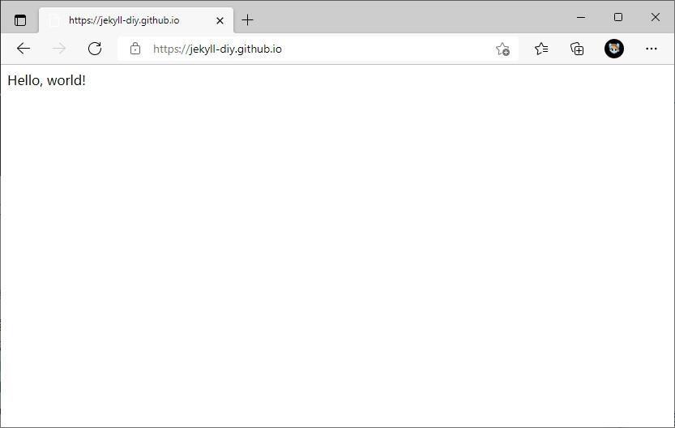
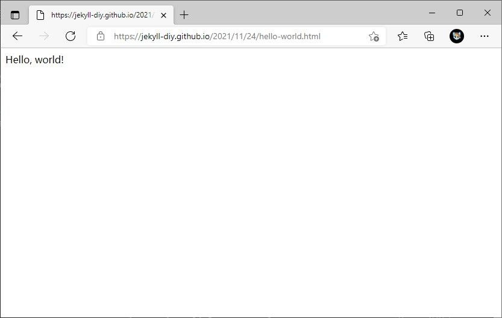

* Content
{:toc}

##  欢迎

本篇是 jekyll-diy 教程的第一篇，在本篇中，我将从0搭建一个没有任何样式的博客，并且在未来的教程中，丰富这个博客，最终形成我们自己的主题。

阅读本篇文章，你需要的预备知识有：

- github page 的使用方法（或在服务器上安装、运行 Jekyll 的方法） 
- 对 HTML 的简单了解

## 配置环境

我不喜欢在自己的电脑上安装太多东西，所以我直接用 github page 来实践。我猜来看这个教程的人都试过 github page 了，如果你没有，我建议你先去了解一下；如果你目前在用 github page，那么我建议你新建一个 organization，然后用 organization 的 github page（设置过程和个人的 github page 一样），避免折腾过程中出错导致重要内容丢失。

## 新建文件

在 github page 仓库中，我们新建如下文件夹与文件（有后缀的是文件，无后缀的是文件夹）

```
.
├── _config.yml
├── _data
├── _includes
│   ├── footer.html
│   └── header.html
├── _layouts
│   ├── default.html
│   └── post.html
├── assets
│   ├── css
│   ├── img
│   └── js
├── _posts
├── _sass
└── index.html # 也可以是带有头信息的 'index.md'
```

下面解释各个文件夹与文件的作用：

- `_config.yml` 保存配置数据。
- `_includes` 加载其中的文件到你的布局或者文章中以方便重用。
- `_layouts` layouts（布局）是包裹在文章外部的模板。布局可以在 YAML 头信息中根据不同文章进行选择。
- `_posts` 这里放的就是你的文章了。文件格式很重要，必须要符合: YEAR-MONTH-DAY-title.md。
- `_sass` 存放 sass 文件，并最终会合并为 main.css
- `assets` 存放 css、img、js 等
- `index.html` 这决定了首页的样式

新建完后，我们可以试着在 `index.html` 中写点东西，比如：

```html
<!-- index.html -->
Hello, world!
```

然后，我们这些文件 push 到 github 上，打开博客对应的网站，就能看到效果了。



虽然我们还没有写主题，但由于 Jekyll 会将根目录下的 HTML 文件生成对应页面，所以我们依然能看到里面的内容。我们页可以创建其他页面，你可以在 [创建页面 - Jekyll](http://jekyllcn.com/docs/pages/) 中学习 Jekyll 是如何创建静态页面的。

我们还可以尝试写一篇博文，比如：`2021-11-24-hello-world.md`，内容还是 `Hello, world!`，然后 push 上去。打开 `https://jekyll-diy.github.io/2021/11/24/hello-world`（注意这里的日期和标题要与文件名一致），你会看到一个空页面（不是404），如果查看该页面的源码，里面空空如也。

这是因为我们还没指定其 layout（中文为“布局”），我们需要在博文中加上头信息：

```markdown
---
layout: default
---

Hello, world!
```

然后在 `default.html` 中写入：

```html
{{ content }}
```

重新 push，你就能看到熟悉的 `Hello, world!` 了！



Jekyll 在生成博文的时候，会用博文内容替换指定 layout 中的 `{{ content }}` 再输出。在我们上面这个博文中，`Hello, world!` 替换了 `{{ content }}`，因此最终页面上只有 `Hello, world!`。