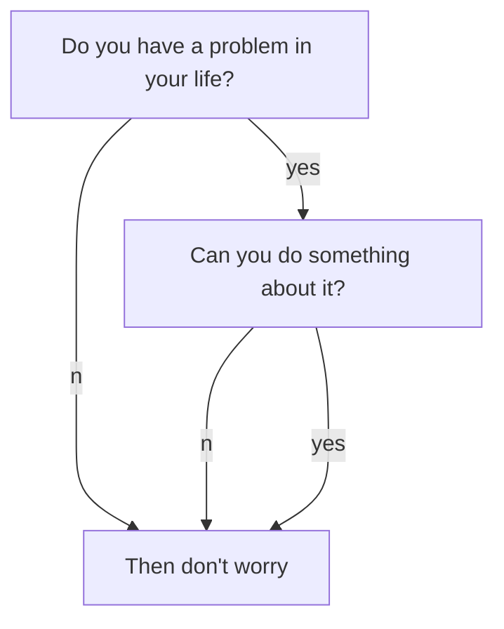

* content
{:toc}

Test Excerpt. 测试摘要
<!--more-->

## sub title

page...

## about thumbnail

add the thumbnail url

## about icon

such as book, code, web, chat, note, game, link, design, image

## Test Markdown Enhancement

When $a \ne 0$, there are two solutions to $ax^2 + bx + c = 0$ and they are

$$x_1 = {-b + \sqrt{b^2-4ac} \over 2a}$$

$$x_2 = {-b - \sqrt{b^2-4ac} \over 2a} \notag$$

$$\dif \p \bold{E}$$



```chart
{
  "type": "polarArea",
  "data": {
    "datasets": [
      {
        "data": [
          11,
          16,
          7,
          3,
          14
        ],
        "backgroundColor": [
          "#FF6384",
          "#4BC0C0",
          "#FFCE56",
          "#E7E9ED",
          "#36A2EB"
        ],
        "label": "My dataset"
      }
    ],
    "labels": [
      "Red",
      "Green",
      "Yellow",
      "Grey",
      "Blue"
    ]
  },
  "options": {}
}
```