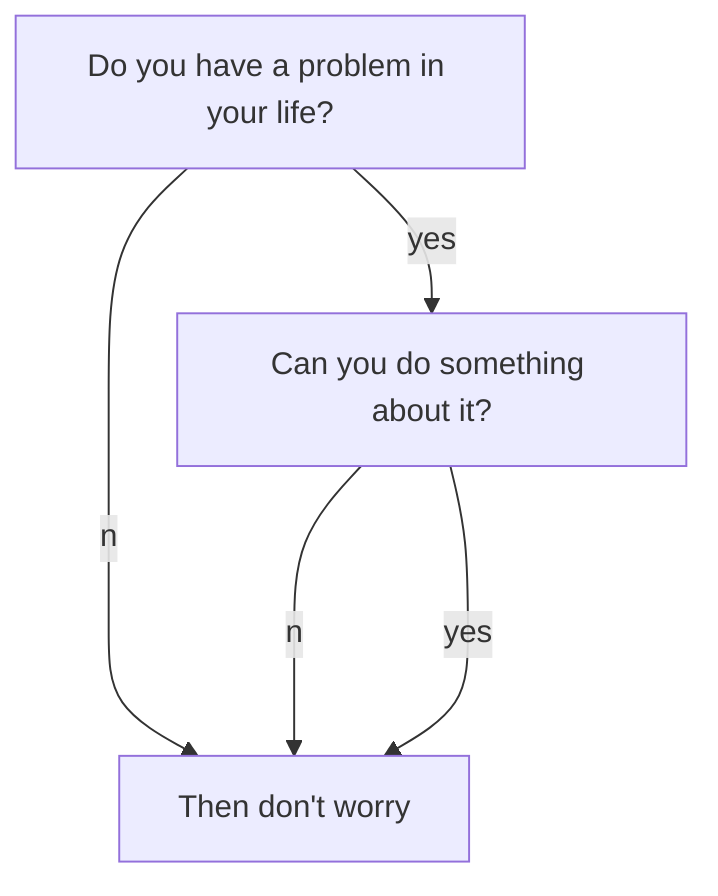

* content
{:toc}

本文旨在介绍我的 Blog 配置，同时测试对 Markdown 的支持和显示效果。
<!--more-->

## 关于本博客

&emsp;&emsp;说实话，这是我第三个博客，前两个博客是：

* [toddzhoufeng.github.io](https://toddzhoufeng.github.io)：我的第一个博客，大一建立的，大三荒废
* [scuteee.com](https://scuteee.com)：我的第二个博客，准确来说是网站，大二建立，目前主要用于存放学习笔记

&emsp;&emsp;其实第一个博客也不是不能用，但第一个博客里的文章也蛮有纪念价值的，但我怕乱搞弄没了，所以就又开了一个。这次我想利用 web 知识折腾一下，顺便记录一下我的研究生生活。

## 折腾进度

&emsp;&emsp;有好多好多东西想弄，但受时间限制，只弄了这些：

- [x] Markdown 扩展
  - [x] Mathjax 3.x 公式支持
  - [x] Mermaid 流程图支持
  - [x] Chart 图表支持
- [ ] 特殊页面
  - [ ] 追番
  - [ ] 读书
  - [ ] 旅游

## 如何写博文

### YAML

```yaml
---
layout: post
title: A Test Post
date: 2021-08-19 20:16:00 +0800
category: tutorial
thumbnail: /style/image/thumbnail.png
icon: book
mathjax: false
chart: false
mermaid: false
---
```

其中，icon 可以是 book, code, web, chat, note, game, link, design, image

如果不是有需求，请将 mathjax, chart, mermaid 设为 false，避免网页加载速度下降。

### 目录与摘要

要让左边的目录出现，文章开头需要写：

```markdown
* content
{:toc}
```

然后写摘要，然后写：

```markdown
<!--more-->
```

### Markdown 基础测试

- 无序列表
- 无序列表
  - 无序列表
  - 无序列表
- 无序列表

1. 有序列表
2. 有序列表
   1. 有序列表
   2. 有序列表

- [ ] Uncheck
  * 无序列表
  * 无序列表
- [x] Check
  - [ ] Uncheck
  - [x] Check
- [x] Check
  1. 有序列表
  2. 有序列表

### Markdown 扩展

#### Mathjax

When $a \ne 0$, there are two solutions to $ax^2 + bx + c = 0$ and they are

$$
x_1 = {-b + \sqrt{b^2-4ac} \over 2a}
$$

$$
x_2 = {-b - \sqrt{b^2-4ac} \over 2a} \notag
$$

注意我设置了三个缩写：\dif, \p, \bold，效果如下：

$$
\dif, \p, \bold{B}
$$

#### Mermaid



#### Chart

```chart
{
  "type": "polarArea",
  "data": {
    "datasets": [
      {
        "data": [
          11,
          16,
          7,
          3,
          14
        ],
        "backgroundColor": [
          "#FF6384",
          "#4BC0C0",
          "#FFCE56",
          "#E7E9ED",
          "#36A2EB"
        ],
        "label": "My dataset"
      }
    ],
    "labels": [
      "Red",
      "Green",
      "Yellow",
      "Grey",
      "Blue"
    ]
  },
  "options": {}
}
```