国庆出游计划

<!--more-->

<!-- 说来惭愧，在广州读了快四年的大学，从来没有好好游历广州，我总觉得广州和佛山差不多，无非就是多了点大城市的喧嚣，那么我为什么要此文呢？说来话长，简单来说就是我要带女友玩，为了给她一个好印象，因此我要做好功课✍。也因为要带女友玩，所以安排行程时有一些东西需要注意：

1. 广州不是山区，别像上次爬黄山那样舍不得坐车，地铁、公交、APM、共享单车、打车，总之能少走就少走！
2. 人家第一次来，能多陪就多陪，别嫌麻烦，另外有咩事都同人地讲清楚（有什么事都和人家说清楚），这样别人才会信你
3. 广州的天气晒得很，注意别把人家女孩子晒黑了，提醒她涂防晒霜，你也要帮她打遮阳伞 -->

## 广州概况

百度百科：

> 广州，位于广东珠江三角洲北部，濒临南海，为西江、北江、东江三江汇合处。相传古代有五位仙人，骑五色羊，各携带一串谷穗降临此处，仙人把谷穗赠给居民，祝福此地五谷丰登、永无饥荒。后仙人飘然而去，留下五羊化为石头。因此，后人又称广州为“羊城”、“五羊城”、“仙城”、“穗城”。广州是国家历史文化名城，从秦朝开始一直是郡治、州治、府治的行政中心；广州从3世纪30年代起成为海上丝绸之路的主港，唐宋时期成为中国第一大港，是世界著名的东方港市；明清两代成为中国唯一的对外贸易大港，是世界上唯一的2000多年长盛不衰的大港。

冷知识：广州最好吃的雪糕是“五羊牌”雪糕。

### 行政划分

根据 2014年4月5日 [《广州市人民政府关于我市部分行政区划调整的通知》](http://www.gz.gov.cn/zwgk/fggw/szfwj/content/post_4757482.html)，广州市分为 11 区：**越秀区**、**海珠区**、**荔湾区**、**天河区**、白云区、黄埔区、花都区、番禺区、 南沙区、从化区、增城区（见下图），加粗的是市中心周围的区，也是我们主要游历的地方。另外，毗邻广州西南边的佛山也值得一去哦！

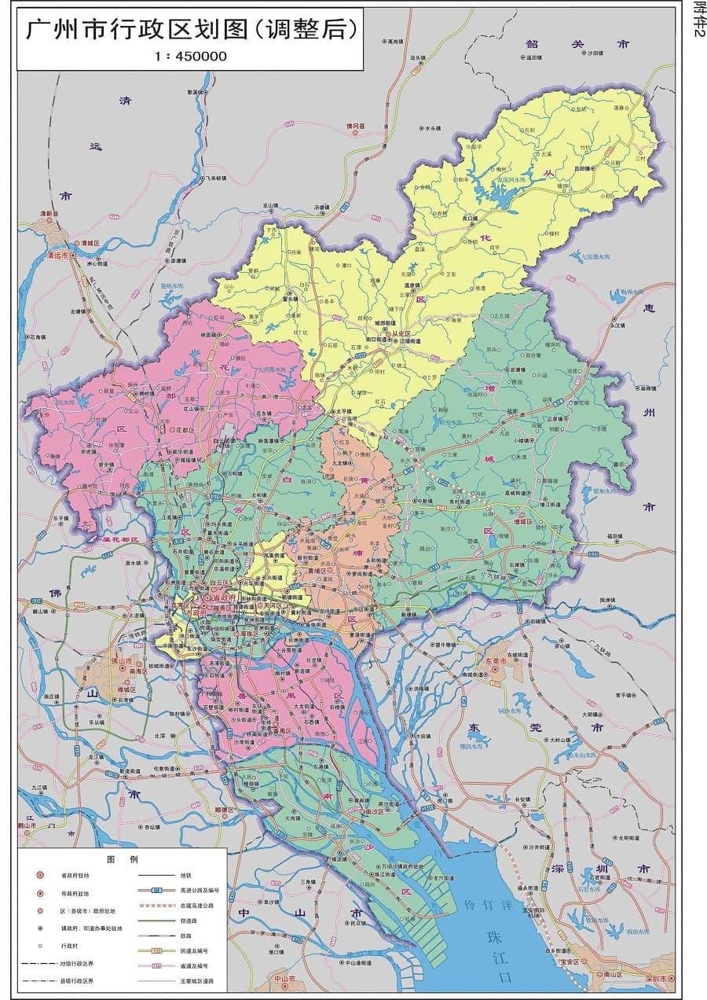

### 交通

广州有非常完善的地铁网络（点击下图查看大图），其中尤为要注意的是 3 号线，它纵穿广州市中心，是广州最拥挤的线路，被称为“死亡3号线”。为了缓解 3 号线的压力，又在市中心建了 APM 线，APM 线只有两节车厢，没有车头车尾，是无人驾驶的哦。除此之外，广州有一路延珠江行驶的有轨电车，也可以去坐一下。

<a data-fancybox="广州地铁" data-src="guangzhou/广州地铁.gif">
  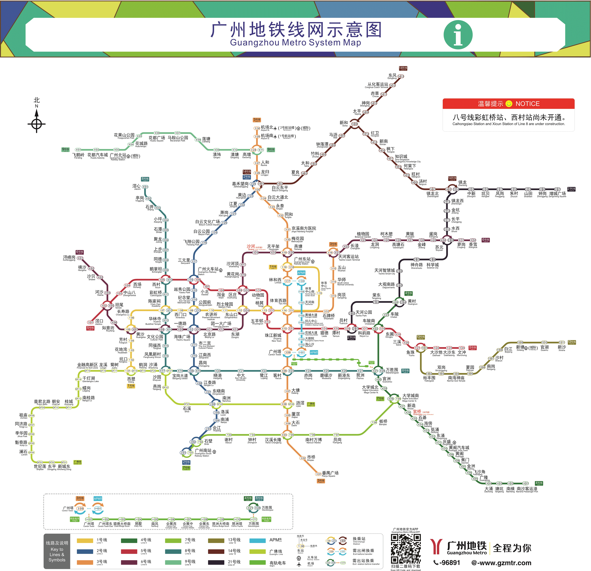
</a>

广州地铁、广州公交均支持全国交通一卡通，如果你的交通卡上有“交通互联”的字样，就能在广州使用。另外，广州也支持微信扫码乘车，需要在小程序“广州地铁乘车码”、“羊城通乘车码”领取地铁、公交的交通卡，领完后，在微信-卡包-交通卡中就可以使用啦！另外，如果要去佛山的话，建议再领一张广佛通（好像在微信乘车中）。

### 气候

全年中，4至6月为雨季，7至9月天气炎热，多台风，10月、11月、和3月气温适中，12至2月为阴凉的冬季。这么看来，国庆很适合来玩，主要还是穿短袖，怕空调冷的话可以带件衬衫。

### 更多

想要了解更多关于广州的故事，可以看看这些资料：

- [知乎：有什么关于广州的冷知识？](https://www.zhihu.com/question/52681728)
- [知乎：什么是你去了广州才知道的事情？](https://www.zhihu.com/question/288241922)

## 广州景点

参考：

- [游遍广州](http://travels.wenzhixin.net.cn/#/)

### 广州塔

<a data-fancybox="景点" data-src="guangzhou/广州塔.jpg">
  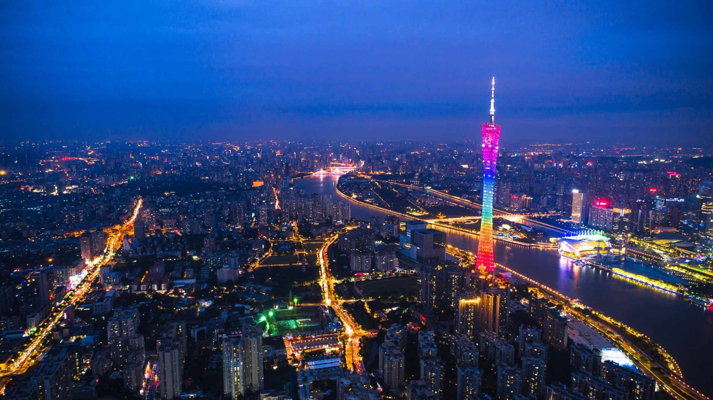
</a>

> 广州塔（英语：Canton Tower）又称广州新电视塔，昵称小蛮腰。位于广州市海珠区（艺洲岛）赤岗塔附近，距离珠江南岸 125 米，与珠江新城、花城广场、海心沙岛隔江相望。广州塔塔身主体高 454 米，天线桅杆高 146 米，总高度 600 米 。是中国第一高塔，世界第二高塔，仅次于东京晴空塔，是国家 AAAA 级旅游景区。

- 官方网站：[http://www.cantontower.com/](http://www.cantontower.com/)
- 地址：广东省广州市海珠区阅江西路 222 号
- 交通：可搭乘地铁 3 号线、APM 线、有轨电车，在广州塔站下车
- 门票：成人票150元/人；儿童票/优惠票75元/人（详情见官方网站）
- 开放时间：分时段观光游览，门票以2小时为一个时段（第一个时段为2.5小时），全天共六个时段，具体为：
  |序号|入塔时段|
  |---|-------|
  |1|9:30 - 12:00|
  |2|12:00 - 14:00|
  |3|14:00 - 16:00|
  |4|16:00 - 18:00|
  |5|18:00 - 20:00|
  |6|20:00 - 22:00|
- 评价：
  - [广州塔上去要钱吗？上面有什么好玩的吗？ - Bronze的回答 - 知乎](https://www.zhihu.com/question/281711161/answer/443775109)
  - [广州塔一日游VLOG/400块一张门票值不值？](https://www.bilibili.com/video/BV1zv41167G5)
  - [陈子豪随拍系列：带大家参观小蛮腰"广州塔"！](https://www.bilibili.com/video/BV1HJ411C7TQ)

<iframe style="position: absolute; width: 100%; height: 100%; left: 0; top: 0;" src="//player.bilibili.com/player.html?aid=245132173&bvid=BV1zv41167G5&cid=254694331&page=1&as_wide=1&high_quality=1&danmaku=1" scrolling="no" border="0" frameborder="no" framespacing="0" allowfullscreen="true"></iframe>

### 沙面

<a data-fancybox="景点" data-src="guangzhou/沙面.jpg">
  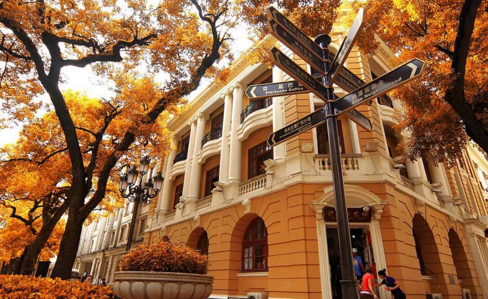
</a>

> 沙面，曾称拾翠洲，因为是珠江冲积而成的沙洲，故名沙面。 沙面位于广东省广州市市区西南部，南濒珠江白鹅潭，北隔沙基涌，与六二三路相望的一个小岛，有大小街巷八条，面积 0.3 平方公里。 沙面在宋、元、明、清时期为中国国内外通商要津和游览地。鸦片战争后，在清咸丰十一年（1861 年）后沦为英、法租界。 沙面是广州重要商埠，历经百年，曾有十多个国家在沙面设立领事馆，九家外国银行、四十多家洋行在沙面经营，粤海关会所、广州俱乐部等在沙面相继成立。沙面见证了广州近代史的变迁，留下了孙中山先生、周恩来总理等伟人的足迹，沙面已成为我国近代史与租界史的缩影，沙面岛上欧陆风情建筑形成了独特的露天建筑“博物馆”。已被开发成国家 5A 级景区，是广州著名的旅游区、风景区和休闲胜地。

- 门票：免费
- 开放时间: 全天
- 交通：羊城地铁 6 号线或 2 号线【黄沙站】下车，走 F 出口，再过天桥，就到了沙面的西端。6 号线【文化公园】站下车，就是沙面的东端
- 评价：
  - [去广州「沙面」有哪些实用攻略和好的建议？ - Anna Christina的回答 - 知乎](https://www.zhihu.com/question/337571679/answer/801341035)

<iframe style="position: absolute; width: 100%; height: 100%; left: 0; top: 0;" src="//player.bilibili.com/player.html?aid=63195472&bvid=BV1b4411D7YJ&cid=109751929&page=1&as_wide=1&high_quality=1&danmaku=1" scrolling="no" border="0" frameborder="no" framespacing="0" allowfullscreen="true"></iframe>

### 越秀公园

<a data-fancybox="景点" data-src="guangzhou/越秀公园.jpg">
  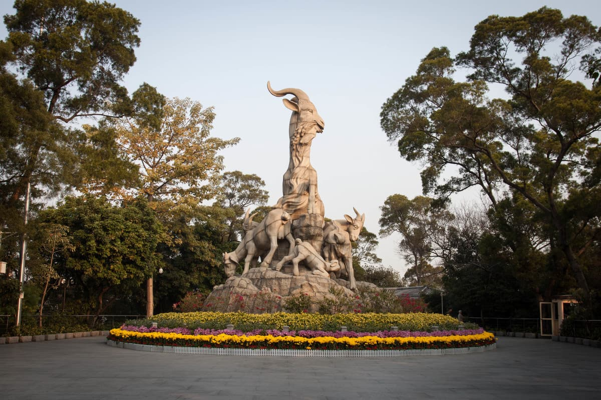
</a>

> 越秀公园是广州城市中心公园，是新世纪羊城八景之一，它与白云山联成广州城北的屏障。海拨70余米。历史上又称粤秀山、越王山。明朝永乐年间，山上曾建观音阁，所以又称观音山。越秀山早在西汉时期便是登临胜地。到了近代，孙中山先生曾提出，要把越秀山建成一座大公园。解放后，人民政府把设想变成了现实。

- 官网：[http://www.yuexiupark-gz.com/](http://www.yuexiupark-gz.com/)
- 门票：免费，中山纪念堂是10元门票
- 交通：地铁二号线【越秀公园站】
- 评价：
  - [越秀公园+中山纪念馆 - 鱼书房的文章 - 知乎](https://zhuanlan.zhihu.com/p/39455711)

### 石室圣心大教堂

<a data-fancybox="景点" data-src="guangzhou/石室圣心大教堂.jpg">
  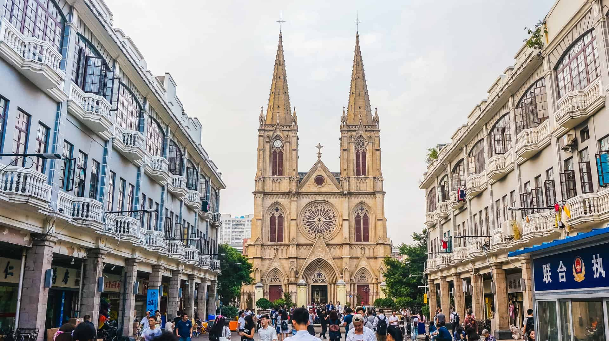
</a>

> 圣心大教堂于1863年6月18日圣心瞻礼日正式举行奠基典礼，故命名圣心大教堂。历时25年始建成，是天主教广州教区最宏伟、最具有特色的一间大教堂。石室圣心大教堂由法国设计师设计，中国工匠建造而成。 教堂建筑总面积为2754平方米，东西宽35米，南北长78.69米，由地面到塔尖高58.5米，石室圣心大教堂1861年耗资40万法郎建立，可与闻名世界的法国巴黎圣母院相媲美。是天主教广州教区最大教堂，国内现存最宏伟的双尖塔哥特式建筑之一，东南亚最大的石结构天主教建筑，也是全球四座全石结构哥特式教堂建筑之一（另外三座是巴黎圣母院、威斯敏斯特教堂、科隆大教堂），由于教堂的全部墙壁和柱子都是用花岗岩石砌造，所以又称之为“石室”或“石室耶稣圣心堂”、“石室天主教堂”。1996年被公布为全国重点文物保护单位。是广东省重点文物保护单位。

- 门票: 免费
- 开放时间：（存疑）
  - 疫情期间：室内暂停开发，只能在外围游览
  - 原开放时间：周二到周五8:30-11:30，14:30-17:00；周六、周日8:30-17:00，周一不开放
- 交通：地铁 6 号线到【一德路站】A 出口步行 470 米即到；地铁 2 号线到【海珠广场站】B2 出口步行590米即到。哥特式建筑十分显眼。

<iframe style="position: absolute; width: 100%; height: 100%; left: 0; top: 0;" src="//player.bilibili.com/player.html?aid=375136830&bvid=BV1Yo4y1f7xA&cid=326822455&page=1&as_wide=1&high_quality=1&danmaku=1" scrolling="no" border="0" frameborder="no" framespacing="0" allowfullscreen="true"></iframe>

### 陈家祠

<a data-fancybox="景点" data-src="guangzhou/陈家祠.jpg">
  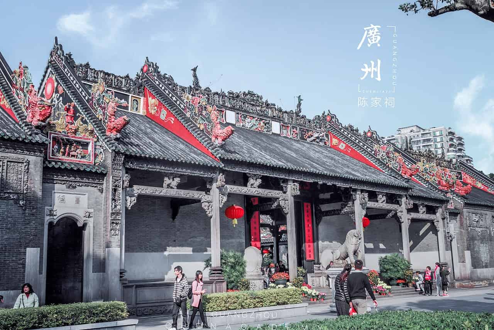
</a>

> 陈氏书院，俗称陈家祠，位于广州市中山七路。陈氏书院筹建于清光绪十四年（1888），二十年（1894）落成，是广东省各地陈氏宗族共同捐资兴建的“合族祠”。其建立主要为参与捐资的陈氏宗族子弟赴省城备考科举、候任、交纳赋税、诉讼等事务提供临时居所。作为捐资的回报，这些陈氏宗族可以将其祖先牌位放到陈氏书院的神龛内供奉。 陈氏书院是广东规模最大、装饰华丽、保存完好的传统岭南祠堂式建筑，占地面积15000平方米，主体建筑面积为6400平方米，由大小十九座单体建筑组成。 陈氏书院集中了广东民间建筑装饰艺术之大成，巧妙运用木雕、砖雕、石雕、灰塑、陶塑、铜铁铸和彩绘等装饰艺术。其题材广泛、造型生动、色彩丰富、技艺精湛，是一座民间装饰艺术的璀璨殿堂。 21世纪以来，陈氏书院以“古祠流芳”之名两度入选“新世纪羊城八景”，被誉为“广州文化名片”，成为岭南地区最具文化艺术特色的博物馆和著名的旅游景点。

- 官网：[https://www.gzchenjiaci.com/](https://www.gzchenjiaci.com/)
- 门票：￥10元（未成年人、60以上长者免费，学生半价）
  - 所有国内外观众（包括按相关规定享受优惠政策的观众）均需通过微信“广东民间工艺博物馆服务号” 网络实名制预约购票。我馆不再提供现场购票服务。
  - 预订了优惠票的观众，在进馆时除了身份证以外还需出示学生证、老人证、军官证、残疾人证等相应优惠证件供检票人员查验后进馆。
- 开放时间：9：00——17：30（17：00停止售票，17：00停止入馆，17：15清场，17：30闭馆）。除每月最后一周的周一为闭馆检修日外（如遇国家法定假日，则顺延），全年开放。
- 交通：乘坐地铁 1 号线在【陈家祠站】下车。
- 历史：[《陈家祠的故事》](https://www.bilibili.com/video/BV1Kt4y167KH)

<iframe style="position: absolute; width: 100%; height: 100%; left: 0; top: 0;" src="//player.bilibili.com/player.html?aid=26005578&bvid=BV1hs411G74H&cid=90338879&page=1&as_wide=1&high_quality=1&danmaku=1" scrolling="no" border="0" frameborder="no" framespacing="0" allowfullscreen="true"></iframe>

### 广东省博物馆

<a data-fancybox="景点" data-src="guangzhou/广东省博物馆.jpg">
  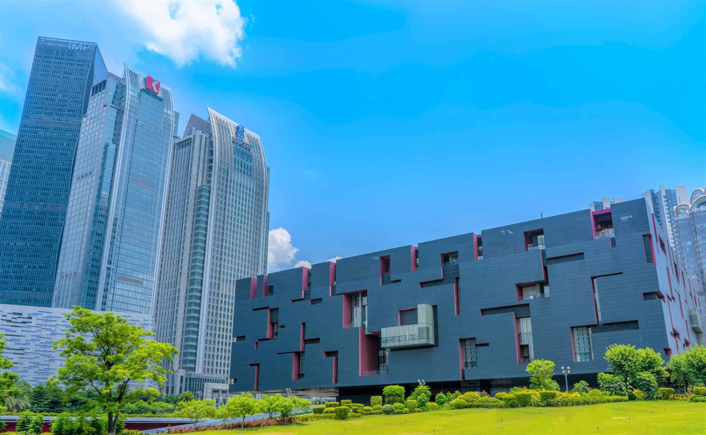
</a>

- 官网：[http://www.gdmuseum.com/](http://www.gdmuseum.com/)
- 门票：免费
  - 所有观众均需预约（微信公众号“广东省博物馆”），预约成功后，请在预约时段内持预约实体证件至博物馆西门
  - 最多可预约七天内门票（含当天）
  - 每张有效身份证件每天限定预约一次，每个账号每天最多实名预约5人。
- 开放时间：全年 周二至周日 09:00-17:00 周一 不开放；中国法定节假日 09:00-17:00
- 交通：地铁3号线【珠江新城站】B1出口，向前行至广州歌剧院，再沿临江大道向东行200米；或地铁5号线【猎德站】D出口，向前行至冼村路，再向左沿冼村路南方向行约200米。APM【大剧院站】B出口，乘扶梯至花城广场，右行到博物馆西门。
- 其他：
  - [参观线路推荐](http://www.gdmuseum.com/gdmuseum/_300882/_300886/371115/index.html)
  - [广东省博物馆怎么样？值得去吗？ - 韩德雨的回答 - 知乎](https://www.zhihu.com/question/333885951/answer/1569342398)

<iframe style="position: absolute; width: 100%; height: 100%; left: 0; top: 0;" src="//player.bilibili.com/player.html?aid=416776290&bvid=BV15V411q7JA&cid=299809370&page=1&as_wide=1&high_quality=1&danmaku=1" scrolling="no" border="0" frameborder="no" framespacing="0" allowfullscreen="true"></iframe>

### 广州海洋馆

<a data-fancybox="景点" data-src="guangzhou/广州海洋馆.jpg">
  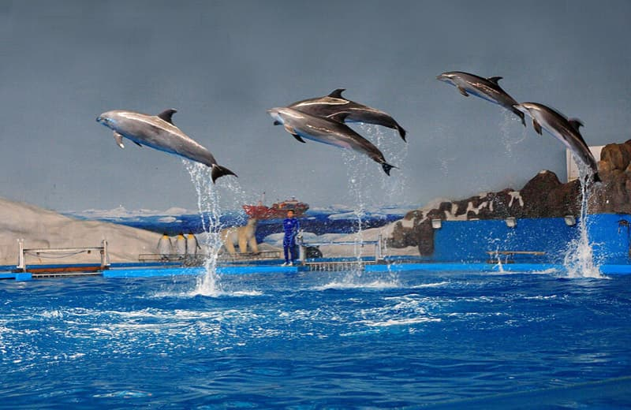
</a>

- 官网：[https://www.gzzoo.com/](https://www.gzzoo.com/)
- 门票：120元
- 地址：广东省广州市越秀区先烈中路120号广州动物园内
- 开放时间：（目前貌似闭馆）08:00-16:00(北门) 08:00-15:30(南门)
- 交通：广州地铁5号线【动物园站】、广州地铁6号线【黄花岗站】

### 广州正佳极地海洋世界

<a data-fancybox="景点" data-src="guangzhou/广州正佳海洋馆.jpg">
  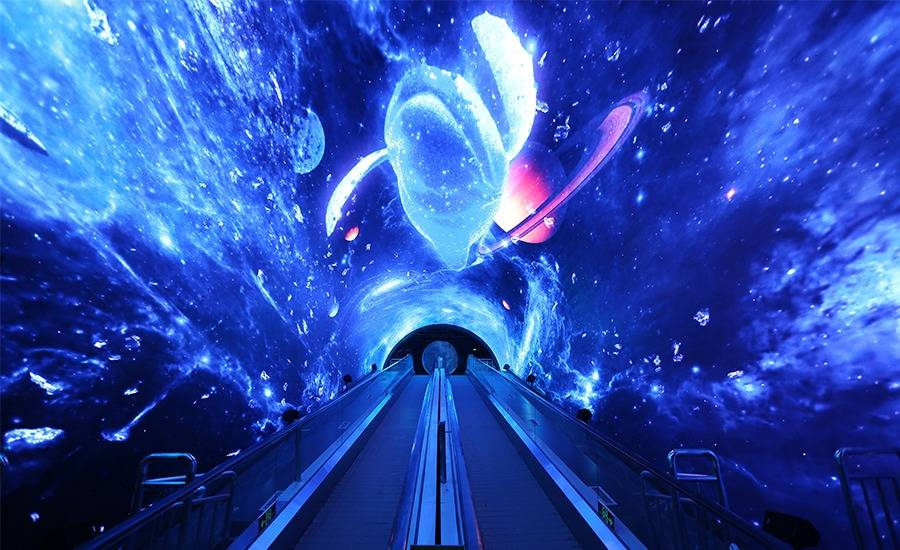
</a>

- 门票：成人票220元/人（学生票有优惠）
- 地址：天河区天河路228号正佳购物广场4层
- 开放时间：全年 10:00-22:00(最晚入园21:30)；营业时间日场10：00-18：00，夜场18：00-22：00，21：30停止检票入园。
- 交通： 乘坐地铁1号线，在【体育中心站】下车，从D3口出站
- 其他：
  - [广州正佳海洋馆美人鱼表演完整版](https://www.bilibili.com/video/BV1L5411t7bL?share_source=copy_web)
  - [广州正佳极地海洋世界游玩攻略](http://www.mafengwo.cn/gonglve/ziyouxing/242698.html)

<iframe style="position: absolute; width: 100%; height: 100%; left: 0; top: 0;" src="//player.bilibili.com/player.html?aid=89913504&bvid=BV1S74117713&cid=153564366&page=1&as_wide=1&high_quality=1&danmaku=1" scrolling="no" border="0" frameborder="no" framespacing="0" allowfullscreen="true"></iframe>

### 北京路商业步行街

<a data-fancybox="景点" data-src="guangzhou/北京路.jpg">
  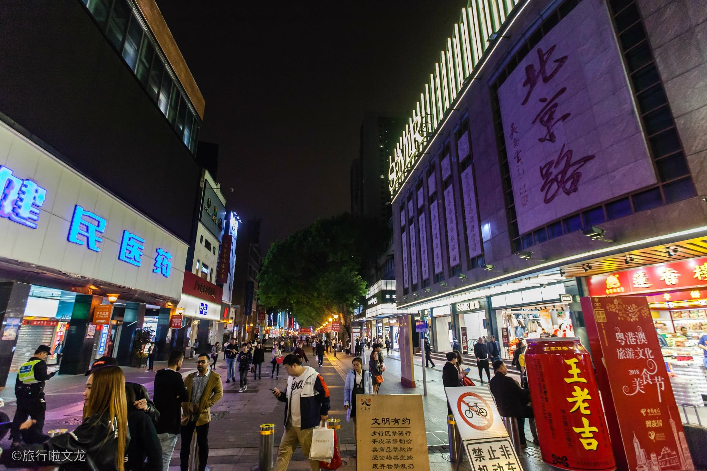
</a>

- 交通：6号线到【北京路站】B口或2号线、1号线【公园前站】C出口、D出口
- 小吃：
  - 陈添记鱼皮
  - 北京路一直往下走，右转有条惠福东路，整条路都是小吃街。
  - [广州北京路，老字号和人气网红美食都扎堆于此！](https://zhuanlan.zhihu.com/p/36786922)
  - [广州游玩必去的北京路，本地人会带你吃哪些馆子？ - 半岛便利店的文章 - 知乎](https://zhuanlan.zhihu.com/p/35563988)

### 上下九步行街

<a data-fancybox="景点" data-src="guangzhou/上下九步行街.jpg">
  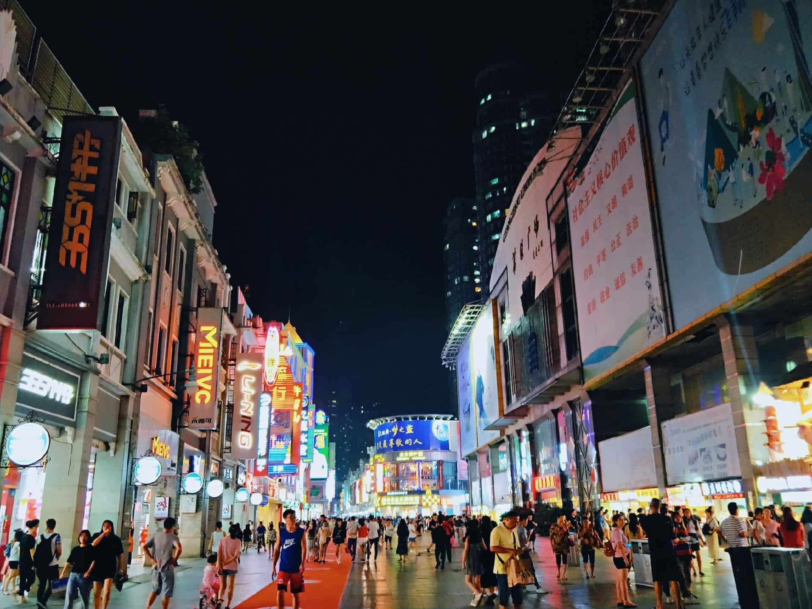
</a>

> 上下九步行街地处广州市荔湾区（俗称西关）的上九路、下九路、第十甫路之间，是广州市三大传统繁荣商业中心之一。全长约1237米，共有各类商业店铺238间和数千商户。在漫长的历史长河中，逐步形成了当今商业步行街中西合璧的四大西关风情特色，并构筑成一副独特的、绚丽多姿的西关风情画，营造出亮丽的旅游风景线。

- 交通：6号线到【文化公园站】E口
- 小吃：
  - [2019.4.6 上下九步行街吃 - 家宏的文章 - 知乎](https://zhuanlan.zhihu.com/p/61573628)

### 其他

- [广州本地人绝对不会去的十大景点 - 阿丽菜的文章 - 知乎](https://zhuanlan.zhihu.com/p/36252222) 广州塔、上下九、北京路、白云山、陈家祠、石室圣心大教堂、越秀公园、黄埔军校旧址、天河北商圈、珠江夜游

## 广州饮食

我没怎么去外面下馆子，因此我也不清楚广州有哪些正宗的粤菜馆，下面这些都是从网上找的。为了方便旅途中查找，我这里按店铺位置分类（而非菜品），并且店铺名点进去就是美团。

为了方便打卡，另外列出菜品：

- [ ] 云吞面、竹升面
- [ ] 肠粉
- [ ] 河粉
- [ ] 牛杂
- [ ] 烧腊（烧鸭、烧鹅、叉烧）
- [ ] 煲仔饭
- [ ] 鱼皮
- [ ] 艇仔粥
- [ ] 双皮奶
- [ ] 姜撞奶
- [ ] （早茶）凤爪、虾饺、牛肚等

参考：

- [知乎：广州著名小食有哪些？地道的店在哪里？](https://www.zhihu.com/question/19752381)

### 荔湾区

- [丽的面家](http://www.dianping.com/shop/6261787)

  - 地址：多宝路296-298号（地铁1号线长寿路D口）
  - 人均：44元
  - 推荐菜品：鲜虾云吞面

- [源记肠粉](http://www.dianping.com/shop/517311)

  - 地址：华贵路93号
  - 人均：16元
  - 推荐菜品：肠粉、粥

- [顺记冰室](http://www.dianping.com/shop/518656)

  - 地址：宝华路83号
  - 人均：25元
  - 推荐菜品：雪糕（香芒、椰子、榴莲）

- [陈添记](http://www.dianping.com/shop/518659)

  - 地址：宝华路六福珠宝对面（巷子最里面）
  - 人均：25元
  - 推荐菜品：鱼皮+艇仔粥

- [文记壹心鸡](http://www.dianping.com/shop/520070)

  - 地址：宝华路旋源桥10号（顺记冰室斜对面小巷内）
  - 人均：82元
  - 推荐菜品：壹心鸡（即白切鸡）

- [南信牛奶甜品专家](http://www.dianping.com/shop/518986)

  - 地址：第十甫路47号
  - 人均：29元
  - 推荐菜品：双皮奶、姜撞奶

- [银记肠粉](http://www.dianping.com/shop/519233)

  - 地址：上九路79号（近光复路）
  - 人均：22元
  - 推荐菜品：肠粉、艇仔粥

- [珍珍小食店](http://www.dianping.com/shop/520942)

  - 地址：西华路183号
  - 人均：28元
  - 推荐菜品：啫啫珍珠粉煲

- [牛佬牛杂汤](http://www.dianping.com/shop/521462)

  - 地址：金花直街135号
  - 人均：18元
  - 推荐菜品：牛三星、牛杂汤

- [沙湾甜品食馆](http://www.dianping.com/shop/521698)
  - 地址：西华路第一津33号101铺（近南方幼儿园）
  - 人均：14元
  - 推荐菜品：糖水、杏仁炒奶

### 越秀区

- [富临食府](http://www.dianping.com/shop/517659)

  - 地址：惠福东路417号（点都德对面）
  - 人均：79元
  - 推荐菜品：脆皮猪手（评论说易腻）、白灼牛肉

- [美荣粉店](http://www.dianping.com/shop/8837311)

  - 地址：麦栏街16号
  - 人均：65元（只吃汤粉大概25）
  - 推荐菜品：汤粉

- [达杨原味炖品](http://www.dianping.com/shop/520451)
  - 地址：文明路160-1号（近文德路）
  - 人均：22元
  - 推荐菜品：原只椰子炖鸡

### 海珠区

- [光明清汤羊](http://www.dianping.com/shop/6185268)
  - 地址：南华中路293号后座108铺
  - 人均：113元

### 天河区

- [潮埕汕头牛丸火锅(体育西横街一店)](http://www.dianping.com/shop/2885599)

  - 地址：体育系横街21号
  - 人均：74元
  - 推荐菜品：牛肉火锅

- [牛威达牛庄](http://www.dianping.com/shop/5142673)
  - 地址：黄埔大道西499号

## 行程安排

行程可以大致分为三个部分：

1. 广州的文化
2. 广州的商业
3. 广州的民风

由于整个行程中均以地铁为主要的出行方式，因此，我会将地铁站用方括号【】包住。

### Day 1 (Oct. 3rd)

&emsp;&emsp;我8:30会从北滘打车到【广州南站】（约半个小时），然后搭乘地铁到【机场南】（约一个半小时），预计十点半到。

&emsp;&emsp;Molly 的航班为 HU7805，8点起飞，11:15到白云机场T1（1号航站楼），对应的地铁站为【机场南】。机场南有A、B两个登机区域，不论哪个区域，拿齐行李后，请前往中间的大厅（点击查看：[航站楼平面图](guangzhou/白云机场T1.jpg)）

&emsp;&emsp;我到时候看看能不能上三楼，如果不能（我会微信和你说一声），Molly 你就到负一楼的地铁站。我去到后会找个显眼的参照物作为见面的地点。

&emsp;&emsp;预计12点前能接到靓女，然后先坐30分钟地铁去吃个午饭。可选的饭店有：

A. 【梅花园】D出口有“华辉拉肠”和“银记肠粉店”，这两间都是比较出名的肠粉连锁店，比较实惠，不用排队

B. 【同和】D出口“禄运茶居”，可以去尝一下早茶，但可能需要排队，人均六十多。

&emsp;&emsp;大概吃完后继续坐地铁到【珠江新城】A2出口（约1h），民宿地址为：铂林国际公寓A座。放好行李后，可选：

A. 在公寓休息一下，毕竟乘飞机也累了

B. 去市中心走一下，走一公里就到花城汇了，那边有一大堆商场可以慢慢逛

&emsp;&emsp;注意，此时要考虑在美团上买第二天的正佳海洋馆的学生票。

&emsp;&emsp;到4点左右，出发去我学校看一下，大概要30分钟，进去我要回宿舍稍微收拾一下（很快的，就衣服+相机），然后在学校饭堂吃个饭（吃完约5:30），然后骑共享电动车逛一下学校，记得买叉烧菠萝包。

&emsp;&emsp;大概到7点左右原路返回，回到去约8点，我把行李放回民宿后，可以去海心沙走走（或骑共享单车），晚上的小蛮腰有灯光更好看。

### Day 2 (Oct. 4th)

&emsp;&emsp;7:00 早起去沙面（人少好拍照），然后去石室圣心大教堂，看完预计 10:00，然后去上下九或北京路逛，中午饭也一起解决（记得早点排队，避免餐馆太多人）。

&emsp;&emsp;然后去海洋馆，晚上回民宿休息（如果不累的话可以再去市中心逛一下，建议这次去走一下海心沙的那个桥）

### Day 3 (Oct. 5th)

&emsp;&emsp;早上去喝早茶，然后去越秀公园逛一下（估计没啥看），然后去南越王博物馆，下午休息，晚上早点睡觉。

### Day 4 (Oct. 6th)

&emsp;&emsp;早起，打车去机场（希望凌晨有车），我会陪同一起去。等上飞机后我再乘地铁回去。
