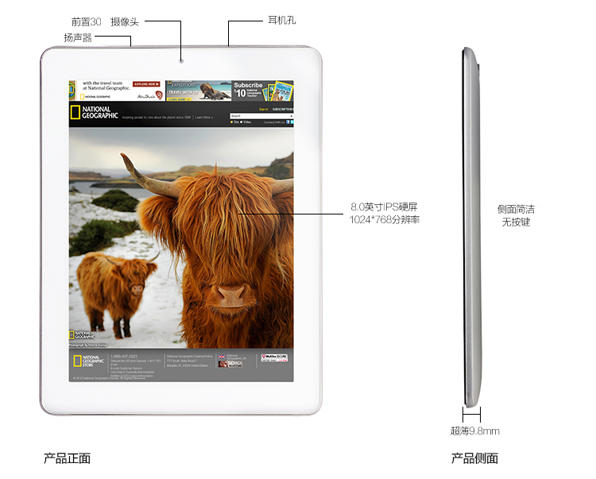
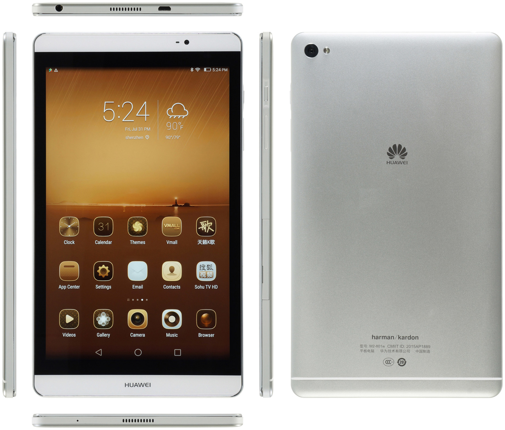
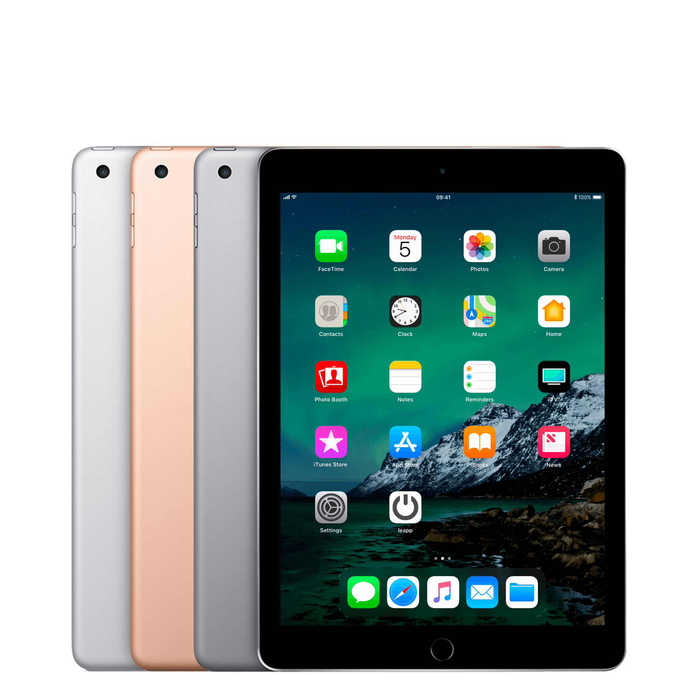

我的平板使用史，与下一部平板的选择。

<!--more-->

## 我的平板使用史

### 第一部平板 昂达V811

&emsp;&emsp;当我上初中的时候，我舅舅说如果我背完道德经就给我一台平板，然后我整个初一到初二都在背“道可道”，最终在春节去吃饭时给我舅背了一遍（其实没全背完，只背了前半部分）。就这样，我得到了第一台平板：昂达V811😀

&emsp;&emsp;虽然是寨板（显然是模仿iPad），但其实它的性能在当时还挺够用的，而且它还支持HDMI输出（尽管我从来没用过）。我当时主要用来听歌、看片、看漫画，还用来玩 Deemo（古树旋律）。

&emsp;&emsp;后来这平板由于电池鼓包，被我拆掉了，在拆的过程中屏幕也弄坏了。但我还留着主板，或许接个外部电源、接个HDMI、接个键鼠，还可以用。

### 第二部平板 华为m2-801

&emsp;&emsp;中考考得不错，我让老爸给我换了一部新平板：华为m2-801，虽然屏幕不如上一部平板大，但音质很棒（哈曼卡顿调音的双扬声器），而且屏幕小也方便我藏在被窝里玩。用途也和上一部平板差不多，不过因为这时我已经上高中了，所以就不看动漫，改看美剧了。

&emsp;&emsp;后来这平板有一天突然充不了电、开不了机，我尝试修但没成功，就放到抽屉里了。

### 第三部平板 iPad2018

&emsp;&emsp;这部平板是18年春发布的，当年正值我高考，考前几个月我就一直想要了，上大学之后，我把switch卖了买了一部 iPad2018。

&emsp;&emsp;主要是在当时，这是唯一一个手写笔好用，而且价格还便宜的平板，平板+笔花了共 3099.

&emsp;&emsp;说实话，如果考虑影音的话，它反而没有上一部华为平板好（单扬声器、非全贴合4:3屏幕真的不适合看片），但我主要是用来记笔记、看书，所以还是挺好用的。

&emsp;&emsp;我大一、大二所有的笔记都在上面。我主要的笔记软件是 Notability，因为它可以录音（但我几乎不会回放录音，录音只是一个心里安慰😂）。在平板上写字不如在纸上写字，写起来容易打滑，而且字迹大小也不好控制，我写了大概一个月才适应。写完之后可以同步到 icloud 上，也可以同步到自己的 NAS 上。当时我是课堂上唯一一个用平板记笔记的学生，现在几乎1/3的人都有平板。

&emsp;&emsp;但现在我觉得没什么必要用它记笔记了，自从我大二时开设了网站后，我的笔记都写成 Markdown 并传到网站上，打字比手写快，比手写美观（我的字不咋地），而且还能随时随地看，还能分享给别人。

## 下一部平板

&emsp;&emsp;随着软件不断升级，iPad 2018 已经开始出现闪退的迹象。而且我的 iPad 只有 32GB 的容量，这让我根本不敢下很多软件，也不敢存太多文件。所以我开始物色下一部平板。

&emsp;&emsp;我对下一部平板如下一些要求。

&emsp;&emsp;首先，我希望它能够连接磁吸键盘，这样就带到课堂上写 Markdown 笔记，也可以写写代码。在此我要吐槽一下苹果的磁吸键盘，最便宜的也要一千多，抢钱啊！但我有点纠结的是，平板+键盘也要 850g，而我的笔记本电脑也才 1330g，多 500g 好像也不是很重……

&emsp;&emsp;至于笔的话，我倒是无所谓。当然有笔就更好的，这样平时可以画画重点，可以带到实验室拿来记数据（不过貌似大部分实验数据可以导出为csv文件），也可以在电子文档上签名（省去打印-签名-扫描的时间）。

&emsp;&emsp;然后我希望最好是 LPDDR5+UFS3.1，省电而且读写速度更快。如果是 LPDDR4x，则必须要有USB3.x，这样方便拷文件。

&emsp;&emsp;另外最好有HDMI输出的功能吧，这样的话就可以彻底告别笔记本电脑了，到时候宿舍里放一个服务器，然后平板连服务器，平板再HDMI直出到显示器，顺便接个键鼠，想想就觉得很不错。但感觉各个厂商的系统或多或少都有点问题，比如不能填满显示屏、锁30帧、不能扩展、不能息屏等等。所以我只是觉得“最好有”，而不是“必须有”。

&emsp;&emsp;最后，一个无奈的选择是我的预算是 3k 以下，考虑上笔的话 4k 以内。所以，iPad pro 就别想了……

&emsp;&emsp;那么，市面上就只有如下这些选择（越靠前越好），顺便列一下缺点：

1. 华为matepad11：略贵
2. 小新pad pro2021：oled、系统、笔不行
3. 小米平板5 pro：usb2.0、系统、笔有点不行
4. iPad 2021：略贵、屏幕不行、系统封闭
5. 小新pad plus：屏幕不行、系统、性能差、笔不行

&emsp;&emsp;这些平板的优劣网上都有，我简单说一下我的选择：

- 如果是学生党拿来做笔记，那么除了小新外都可买，推荐买华为或iPad；
- 如果只是单纯看PPT、网课，那么小新pad plus性价比最高；
- 如果想拿来轻办公，小米和华为是不错的选择；
- 如果希望有极致影音，那么华为、小米、小新pad pro都可以；
- 如果是玩游戏，那么选择小米和小米pad pro

总结一下：

- 性能：iPad 2021>小米平板5 pro≈小新pad pro>华为matepad 11>>小新pad plus
- 屏幕：小米平板5 pro≈华为matepad 11>小新pad pro>iPad 2021≈小新pad plus
- 手写笔：iPad 2021>华为matepad 11>小米平板5 pro>小新pad pro>小新pad plus
- 价格：iPad 2021>华为matepad 11>小米平板5 pro>小新pad pro>小新pad plus
- 手写笔价格：iPad 2021>华为matepad 11>小米平板5 pro≈小新pad pro=小新pad plus

&emsp;&emsp;但说实在，这些都一般般。我建议要么用小新pad plus凑合一下（仅用于影音网课），然后等到明年出新品卖掉换个好的；要么就加钱上更好的。加钱的话，可以考虑：三星Tab S7，3799（包括笔），虽说是去年（2020）出的，但配置放到今年（2021）也不过时：三星的笔是最好的（个人觉得值六七百元）、三星的屏幕也是最好的（比上面列出的都好）。如果你没钱又急需今年买，那么最推荐的，还是华为matepad 11.

&emsp;&emsp;啊，对了，3000~4000 价位还有 iPad Air4 可以选择。但是嘛，Air4 的处理器是A14，而比它低价的 iPad mini6 却是A15，而比它高一千多的 iPad Pro 是 M1，夹在中间的 Air 反而是最差的……总感觉有点小亏（虽然A14也很好）

&emsp;&emsp;最后说一下存储规格，我个人觉得，对于平板，6+64是最低限度，6+128可以用得比较舒服，有条件的话上6+256/8+256。至于8+128就没什么必要了。但注意一定要 UFS3.1+LPDDR4X 或 UFS3.1+LPDDR5.

## 后续

2021/12/02

看了一下自己的钱包，奖学金+旧iPad已经有四千元了，那为什么不整台 iPad Pro 呢！现在唯一的问题就是直接买2021还是等2022。考虑到现在不急着用，还是安心等2022吧。

根据小道消息，iPad Pro 2022 会在明年上半年发布，可能会有新的外观设计（logo横置、后壳换玻璃）、M2 处理器以及 11 寸会上 mini led，甚至会有新的 Apple pencil（希望不要有）。

2021/12/29

下单了小米平板5

2022/03/10

卖掉了小米平板，换成了联想Y700

2022/09/10

卖掉了联想Y700，换成了 iPad air5
