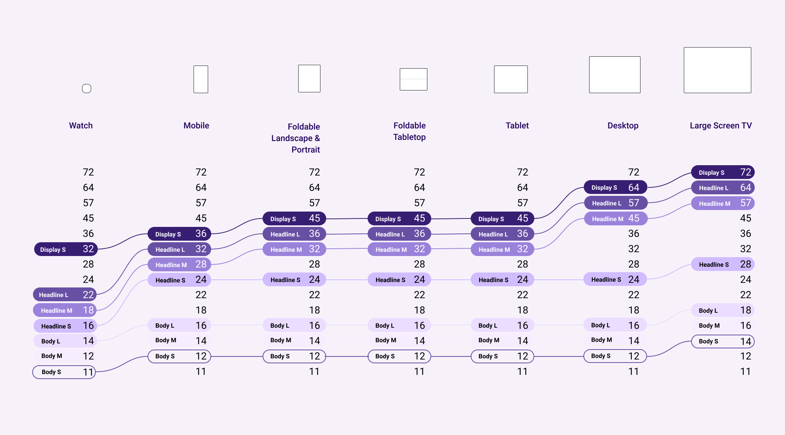
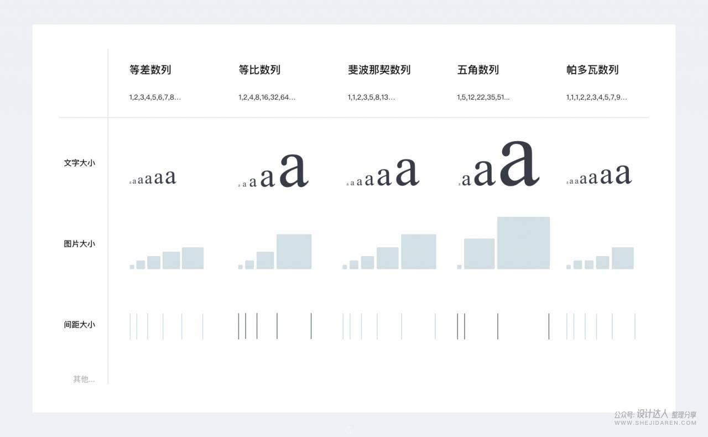
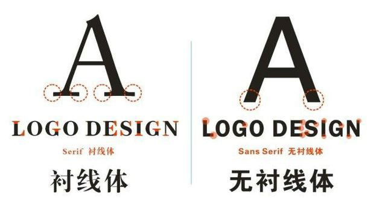
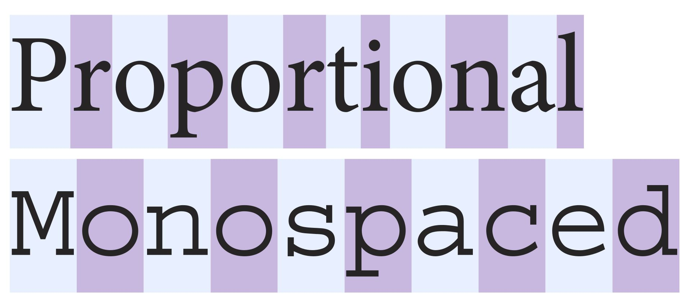

<!--more-->

我写这篇的原因是，我开始设计Jekyll主题的Markdown的CSS，其中大部分工作是设计字体，所以我查阅了一些资料，并总结成下文。

## 字号

### 字号的单位

#### 磅与号

外国人常用“磅”作为文字大小的计量单位，咱中国人则常用“号”。

磅[^point]，英文为 point，缩写为 pt，是印刷所使用的长度单位。point 的正确翻译应该是点。最早的点制系统是法国的 Fournier's point，而现在常用的点制系统是 DTP point（DeskTop Publishing point），1 DTP pt=1/72英寸≈0.3514mm

[^point]: https://zh.wikipedia.org/wiki/%E9%BB%9E_(%E5%8D%B0%E5%88%B7)

号[^hao]，则是1858年美国传教士姜别利在上海的美华书馆主持印刷工作，他根据美国当时活字的大小指定了汉字大小的标准并编号，定下一号到七号，后续在这七个字号的基础上又增加了其他字号。号数制的缺点是不同字号之间没有线性倍数关系，一号并不是二号的两倍大。

[^hao]: https://zh.wikipedia.org/wiki/%E5%AD%97%E5%8F%B7_(%E5%8D%B0%E5%88%B7)

磅与号的换算关系见下表。

| 磅     | 号     | 毫米    | 像素   |
| ------ | ------ | ------- | ------ |
| 5pt    | 八号   | 1.76mm  | 6.7px  |
| 5.5pt  | 七号   | 1.94mm  | 7.3px  |
| 6.5pt  | 小六   | 2.29mm  | 8.7px  |
| 7.5pt  | 六号   | 2.56mm  | 10px   |
| 9pt    | 小五   | 3.18mm  | 12px   |
| 10.5pt | 五号   | 3.70mm  | 14px   |
| 12pt   | 小四   | 4.23mm  | 16px   |
| 14pt   | 四号   | 4.94mm  | 18.7px |
| 15pt   | 小三   | 5.29mm  | 20px   |
| 16pt   | 三号   | 5.64mm  | 21.3px |
| 18pt   | 小二   | 6.35mm  | 24px   |
| 22pt   | 二号   | 7.76mm  | 29.3px |
| 24pt   | 小一   | 8.47mm  | 32px   |
| 26pt   | 一号   | 9.17mm  | 34.7px |
| 36pt   | 小初   | 12.70mm | 48px   |
| 42pt   | 初号   | 14.82mm | 56px   |
| 54pt   | 特号   | 18.97mm | 71.7px |
| 63pt   | 大特号 | 22.14mm | 83.7px |
| 72pt   | 1英寸  | 25.30mm | 95.6px |

> 注：上面列出的是 Word 中的换算关系，而在“方正飞腾”等其他排版系统中则略有不同，如：七号对应5.25pt（Word中是5.5pt）

#### 屏幕上的字号

px，全拼是 pixel，像素，指的是构成图片的最小单位。我们平时说的分辨率的单位就是 px。像素没有固定的物理长度。

分辨率越高不一定越清晰，而是要看密度，或者说单个像素的大小。有两种衡量密度的单位：

- dpi：dot per inch，每英寸点数，用于印刷。
- ppi：pixel per inch，每英寸像素数，用于屏幕。

由于屏幕常用对角线来衡量大小，所以 ppi 常用该公式来计算：$\text{DPI}=\frac{\sqrt{\text{height}^2+\text{width}^2}}{\text{inch}}$，分子是对角线上的像素数，分母是对角线长度。但某些不良商家会直接用横边来计算，这样会使得数值看上去更大一点。

300ppi 对人眼来说已经足够了，常见的电脑显示器的 ppi 在 100~200 之间，iPad Pro 的 ppi 为 264.

但是，直接用 px 定义字体大小并不好，因为像素没有固定的物理长度，所以假如我有两个手机，一个是 1080P，一个是 2K，同样显示 10px，前者实际显示的大小会比后者大。所以我们需要其他尺度单位。

或许你会说，那直接使用磅/号不行吗？不行，因为印刷中纸张的大小是固定的，而屏幕大小不是，所以我们不知道显示出来到底有多大。

#### dp sp em rem

前面我们不使用 px 的原因是不同屏幕的像素大小不同，也就是 ppi 不同。为了解决这个问题，安卓系统引入了另一个单位 dp（Density-independent Pixels），简单来说就是：对于 160dpi 的屏幕，1dp=1px；但如果屏幕像素太小，比如 320dpi（像素大小减小一半），那么 1dp=2px。也就是说，像素越小，1dp对应的像素就越多，这样实际显示的大小就能保持一致。

px 和 dp 的换算公式是 ${\rm px=dp \times (dpi\div 160)}$，这个是由谷歌定义的，可以去[知乎](https://www.zhihu.com/question/20697111)了解更多。

后来谷歌由引入了一个新的单位：sp（Scale-independent Pixel），它和 dp 类似，但是它还会受用户设置的影响（如果是 dp 则用户无法改变大小）。

dp 和 sp 都只用于安卓。

---

在网页端中，我们使用的是 em 和 rem

em（emphasize）是相对长度单位，相对于当前对象内文本的字体尺寸，即 em 的计算是基于父级元素font-size的。如当前对行内文本的字体尺寸未被人为设置，则相对于浏览器的默认字体尺寸（一般是16px）。举个例子：

```css
.padded {
  font-size: 16px;
  padding: 1em;
}
```

在 `.padded` 中，字体大小为 `16px`，则 `1em=16px`。

rem（root em，根em）是css3新增的一个相对单位，与em的区别在于，它是相对于html根元素的（在body标签里面设置字体大小不起作用）；下面举个例子来说明一下为什么 rem 比 em 好。

考虑这么一个 css：

```css
body {
  font-size: 16px;
}

ul {
  font-size: 0.8em;
}
```

`ul` 中的字体是父元素 `body` 的 0.8 倍，即 16\*0.8=12.8，这没有问题。但是，如果一旦有嵌套列表，那么嵌套列表会在上一级列表的基础上继续缩小，这可不是我们所希望的。要解决这种问题，我们可以这样写：

```css
ul {
  font-size: 0.8em;
}

ul ul {
  font-size: 1em;
}
```

但这种方案并不清晰，因为我们为 `ul` 定义了两个大小。而用 rem 则很好的解决了这个问题：

```css
ul {
  font-size: 0.8rem;
}
```

这样，所有的 `ul` 都是 16\*0.8，不存在嵌套列表缩小的问题。所以，对于 `font-size`，更推荐使用 rem。

总而言之，这两个单位都是“相对”大小，至于参照物，则由浏览器设置，这样在不同屏幕上的效果也能达到一致。

关于相对单位，知乎上有一系列文章说得很好：[《别说你懂CSS相对单位》系列译文](https://zhuanlan.zhihu.com/p/39270696)

### 字号的选择

目前，大部分设计指南均有关于字号的规定。我们可以从中选择/借鉴适合自己的。

#### 借鉴设计标准

[**Material Design**](https://material.io/design) 谷歌的设计语言，目前已出到第三版（[Material You](https://m3.material.io/)）。其推荐的字号如下（单位是 px）：


这种字号也并非一成不变，而是要根据屏幕大小适当缩放：



另外，它也对字体的选择给出了一些建议：

1. 标题可以使用有表现力的文字，比如手写体，这样能吸引眼球
2. 子标题、主体、说明文字等则应避免选择有表现力的文字，推荐使用 Serif 或 sans serif

另外，它还解释了排版中的一些术语：[Understanding typography](https://material.io/design/typography/understanding-typography.html)

---

苹果推荐的字号如下（MacOS）：

| Text style  | Weight  | Size (points) | Line height (points) | Emphasized weight |
| ----------- | ------- | ------------- | -------------------- | ----------------- |
| Large Title | Regular | 26            | 32                   | Bold              |
| Title 1     | Regular | 22            | 26                   | Bold              |
| Title 2     | Regular | 17            | 22                   | Bold              |
| Title 3     | Regular | 15            | 20                   | Semibold          |
| Headline    | Bold    | 13            | 16                   | Heavy             |
| Subheadline | Regular | 11            | 14                   | Semibold          |
| Body        | Regular | 13            | 16                   | Semibold          |
| Callout     | Regular | 12            | 15                   | Semibold          |
| Footnote    | Regular | 10            | 13                   | Semibold          |
| Caption 1   | Regular | 10            | 13                   | Medium            |
| Caption 2   | Medium  | 10            | 13                   | Semibold          |

iOS上的字号则略微大一点：

| Style       | Weight    | Size (points) | Leading (points) |
| ----------- | --------- | ------------- | ---------------- |
| Large Title | Regular   | 34            | 41               |
| Title 1     | Regular   | 28            | 34               |
| Title 2     | Regular   | 22            | 28               |
| Title 3     | Regular   | 20            | 25               |
| Headline    | Semi-Bold | 17            | 22               |
| Body        | Regular   | 17            | 22               |
| Callout     | Regular   | 16            | 21               |
| Subhead     | Regular   | 15            | 20               |
| Footnote    | Regular   | 13            | 18               |
| Caption 1   | Regular   | 12            | 16               |
| Caption 2   | Regular   | 11            | 13               |

---

微软的 Fluent Design 给出了一些字体和建议

| Size | Uasge                                                                                                                                                                                                                                                                       |
| ---- | --------------------------------------------------------------------------------------------------------------------------------------------------------------------------------------------------------------------------------------------------------------------------- |
| 68px | Data visualization and/or large numerics. Use sparingly when specific figures need to stand out. Recommended line height is 76px.                                                                                                                                           |
| 42px | Full-screen hero moments: OneDrive album titles, dates in All Photos view, SharePoint site titles, first run hero moments, greeting moments at the start screen. Recommended line height is 52px.                                                                           |
| 32px | Titles for favorite document cards, Greeting moments. Recommended line height is 40px.                                                                                                                                                                                      |
| 28px | Page titles. Recommended line height is 36px.                                                                                                                                                                                                                               |
| 24px | Marketing email header. Recommended line height is 32px.                                                                                                                                                                                                                    |
| 20px | Page and pane headers, suite nav, titles in teaching bubbles, dialogs and file hover cards. Recommended line height is 28px.                                                                                                                                                |
| 18px | Header for Team’s channel names. Recommended line height is 24px.                                                                                                                                                                                                           |
| 16px | Subject line in mail, SharePoint article body, marketing emails as file name and body text. Recommended line height is 22px.                                                                                                                                                |
| 14px | Commands and controls (left nav, Teams channels, command bar, checkbox, dropdown menu, toggle, radio button, button text and links), in file or document titles and as body text. Recommended line height is 20px.                                                          |
| 12px | Metadata in file lists and grid views, denotes any activity on items (number of views, shares or @mentions, timestamps), sharing permissions, persona names and in tooltips. Recommended line height is 16px.                                                               |
| 10px | Limited usage, use in places where text is mandatory and space is tight. For example, it is used for any disclaimer text that may appear in a purchase flow. It’s also used as the initials in a list of SharePoint sites in the left nav. Recommended line height is 14px. |

### 根据比例选择

[排版干货 字号大小与设计比率之美](https://www.shejidaren.com/zihao-daxiao-sheji-bilv.html) 一文中提到，可以通过比例来确定的字号。



大比例显得活泼，小比例则显得安静，据此我们可以根据内容确定比例，再计算出具体字号。除了上图中的比例，还有黄金比例，甚至音乐中的音阶也算比例（具体请去看原文）。

## 字体

反正我是业余的，所以也不说太复杂。简单来说，我们只需要了解：衬线（serif）与无衬线（sans-serif），比例（Proportional）与等宽（Monospaced）。下面两张图说明了它们的区别。





至于具体的字体嘛，很遗憾，由于中文字体的文件大小过大，所以一般网页只用系统自带的字体。关于系统自带的字体，请自行搜索。

一些 font-family 方案：

- [最标准的系统字体规范font-family](https://segmentfault.com/a/1190000011827800)
- [中文网页字体设置方案：从 font-family 到 font-display](https://ridiqulous.com/chinese-webfont-guide/)
- [中文字体网页开发指南](https://cloud.tencent.com/developer/article/1095935)
- [中文网页最优字体选择](https://www.zaera.cn/2821.html)
- [如何优雅的选择字体(font-family)](https://segmentfault.com/a/1190000006110417/)

## 一些参考资料

英语：

- [BUTTERICK’S PRACTICAL TYPOGRAPHY](https://practicaltypography.com/) 建议将所有文章都读一遍，

- 多家公司的字体规范
  - [苹果](https://developer.apple.com/design/human-interface-guidelines/macos/visual-design/typography/)
  - [微软](https://www.microsoft.com/design/fluent/#/)
  - 谷歌 [Material2](https://material.io/design/typography/the-type-system.html) [Material3](https://m3.material.io/styles/typography/overview)
  - IBM [Carbon Design](https://www.carbondesignsystem.com/guidelines/typography/overview/)

中文：

- [中华印刷通史](http://www.cgan.net/book/books/print/g-history/gb_12/content.htm)

- 系列文章：

  - [字体的字号与字重](https://www.ui.cn/detail/598425.html?nopop=1)
  - [字体的字符和字间距](https://www.ui.cn/detail/605989.html?nopop=1)

- 系列文章：

  - [中文字体盘点之黑体](https://www.biaodianfu.com/heiti.html)
  - [中文字体盘点之宋体与仿宋](https://www.biaodianfu.com/songti-fangsong.html)

- UI设计师必看系列

  - [设计师必看的字体与排版指南（上）字体基础知识](https://zhuanlan.zhihu.com/p/203561341)

- [Ant Design](https://ant.design/index-cn)
