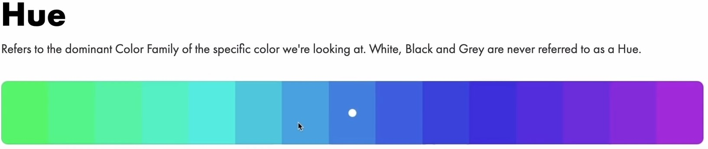
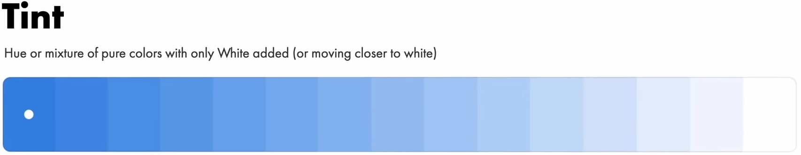
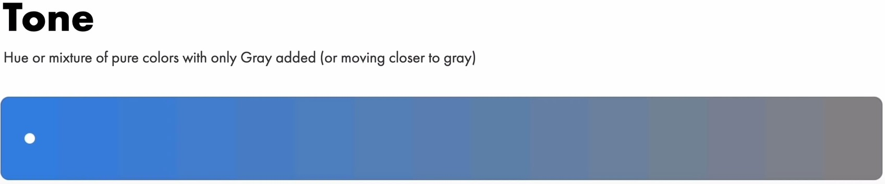
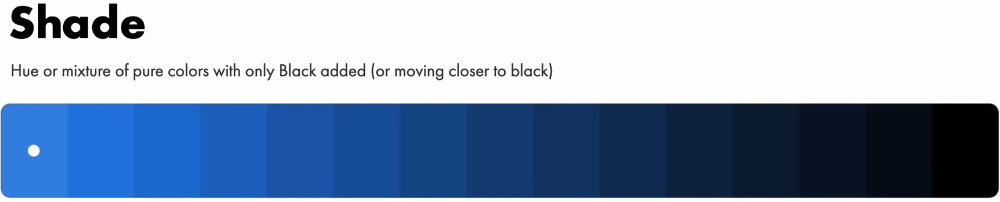
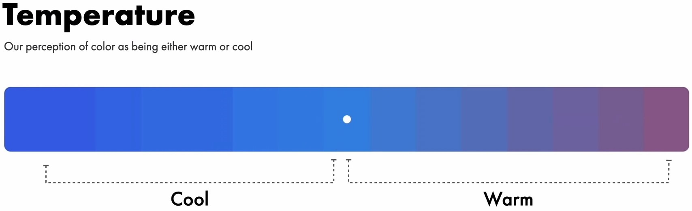
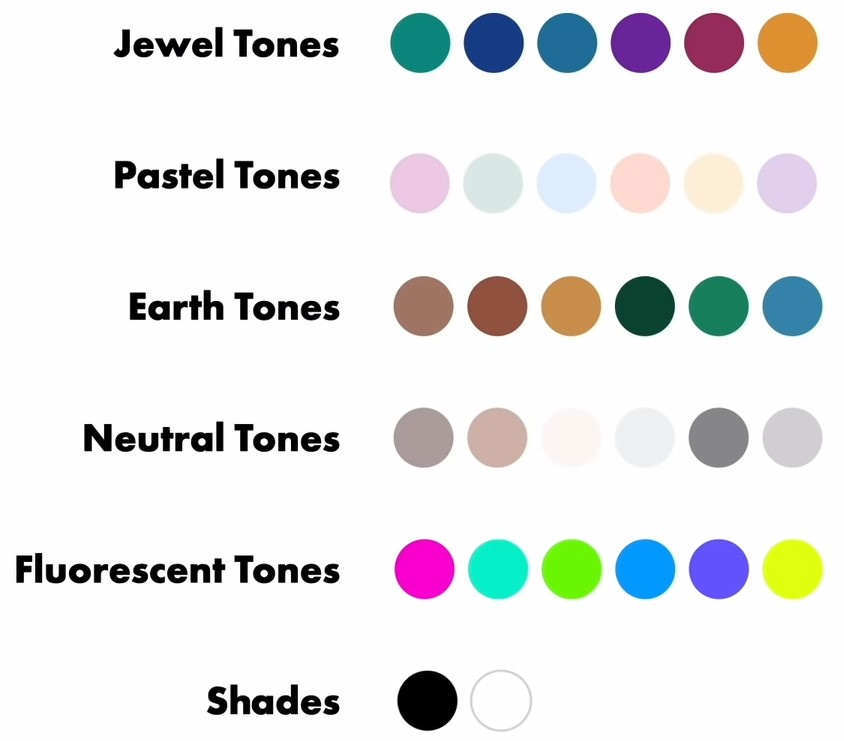
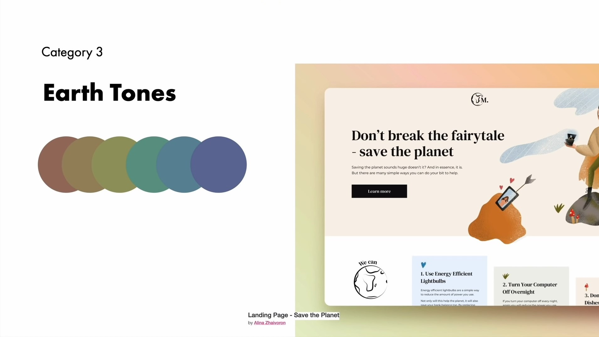
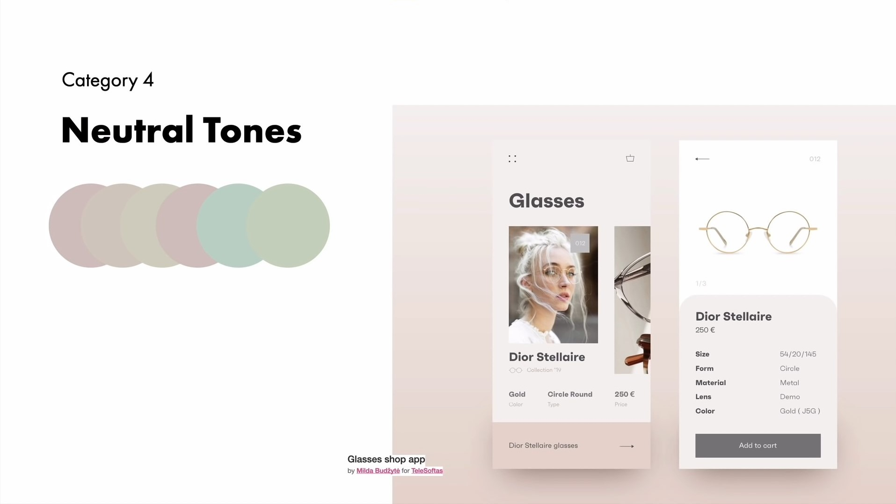
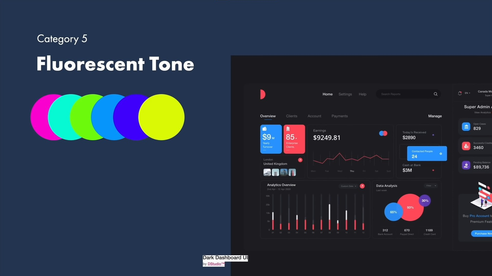

<!--more-->

> 本文所有内容来自于：[Super Practical Guide to Color Theory, Color Models and Perfect Color Palettes \| UI Design](https://youtu.be/GyVMoejbGFg)

## 色彩的属性

色彩有 5 个属性：

**Hue 色相**：色彩的外相，不包括黑白灰

**tint 亮度**：向纯色中增加白色的程度

**tone 色调**：向纯色中增加灰色的程度

**shade 色度**：向纯色中增加黑色的程度

**temperature 色温**：色彩中，红/黄色占得多则偏暖，蓝/绿色占得多则偏冷

## 色彩模型

色彩模型指的是我们描述色彩的方法。

**CMYK** Cyan, Magenta, Yellow, Black，简单理解有点像用不同荧光笔叠加得到不同颜色，在叠加的过程中白色会越来越少，最终变成纯黑。这种模式用于打印机。

**RGB** Red, Green, Blue，简单理解就是不同颜色的光混合，混合过程中会越来越亮，最终变成纯白。这种模式用于屏幕显示。

**HSB** Hue, Saturation, Brightness，简单理解就是将不同颜色与黑、白、灰混合，从而控制颜色的纯度、明度。这种模式用于设计。

## 常用色彩搭配

确定 S 和 B 后，改变 H 得到一组所需颜色。各组颜色的 SB 范围如下：

- Jewel Tones
  - S: 73-83
  - B: 56-76
- Pastel Tones
  - S: 14-21
  - B: 89-96
- Earth Tones
  - S: 36-41
  - B: 36-77
- Neutral Tones
  - S: 1-10
  - B: 70-99
- Fluorescent Tones
  - S: 100-63
  - B: 100-82
- Shade
  - S: 0
  - B: 0-100

至于 H，我们可以选择色环上相邻、均分、甚至相对的颜色。一般我们以其中一个为主色调，其余为辅色调。

一些示例：

## 色彩搭配网站

<https://color.adobe.com/> 你可以用色环设计自己的配色，也可以在“探索”中查看其他人的配色。

<https://coolors.co/> 另一个配色网站

<https://colorable.jxnblk.com/> 检查你的颜色是否方便阅读，
