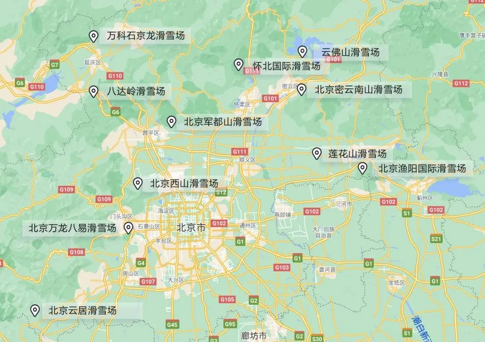

<!--more-->

## 时间安排

**2022/01/06~2022/01/11**

### 核酸

北京市防疫政策：

> 人员进（返）京须持48小时内核酸检测阴 性证明和“北京健康宝”绿码，14日内有1例以上（含1例）本土新冠病毒感染者所在县 (市、区、旗)旅居史人员严格限制进（返） 京。民航、铁路、公路将加强远端登机登车和 进京检查站查验。
>
> 来源：[北京市政府：11月17日零时起进返京须持48小时内核酸阴性证明和“北京健康宝”绿码](http://www.beijing.gov.cn/ywdt/gzdt/202111/t20211114_2536367.html)
>
> 持纸质核酸检测阴性证明或电子核酸检测阴性证明均可。电子核酸检测阴性证明可以通过“北京健康宝”、支付宝“健康码”、微信国务院客户端等进行查询。
>
> 来源：[北京市政府：核酸阴性证明必须纸质吗?](http://www.beijing.gov.cn/ywdt/zwzt/yqfk/jfj/202111/t20211118_2540002.html)
>
> 关于核酸检测阴性证明认定问题。按照现行的管控要求，人员进(返)京须持48小时内核酸检测阴性证明和“北京健康宝”绿码，其中核酸检测阴性证明的起始时间，以检测报告中“报告日期”为准。
>
> 来源：[北京市政府：核酸检测阴性证明起始时间、环京地区通勤人员身份如何认定？官方解读](http://www.beijing.gov.cn/gongkai/hygq/202111/t20211117_2539140.html)

广州市防疫政策：

> 其他省（自治区、直辖市）外来（返）穗人员抵穗后应48小时内主动做一次核酸检测。
>
> 全国中高风险地区所在城市及部分邻近城市来穗航班旅客抵达(中转)白云机场后，在航班出口处为旅客测量体温、查验健康码(“粤康码”、“穗康码”、“全国一体化政务服务管理平台”)及在机场到达区做核酸检测。航班落地后将在T1航站楼W3出口专门区域保障，对所有旅客落地实行免费核酸检测，同时检查健康码以及测量体温，完成核酸检测采样后即可离开。

5号上午去附近卫生站做核酸，6号上午打印核酸报告

### 机票

- 2022/01/06 16:40~19:45 白云机场T1
  - 截办时间：15:55
  - 值机柜台：M（近12-14号门）
- 2022/01/11 12:00~15:20 大兴国际机场
  - 截办时间：11:20
  - 值机柜台：R01-R16，W17-W22（近11号门）

## 滑雪

### 雪场的选择

初学者优先选近的，本来想选万龙八易，但上美团一看，不开了！好吧，那只能去云居或西山了。两者的距离差不多，打车1小时，公交2.5小时，我个人想的是去的时候公交，回来的时候打车。

价格方面（含雪具）：

- 西山
  - 工作日和周末都是 230/4小时，360/全天；
- 云居
  - 工作日 160/4小时，190/全天
  - 周末 220/4小时，260/全天

这么看还是去云居比较实惠（也没便宜很多），那就去云居好了！而且据说云居的雪好，人少，

---

云居滑雪的攻略

- 开放时间：周一至周日，日场 8:30 - 16:20，15:00 停止入场。夜场就免了，太晚了不方便回去。
- 雪具押金 400，支付方式：微信、支付宝、现金
- 雪票带雪板、雪杖、雪鞋，其余要自己租，头盔30，滑雪服一套40（据说比较旧），手套10，柜子20
- 吃饭价格合理，但据说“人员一看就不是搞餐饮的，很笨拙”

### 滑雪的穿着

三层穿法：

- 内层
  - 罩在内衣裤外，紧贴着皮肤
  - 不需要太厚，其主要用来排汗
  - 合成材料或羊毛
  - 尽量避免与纯棉衣物叠穿
- 中层
  - 用于保暖
  - 羽绒、合成材料夹克
  - 应避免纯棉衣物，以防吸汗潮湿
  - 可通过增减中间层的方式配合外界温度变化
- 外层
  - 防水、透气和保暖

所有衣服：

1. 贴身速干衣（修身秋衣裤可代替）
2. 上身护甲衣，即中间层，防撞？？
3. 护膝护臀（单板必须要）
4. 滑雪袜（普通长袜可替代）
5. 滑雪裤（雪场租）
6. 滑雪外套（雪场租）
7. 滑雪手套滑雪外套（雪场租）
8. 滑雪护脸（天冷必须要，容易冻伤）
9. 头盔（雪场租）
10. 护目镜（雪场租）

### 戴好护具

### 学会刹车
