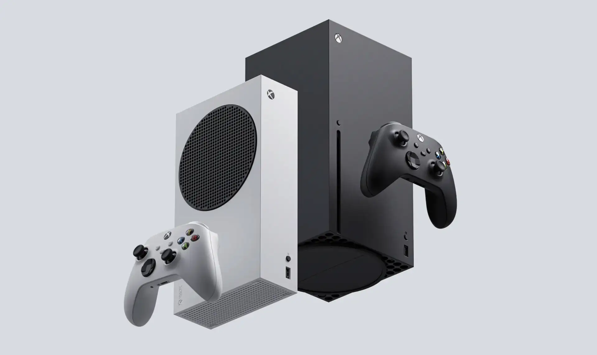
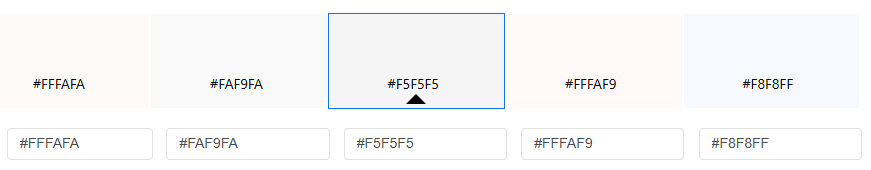
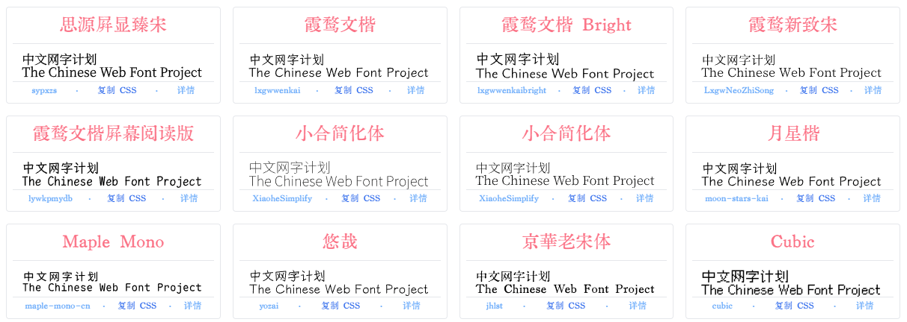

<!--more-->

最近在整理笔记和博客，然后看到别人好看的博客又心痒痒想重新改一下博客，于是就有了这个主题。这个主题的特色是：点线面、黑白灰，所以就选了同样简洁的「灰山椒雀」作为主题名。

类似的主题有很多，比如我在 hugo 官网主题页看到的：

- [hugo-PaperMod](https://github.com/adityatelange/hugo-PaperMod) 11.2k stars，只有导航栏+正文，大面积留白
- [archie](https://github.com/athul/archie) 1.1k stars，依靠下划线来进行区分，把下划线去掉，就是单纯的 markdown
- [hugo-theme-yinyang](https://github.com/joway/hugo-theme-yinyang) 503 stars，只有导航栏+正文，依靠加粗/边框来进行区分，有个旅行图功能还挺有趣
- [hugo-theme-zen](https://github.com/frjo/hugo-theme-zen) 297 stars，只有导航栏+正文，老实说，没什么设计感
- [hugo-theme-monichrome](https://github.com/kaiiiz/hugo-theme-monochrome) 211 stars，留白，只有导航栏+正文，通过颜色深浅来区分

纵观以上主题，大部分都喜欢留白，仅保留文字。我这次就想尝试一下多用点、线、面会搭配出什么样的效果。我觉得我个人会有这种想法，来自于「微软」，微软的设计风格偏硬朗，软件上有 Windows 8/10/11，硬件上有 ZUNE、Lumia 以及 Xbox Series X/S. 总结来说就是：大色块、平面化、无多余装饰。近些年微软也在色块的基础上引入了更加丰富的光照、深度、动效、材质（Fluent Design），使得设计更有质感。

## 设计过程流水账

这次基本上是从 0 开始设计的，运行 `hugo new theme` 后，简单地配置了一下 tailwindcss 及配套的插件。

背景颜色。对比于过于刺眼的纯白 #FFFFFF，有几种选择，比如雪白 #FFFAFA、象牙白 #FAF9FA，灰白 #F5F5F5. 对比了一下，我认为象牙白 #FAF9FA 看起来更高级一点，其他白色都有点偏红或偏黄。（以下截图自 Adobe Color）

字体方面。这次打算尝试采用 [中文网字计划](https://chinese-font.netlify.app/)，据说能按需加载，提高加载速度。字体选择方面，必须要覆盖80%的基本汉字，并且字形清晰不发虚，满足这些的有（以下截图来自于 1080P 的屏幕，在更高清的屏幕上可能会发虚，最好还是点击链接查看效果）：

- [思源屏显臻宋](https://chinese-font.netlify.app/zh-cn/fonts/sypxzs/%E6%80%9D%E6%BA%90%E5%B1%8F%E6%98%BE%E8%87%BB%E5%AE%8B)
- 霞鹜系列：感觉介乎于黑体和楷体之间（偏楷体），作者觉得「不太适合大段正文排版，更加适合诗词或者注释」，我觉得看起来没什么不好的。
  - [霞鹜文楷](https://chinese-font.netlify.app/zh-cn/fonts/lxgwwenkai/LXGWWenKai-Regular)
  - [霞鹜文楷 Bright](https://chinese-font.netlify.app/zh-cn/fonts/lxgwwenkaibright/LXGWBright-Regular)
  - [霞鹜新致宋](https://chinese-font.netlify.app/zh-cn/fonts/LxgwNeoZhiSong/LXGWNeoZhiSong)
  - [霞鹜文楷屏幕阅读版](https://chinese-font.netlify.app/zh-cn/fonts/lywkpmydb/LXGWWenKaiScreen)
- 小合简化体 [宋体](https://chinese-font.netlify.app/zh-cn/fonts/XiaoheSimplify/XiaoheSimplifySerif-VF) 与 [黑体](https://chinese-font.netlify.app/zh-cn/fonts/XiaoheSimplify/XiaoheSimplifySans-VF)：由思源宋体修改而来，特点是繁体能显示成简体。
- [月星楷](https://chinese-font.netlify.app/zh-cn/fonts/moon-stars-kai/MoonStarsKaiHW-Regular)：部分字形是书法中的字形，与常见字形不同，不太适合通用场景。
- [Maple Mono](https://chinese-font.netlify.app/zh-cn/fonts/maple-mono-cn/MapleMono-CN-Regular)：笔画圆润，看起来很可爱，英文字形适合代码
- [悠哉](https://chinese-font.netlify.app/zh-cn/fonts/yozai/Yozai-Regular)：笔画细长圆润，同时字形左低右高，看起来有种斜体的感觉。
- [京华老宋体](https://chinese-font.netlify.app/zh-cn/fonts/jhlst/%E4%BA%AC%E8%8F%AF%E8%80%81%E5%AE%8B%E4%BD%93v2_002)：有点像拓文，笔画有残缺感。

关于衬线 or 无衬线字体的选择。根据 Grok/DeepSeek/ChatGPT 的解释，印刷物多采用衬线字体，是因为衬线有助于引导眼睛沿文本行移动，提升长篇阅读的易读性；网页多采用无衬线字体，是因为它们在屏幕上显示更清晰。我认为，屏幕上有太多不相关的内容时，使用衬线字体就会分散注意力，但如果页面简洁，则不会有这个问题。目前先暂定用「霞鹜文楷屏幕阅读版」，这款字体在网页上显示效果还是挺不错的，但是一定不能加粗，否则就很容易挤成一团，可以用大字号或深色来突出显示。

补充一下，字体加载大小的测试。常用的 3500 汉字，通过网络传输 2.7MB，加载速度非常不错！

下面来决定一下布局。一般的博客都包括三个：文章、导航栏、侧边栏，简化一点，可以只有两个：文章+导航栏/侧边栏。在移动布局中，由于纵向位置更多，因此采用导航栏+文章的上下结构；而桌面布局中，由于横向空间更多，因此采用文章+侧边栏的左右结构。导航栏和侧边栏都采用 fixed 固定在屏幕上，方便在阅读时进行跳转。

先从移动布局开始入手。导航栏分为：

- 默认显示的部分
  - 左：网站标志
  - 中：空白/文章标题
  - 右：菜单标志，点击展开菜单
- 展开部分
  - 上：导航
  - 下：文章目录

开始实现。先是默认显示的部分，为了区分导航栏与正文，在导航栏下方加了直线，实际上这是展开部分的边框，这样就能够实现直线展开成框的动画效果，很不错！

展开部分。导航栏纵向排序，目前只展示第一级的 sections，单文字有点呆板，前面加个图标会好一点。我选择 tabler 图标，这个图标和 tailwindcss 的 heroicon 类似，比较简洁灵动，和霞鹜文楷也比较搭配。

接着是目录。目录这里废了我老大劲了，我希望能像微软 fluent design 那样，在目录左边加一条竖线，用来指示当前页面上的标题，为了实现动态效果求助了大语言模型。然后又加上目录自动滚动的效果。
