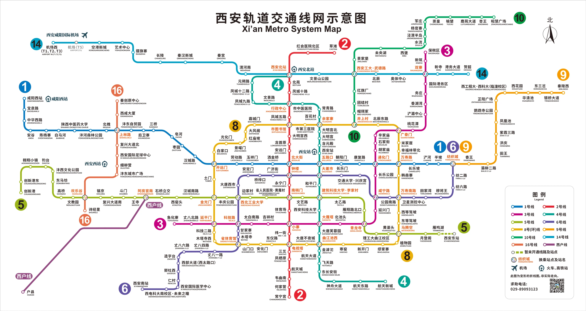

## 西安介绍

西安市，古称镐京、长安、京兆、西京、雍州，是陕西省的省会，其位于中国正中部，在陕西省内位于中南部及渭河平原正中，是特大城市、国家中心城市及关中城市群核心城市。先后有西周、秦、西汉、新、东汉、西晋、前赵、前秦、后秦、西魏、北周、隋、唐共13个朝代在此建都。下属11个区，其中，西安城六区包括未央区、灞桥区、雁塔区、碑林区、莲湖区、 新城区。

西安地铁发达，各班次地铁的运营时间可以参考 [西安地铁运营时间](http://xa.bendibao.com/ditie/time.shtml)，末班车基本在 11 点以后。

## 景点

### 西安城墙

#### 基本信息

> 西安城墙景区位于西安市中心区，呈长方形，墙高12米，底宽18米，顶宽15米，总周长13.74公里。有城门四座：东长乐门，西安定门，南永宁门，北安远门。西安城墙是在唐皇城的基础上建成的。完全围绕“防御”战略体系，城墙的厚度大于高度，稳固如山，墙顶可以跑车和操练。现存城墙建于明洪武七年到十一年(1374-1378)，至今已有600多年历史，是中世纪后期中国历史上最著名的城垣建筑之一，是中国现存最完整的一座古代城垣建筑。
>
> 关于各城门的介绍可以看：[西安城墙五一旅游攻略](http://xa.bendibao.com/tour/2023425/ly114632.shtm)、

- 开放时间：
  - 永宁门(南门)、建国门、中山门（小东门）：8:00-22:00
  - 长乐门(东门)、安定门(西门)、安远门(北门)、文昌门、含光门、西北城角登城口：8:00-20:00
  - 18:00 开灯
- 门票：54元/人
  - 在景区游览过程中，如想临时离开，可找工作人员在闸机处刷证出去，门票是当日内有效，一天内可多次出入
  - 自行车单人45/辆/3小时，双人90/辆/3小时，押金100，要现金押金（租赁地点：永宁门、安远门、长乐门、安定门、含光门，也就是东西南北都能租车/还车）
- 订票方式：关注“西安城墙景区”微信公众号，通过官方小程序提前两日预约购票

#### 路线

- 建议一（南门步行到西门）：[西安城墙从哪里登上去，从哪里下去最好玩？ - 稗子酿的酒的回答 - 知乎](https://www.zhihu.com/question/402620789/answer/1837154776)
  - 登城墙的地点建议选择南门（也就是永宁门）。因为古代的建筑都讲究坐北朝南，所以南门是最气派的城门，保存的也很完整，闸楼、箭楼、正楼都完整无缺。
  - 如果是步行的话，可以向西走，路过含光门，参观一个城墙遗址博物馆，然后在西门（安定门）下城墙即可，之后可以去回坊和钟鼓楼附近吃小吃（不太推荐永兴坊，感觉主要是给游客准备的）。没有太大的必要走完一圈，接近14公里的路程有点长，而且城墙上的景致都差不多。
  - 如果喜欢骑车，可以租一辆自行车绕城墙一周，用时大概两小时。
  - 如果喜欢骑车，可以租一辆自行车绕城墙一周，用时大概两小时。
- 建议二：[西安城墙从哪里登上去，从哪里下去最好玩？ - John1628的回答 - 知乎](https://www.zhihu.com/question/402620789/answer/1294411647)
  - 时间充足的话，建议从永宁门（南门）上城墙，然后往东走一段有个租自行车的地方，租一辆自行车，绕着城墙骑一圈，回到永宁门西边还车，最后从永宁门下城墙。绕城墙一圈是13.74公里。边骑边看，能看到东南西北不同的风景。
  - 不充足的话，建议还是从永宁门上城墙，往东走，根据自己的时间和体力从安远门（北门）或者长乐门（东门）或者中山门下城墙。如果时间很紧张的话就从永宁门上城墙，沿着城墙走一段，再原路返回从永宁门下城墙。
- 建议三：[【西安城墙路线攻略：有王者走完一圈了嘛？ - 冷三岁 | 小红书 - 你的生活指南】](https://www.xiaohongshu.com/discovery/item/67a5d0f5000000002a0012fa?source=webshare&xhsshare=pc_web&xsec_token=ABmYU2RysaDwAEkd1UkJcIm1y_rtREfC_Dwr8V0AZcgZU=&xsec_source=pc_share) 这个博主还有城墙内的游玩路线，如果要按这个路线走，可以从南门上，西门下，然后再按路线走回南门。
- 建议四：[【那些骑行西安城墙的你们嘴是真严啊 - 小敏。 | 小红书 - 你的生活指南】](https://www.xiaohongshu.com/discovery/item/67095adb000000002c02bf31?source=webshare&xhsshare=pc_web&xsec_token=ABPBFScTqlJ2s3wtPnOWpnt7qx_RtYYlD0jNOYLXMMWi4=&xsec_source=pc_share) 一句话，骑完全身痛
- 建议四（精华短途路线）：永宁门→朱雀门→含光门遗址博物馆→小南门→返回永宁门。必打卡看点
  1.  含光门遗址博物馆：展示唐代城墙遗址及横截面，了解古代筑城工艺。
  2.  永宁门：城墙修复最完整的城门，可远眺钟楼，晚间有金甲武士表演。
  3.  朱雀门：韩愈笔下“天街小雨润如酥”的朱雀大街起点，历史感浓厚。
  4.  广仁寺金顶（西北角）：城墙高处俯瞰藏传佛教寺庙的金顶，静谧独特。
  5.  月亮桥（护城河南段）：夜晚灯光下拍照绝佳，如梦如幻。

#### 拍照机位

- 永宁门
  - [【永宁门城墙门票要这个价是认真的吗 - Tree & Jackie | 小红书 - 你的生活指南】](https://www.xiaohongshu.com/discovery/item/6784a44d000000001a01ee7c?source=webshare&xhsshare=pc_web&xsec_token=ABbWs3VOUmhjDXBErOAgohutbOl6mKFV1gggilGaNom7o=&xsec_source=pc_share)
  - [【请抄作业‼️这8⃣个西安城墙机位太美了✅ - 西安跟拍-城墙三公主📸 | 小红书 - 你的生活指南】](https://www.xiaohongshu.com/discovery/item/66f928b1000000002c02e983?source=webshare&xhsshare=pc_web&xsec_token=AB8U-gXbTq3WG-Xrrnx6nQywzqsDj-c9S31cb3GqJZ4tE=&xsec_source=pc_share)
  - [【西安城墙珍藏拍照机位~~ - 摄影滴七一 | 小红书 - 你的生活指南】](https://www.xiaohongshu.com/discovery/item/6630965b000000001e0324c5?source=webshare&xhsshare=pc_web&xsec_token=ABhS0wiC3BLZ0igmfSlrT0J4L66AzPJ9JiTOC2gl-J-NQ=&xsec_source=pc_share) 视频教学

### 城墙内

#### 路线一

上图路线来自：[【西安城墙路线攻略：有王者走完一圈了嘛？ - 冷三岁 | 小红书 - 你的生活指南】](https://www.xiaohongshu.com/discovery/item/67a5d0f5000000002a0012fa?source=webshare&xhsshare=pc_web&xsec_token=ABmYU2RysaDwAEkd1UkJcIm1y_rtREfC_Dwr8V0AZcgZU=&xsec_source=pc_share)，下面按顺序介绍

- **广仁寺**：中国唯一绿度母主道场，也是陕西地区唯一的一座藏传格鲁派寺院，拥有中国唯一的精品千佛殿。国家AAAA级旅游景区。
  - 开放时间：8:00-18:00（17:30停止入场）
  - 门票：免费，无需预约
  - 注意事项：
    - 穿着：不要穿拖鞋、吊带、背心、短裙等。尽量不要穿太艳丽的衣服会显得不够庄重。
    - 藏传佛教遵循顺时针绕行（右绕）的礼佛传统，从寺院左侧进入（门口可领绿度母手环带左手），沿顺时针方向参拜。进门左侧可免费领三支清香。
    - 供香不点香，合十不磕头
    - 不要对着佛像拍照，手机可调静音震动
  - 拍照机位：[【西安广仁寺｜6️⃣个宝藏机位大公开📸 - 鱼蛋在拍照📷（全国版） | 小红书 - 你的生活指南】](https://www.xiaohongshu.com/discovery/item/678a1784000000000a007b78?source=webshare&xhsshare=pc_web&xsec_token=ABKAfuaAAxDI4PuzRXg3-WRyFk9oeMUj-2r_dvMI-ETFQ=&xsec_source=pc_share)
    
- **云居寺**：云居寺“其台基于唐，创于宋，屡葺于明”，据说是唐太宗为母亲免于奔波南五台礼佛而建。现存的云居寺殿宇保持着宋代“硬山式”建筑形式，尤其是卧佛殿内卧佛塑像堪称明代塑像珍品。
  - 开放时间：时间 8:00-17:30
  - 门票：免费
  - 拍照机位：[【西安经典机位打卡——西五台云居寺 - Mua | 小红书 - 你的生活指南】](https://www.xiaohongshu.com/discovery/item/666d0a49000000000e0336ea?source=webshare&xhsshare=pc_web&xsec_token=ABLD2cAtwFcpco0KtJH6DIkEIf8FSqvc39uHL1sDi0sAo=&xsec_source=pc_share) 11月去有银杏树会更好看
    
- 洒金桥美食街：[【西安洒金桥外地游客避坑推荐指南攻略！ - NPC | 小红书 - 你的生活指南】](https://www.xiaohongshu.com/discovery/item/66a76e5a0000000005033e95?source=webshare&xhsshare=pc_web&xsec_token=ABYv_PMM2NyFeBu0OJgjjCnQvoNzYERkgtAdsQAJT5Ljs=&xsec_source=pc_share)，不过看评论似乎有点脏乱
  1. 洒金桥入口的牛肉饼❌不推荐买！这个满大街都有，而且价格贵，排队时间长，性价比不高！
  2. **刘明柿子糊塌**，现做现炸，外酥里软，甜甜的，适合当作小甜点吃一个。
  3. **胖子甑糕**（zèng），每天早上出摊，卖到九点就不卖了，可以要个小份的尝尝，甜甜糯糯的，接受度很高的小吃。
  4. **军军绿豆糕**，西安传统糕点，有好多种口味，非常适合当作伴手礼买回去。
  5. 秦伊香牛肉干，军军的隔壁，有九种口味任选，店里还有很多西安特产，可以顺便看看
  6. **马二酸汤水饺**，西安的酸汤水饺非常有西安特色，而且回民的做法是牛肉韭黄馅的，这家店虽然这两年褒贬不一，但是游客可以试试，尝尝味道。
  7. **刘信牛羊肉小炒**，对于很多西安人，小炒比泡馍更受欢迎，整体口味酸酸辣辣，外地人也更容易接受。记得要牛肉的。
  8. **老金家蛋菜夹馍**，前几年突然很火的夹馍形式，里边有咸蛋黄，煎鸡蛋，玫瑰小菜，各种小料，我自己觉得有点咸，但是很多人挺喜欢的。
  9. **志亮蒸饺**，西安必吃榜的常客，很多西安人都会来吃的店，别的就不多说了，记得再来一份八宝粥，会非常惊喜！
- 西安城隍庙：道家圣地，敬奉城隍神，建于明洪武二十年，清光绪十三年火灾被毁后重修，保留至今。

  - 开放时间：8：30-17：30
  - 门票：免费，无需预约。
  - 牌匾挺有意思，[【这地方靠谱吗？咋看着有点不正经？ - 小胡怪蜀黍 | 小红书 - 你的生活指南】](https://www.xiaohongshu.com/discovery/item/672cdd8f000000001b02af20?source=webshare&xhsshare=pc_web&xsec_token=ABH1-sAG-O7XZ8nXcqwJc4avsXFvEY70YGxZr18ZGa-Ic=&xsec_source=pc_share)
  - 拓展阅读：[全国十大城隍庙](https://www.maigoo.com/top/438067.html) [中国著名的城隍庙都有哪些？里面供奉的都是谁？](https://zhuanlan.zhihu.com/p/615957883)

  

- 鼓楼/钟楼：就俩楼，感觉晚上去有灯好看一点。没必要上去。可以去开元商场五楼/六楼观景平台拍照👉[【西安钟楼夜景出片指南‼️6⃣️个必拍机位+隐藏 - 洞见law | 小红书 - 你的生活指南】](https://www.xiaohongshu.com/discovery/item/67c980bd000000000d015b13?source=webshare&xhsshare=pc_web&xsec_token=ABNLMGytU35QW71767U6_6nQD3Q9QQoB_GwtuWCgx4B-8=&xsec_source=pc_share)
  
- 回民街
  - 从鼓楼进主街，看看就行，啥也不买啥也不吃。
  - 走穿主街以后左拐进去大皮院，可以吃陕拾叁，马三灌汤包，老乌家小炒，穆萨砂锅，文文烤肉(必吃)，盛家凉皮，小房子粉蒸肉，东南亚甑糕，按这个顺序一路可以走到西羊市就差不多了，如果觉得好的话可以再有一晚上专门去吃饭，除了文文烤肉，白天别的饭馆也开门;
- 高家大院
  - 在回民街里面
  - 有皮影戏
- 天主教西安南堂
  - 开放时间：8:00-18:00（弥撒期间禁止随意拍照）
  - 门票：免费
  - 机位：[【西安跟拍｜这座教堂⛪️真的很出片！ - 火离 | 小红书 - 你的生活指南】](https://www.xiaohongshu.com/discovery/item/6623552c000000000302336c?source=webshare&xhsshare=pc_web&xsec_token=ABD1YsRZg1eN-qBQN7rFm3U6ZEy_lZVNNJB9kxTuWXI1c=&xsec_source=pc_share)
    
- 湘子庙：主要供奉八仙中的“韩湘子”，据说是韩湘子出家之地，故居。有 月老殿，供奉着月老，是求姻缘的主要场所。灵槐妙花，两棵千年古槐树，据说在树下祈求姻缘会更加灵验。[【西安湘子庙 - 田田Luckygirl | 小红书 - 你的生活指南】](https://www.xiaohongshu.com/discovery/item/66c761d0000000001f01edd4?source=webshare&xhsshare=pc_web&xsec_token=ABuoKc-qSD3c0O24HDF6MMOHqjoc6CvmQoRylMiVIyQpA=&xsec_source=pc_share)
  - 开放时间：8:00-17:00
  - 门票：免费，求签20元
- 碑林博物馆
  - 5月18日开放新馆，这之前普票10远
  - 目前只能看到拓片，门内门外都有卖（不是原碑）[【碑林———书法爱好者的朝圣地 - 乐乙安 | 小红书 - 你的生活指南】](https://www.xiaohongshu.com/discovery/item/65cb856a000000000b021aa1?source=webshare&xhsshare=pc_web&xsec_token=ABUYxCbdE1aNkfbLLVqIDyWL-M0TRpbAoo814E3mMjMtQ=&xsec_source=pc_share)
  - 还有石刻 [【碑林石刻馆重装上阵 - 酉书文库外版雕塑造像文献 | 小红书 - 你的生活指南】](https://www.xiaohongshu.com/discovery/item/67bdc4e6000000000900dc33?source=webshare&xhsshare=pc_web&xsec_token=AB15fflnZopQY-iaXSKtj7bVXzBccBhSDtUqRVfnWDdy8=&xsec_source=pc_share)
- 永兴坊（小吃街）：多是西安本地美食，比如biangbiang面、腊汁肉夹馍、凉皮、柿子饼，甑糕、柿子饼、油泼辣子、菜盒、饸络、陕北羊蹄、菜豆腐、陕北猪头肉夹馍、岐山臊子面等美食。[【🔥西安永兴坊逛吃全地图❗️摔碗酒+12家非遗 - 张张呀 | 小红书 - 你的生活指南】](https://www.xiaohongshu.com/discovery/item/67c3e05d000000001203c64a?source=webshare&xhsshare=pc_web&xsec_token=ABGTmHKjoqZRjJ58NPUKriCcE57XTLyQbP5fjsEHsSvMw=&xsec_source=pc_share)
  - 但是看评论说不好吃，人多估计也不好拍照，随便逛逛得了。

#### 路线二

上图来自：[【西安——多条线路 - 今夜吃晚饭 | 小红书 - 你的生活指南】](https://www.xiaohongshu.com/discovery/item/6797446b000000001800aff1?source=webshare&xhsshare=pc_web&xsec_token=ABGI4E5UYKs5kNSVQrJRl5ciARv17y3-G1hUgEzMtSRdk=&xsec_source=pc_share)，其实和路线一差不多，我觉得这张图看起来清晰一点。

#### 路线三

宗教之旅：[【西安四种宗教一日游（全程步行就可！ - 壺壺 | 小红书 - 你的生活指南】](https://www.xiaohongshu.com/discovery/item/67926afb0000000018005613?source=webshare&xhsshare=pc_web&xsec_token=ABnzgSXmSLkDda0SfqcQoeThbwMoDDkVucoF8lZsogGKE=&xsec_source=pc_share) 天主教、道教、伊斯兰教、佛教（藏传+汉地），一天就能看一遍；天主教西安南堂—都城隍庙—化觉巷清真大寺—西五台云居寺—广仁寺—杨虎城别墅止园—天主教西安北堂。

- 化觉巷清真大寺：[【在西安回民街附近，最古老的两座清真大寺 - 少喝可乐 | 小红书 - 你的生活指南】](https://www.xiaohongshu.com/discovery/item/67a73519000000002a001797?source=webshare&xhsshare=pc_web&xsec_token=ABBou7HkB4VxIIdKX3h0_MhlatSsaguAmiiXuRsXDVbxA=&xsec_source=pc_share) 化觉巷清真大寺和大学习巷清真寺，分别一东一西
  - 开放时间：8:00-18:00（17:30 停止入场），周五主麻日不对外开放
  - 门票：
    - 化觉巷清真大寺：淡季15元，旺季为25元
    - 大学习巷清真寺：免费
  - 女生必须戴头巾（门口可以租 5r / 次），不能穿露肩 / 露膝的衣服，进入大殿要脱鞋
- 杨虎城别墅止园：小院建成后初取“紫气东来”首字，命名为“紫园”；后来杨虎城接受李元鼎先生的建议，取“止戈为武”之意更名为“止园”；陕西辛亥革命元老、著名书法家寇遐先生隶书题写“止园”二字，镌刻于小院门楣；因为蒋介石字"中正"，"正"字去头为"止"，所以他觉得不吉利，不喜欢这个地方😂
  

### 城墙外

- 陕西历史博物馆
  - 每日分8:30-10:30、10:30-12:00、12:30-14:30、14:30-16:30四个预约入馆时段
  - 门票：免费（壁画馆需进馆后单独购票），注意：陕历博还有一个秦汉馆，在另一个地方，但预约在同一个页面，注意看好别选错！
  - 可以看B站上的讲解：[陕西历史博物馆全程参观讲解](https://www.bilibili.com/video/BV1RkhneXEv3)，2个小时
- 大雁塔：唐永徽三年（652年），玄奘为保存由天竺经丝绸之路带回长安的经卷佛像主持修建了大雁塔，最初五层，后加盖至九层，再后层数和高度又有数次变更；自武则天改建以来，一直保持着七层的外观至今。
  - 有音乐喷泉可以打卡，12/16/19/21 整点开始共四场，周二检修不开
  - 拍照机位：
    - 唐大慈恩寺遗址公园，如来佛和大雁塔同框
    - 大雁塔南广场，和玄奘法师来张合照
    - 大悦城4楼观景台
- 大唐不夜城：一条充满盛唐风情的街道，东西两侧景观各有特色，中间则是美轮美奂的景观带，单向路程大概1公里。人少的时候可以两边随意穿梭着走

  - 门票：免费，演出也能免费看（19点-22点50）
  - 景区内免费循环接驳车（10分钟/班）
  - 🌟必吃推荐：

    ✔️ 老字号：

    - 同盛祥羊肉泡馍（馍粒筋道，汤头浓郁）
    - 西安饭庄葫芦鸡（皮酥肉嫩，搭配椒盐）
    - 春发生葫芦头泡馍（肠肚处理干净，汤鲜味美）

    ✔️特色美食：

    - 陕拾叁冰酪（醪糟味、油泼辣子味猎奇体验）
    - 三原老黄家油糕（糖汁四溢，甜而不腻）

- 大唐芙蓉园：门票120，主要是仿古建筑，表演好像要另外收费。评论表示不如开封清明上河园。去大唐不夜城就得了。
