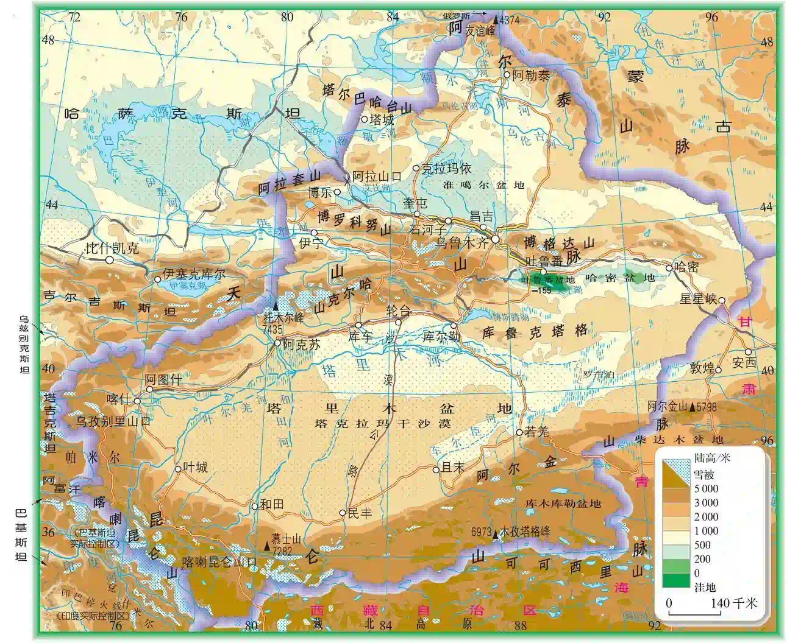
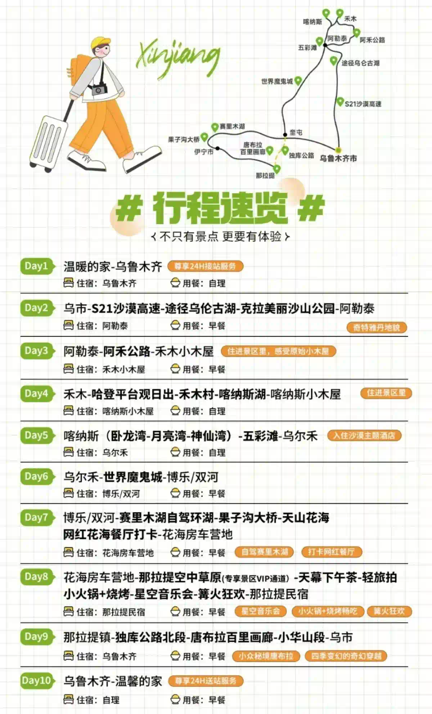
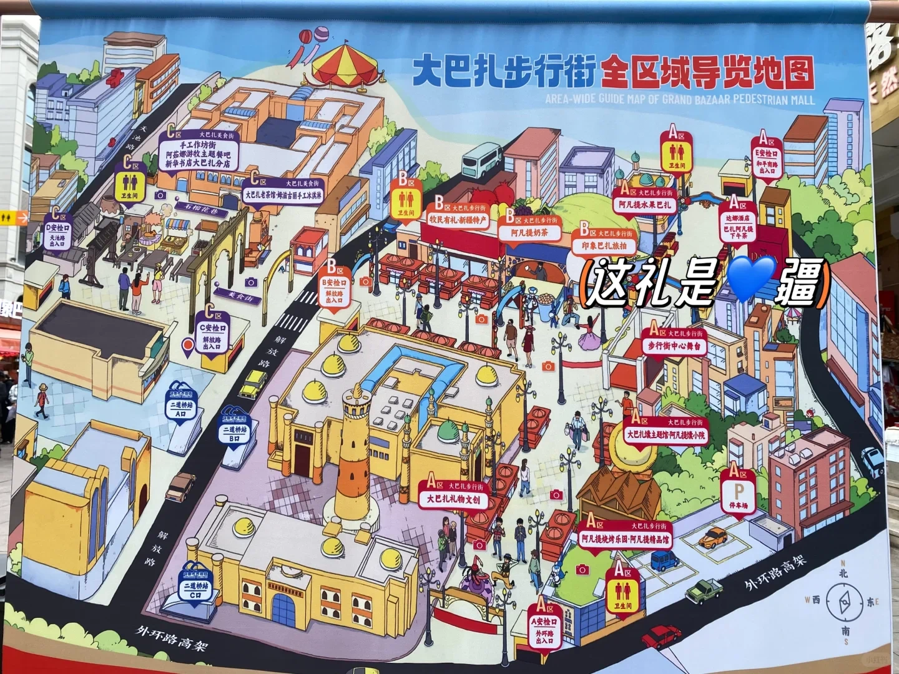
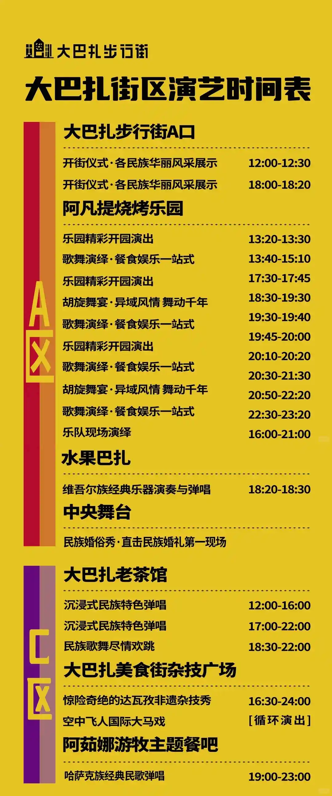
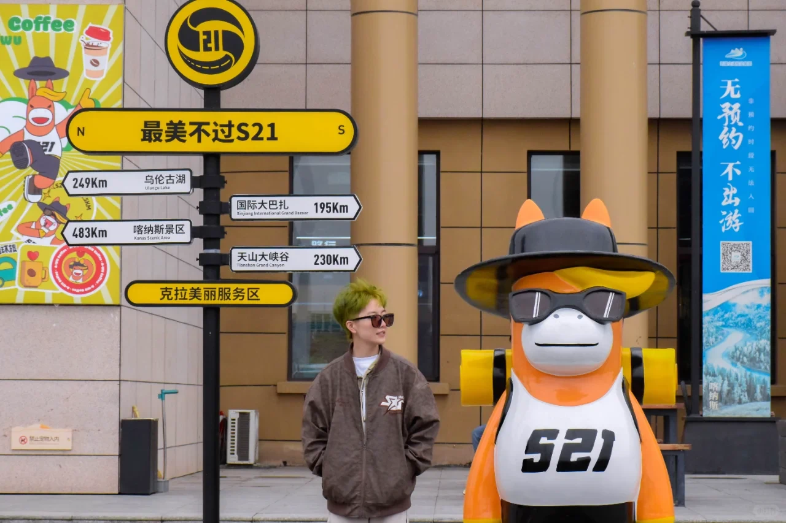
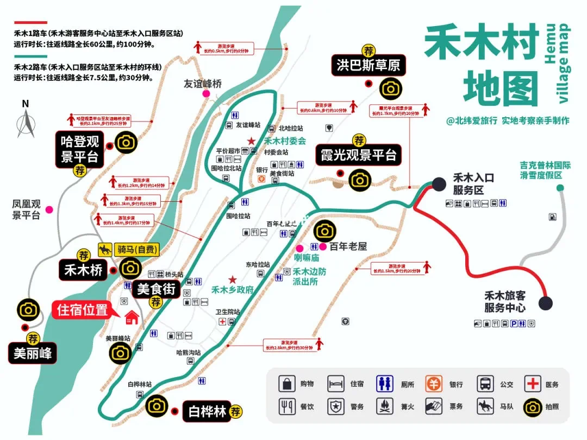
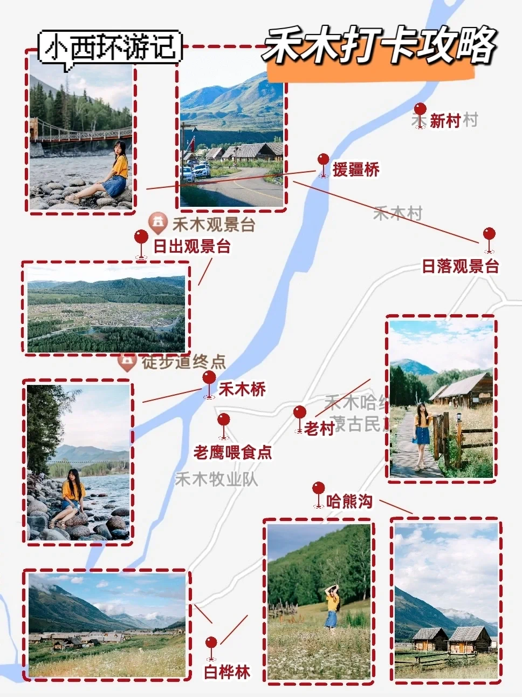
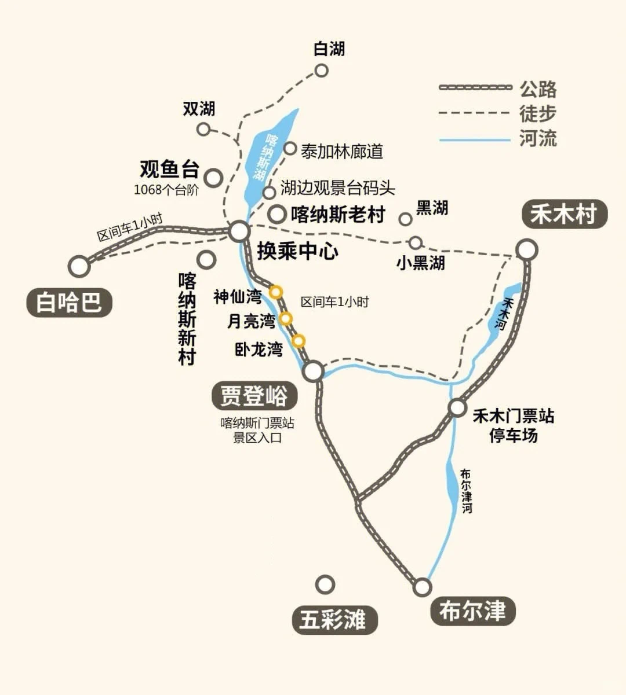

2025年5月6日~2025年5月15日新疆之旅

<!--more-->

## 新疆介绍

以下内容来自百度百科：

> 新疆维吾尔自治区（Xinjiang Uygur Autonomous Region，维吾尔语：شىنجاڭ ئۇيغۇر ئاپتونوم رايونى），首府乌鲁木齐，面积166.49万平方千米，是中国面积最大的省级行政区，约占中国国土总面积的六分之一。新疆主要使用普通话和维吾尔、哈萨克、蒙古、柯尔克孜、锡伯等5种少数民族语言。
>
> 新疆地势为三山夹两盆，从南向北分别为：昆仑山脉、塔里木盆地、天山山脉、准噶（gá）尔盆地、阿尔泰山脉，属于典型的温带大陆性干旱气候，气温年较差与日较差大，降水集中在山区，平原区降水少。新疆拥有中国最大的内陆河塔里木河，以及中国陆地最低点艾丁湖。新疆古称“西域”，西汉建元三年，汉武帝派遣张骞出使西域。神爵二年‌‌，西汉设立西域都护府，新疆地区正式纳入中国版图。清光绪十年，清政府正式在新疆设省，改称西域为“新疆”。1949年9月25日新疆和平解放。1955年10月1日成立新疆维吾尔自治区。
>
> 吐槽："昆仑山"对应"昆仑山脉"，"天山"却不对应“天山脉”，而是“天山山脉”，叠词词😂

## 新疆美食

- 馕饼
  - 肉馕
  - 买买提奶油馕
- 烤羊肠
- 酸奶酪
- 丸子汤
- 酸奶冰粽

## 行程一览

由于报了小团，所以就按安排的行程走。下面对行程进行详细的规划，文中点击景点名可跳转至高德地图，主要参考小红书近期（五一放假期间）的博文。

### 5/6 广州-乌鲁木齐

广州白云 T2 航站楼，10:05 起飞，15:25 到达。从学校过去约 2 个小时，建议打车到3号线市桥站（约20~25元），这样到汉溪长隆后有位置坐，毕竟地铁上要一个小时。

到达后司机接机到酒店（[乌鲁木齐塞外江南大酒店](https://surl.amap.com/g6sQjmoh1Ox)），去酒店大概 30 分钟，到酒店后放好行李大概 16:30，然后后面的行程都自由安排。下面列举可选景点：

- [新疆国际大巴扎](https://surl.amap.com/3BzfUOI1p4OM)
  > 新疆大巴扎于2003年6月26日落成，总面积达10万平方米，是世界规模最大的巴扎（维吾尔语，意为集市、农贸市场），集伊斯兰文化、建筑、民族商贸、娱乐、餐饮于一体，是新疆旅游业产品的汇集地和展示中心。
  - 营业时间：10:00~22:00
  - 游览建议：可以吃点小吃，但别买东西，买东西的话建议去金泉商场，且一定要对比拼多多&砍价。[小红书：乌鲁木齐购物攻略✨别再买贵了](https://www.xiaohongshu.com/discovery/item/671a9488000000001b02de5b?type=normal&xsec_token=ABZdyoAl0zpWsiQargp4bFBD1v5yjTIjEH-Kn22A9ZxBM=&xsec_source=pc_share)
  - 拍照：[小红书：新疆大巴扎这10个宝藏机位📸直接赞爆朋友圈](https://www.xiaohongshu.com/discovery/item/66bac6160000000009016293?type=normal&xsec_token=ABaEQ2REJbWq4FlRof39CLqjC9hDO6hvXDLK348g65Yf4=&xsec_source=pc_share) 主要是阿凡提、工艺品
  - 导览地图：分为A、B、C 三个区，地铁站C口出来就是 A 区。
  
  - 表演：

- [红山公园](https://surl.amap.com/7UmzYTl27kq)：其实就和一般的城市公园差不多，能看到的也就中信大厦和乌鲁木齐电视塔。
  
  

### 5/7 乌鲁木齐-阿勒泰

8:00~9:00 酒店有早餐，可以偷偷顺几个鸡蛋路上吃。路上时间较长，出发前准备多一点水和零食。

9:00 启程，沿 S21 阿乌高速一路向北穿过准格尔盆地，到达阿勒泰，全程约 6.5 小时（5小时车程，加上中途吃饭休息的时间）。据说乌市很堵，要两个小时才出得去。出发11点、12点左右会到达克拉美丽沙漠公园，应该就在这里吃午饭，然后在公园玩 2 小时，然后再启程。从克拉美丽沙漠公园到乌伦古湖（附近）又要 2 小时，不确定会不会到湖边，看路线并不顺路，有可能只是隔很远看一下。晚上到阿勒泰住宿（[阿勒泰国帆假日酒店](https://surl.amap.com/3O6aBWRBdvL)）。

- [S21公路](https://surl.amap.com/2cMnZ0hy6Zq)
  > 阿乌高速是S21沙漠公路。‌这条公路连接了天山与阿尔泰山，横穿了古尔班通古特沙漠及准噶尔盆地腹地，全长343公里，于2021年12月25日通车。
  >
  > 公路沿途设有5对服务区，每个服务区都有独特的设计和主题，如军垦文化、旅游探险、野生动物保护等，让游客在旅途中享受不同的文化和旅游体验。此外，S21沙漠公路还是中国首条交旅深度融合的沙漠探险旅游示范高速公路，沿途的‌雅丹地貌、湿地等自然景观以及服务区的特色设计，使得这条公路成为了一个旅游目的地。
  - 出片点在盆地中间（克拉美丽沙漠公园之后），可以拍到四周的山
- [克拉美丽沙漠公园](https://surl.amap.com/2c6AiOV100cZ)
  > 克拉美丽沙漠属于古尔班通古特沙漠，也是中国第二大沙漠。准确的说不能叫沙漠，更像是荒漠，有一些植被。旁边有建设的塔楼，可以俯瞰，当然也没什么特别的风景。
  - 门票：免费，建议别去因为啥也没有，可拍的也只有沙漠、骆驼、胡杨柳树（参考 [小红书：新疆避坑指南之克拉美丽沙漠s21](https://www.xiaohongshu.com/discovery/item/66fa2264000000002c02e05c?type=video&xsec_token=ABWrN6wDxWMCvWeiVSTgQnY1fGvMPoPzMJI3JqEQ77sY4=&xsec_source=pc_share) 以及 [小红书：新疆自驾｜S21沙漠公路 沿途风景记录](https://www.xiaohongshu.com/discovery/item/66ebfb6a000000001e019224?type=normal&xsec_token=AB5d0PIRvXiFZM7rsdjj8kjNLxLenMmm1Ct3lg8YzCjvo=&xsec_source=pc_share)）
  - 景区项目（可以看看 [官方小红书：S21沙漠公路](https://www.xiaohongshu.com/user/profile/66627e33000000000303079f?channel_type=web_search_result_notes&xsec_token=ABjsoX43jFcH96e_BijGYy4VvfTR3HYmdwEcGAaA8UT4Y%3D&xsec_source=pc_note)）
    - 沙漠冲浪168/人（据介绍可赠送滑板滑沙）
    - 骑骆驼80/人（距离几百米，大概15分钟）
    - 在旁边有一座地下的餐厅，也可以吃饭，整体价格比外面要贵一些，不过可以接受。在地下餐厅的上方也有卖特产和工艺品的地方。
- [克拉美丽服务区](https://surl.amap.com/uuGpeBmo97J)
  - 有路牌可打卡
  - 西琳姑娘奶茶店，有冰淇淋和酸奶茶（看好几个小红书博主都推荐，可以试一试）
  - 其他吃的有烤包子（推荐）、牛肉馅饼（不推荐）、羊肉串（不推荐）等
  

补充一下其他服务区（按路途经过的顺序）：五家渠服务区（军垦文化）、六师一〇三团服务区（旅游探险）、克拉美丽服务区（野生动物保护）、黄花沟服务区（现代农业）、吉力湖服务区（自然风光），补充一句这些服务区的厕所“据说”都很干净。

### 5/8 阿勒泰-禾木

8:00~8:30 酒店内用早餐

8:30 出发，沿布尔津河绕行至禾木。**道路周边无餐厅，需要准备好零食。**

15:30~19:30 到达禾木村景区后，换乘景区大巴进景区，到达“禾木换乘中心”（1小时），带洗漱用品与换洗的衣服，大行李放司机车内。

19:30~20:30 入住禾木小木屋

- [禾木](https://surl.amap.com/80VWR2j54dT)：小红书上前十个帖有五个是避雷的，普遍觉得不如喀纳斯，吐槽的点包括：交通麻烦、人多、住宿脏乱贵、蚊子多。
  - 住宿：分为新村和老村，新村整体住宿条件好一些，很多都是原始风情木屋建筑，但部分网红民宿价格会虚高。（补充：老村在百年老屋附近，新村在禾木入口服务区附近）
  - 景点：景区不大，可步行，也可租电动车（共享 9 块 30 分钟，店里 50 块一小时）。里面也有公交车（不用单独付钱，买门票的时候都是门票+区间车）。
    
    
    - 云霄峰：想去看雪山可以去，禾木站和换乘中心都可以买票，188一位。买完票后去换乘中心根据指示牌去大巴。缆车上去有个中途站需要换乘，上山不要在这浪费时间。下山的时候再玩。山顶很冷，有雪，多穿衣服。超级多人，不好拍照，排队时间长。游玩时长3~5小时。具体景色可参考：[小红书：禾木云霄峰🏔️实拍 | 被浪费的5小时🥲](https://www.xiaohongshu.com/discovery/item/669a1a480000000025017dad?type=normal&xsec_token=AB-qSjqnGfBYCVgVL8XYKPXXZ0mIEZH_aYm4PskF0hj24=&xsec_source=pc_share)、[小红书：禾木云霄峰值不值得上 看完实况再决定](https://www.xiaohongshu.com/discovery/item/66f3d4a6000000001902e39e?type=normal&xsec_token=AB3-KJckAjW4VZnkQs_KsORfU_c9f4xzwkdaRRVuPahqY=&xsec_source=pc_share)，另外有人说早上9点半缆车开门，几乎没人，不用排队。
    
    - 美丽峰：小美丽峰（2-3小时）、大美丽峰村（5-6小时），戴防晒面罩+墨镜，路上会有尘土
      - 禾木站过禾木桥后，有骑马的地方，320往返。或者往左（出禾木桥后的左）走，跟着马道一起走，徒步大概1.5～2小时可以到达美丽峰。很累，可以上去后乘马下来，也可以找好心人拼车。拼车地点在美丽峰村庄，也可以中途招手问车子能不能载程。300一车一程。美丽峰村庄有一个餐厅。徒步记得多带水，中间没有买水的地方。穿衣服不要穿太好的，因为灰尘太多了，全身全是灰。
        
      - 哈登平台咖啡店右侧有马队，也可以这里骑马去美丽峰，往返1人200。
      - 骑马体验可以参考：[小红书：禾木村骑马走美丽峰喝奶茶需二次收费，被迫](https://www.xiaohongshu.com/discovery/item/680c673c000000001202ea83?type=normal&xsec_token=ABvDRt9v1Kg3oAg34j09kSacqMt1va4YfnW_PxhbM-Df8=&xsec_source=pc_share)，博主表示雪景骑马体验不错，但是到山顶冻的不行，进屋子吃东西要收30块钱（其实也还好）。还有另一个博主的：[小红书：5.3禾木今天也太美了叭！！](https://www.xiaohongshu.com/discovery/item/6816528d000000002301e6e4?type=normal&xsec_token=ABUL12F3_OnA-kfwe2LBD0Q1Vp51MzXtRHRGz_UxVzG5Y=&xsec_source=pc_share)
    - 哈登平台（看日出/日落）：[小红书：🌄在禾木看日落要反过来去日出观景台！！](https://www.xiaohongshu.com/explore/67de2ea700000000090150f5?xsec_token=ABB038D7JKAN9rccIqCV43dCA9ybgXbTFpqjD834xfwrg=&xsec_source=pc_search&source=web_search_result_notes)
      - 【禾木站】从禾木桥后的木梯往上走，到山顶就是哈登平台。这条路算比较好走的。沿途有卖松塔的，松塔里面有松子，可以边剥边走，这样好像不会累，而且剥下来的松子壳，松塔皮可以随便扔，松塔的果子，没有什么污染。
      - 【友谊峰站】【村委会站】过援疆桥往上走，这条路比较累，坡度比较高，但是风景绝美，而且没那么臭。
      
      
    - 禾木桥：
    - 援疆桥：学学拍照姿势 👇
    - 喂鹰：10块钱可以买到一杯羊肉，也有博主说禾木桥头两边的烧烤店为了吸引客人免费提高肉投喂（不清楚要不要消费），不想花钱可以丢馕，也可以捡地上的肉。超多鹰待投喂，持续盘旋，超级震撼也很出片。接近傍晚时刻，鹰会聚集得更多。
      
    - 其他拍照点：[小红书：在禾木拍到的有趣照片📷附小众地点](https://www.xiaohongshu.com/discovery/item/67bdee25000000000900da6d?type=normal&xsec_token=AB15fflnZopQY-iaXSKtj7bTrEViiWUIdY9dIvaHtaNYU=&xsec_source=pc_share)、[小红书：禾木 | 出片封神机位✨ 小白也能秒出片](https://www.xiaohongshu.com/explore/678de97b000000001803d64c?xsec_token=ABn67X5O2hCGdmhKC3K3bhE1K9Bar6kpwl7sY8QGA2yJQ=&xsec_source=pc_search&source=web_search_result_notes)

补充禾木有中国最北端的肯德基，而8号恰好是星期四（懂？）。

### 5/9 禾木-喀纳斯

7:00-8:00 清晨美景

8:00-12:00 早餐后再自行游览禾木（如果在民宿内用正餐则送早餐）

12:00-15:00 乘车去喀纳斯

15:00-19:00 参观喀纳斯湖

19:00-20:00 喀纳斯木屋入住

- [喀纳斯](http://f.amap.com/0211ioX)：
  
  
- 湖边观景码头：
  - 徒步路线：
    - 双湖码头到吐鲁克岩画，总长3.2km，需要走来回总共6.4km。但爬上山可以看到喀纳斯湖的全景，而且一直沿着湖边走，风景也都不错。
    - [小红书：喀纳斯不走湖滨栈道就白来了！！](https://www.xiaohongshu.com/discovery/item/66bc29c5000000001e019ff4?type=normal&xsec_token=AB13c-9hRc32ITQQMheAGzuQOroSwB3Xsof0u6s6z9yCI=&xsec_source=pc_share)
      - 抵达“游客中心”，在五条线路中选择通往“喀纳斯湖”的线路。
      - 下车后根据指示牌找“喀纳斯湖码头”。下楼梯到码头后“左走”，前往喀纳斯老木桥
      - 全长 2.5 公里
- 观鱼台：换乘中心换乘2号线上观鱼台，现在淡季人少不用预约，直接上车就行，爬 1068个台阶，不想做区间车到观鱼台的也可以骑马去观鱼台，300元一人往返，不用爬1068个台阶。
  
- 三湾：（由南向北依次为：卧龙湾、月亮湾、神仙湾），三湾之间有区间车站，每两个湾之间步行时长为 50 分钟，如果全程步行大概 6 公里。小红书博主说（5月1日）神仙湾景色最好，月亮湾的水还没有绿，还是黄黄的。这里我另外选取其他几个博主的徒步路线以供参考：
  - 湖边的栈道都很靠近水，如果涨水会有被淹的风险；
  - 建议穿运动鞋，三湾那段有铁丝网
  - 穿搭建议：冲锋衣+冲锋裤+帽子+墨镜+登山杖+运动鞋
  - 神仙湾（2.9km）—月亮湾（1.7km）—卧龙湾 —双桥（0.8km）
  - [小红书：划重点‼️喀纳斯三湾的最完美徒步路线](https://www.xiaohongshu.com/discovery/item/66816245000000001e013a4d?type=normal&xsec_token=ABkKAyfdlDiMMtau80Beu-Cyss1o7_IQiQxeO5SpOovvM=&xsec_source=pc_share)
    - 坐车坐到月亮湾，最精华的部分其实是月亮湾到卧龙湾的徒步路段，但是这里注意徒步路段分沿马路的和山谷里的，一定要走到山谷里，河边的徒步栈道会给你惊喜的
    - 月亮湾有高中低三个观景台，越高处的栈道长度越短，但也离湖边越远。地下通道走几百米就能看到一个分岔口，立刻沿向上台阶，先去最高的观景台，这里能看到月亮湾的全貌。
    - 回到分岔口，跟着下行台阶，可以一路走到中间和最靠近湖边的观景台。这条下行栈道非常长，且陡，注意量力而行
  - [小红书：喀纳斯徒步的正确打开方式（建议收藏）](https://www.xiaohongshu.com/discovery/item/66740069000000001f004368?type=normal&xsec_token=ABRD-ne3olZpYNM9V56vXpj1553i50vxyH-EOha6WhDfo=&xsec_source=pc_share)
    - 在换乘中心乘坐大巴到达神仙湾下车
    - 神仙湾下车，映入眼帘就有一大片湖泊，但近水处是泥地，一脚进去鞋没了，不建议停留过久/拍摄
    - 一直往前走，就能穿越大片森林，可以走栈道，有林荫遮蔽，不晒且舒适
    - 越靠近卧龙湾就越靠近碧色的水面，是下坡路很好走，有个最佳拍摄弯道的机位，可以俯瞰蜿蜒的水湾
    - 全程走完三湾时长：拍照+走路共需5h左右（单程），仅供参考

  

  

### 5/10 喀纳斯

8:00~9:00 早餐自理

9:00-13:00 游玩三湾

13:00-16:00 前往五彩滩

16:00-17:00 游览五彩滩

17:00-20:30 前往乌尔禾，入住酒店休息

- [五彩滩](https://surl.amap.com/TeLG1ybcb)

### 5/15 乌鲁木齐-广州

酒店 14:00 前退房。上午可以去 [新疆维吾尔自治区博物馆](https://surl.amap.com/BglorFKc8pp)。

乌鲁木齐天山，18:40 起飞，0:10 到达。
