## 准备

3月份同学问我去不去新疆，我想着还没和他们一起旅行过，就答应了。我们拉了一个群聊，中间人数从8人，变成6人，最后到旅行社下单时，就只剩四人了。其实我差点因为没钱而去不了，不过还好妈妈资助了我几千元。

定的是5月6号到15号。4月末时，开始准备各种东西。看小红书上说新疆温差大，就买了件冲锋衣，迪卡侬的NH500，这件衣服真的很好穿，还有拉链可以透气，强烈推荐👍还买了登山鞋，也很有必要，走各种草地山路都不会打滑。此外还买了遮阳帽，一顶牛仔的休闲的，还有一顶迪卡侬的专业的。

为了拍出好照片，我还租了个长焦，索尼的70-350，感觉这个长焦过于长了，大部分时候我还是用我的适马18-50 F2.8。还买了闪光灯，但我觉得没什么用。还买了反光板，这个倒是非常有用。还买了备用电池、SD卡。

## 3/6

3月5号收拾好东西，6号早上6点15我就起床了，6点40去食堂，只有烧麦和蒸饺做好了，就都打包了几个当早餐。

6点55打车去汉溪长隆，到地铁站已经7点四十多了，此时地铁防护门就已经开始排队了😅，上了地铁不出意外没有座，不过过了几站后就有座了。

10点坐上了飞机，飞机还挺大的，至少是我坐过的最大的飞机。飞机座位前面有屏幕，我一路看了两部电影。飞机到新疆后可以看到地下蜿蜒的山脉和远处的雪山，已经可以感受到新疆旷美的风貌。

落地天山机场后，联系了来接机的司机。司机说他在2楼，但实际是外面的二楼（即高架桥），但机场内部对应的是3楼。我们上下两趟才找到司机说的地方。司机把我们送到了酒店，然后就离开了，他只负责接机，并不负责后续的行程。

在酒店放下行李，我们打算出去整点吃的。我们一出门就领略到了太阳的毒辣。这时候大概3、4点，此时正是新疆最晒的时候，但我们都只穿了短袖。正是有了这天的教训，后面每天都穿着冲锋衣。

我们就在路边找了个手抓饭，点了一份羊肉抓饭，一份羊腿抓饭。抓饭特别好吃。它里面放了胡萝卜、彩椒（有点不太确定），上面有炖烂的羊肉，羊肉一点也不膻，又香又嫩还带点甜味。饭用的是长粒米，虽然是炒制的，但是却一点也不油腻。胡萝卜的清甜，肉的香甜，全部都顺着油融入的饭中，即使空口吃饭也好吃。

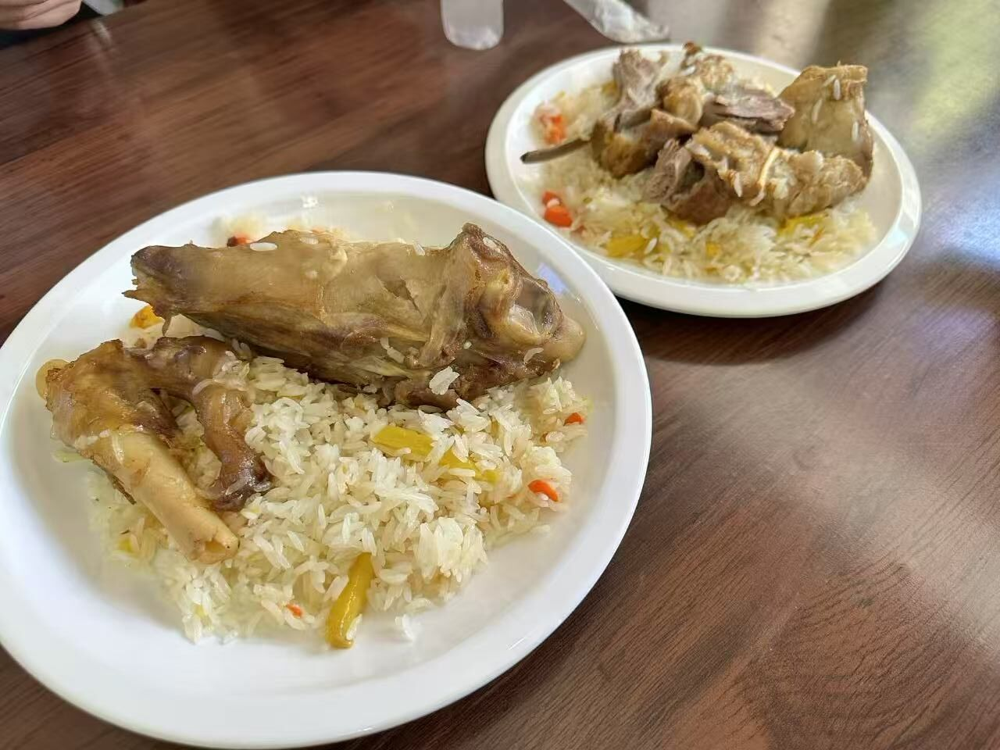

吃完饭，我们回到了酒店，和旅行社签了协议，交了剩下的钱。然后回房间把冲锋衣、雨伞和墨镜带上，就去了大巴扎。大巴扎在维吾尔语中相当于集市。我们去到时刚好有表演，主要是民族舞，也有一些杂耍。我们看了一会，拍了一些照。

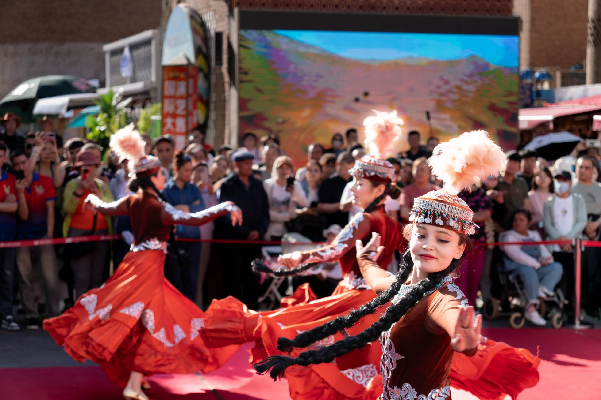

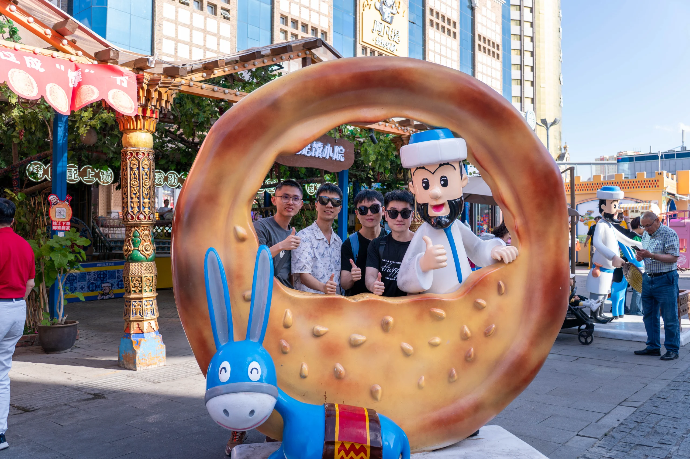

顺着街往下走，两边商户摊位都是卖的新疆特色商品，我们先是看到了葡萄干，尝了尝，挺甜的。然后买了格瓦斯，像没有酒味的啤酒，麦香中带甜味。同学还尝试了沙煮咖啡，就是用沙来煮咖啡，当咖啡沸腾产生泡沫时，就把泡沫那部分倒进杯子里，反复多次得到一整杯咖啡，他们觉得并不好喝，我也就没喝。然后我们去楼里的特产店逛了逛，试吃了最贵的蓝宝石葡萄干，这种葡萄干细长细长的，特别甜。我们还试吃了酸奶坨，像奶糖一样黏黏的口感，奶香味很足，我们都很喜欢，就买了一些路上吃。还买了个蜜瓜，我们买的品种叫小傻瓜，也有大傻瓜。

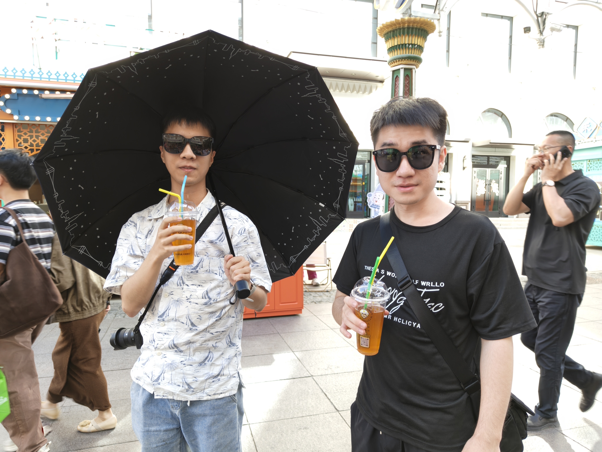

我们逛了一会，就去美食街吃饭了。在美食点了烤羊肉串、烤骆驼肉、炒米粉和一大瓶啤酒。骆驼肉并不好吃，又柴又韧。炒米粉带点辣，我同学说在广州吃的特别辣，把他辣麻了，他怀疑这家不正宗。

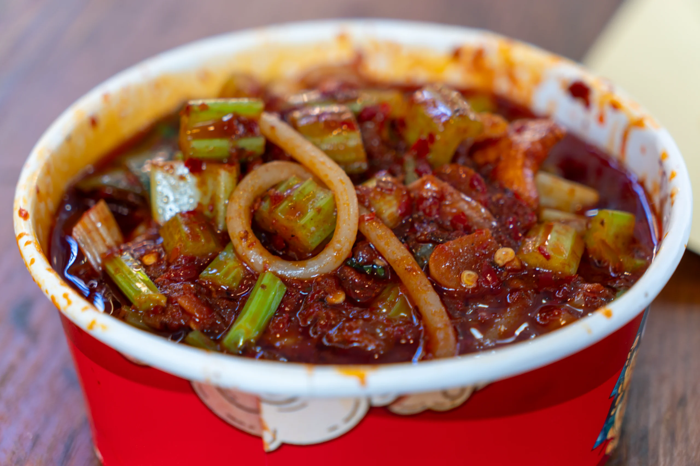

吃完饭，我同学说他女朋友想买一种叫艾德莱斯的包，就又往卖特产的店那边走。不过他似乎没有找到卖这个的店，就算了。往外走的路上，有卖10块钱的牛仔帽，有两个同学就买了一顶（不过有个同学的帽子中途不见了，就借我的帽子戴了一路）

我们做地铁回去，乌市只有一条地铁线路。回到酒店附近，我们去商场买了些泡面、火腿肠、馕准备路上吃。我们还买了9.9一大罐的酸奶。但是这酸奶不好好，里面放了明胶。回到酒店，玩了会桌游（一款有点像斗地主的牌），就休息了。

## 3/7

第二天一早吃完早餐，就出发了。司机已经在门口等着我们了，车上与我们拼团的两人也已经到了。司机姓张，我们叫他张哥，拼团的男士是一位在泰国做生意的浙江商人小周，放假来这边玩；另一个是广西离职出来玩的莎莎姐，莎姐之前去过禾木滑雪，这次都是第二次来。小周和莎姐是司机的叫法，我和同学都叫大哥大姐。司机逗我们说他是维族人，叫买买提张，到最后一天才告诉我们他是汉人。司机之前是销售经理，觉得业绩压力大，就改行做导游。

第二天要沿着S21沙漠公路一直走。S21纵穿准噶尔盆地，连接了乌市和阿勒泰。一路上两边的沙漠都按田字形种了一些草，再远一点有些灌木、胡杨，并没有想像中的那么荒凉。

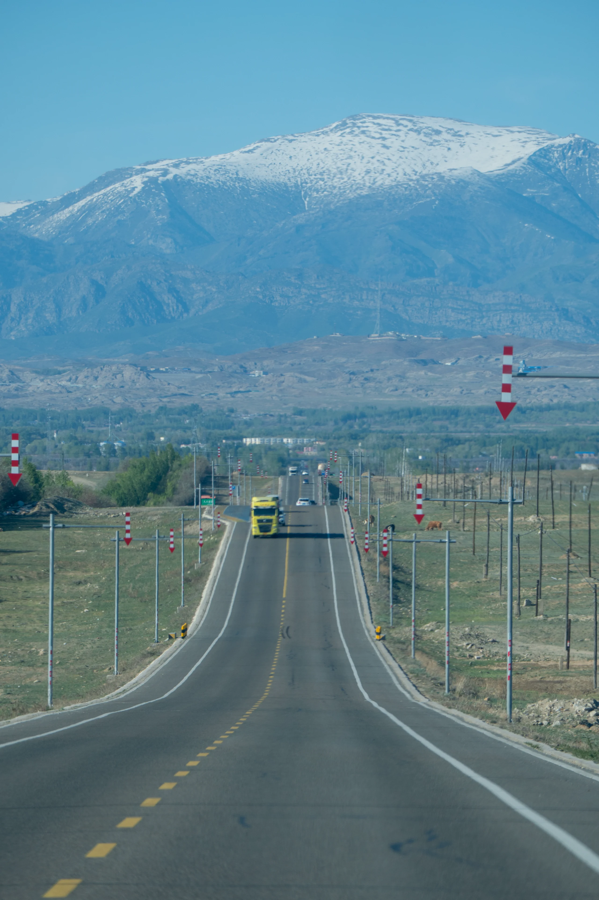

我们在中途一个休息站下车去沙漠里走了走，见到了一小团风滚草，休息站有只小猫很喜欢和路人互动。

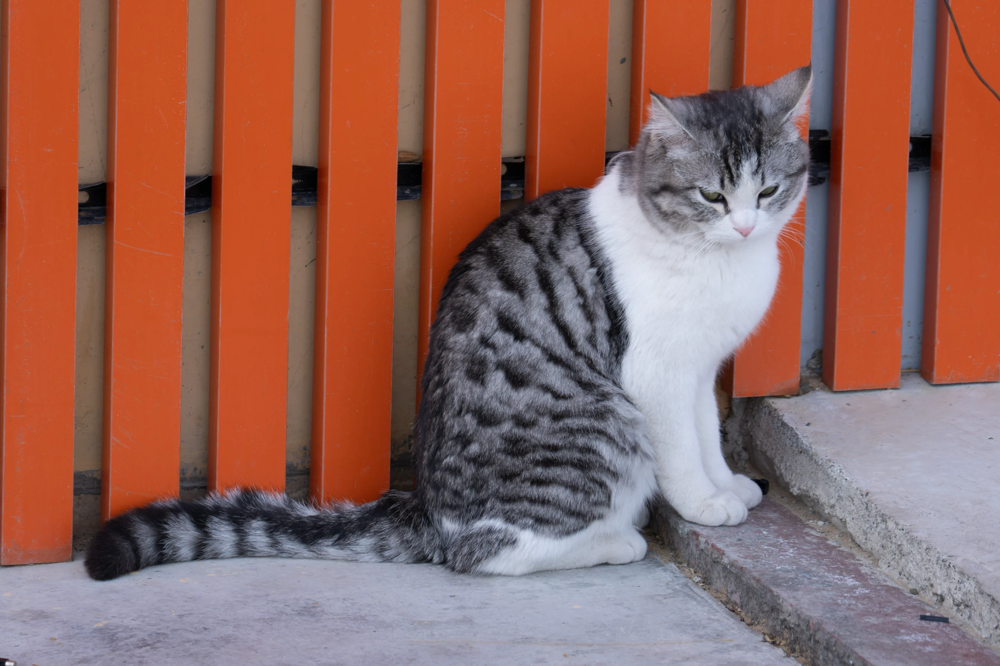

走了差不多一半时，到了克拉美丽服务区，旁边有个免费的沙漠公园，我们爬上沙坡拍了些照。在沙上行走不好用力，爬起坡来特别累。

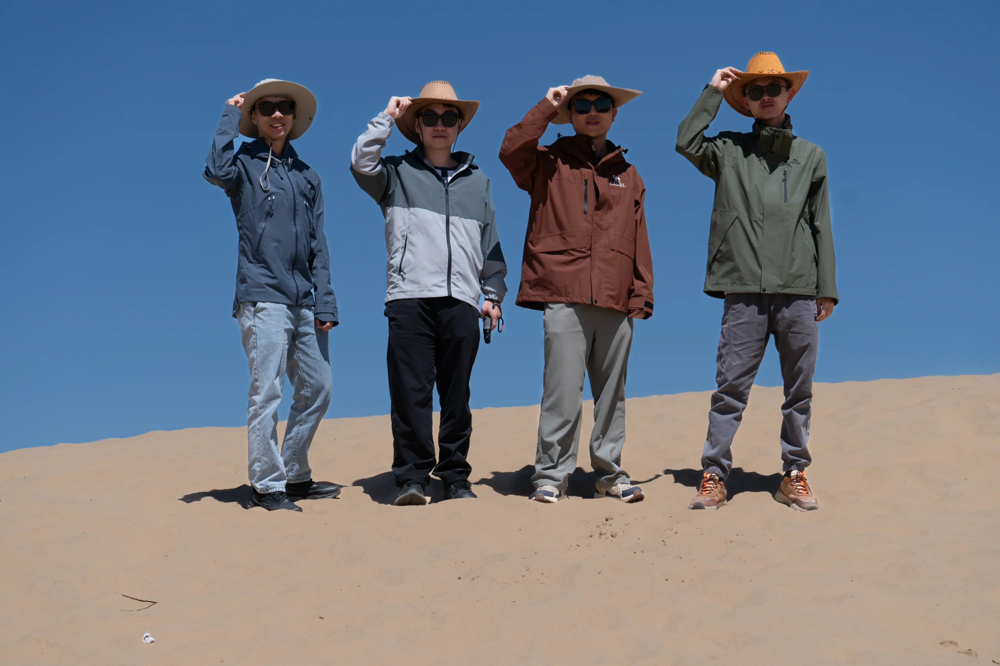

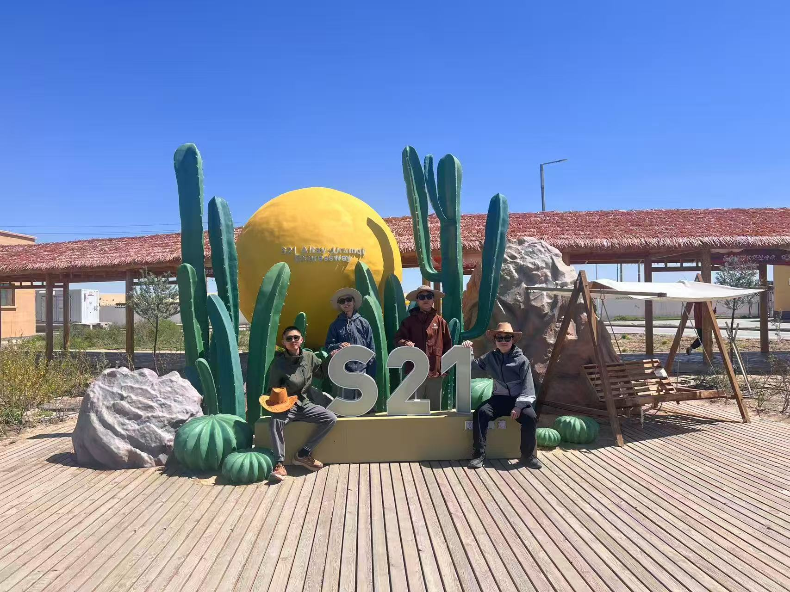

中午是在黄花沟服务区吃的。去到时手抓饭已经卖完了，我们就点了拌面吃。我点的是碎肉拌面，味道还行。司机特别喜欢吃过油肉拌面，后面有好几顿都吃的这个。

路两边有放羊的，我们停车下去拍了点照。有只牧羊犬在公路上看着羊，避免羊群跑到公路上。

快到阿勒泰时，我们去了路边的阿苇滩水库，水库其实并不算大，但是水很蓝，后面还是雪山，所以也挺好看。不过嘛，湖边的草地上特别多羊粪，有点败兴。

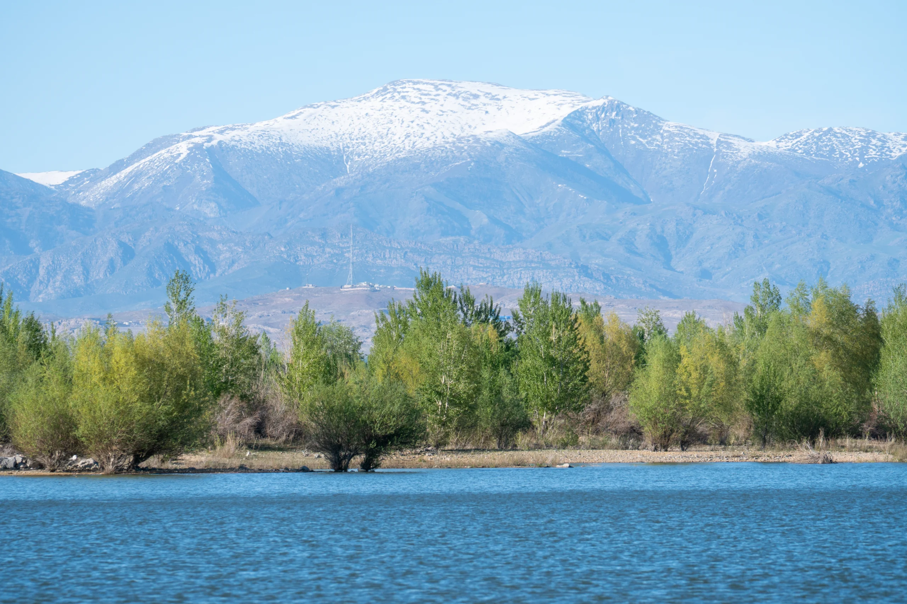

到阿勒泰已经挺晚了，我们放下行李去了附近商圈的饭店里吃饭。一开始去的商圈里面的店铺不多，很多都关门了，就换了马路对面的另一个商圈。我们看三楼有烤肉的烟雾飘出，就去了那家饭店。店不大，就一条过道，总共也就5、6张大桌子，但却坐得挺满，而且都是本地人在吃。

我们点了烤羊肉、椒麻鸡和鱼。椒麻鸡是冷的，有点像手撕鸡，特别麻。鱼似乎是冷水鱼，是这里的特产，我们住的酒店前台也有礼盒装的冷水鱼，吃起来肉有点散，红烧的做法。这顿饭是大哥请的客。

吃完饭，大哥和大姐去楼下买了泡面，因为禾木里的物价比较贵。有摊贩在卖蓝宝石葡萄干，只需要六、七十，大姐就买了一公斤。

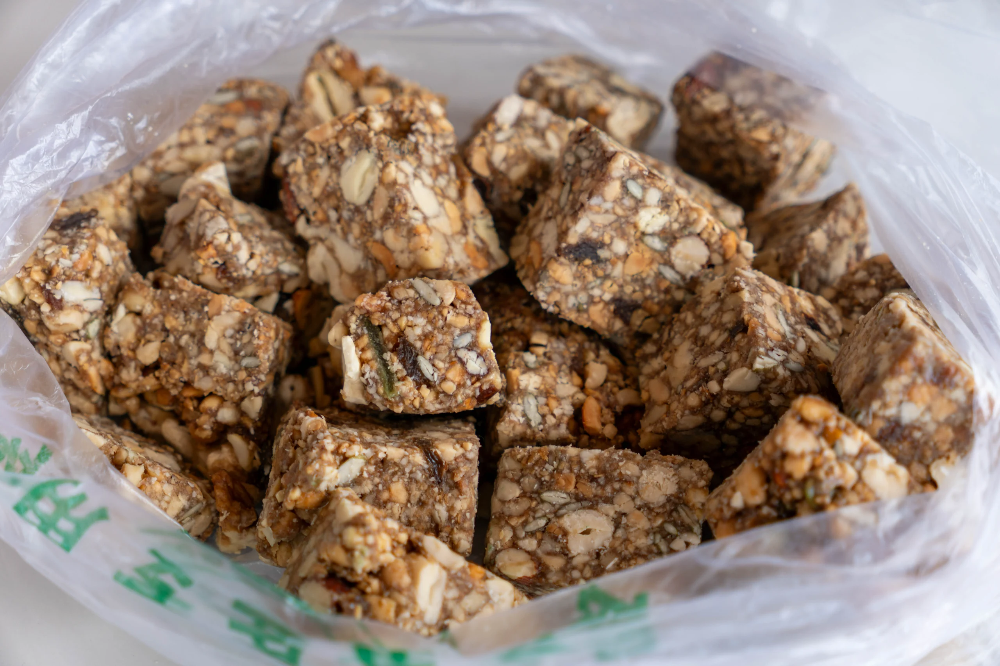

晚上回酒店又打了牌，这次是飞行棋，不过是带道具的，玩起来比较刺激。

## 3/8

第三天前往禾木。早餐在酒店里喝了新疆的奶茶，是咸的，我觉得不好喝。在出城镇的路上司机停车上厕所，我们就在附近逛了逛，那里的老人都挺悠闲的，在公园里打牌、打麻将，还有在路边打台球的，我们还去早餐店买了包尔萨克，油香口，有点像油条，可以就着奶茶吃。

去禾木的路上，我们在一片山坡边停了车。山坡下还有一点积雪，我们都上去摸了摸，雪已经变成沙冰状了。山坡上都是草，点缀着小黄花。远一点的地方有碎石和松树，再远方就是雪山。我们拍了照，还在山坡背面的石堆处解手😂

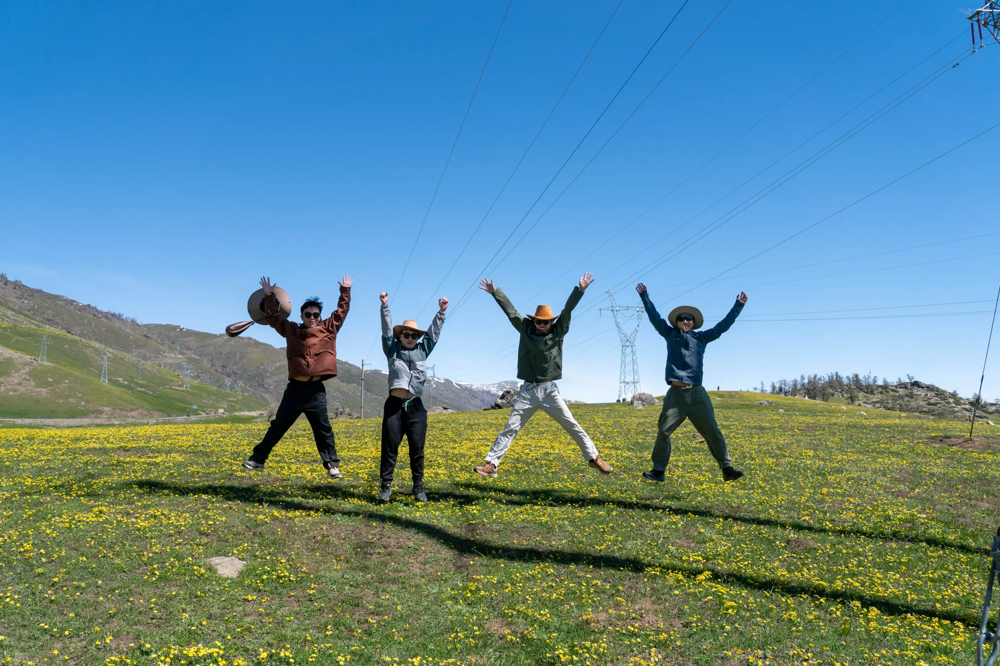

进禾木要换乘大巴，大巴进村后还要换乘公交车。禾木里面大部分都是民宿商户，房屋都是木屋。我们住在哈熊沟附近，民宿门口就是白桦林，张哥说秋天的白桦林最好看，都是金黄色的。民宿老板养了一只哈萨克牧羊犬，非常大，但也懒，我们去房间时它正躺着晒太阳，当我们出房间时它已经睡着了。

放下行李，张哥请我们吃了民宿的火锅，里面有鸡肉和羊肉，沾着微辣的酱料很好吃。不过肉很快就吃完了，只剩下一些速冻丸子、蟹柳棒还有菜。

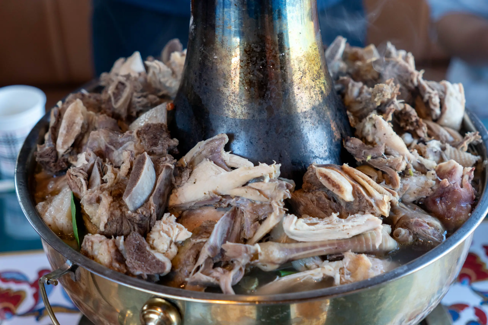

吃完午饭，我们打算去观景平台。路上经过了禾木桥，桥头的烤肉店在喂鹰，上面盘旋着一大团老鹰，用力把肉块往上丢，老鹰就会俯冲下来吃。

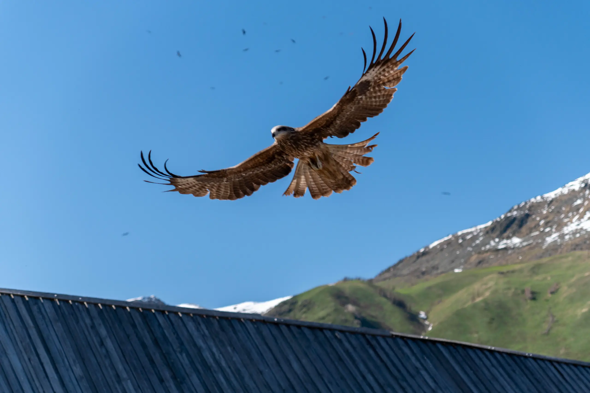

观景平台在山上，上去时没带水，爬得又累又渴。上去后有商店，救大命。山上都是草，可以俯看禾木村。老实说，禾木村没什么看的，反而是另一边，有雪山，反而好看一点。山上有个秋千，还挺好玩的，拍照也出片。张哥还帮我们用无人机拍了视频。

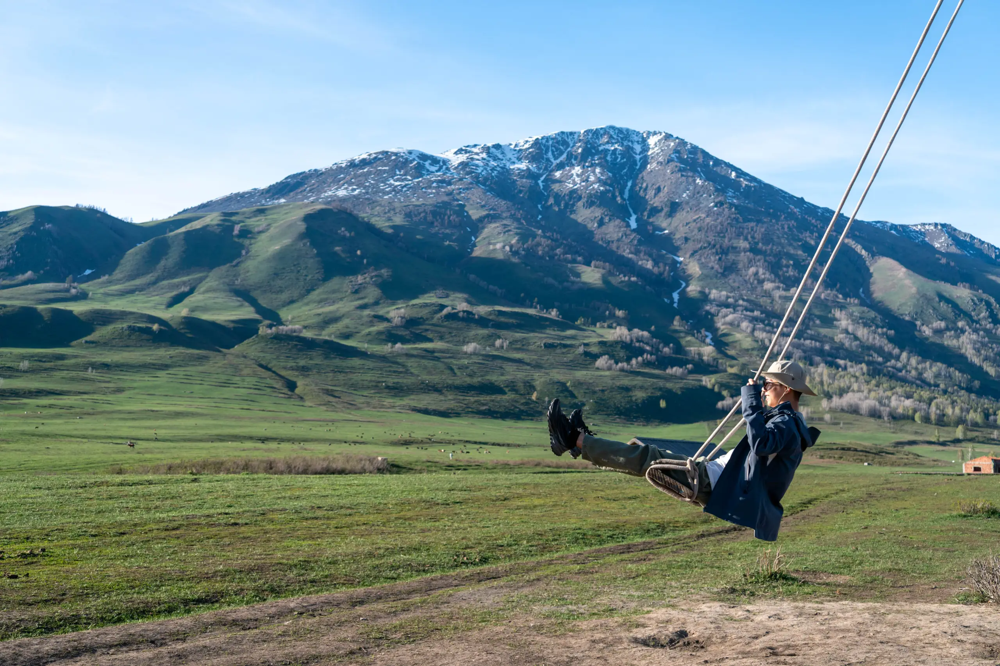

下去后，我们四个同学去打包了肯德基，打算带到日落平台上一边看到日落一边吃。不过当我们骑电动车去山脚，再爬上去，日落已经结束了，于是我们吃完肯德基，就下山了。

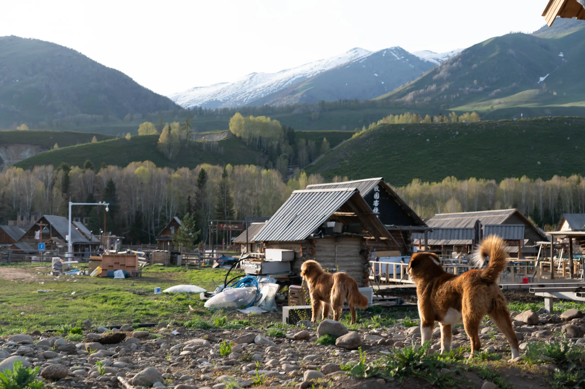

晚上还是有点冷的，我们哆嗦着走回民宿。大哥大姐和张哥已经回到了，并点了烧烤。他们给我们也点了一份，大姐请的客。我们吃饭时旁边一桌也是广东人，他们中有个男生用老板的音响唱K。牧羊犬在里我们不远处蜷缩着睡觉，天色昏暗我们还把它错以为是一块石头，我们吃完时它醒了，悠哉悠哉地走到老板边，老板说它才两岁，喜欢欢晚上出去玩。

## 3/9

第四天本来想看禾木的日出，醒来一看已经7点了，估计是来不及去观景平台了，我就在房间外面随便拍了两张。外面只有0度，差点把我冻坏了。我们一行人只有大哥去观景平台看了日出，他还遇见了茉莉姐。茉莉姐是武汉的，从禾木第一次遇见，到喀纳斯，再到赛里木湖，我们都遇见她了，最后她还坐我们的车一起回到了乌鲁木齐😂

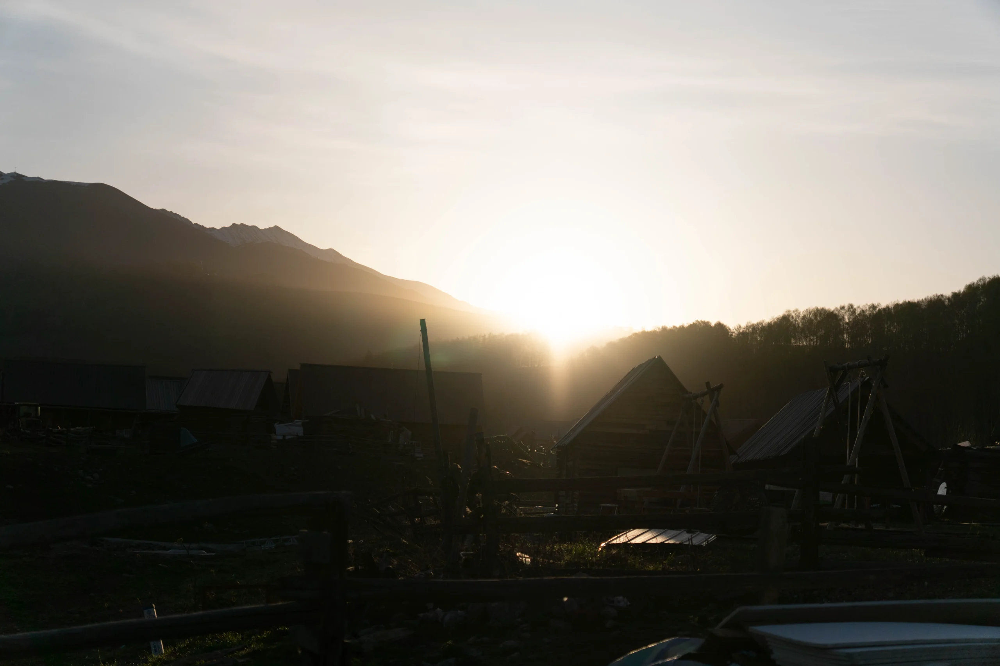

我们在民宿吃了早餐，又吃了包尔萨克。老板还送了一碗鸡蛋面。然后我们就离开禾木去喀纳斯了。回去路上经过山坡时，山脚下的雪已经化完了。我们这个时节正处于雪化的阶段，张哥说等雪化完，山就不好看了。我们到喀纳斯后转乘大巴，一路上都是雪水融化形成的小溪。

喀纳斯和禾木差不多，住的民宿也是木屋，不会喀纳斯的游客中心吃的喝的比较多。我们在民宿放下东西后，为了节省时间，决定吃了泡面。吃完，先去看了三湾。先从游客中间坐车去神仙湾，下车拍了照打了卡。打卡拍照时，我们前面有一个女生在帮另一个女生拍照，我在她们后面用反光板打光，拍照的女生说最后一张好看，然后被拍的女生笑她：“那当然，有人帮我打光”，看来反光板打光的效果还是非常明显的。

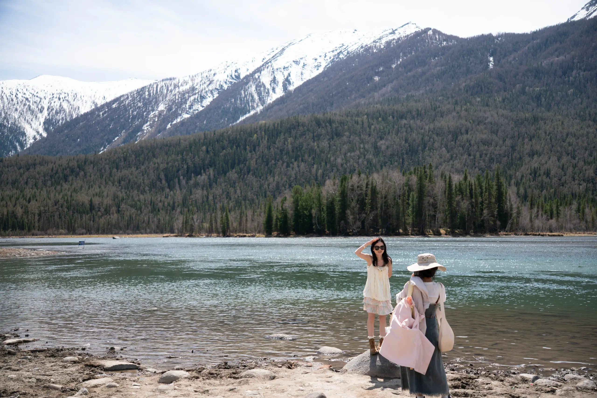

然后我们再坐车去月亮湾，先登山俯视月亮湾，再下山沿河徒步到卧龙湾。这条徒步路线很舒服，还没人，一路上只有我们一行人和另一个女生。月亮湾的湖水如翡翠般翠绿清澈，在湖边能看到很多小鱼。我们沿河边走边拍，还打起了水漂。大哥打水漂很专业，能打4个。

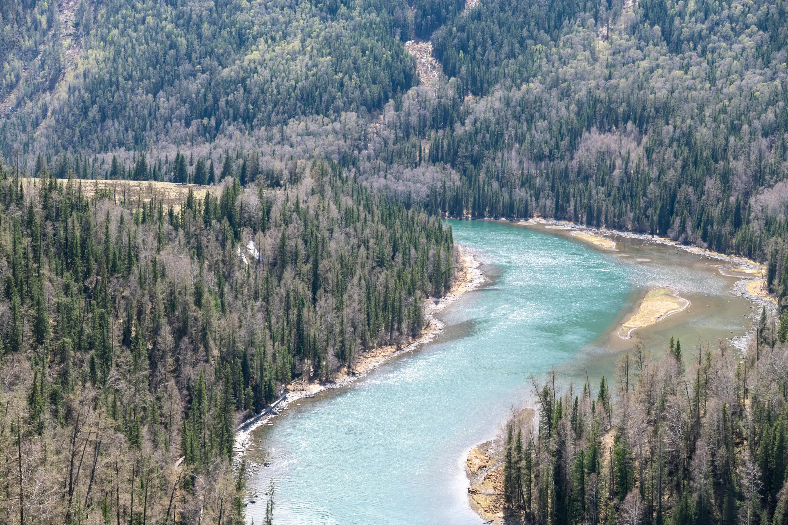

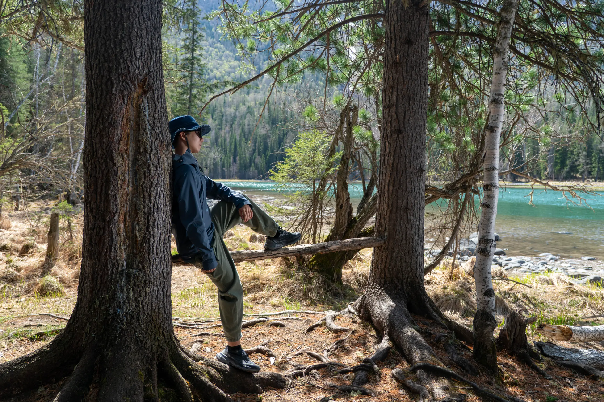

走到卧龙湾，我们马上折返去观鱼台。我们去时乘的是最后一班车，去到后工作人员马上催促我们向上走，因为他们要等我们下山才能下班。观鱼台一共1068级台阶，爬上去还是要费一些体力。上面风很大，往东边看是喀纳斯湖，西边则是草地雪山。喀纳斯湖的蓝是深沉的，没有一丝波纹，就这么静静地卧在山间。我们拍了照就下去了。我们上去走的是靠近湖的比较陡的路，下去则是靠近草地雪山的缓路。喀纳斯的路真的特别适合徒步，这天是整段旅行中，走得最远的一次。

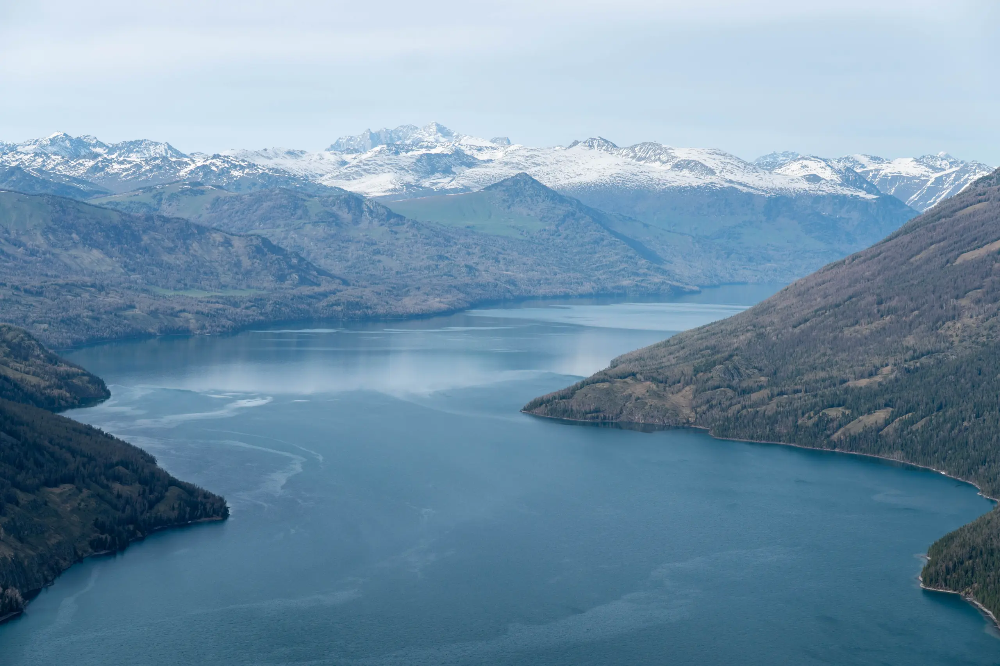

晚上我们在游客中心吃的饭。手抓饭只剩最后两份了，我和大姐各要了一份。但老实说，卖剩的手抓饭非常难吃，油腻，饭也硬。晚上回民宿时，我把「小丑牌」手游推荐给我同学玩，帮他们填补了不少后面的空闲时间。晚上准备回房睡觉前，看到三四匹马在民宿门口吃草，难怪门口的草地这么多马粪。

## 3/10

第五天早上准备离开民宿时，遇到了两只大狗，小黄和小黑。先是小黄看到我们在吃早餐，主动过来讨吃的，我们喂了它一些，它就赖在我们身边不走了。我上去摸了摸它，它很享受，当我不摸时，他会扭头看我，让我再摸摸它。我们前往公交站坐车，它们也一路跟着我们，直到我们上车离开。

早上我们先去了喀纳斯湖边，在下面看的风光远不如上面。这天是阴天，山是枯黄的，湖也是暗淡的。张哥说幸好我们昨天晴天时去了观鱼台。

回到喀纳斯游客中心，我去办了边境通行证，如果要去边境附近玩的话要办这个，但我只是办一个留作纪念。

接下来我们去了五彩滩。河这边是沟壑纵横五彩斑斓的岩石，河对岸则是树林。或许地理爱好者会感兴趣，但我看来就是一些石头，拍照也不好看。

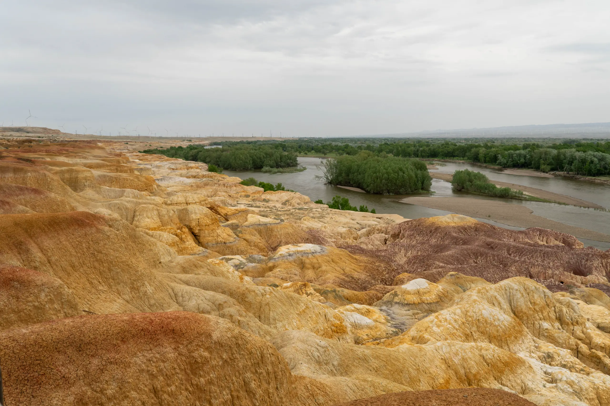

中午饭是在一个路边小馆（好像叫炒面王）解决的，点了份拌面。旁边的便利店有一款很好喝的酸奶，里面加了坚果，配料就只有四个：鲜牛奶、巴旦木仁（或核桃仁）、白砂糖、保加利亚杆菌。

晚上去了另一个很好吃的饭店，叫阿吾丹的烤羊。点了羊拐抓饭，特别好吃。还点了卡瓦斯，味道是麦香与蜂蜜。中途还有两个美女姐姐表演新疆舞。

吃完饭出来，大姐去买了切糕。切糕看着不多，但其实很重，一不留神就买了1.5kg，300块钱就这么没了。不过大姐也不怎么在意，分给了我们吃。切糕里面有很多干果，吃起来很香，很管饱。

## 3/11

这天去了两个景点，魔鬼城和木特塔尔沙漠。魔鬼城就是雅丹地貌，一堆岩石山，硬说像什么动物。如果不是有一些电影在这拍摄，我是不想去的。沙漠就更别提了，我没什么兴趣，但他们想去滑沙、骑骆驼，结果去到刮起了大风，吃了一嘴的沙子，幸好我戴了防晒面罩。

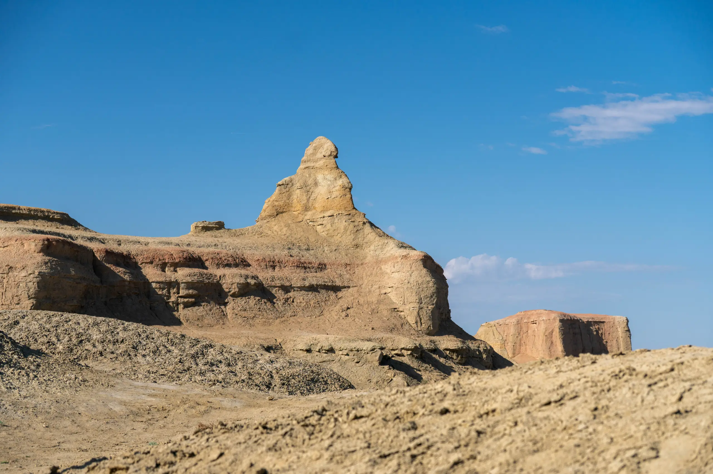

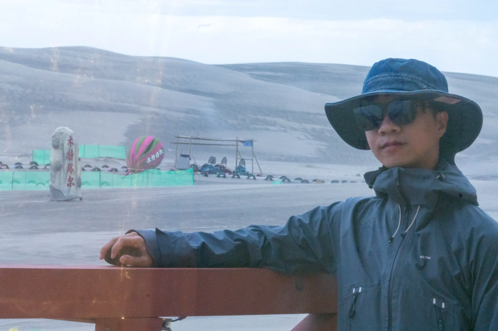

晚上住的是带有新疆特色风格的民宿。就是房子都是土黄色的，带有沙漠风格。晚上我们去当地的商业街吃了饭，恰好另一个同学（LDF）和他女朋友自驾到这，我们一起吃了油焖大虾，老实说，一般，我还是比较喜欢吃清蒸的。还吃了酸奶粽子，就是碱水粽上面盖一层酸奶。

## 3/12

这天要去赛里木湖，就起得早了一点。早餐吃得特别差，鸡蛋都小很多。我们是开车进去自驾的。今天天气很好，蓝色白云，湖水特别清特别蓝。在湖边的雪堆、木栈道、草地上拍了照，还去坐了游艇。游艇是一定要坐的，在岸边看湖，近处的水不够深，而远处的水有反光，就会稀释湖水的蓝；但在湖中心看湖，脚下就是湖，看到的就是湖水，没有反光，没有杂色，就是非常纯粹的蓝。船上还有小姐姐跳舞，不过跳得不是很好，而且还是戴着防晒口罩跳的，口罩还没遮住鼻孔，不好看。

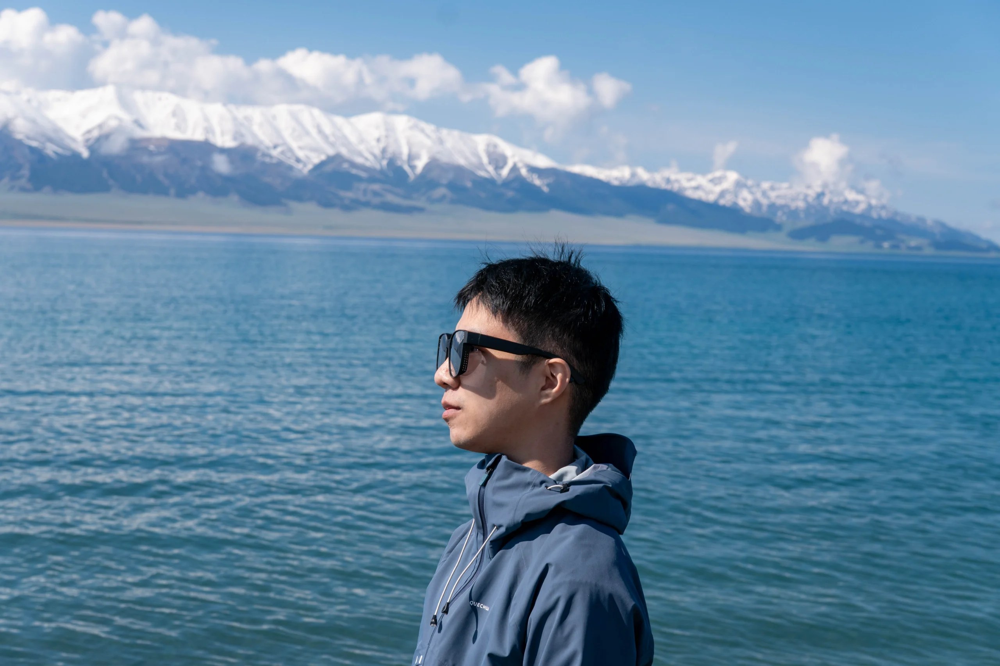

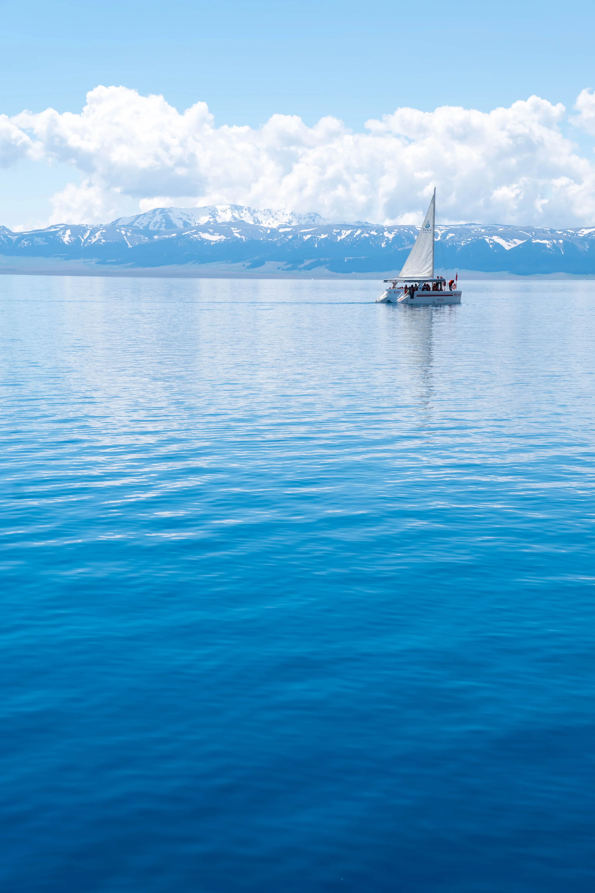

然后我们还去看了天鹅，然后昨晚那个同学和女朋友也来了，我们就一起合了影。然后我们去吃了旅行社安排的下午茶，也就是茶水和预制小饼干。然后就走了。

路上可以看到果子沟大桥，在蓝天白云青山中显得特别壮阔。

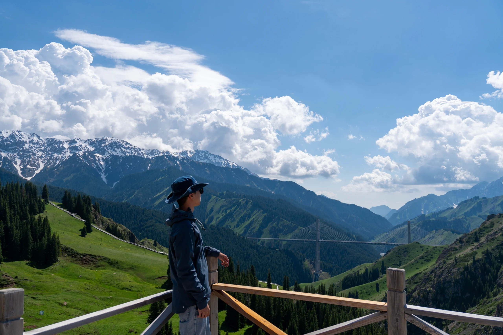

## 3/13

民宿有一只小羊，早上会放出来，我们就撸它，抱着它拍照。老实说，羊软软的，不好抱，而且我怕它拉我身上。我抱完小羊它就挣扎着下来了，但当我们走远时，只剩它一个时，它就开始咩咩地叫起来，看来群居动物没有安全感。

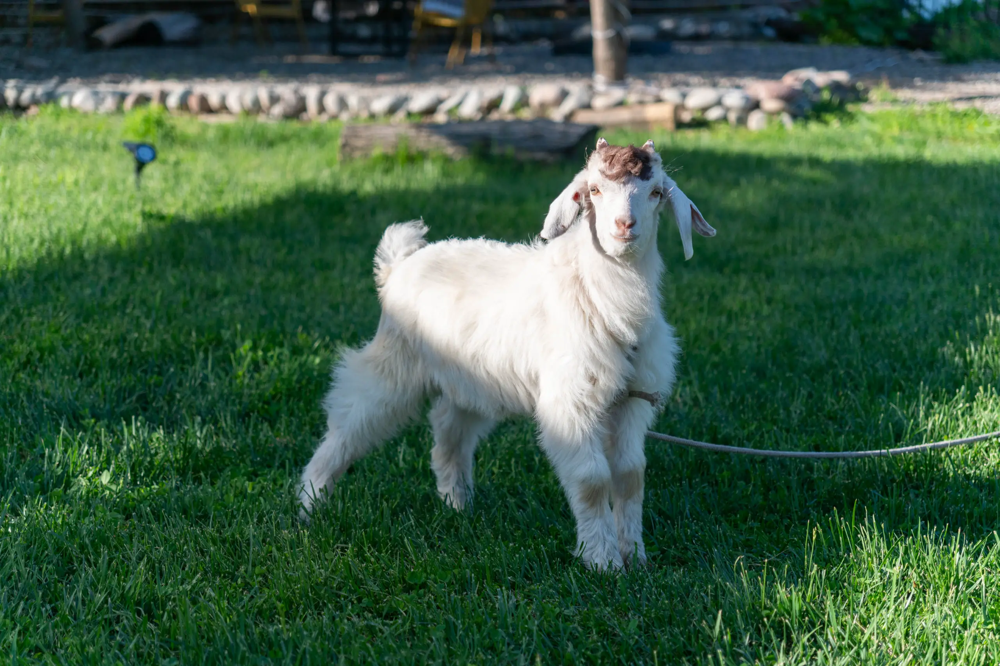

然后我们去了那拉提的空中草原，还有个河谷草原没去。司机还骗我们说没买到自驾票，然后开进去之后才说买到了🤣那拉提的草原特别大，然后还连着雪山，很好看。我觉得最值得的是骑马，80块钱一小时，是专业的马队，比其他地方的都值得。下马后还买了50块钱一张的纪念照，照片拍得不错，我觉得值得。

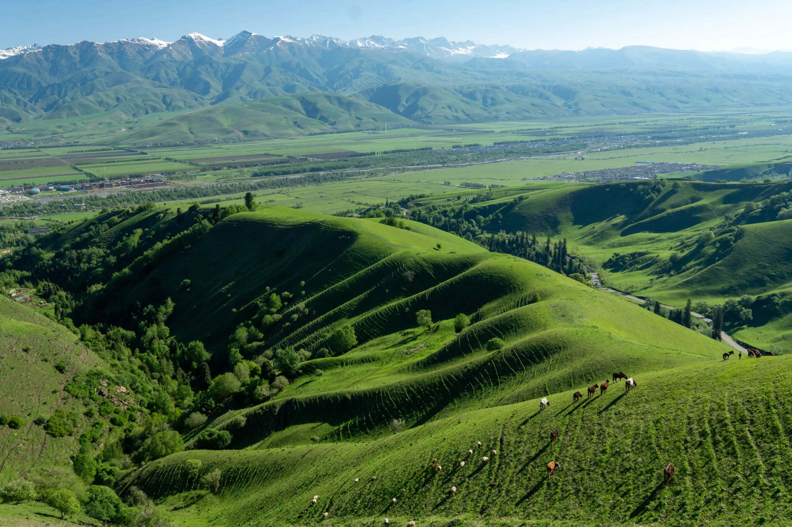

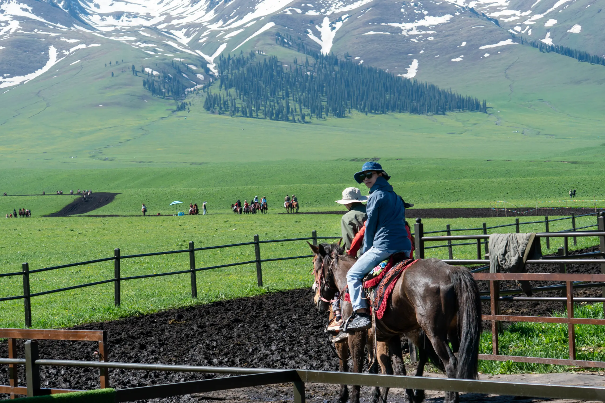

然后大哥大姐就离队了。就剩我和同学四个人。在那拉提玩到下午3点多，就要马不停蹄得开车去酒店。由于独库公路没开，所以我们只能原路返回，路上经过赛里木湖时刚好是日落，于是就在车上看到了赛里木湖的日过，算是没有遗憾了。到了晚上12点才到，吃了丸子汤当晚饭。

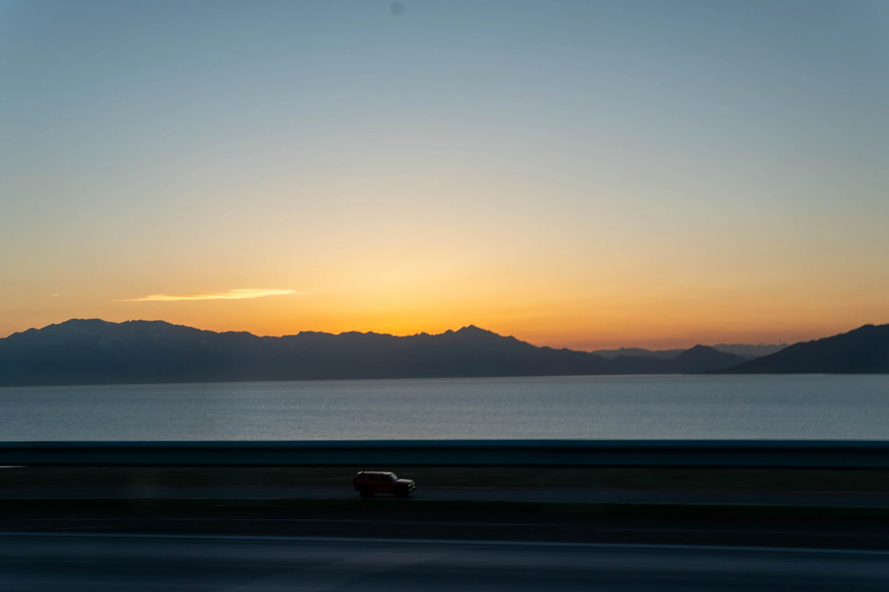

## 3/14

早上接上了茉莉姐就出发了。今天的行程只是回乌鲁木齐，路上多走了120公里去看了安集海大峡谷。这个地方是免费的，就是站在悬崖边上看峡谷，这个峡谷还挺大，而且边上没有防护栏，还挺惊险的。

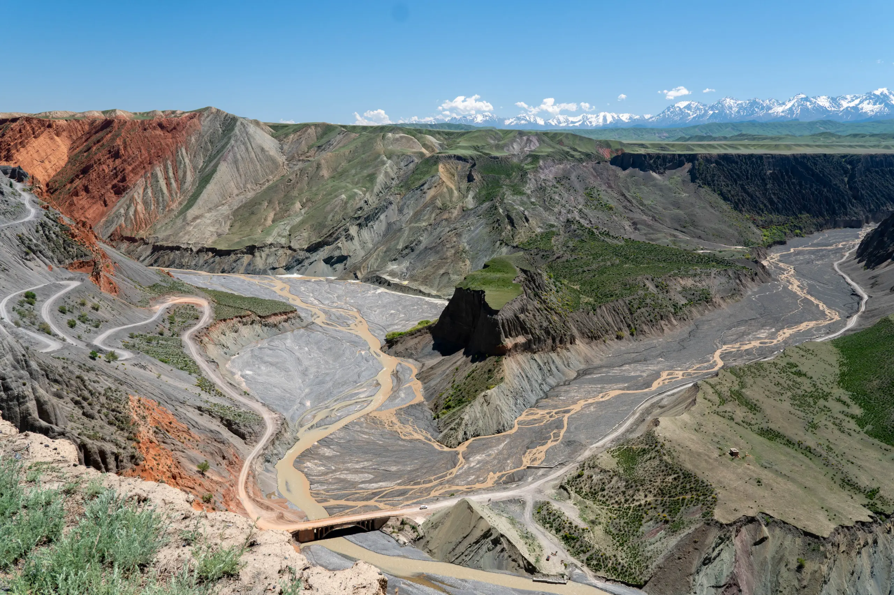

晚上去了楼兰密烤，有点像深圳的纳塔新疆餐厅。我们点了烧烤，还尝试了西域姑娘的酸奶茶（喝起来太甜了）。吃完饭去买了特产，买了葡萄干，买的是另一种葡萄干，吃起来带有玫瑰花香。还买了枸杞、雪菊、奶制品零食和牛肉干。

## 3/15

今天去了博物馆，还去大巴扎买了包包和丝巾。博物馆的干尸馆没开，哭哭，不过看到了“五星出东方利中国”，感觉也值了。包包一开始想买的是艾德莱斯包，感觉另一款孔雀纹的更好看，就买了一黑一白两个。

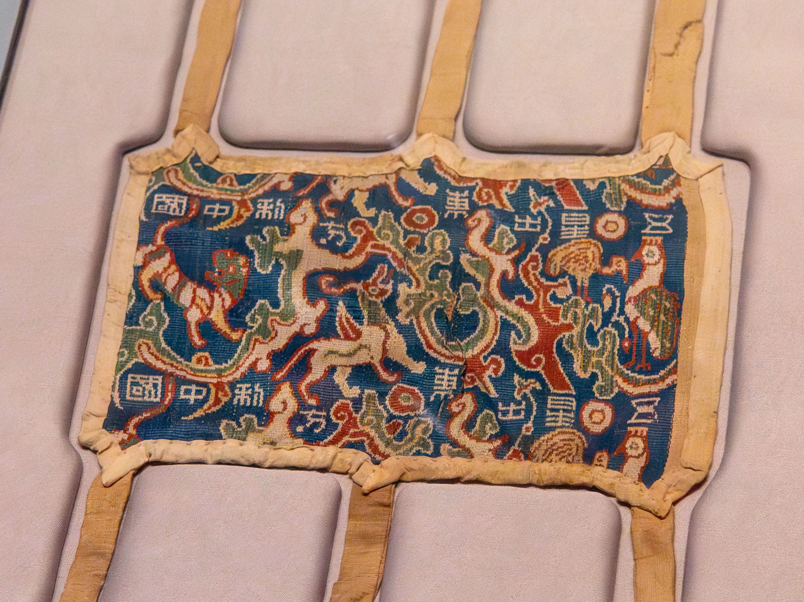

晚上6点的飞机，回到学校已经1点半了，躺下，新疆之旅就结束了。