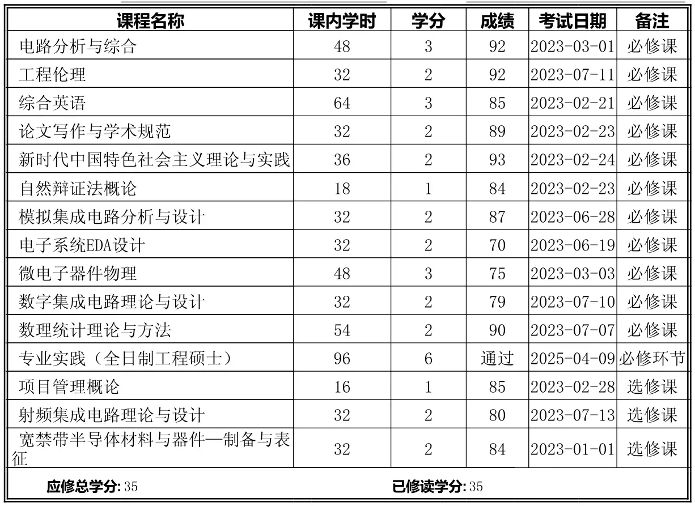

简单记录一下硕士毕业的流程。

<!--more-->

## 研一

研一修完所有的课程，顺便简单说说各个课程：

- 电路分析与综合：个人觉得最有意思的课程，但各种矩阵计算很容易绕晕。后面的判断零极点有助于理解传输函数。感觉对 EDA 软件有用，对电路设计用处不大。
- 模集/数集：和本科差不多
- 电子系统EDA设计：其实就是 Verilog，不过我不是做数字的，没认真学
- 微电子器件物理：讲器件的，和大四的半导体器件差不多，但涉及的器件更多。
- 数理统计：和本科差不多
- 射频：老实说，没学懂，不过还好是做课设，当 spice monkey 了

研一下开始参加集创赛（全国大学生集成电路创新创业大赛），基本上课间都在弄。如果能拿到国二或以上，那么就能达到毕业要求，后面就不用发论文了。另外，参加比赛还能公费旅游，我是去了泉州和重庆，挺爽的。

## 研二

研二开始要确定毕业课题，过完国庆，就要开始准备开题答辩（我是10月23日），开题可以线上，是自己老师负责答辩。我研二在企业实习，并在企业完成自己的毕业课题，研二上就弄完了，后面一直在做企业的项目。

## 研三

研三上这段时间主要还是忙着找工作、投简历、面试，一直忙到收到 offer（大概十月下旬）. 中间还有中期答辩（我是10月20日），自己老师线下答辩。

然后就继续完善自己的课题，大概 11 月的时候开始写论文，我贴一下我各章写完+后续流程的时间点：

- 11.21 题目、摘要、目录
- 12.25 第一章
- 2.11 第二章
- 3.1 第三章
- 3.12 第四章+总结
- 4.6 确定终稿，做预答辩 PPT
- 4.21 上传论文
- 5.6 出盲审结果
- 5.25 答辩

实际上我的进度算慢的，很多同学在 2 月左右就写完论文了。中间有很多材料要弄，特别、特别烦人，尤其是很多填写的要求分散在文件、链接、教务的聊天记录中，建议多和其他人交流。
