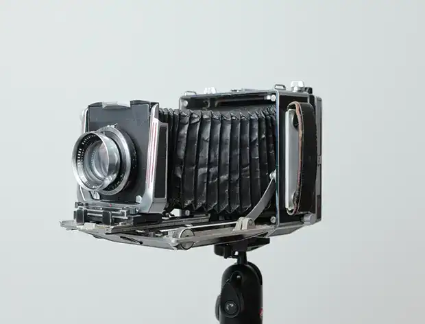
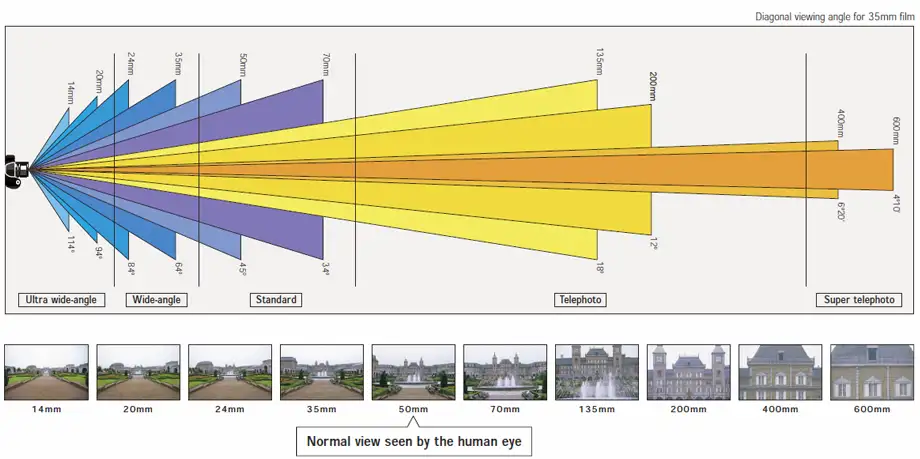
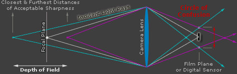
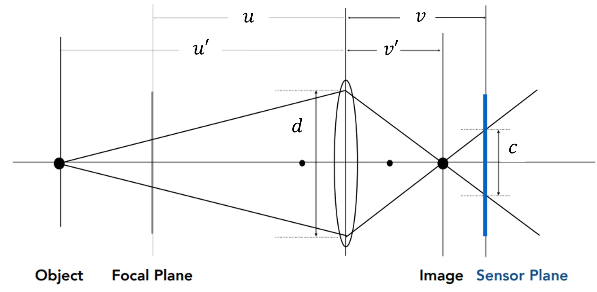
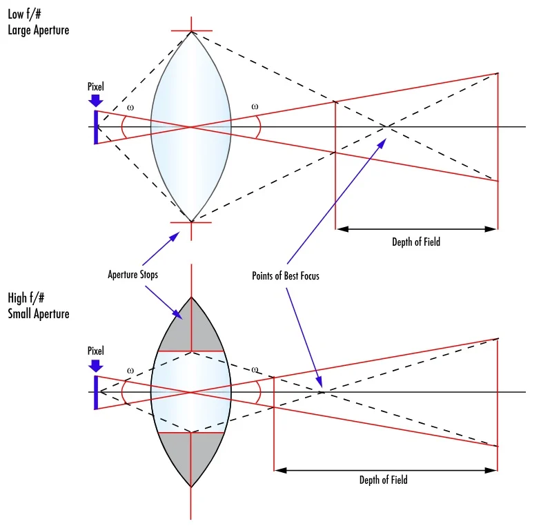

用数学公式定量解释焦距、景深、光圈、曝光……

<!--more-->

## 焦距

### 焦距的定义与薄透镜公式

在初中物理中我们学过，当一束平行光经过一片凸透镜时，会汇聚到一点，从镜片主平面到会聚点的距离，就是焦距（Focal Length）。

而凸透镜还有另一个性质，就是经过镜片中心（称为光心）的光线不会改变方向。所以在下图中，从 B 点出发的光线，平行光 和 经过光心的光 会汇聚到 B' 点，因此此处有清晰的成像。我们将物体到镜头的距离 AO 称为 **物距 $u$**，成像到镜头的距离 A'O 称为 **像距 $v$**，根据简单地几何知识，可推导出物距、像距和焦距之间的关系：

$$
\frac{1}{u} + \frac{1}{v} = \frac{1}{f}
$$

相机的对焦过程就是让传感器在“像距”的位置，老式的 4x5 大画幅相机通过改变传感器和镜头的距离来实现这一点；而现代相机则不适合移动传感器，则是通过移动某些浮动镜头，来改变光心的位置。需要注意的是，虽然对焦过程改变了透镜组里面某些镜片的位置，但是经过特殊光学设计，这个操作并不会影响焦距，而只会影响光心（主点）位置。（参考：[相机是如何对焦的——by Zephyr](https://zhuanlan.zhihu.com/p/652189338)）

### 焦距与放大倍率

成像放大倍率 $M$ 是像高与物高的比值，而根据相似三角形的公式，像高/物高=物距/像距，因此：

$$
M = \frac{v}{u} = \frac{f}{u-f}
$$

说明：

1. 如果焦距 $f$ 越长，放大倍率越大，物体在图像中显得越大
2. 或者，离被摄物体近一点（$u$ 减小），也能使得物体在图像中显得大

### 焦距与视角

视角指的是镜头能捕捉到的场景范围，取决于焦距与传感器大小。根据上面的成像公式，视角 $\theta$、焦距 $f$ 与传感器的宽度 $w$ 关系为：

$$
\tan \frac{\theta}{2} = \frac{w/2}{f}\\
\Downarrow\\
\theta = 2 \arctan \frac{w}{2f}
$$

焦距越短（如 24mm），视角越宽，适合拍摄风景；焦距越长（如 50mm），视角越窄，适合人像或特写。

全画幅的传感器尺寸为 36×24mm，半画幅为 22.7x15.5mm。全画幅的宽度是半画幅的约 1.5 倍，因此在保持视角不变的前提下，半画幅的等效焦距是全画幅的约 1.5 倍。

### 焦距与成像高度

物体在画面中的成像高度 $h$ 取决于其本身的高度 $H$、物距 $u$ 和焦距 $f$：

$$
h = \frac{f}{u} H
$$

焦距长意味着图像中物体更“高大”。但需要注意，**长焦并不是“压缩感”的来源，压缩感来源于物体距离镜头的距离**。因为：两物体在画面中的成像高度比值 $h_1/h_2$ 取决于它们的物距比值：

$$
\frac{h_1}{h_2} = \frac{u_2}{u_1}
$$

当拍摄距离变远时，$u_1$ 和 $u_2$ 同时增加 $\Delta u$，此时成像高度比值为：

$$
\frac{h_1'}{h_2'} = \frac{u_2 + \Delta u}{u_1 + \Delta u} < \frac{u_2}{u_1} = \frac{h_1}{h_2}
$$

（注：假设 $u_2>u_1$，即物体 1 在前，物体 2 在后；$h_1>h_2$，即近的物体的成像高度大于远的物体）

上式说明，当距离增加后，后面的物体的高度会更接近与前面的物体，两个物体的高度差异减小，压缩感增强。如果保持距离不变，仅增大焦距，只会等比例地增大前后物体的成像高度，并不会增强压缩感。

## 光圈

### 光圈的定义

在摄影中，光圈通常用 F 值表示（用大写字母，以区分焦距 f），定义如下：

$$
F = \frac{f}{d}
$$

$f$ 是焦距，$d$ 是镜头的有效孔径直径。比如，一个 50mm 镜头在 F2.0 时的有效孔径直径为：

$$
d = \frac{f}{F} = \frac{50}{2} = 25{\rm mm}
$$

> 需要强调的是“有效孔径直径”并不等于物理直径，还要考虑透镜折射放大等光学效果，

光圈值越大、焦距越长，那么镜头的直径就越大。

### 光圈与曝光量

光圈的有效面积 $A$ 可以表示为：

$$
A = \pi (\frac{d}{2})^2 = \pi (\frac{f}{2F})^2 = \frac{\pi f^2}{4F^2}
$$

因此曝光量 $E \propto A \propto \dfrac{1}{F^2}$，这说明：

1. 光圈值越小，面积越大，进光量越多
2. 光圈每增加一档（乘以$\sqrt{2} \approx 1.4$），进光量减半。常见的光圈值有：F1、F1.4、F2、F2.8、F4、F5.6、F8

### 光圈与衍射

当光圈过小时，会引发衍射现象，导致图像模糊。衍射是光波绕过障碍物或通过小孔时发生的波动现象（光的波动性）。即使镜头完全对焦，当光线穿过一个非常小的开口（即小光圈）时，它不再笔直传播，而是发生弯折、扩散，导致成像模糊。

通过圆形孔径（光圈）形成的点光源图像不是一个点，而是一个中心亮斑和多个衰减的光环，称为 Airy pattern。中心亮斑的半径（第一个暗环）为：

$$
r = 1.22 \cdot \frac{\lambda \cdot f}{d} = 1.22 \cdot \lambda \cdot F
$$

其中：

- $r$ 是 Airy disk 半径
- $\lambda$ 是光波长，可见光范围大约是 400–700 nm
- $f$ 是焦距
- $d$ 是有效孔径直径
- $F$ 是光圈值

可以看出，光圈越小（F 值大），衍射模糊越严重。虽然小光圈可以获得更大景深，但超过某个点后，衍射模糊增长快于景深收益，

假设一个 2400 万像素的全画幅（6000×4000像素），传感器的尺寸为 36×24mm，因此每个像素的尺寸为：

$$
p = \frac{36{\rm mm}}{6000} = 6 {\rm \mu m}
$$

取 $\lambda = 0.55{\rm \mu m}$，我们计算不同光圈下的衍射半径：

|F值| $r$ | 与像素大小之比 $r/p$ |
|:---:|----:|:---------:|
|F4|2.684|0.45|
|F5.6|3.758|0.63|
|F8|5.368|0.89|
|F11|7.381|1.23⚠️|
|F16|10.54|1.76⚠️|

这说明衍射半径大约在 F11～F16 之后开始显著影响画质。摄影师通常称 F5.6–F8 为“最佳锐度光圈”（sweet spot）。

> 需要注意，对于同样分辨率的半画幅（2400W），其像素尺寸是全画幅的 2/3，因此在 F8 开始就会受到衍射的影响。最佳锐度光圈应该为 F5.6

想要在小光圈下保持相同的清晰度，唯一的方法就是增大像素的尺寸，但这样就会导致传感器变大。这就是“底大一级压死人”的底层原因（之一）。

## 快门

快门控制感光元件暴露于光线的时间，称为快门速度或曝光时间（记为 $t$，单位：秒，通常为分数，如 1/100 秒）。

快门速度越慢，曝光时间越长，光子累积量也就越多，照片越亮。具体公式将在下一节“曝光”中统一描述。

这里主要讨论“安全快门”。安全快门是指手持相机拍摄时，为避免因手抖导致的图像模糊所需的最短曝光时间。一般经验为**安全快门不慢于焦距的倒数**，即：

$$
t_{安全} = \frac{1}{f_{等效}}
$$

这个公式是怎么来的呢？假设手抖导致画面的位移 $d_{模糊}$ 为：

$$
d_{模糊} = f \cdot tan(\omega \cdot t) \approx f \cdot \omega \cdot t
$$

- $f$：焦距
- $\omega$：手抖角速度（典型值 ≈ 0.01–0.05 弧度/秒，视拍摄者稳定性）
- $t$：快门时间

为了避免模糊，$d_{模糊}$ 应该小于弥散圆或像素边长：

> 后面在景深一节会介绍弥散圆。

$$
f \cdot \omega \cdot t < c
$$

也即：

$$
t < \frac{c}{f \cdot \omega}
$$

假设 $c\approx0.01$（全画幅的弥散圆），$\omega \approx 0.01 {\rm rad/s}$，从而：

$$
t < \frac{0.01}{f \cdot 0.01} = \frac{1}{f}
$$

由于半画幅的等效焦距是全画幅的 1.5 倍（半画幅的裁切相当于把抖动放大了 1.5倍），所以安全快门要快 1.5 倍

## 曝光

曝光三要素：光圈（Aperture）、快门速度（Shutter Speed）、感光度（ISO），再加上场景本身的光照，共同决定了照片的亮度。

### 曝光与快门速度

从光物理角度看，曝光量的本质是单位面积上接收到的光能量：

$$
E = I \cdot t
$$

其中，$E$ 是单位面积曝光量；$I$ 是入射光照强度；$t$ 是曝光时间（快门）。显然，快门时间越长，接受到的光子数量就越多，也就越亮。

### 曝光与光圈

入射光强 $I$ 与镜头光圈面积成正比：

$$
I \propto A = \pi (\frac{d}{2})^2 = \pi (\frac{f}{2F})^2 = \frac{\pi f^2}{4F^2}
$$

其中，$f$ 是焦距；$F$ 是光圈；$d$ 是有效光圈直径。这个式子说明：

1. $E\propto \frac{1}{F^2}$，也就是光圈值每减小一档，亮度减半
2. $E \propto f^2$，焦距增加，会导致曝光量增加

### 曝光与 ISO

感光度并不改变光线本身，而是改变感光元件对光的“放大能力”。ISO 通常是线性的：

$$E_{有效}=\frac{E \cdot ISO}{100}$$

所以：

$$
图片亮度 \propto \frac{t}{N^2}\cdot {ISO}
$$

### 曝光值（EV）

摄影中常用 **曝光值（EV）** 来量化曝光设置。要想正确曝光，相机的曝光设置要匹配环境亮度，为了方便起见，这两者都用 EV 来表示。

用如下 EV 值来衡量环境的亮度：

$$
EV = \log_2 (\frac{F^2}{t})
$$

环境越亮，需要的光圈越小（F值越大），同时曝光时间越短，从而 EV 值越大。当感光度为ISO 100、光圈系数为F1、曝光时间为1秒时，曝光量定义为0，曝光量减少一档（快门时间减少一半或者光圈缩小一档），EV值增加1

EV 值在胶片时代十分有用，比如一个场景的 EV 值=10，采用 F4 的光圈，那么就需要曝光：

$$
10 = \log_2 (\frac{4^2}{t})
$$

可以解出 t=1/64，因此只要将曝光时间设置为 1/64 秒就能正确曝光。

在现代相机中，则是通过传感器测得物体的亮度，再换算成 EV，再去调整快门或光圈。但相机测光并不准确，所以我们就需要曝光补偿，比如实际场景亮度为 11EV，但相机测出来只有 10EV（偏暗），我们就需要设置曝光补偿为 +1EV.

> EV 是用来衡量场景的亮度的，并不是衡量照片的亮度！

## 景深

### 景深的定义

景深是指照片中清晰成像的距离范围，从最近清晰点到最远清晰点。如果一束点光源不在焦平面上时，其发出的光汇聚到传感器上时，就不是完美的点，而是一个圆，当这个圆较小时（小于一个像素点），可以认为还是合焦的；反之，就会失焦。

景深主要受以下四个因素的影响：

| 参数    | 符号  | 影响效果                         |
| ----- | --- | ---------------------------- |
| 光圈值   | $F$ | 光圈越大（F 值越小），景深越浅             |
| 焦距    | $f$ | 焦距越长，景深越浅                    |
| 拍摄距离  | $u$ | 距离越近，景深越浅                    |
| 弥散圆直径 | $c$ | 感光元件允许的模糊极限，越小则景深越浅（与像素密度相关） |

### 弥散圆

景深的公式非常复杂，涉及到“弥散圆” (Circle of Confusion, CoC)。在光学中，一个完美的点光源通过镜头后，理论上应该在感光元件上形成一个完美的点。然而，由于光线的衍射、镜头像差以及光线无法完全聚焦等因素，这个点实际上会形成一个微小的圆斑。当这个圆斑小到人眼无法分辨时，我们就会认为它是一个清晰的点。这个可接受的最小模糊圆斑就是**弥散圆 (Circle of Confusion, CoC)**。

弥散圆的直径大小是衡量清晰度的标准，它没有一个绝对的固定值，而是取决于多种因素，包括：

- **传感器尺寸**：传感器尺寸越大，在相同视角下，允许的弥散圆通常越大。
- **观看距离**：观看距离越远，允许的弥散圆越大。
- **打印尺寸**：打印尺寸越大，允许的弥散圆越小。
- **人眼的辨识能力**：通常设定为在一定观看距离下，人眼能够分辨的最小点。

弥散圆常用值：全画幅 0.029mm；半画幅 0.019mm。

下面简单介绍一下弥散圆的公式：

利用相似三角形可以推导出：

$$
\frac{c}{d} = \frac{|v-v'|}{v'}
$$

同时，根据焦距、物距、像距的关系，有：

$$
\frac{1}{f} = \frac{1}{u}+\frac{1}{v} = \frac{1}{u'}+\frac{1}{v'}
$$

根据第二个等号，有：

$$
\frac{1}{u} - \frac{1}{u'} = \frac{1}{v'} - \frac{1}{v}\\
\Downarrow\\
\frac{v|u'-u|}{uu'} = \frac{|v-v'|}{v'}
$$

从而代回原式，有：

$$
\begin{aligned}
\frac{c}{d} &= \frac{|v-v'|}{v'}\\
&=\frac{v|u'-u|}{uu'}
\end{aligned}
$$

又：

$$
v=\dfrac{1}{\dfrac{1}{f}-\dfrac{1}{u}}=\frac{uf}{u-f}
$$

代入后有：

$$
\frac{c}{d} = \frac{f}{u-f} \frac{|u'-u|}{u'}
$$

$d$ 可以用光圈和焦距来表示：$d=\dfrac{f}{F}$，所以最终可以推导出：

$$
c = \frac{f^2}{F(u-f)} \cdot \frac{|u'-u|}{u'}
$$

### 超焦距

如果物体位于无穷远处，则：

$$
\lim_{u'\rightarrow \infty} c = \frac{f^2}{F(u-f)}
$$

如果此时弥散圆恰好等于像素大小 $c_0$，那么后景深就会延申到无穷远；而前景深此时为：

$$
c_0 = \frac{f^2}{F(u-f)} = \frac{f^2}{F(u-f)} \cdot \frac{|u'-u|}{u'}
$$

可以解出：$u' = \dfrac{1}{2}u$

也就是说，从 $u/2$ 到 $\infty$ 的物体都是合焦的。因此我们定义此时的对焦点 $u$ 为超焦距，记为 $H$：

$$
H = \frac{f^2}{Nc_0}+f
$$

超焦距意味着：当你将镜头对焦于距离 $H$ 处，从 $H/2$ 到 $\infty$ 的物体都在允许的弥散圆范围内，即这些距离范围内的物体在照片中“看起来是清晰的”。运动相机就是使用了这一点，另外，运动相机通常采用广角，意味着 $f$ 非常小，因此超焦距 $H$ 非常近，通常半米到无穷远的物体都能拍清楚。

### 景深的前后范围

对于给定的 $c_0$，我们可以推导得到两个 $u'$ 值，对应着前景深和后景深。这个推导过程比较简单，在此略过。

- 前景深

$$
DoF_{\rm front} = \frac{H u}{H+(u-f)}
$$

- 后景深（当 $u\geq H$ 时，后景深无穷远）

$$
DoF_{\rm rear} = \frac{H u}{H-(u-f)}
$$

景深为前、后景深之差：$DoF = DoF_{\rm rear} - DoF_{\rm front}$

当前景深和后景深近似相等时（远距离对焦或大光圈下），利用泰特近似（假设 $u-f\gg H$），可以推导出景深的简略表达式：

$$
DoF \approx \frac{2Fcu^2}{f^2}
$$

该式说明：

1. 光圈值 F 越大（光圈越小），景深越深
2. 焦距 f 越小，景深越深
3. 对焦距离 u 越远，景深越深。因此微距拍摄的景深都很浅。
4. 像素越大，景深越深

### 景深和虚化效果

虚化其实就是弥散圆。景深之外的物体，其弥散圆越大，虚化越明显。上面推导过弥散圆的计算公式：

$$
c = \frac{f^2}{F(u-f)} \cdot \frac{|u'-u|}{u'}
$$

在摄影中，常用近似形式（当 $u \gg f$，即拍摄距离远大于焦距）：

$$
c \approx \frac{f \cdot |u' - u|}{F \cdot u}
$$

想要虚化好，光圈值要小，焦距要长。这会导致景深变浅，因此，虚化和景深是相互矛盾的。

另外，网上常常有这种观点：半画幅在 F2.8 下的虚化效果等于全画幅 F4 的虚化效果。这是来自于“视角匹配”，也就是半画幅想要达到全画幅相同的视角，焦距要乘以 1.5，因此在相同视角下，半画幅的焦距比全画幅要短，从而虚化不如全画幅。如果采用相同的焦距、光圈，那么两者的虚化效果不会有任何区别。
