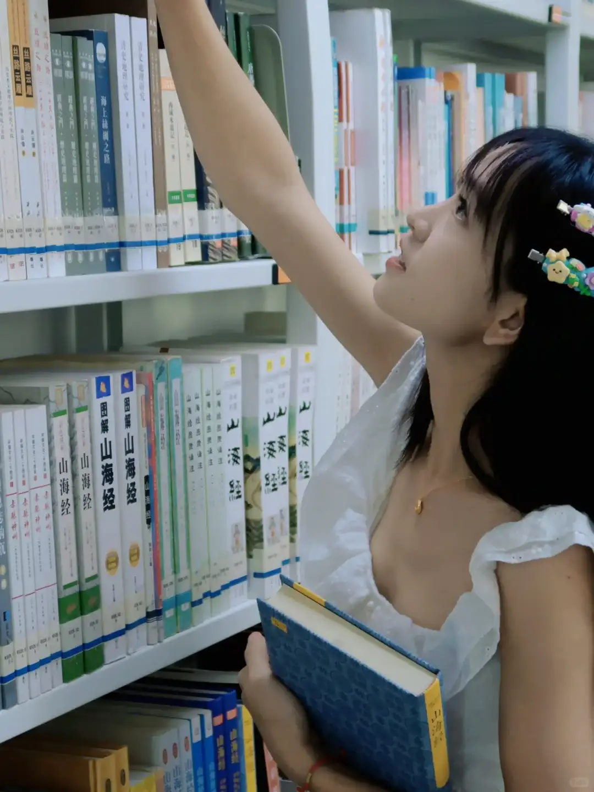
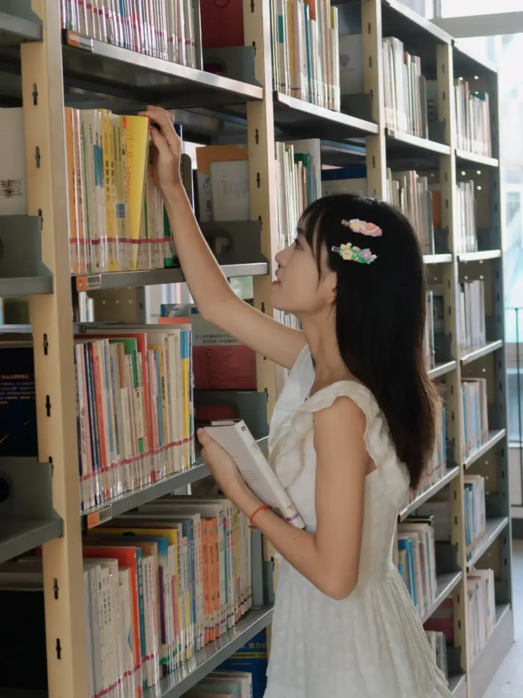
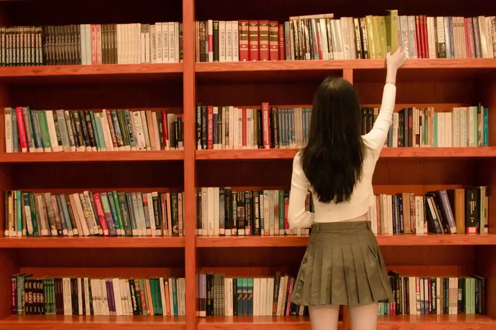
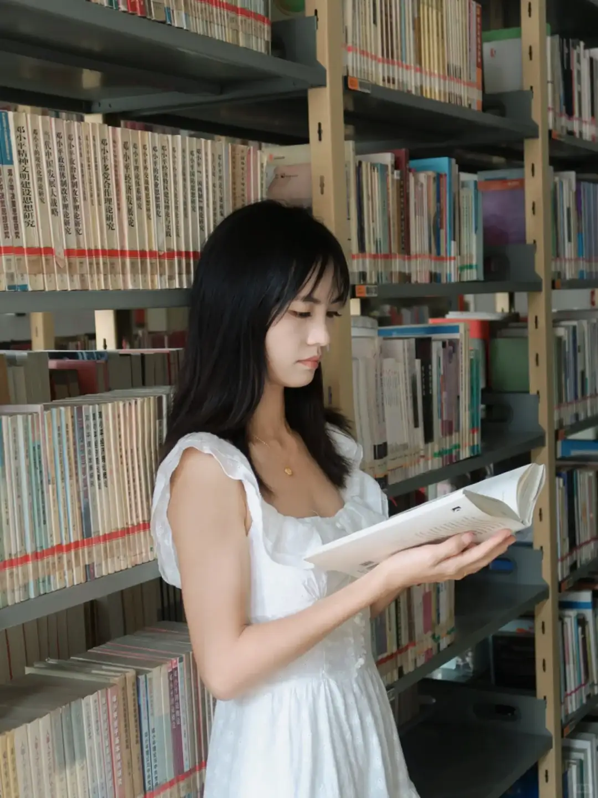
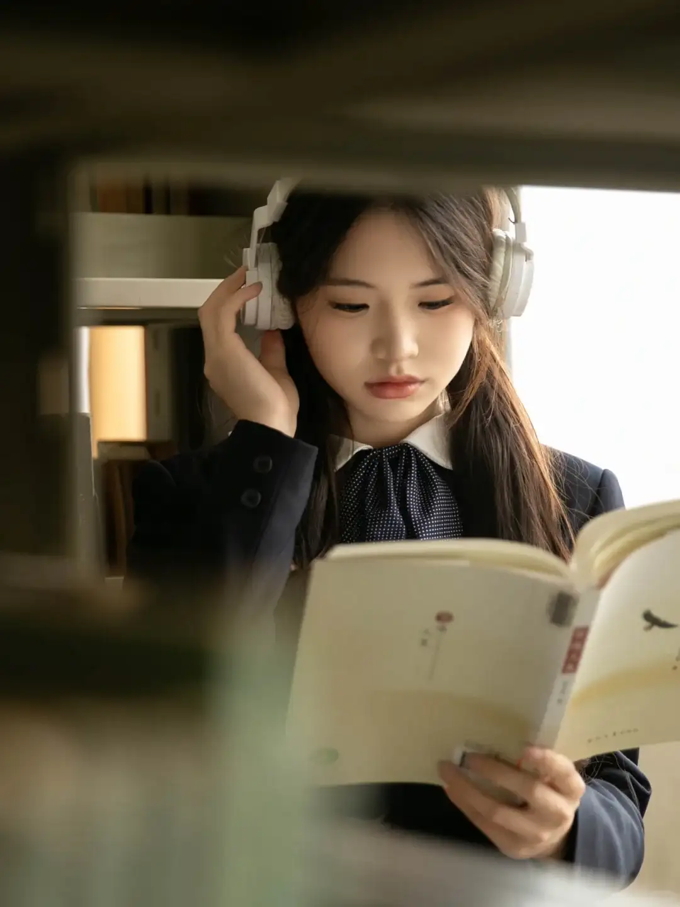
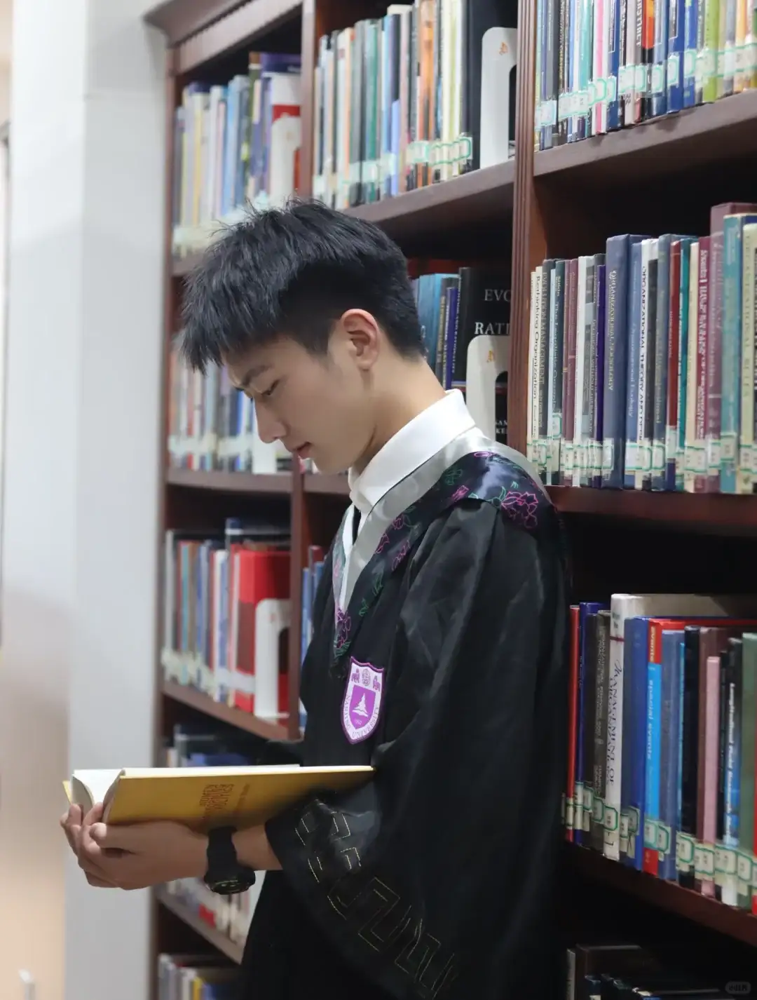
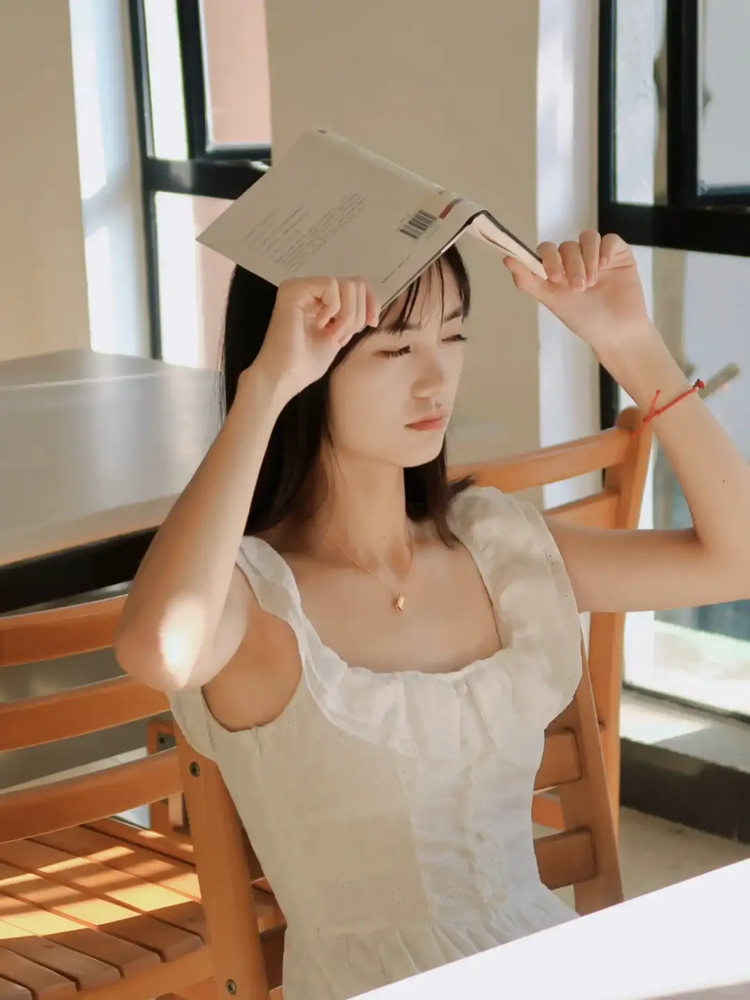
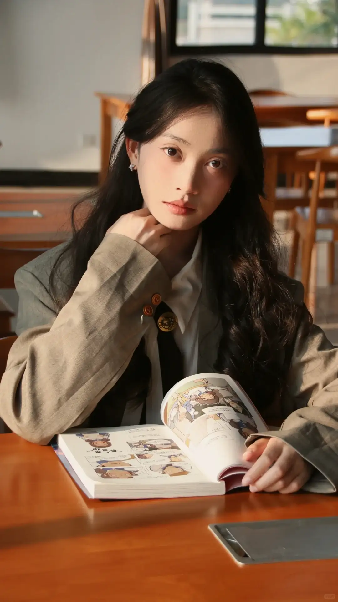
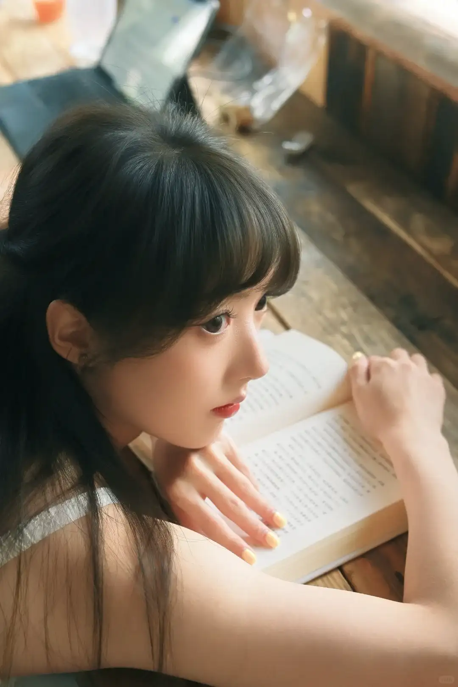

<!--more-->

环境分析：

- 图书馆/书店光线一般比较好，无需补光；或者在胸口处放本打开的书，白色的书页也可以当反光板；
  - 室内的光会比较“平”，没有光感，如果有室外阳光会更好。
- 背景多是整齐地、一排排的书/书架，可以当引导线用，另外也要注意不要显得太杂乱（大光圈虚化）
- 书架可能会有“穿头”问题？

## 动作一：拿书

- 动作要点：
  - **远离镜头的手拿书架上的书**，书要比眼睛高，让书斜着抽出一半。手臂微弯，类似于“遮阳”的感觉；如果高度不合适可以踮脚
  - **另一只手可以再拿一本书**，可以让胸挺起来。类似的姿势也可以，比如可以扶一下书架、握着肩膀的背包带
  - **身体可以面对书架或向摄像机侧一点**，但无论如何都要站直，可以有一点点左右倾斜，但不能前倾
  - **头要抬高，不能平视**，否则身体和头一条直线显得很呆
- 拍摄要点：
  - 侧面平拍拍摄，高度在模特肩膀处
  - 在书架末尾拍摄，不要在中间拍摄，避免穿头的问题
  - 书架占画面的一半为佳

## 动作二：低头看书

- 动作要领：
  - 胳膊竖直靠近身体，前臂自然弯曲，书本与胸同高，倾斜45°，不要太靠近胸
  - 靠近镜头的手放在书页边缘（假装翻页，或者用大拇指按着书页），远离镜头的手托住书脊
  - 基本上就是怎么自然怎么来
- 拍摄角度（取决于脸从哪个角度拍好看）
  - 侧方到斜侧方之间
  - 可以透过书架之间的缝隙拍
  - 正面也可以，但尽量与脸的方向相对（比如：如果在低头看书，那么就斜向上仰拍；如果要平拍，就让模特看相机），避免压缩五官

### 动作三：头顶书

简单来说就是头顶书，俯拍，显脸小；另外可以挡住一些硬光线

### 动作四：坐桌边

**坐着反而不能双手拿书了**，会显得过于严肃。一只手拿书，另一只手整理头发头发、摸脸。

或者趴在书上。

### 动作五：探出身

