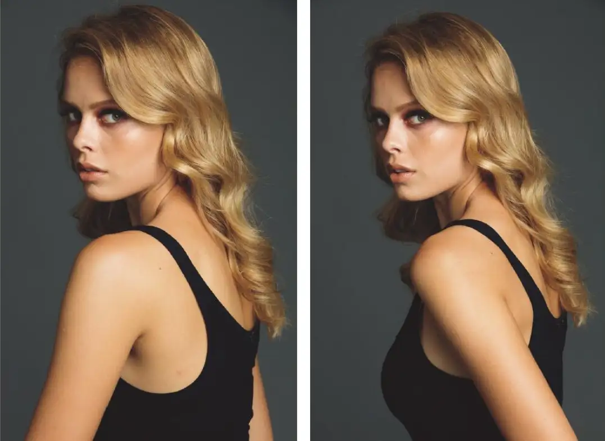
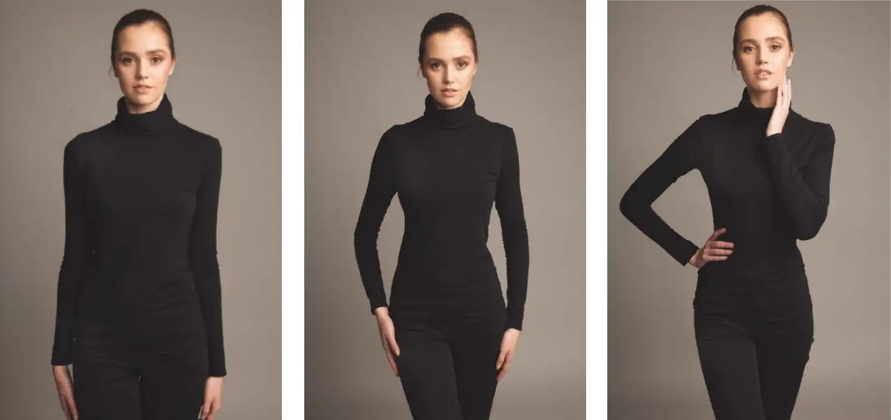
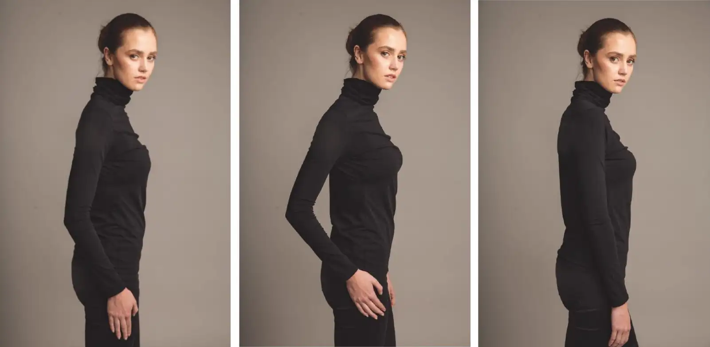
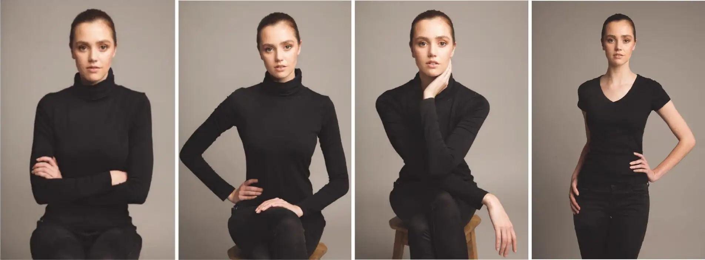
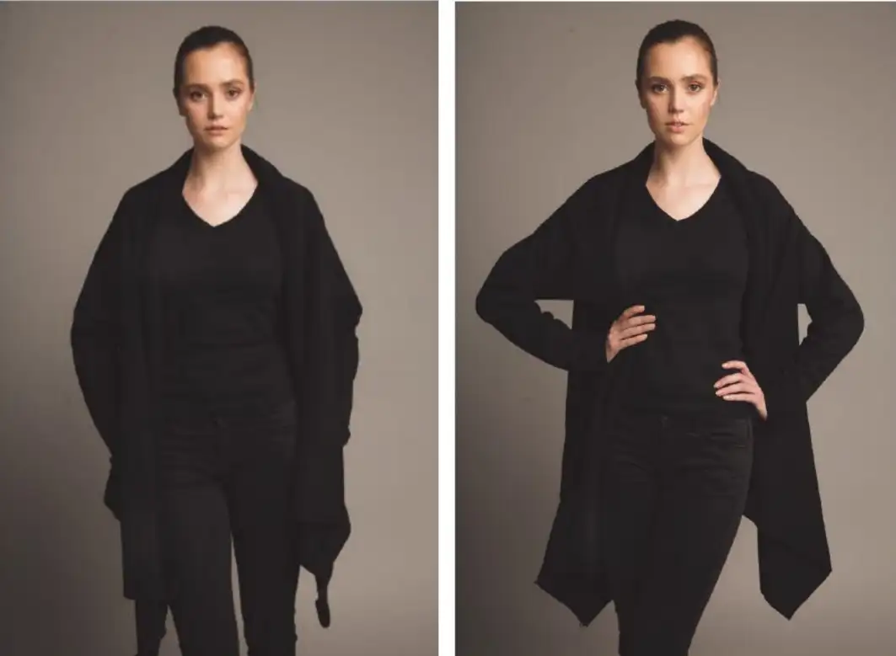

> 这里我们讨论无任何道具，空手站立时的姿势

<!--more-->

小红书上有非常多的站姿，为了方便讨论，我们从以下角度进行分类：

- 头部方向：正面、侧面、背面、低头、仰头、歪头
- 身体方向：正面、侧面、背面
- 手臂位置：低、中、高、张开、收缩
- 脚的站位：左右、前后、交叉、抬腿

一个好的姿势的标准：**更高更长**，良好的姿势能让人显得高、挺拔，四肢修长。

## 身体方向

## 侧身

**侧身可以减小肩膀的宽度，但是过侧会导致腹部的突起更加明显**。因此可以让拍摄对象侧身后，再缓慢向镜头方向转身，直到问题区域在镜头中变得模糊。

**侧身时，应该避免胳膊挡住胸部**。可以将手臂向后，使肩膀的形状更清晰的同时，展现了身材和胸部。

## 手臂位置

### 手臂与身体合并

- **手臂与身体合并导致拍摄对象身体更宽**。下面的图就展示了这个问题。解决方法：
  1. 张开手臂或叉腰，让手臂和腰之间留出空白。
  2. 将手臂摆在身体框架内，这种方法还可以利用手来勾勒身体轮廓，更加突出拍摄对象的优势。
  3. 如果衣服太宽松，可以将手放腰上，告诉观众腰的实际位置。

## 手部姿势

手可以引导视线，也可以造成干扰。你不会希望双手成为照片中的干扰因素。如果双手看起来太大或太亮，又或者让观众过度关注而导致他们忽视了人物的脸部，那可能会导致照片整体质量的降低。因此，**要避免让手掌或手背摊开朝向镜头**。另外，大拇指看起来又短又粗，会破坏一个姿势的线条，因此**应该让小拇指朝向镜头**。