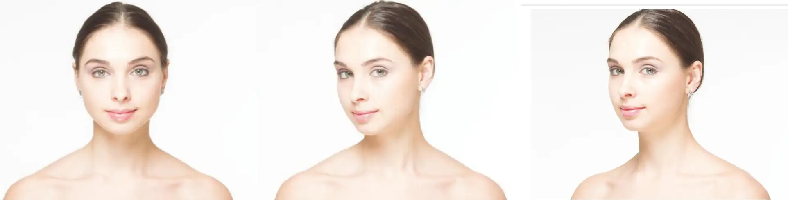
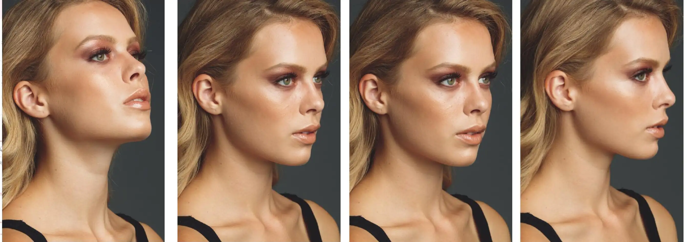

<!--more-->

## 头部姿势

头部只有三个自由度，也即只能在三个方向转：

- 俯仰（低头、抬头）
- 左右（向左、向右）
- 斜侧（直立、歪头耳朵贴近肩膀）

- **左还是右？**

要想知道哪个角度好看，最好的方法就是在正式拍摄前，尝试不同角度试拍一下，这样还能让拍摄对象适应闪光灯。当然，为了节省时间，可以：直接询问拍摄对象；拍摄发型更多的一侧（就像3/7分，7的那边）；或者翻阅拍摄对象在社交媒体上的自拍。如果还不确定，那么根据多个研究调查，大多数人更喜欢自己的左边。

- **俯还是仰**

- 下颌上扬：适合下颌较小或额头较大的拍摄对象
- 下颌收起：适合下颌较宽或眼睛较小的拍摄对象
- 下颌直面相机：适合面部特征比较对称的拍摄对象

> [!NOTE] 小技巧
>
> 我第一次见到拍摄对象时，我会告诉他们，让自己坐得舒服一点，我需要拍几张照片以调整光线。我告诉他们这几个镜头都是会删除的，只是在调整设置。可以给拍摄对象时间适应闪光灯，有助于让其在镜头前放松下来。在拍摄测试镜头时，我会过一遍头部的所有可能性，查看哪个角度的拍摄效果最好。这个过程不会超过一分钟，但却可以让我们两个都放松下来。

### 头部特写需要考虑的因素

- **下颌轮廓要清晰**：有两种方法：
  - 下颌向前、向下伸（但不要太过）
  - 将前额朝向镜头

- **注意头部与肩宽**
  - 肩膀正面镜头时看起来很宽，如果此时转头，更小的面部就会导致肩膀看起来更宽
  - 解决方法是转到身体，使得肩膀侧面镜头
  
  

- **注意鼻子**
  - 侧面拍摄时，鼻子不能遮盖眼睛。可以通过低头或转头来避免
  - 鼻子不能破坏面部线条，要么让鼻子在面部线条以内，要么让鼻子完全遮盖面部

## 眼睛方向

无论朝哪看，基本要求是：**眼白/眼珠要均匀，不能一个过多而一个过少**。这个要求使得眼珠的活动范围不能过大。

然后，眼睛要有神，避免拍摄对象的眼神空洞或无聊。这就需要摄影师去引导。

## 面部表情