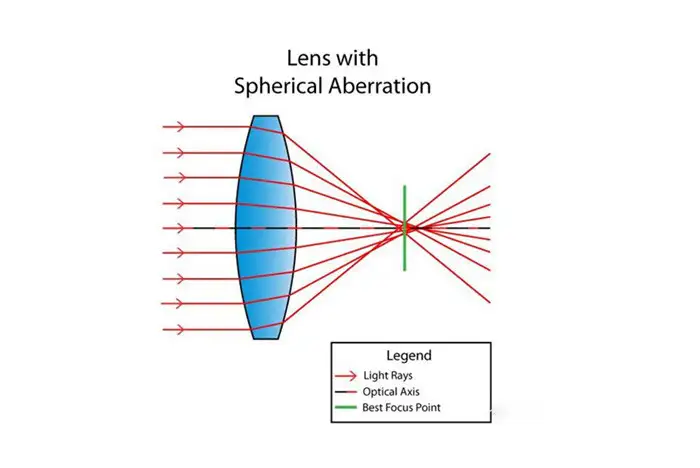
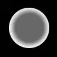
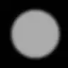
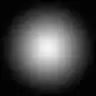
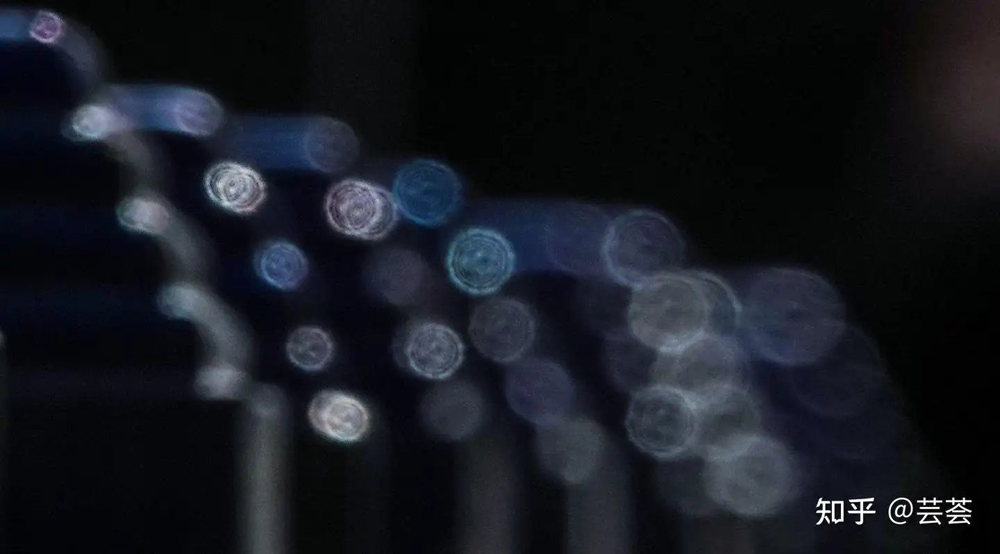
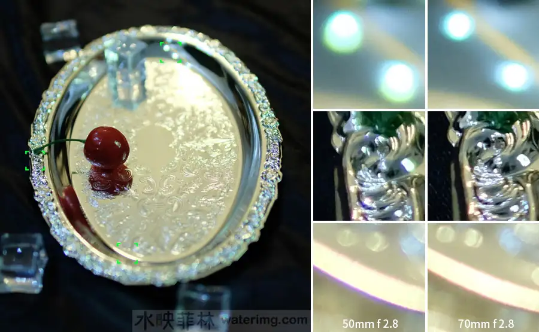

> 结合图片聊聊焦外

<!--more-->

焦外的特性主要取决于镜头的球差。理想的镜头，应该能将光线汇聚于一点；但实际上，却是形成一个漫射圆斑。

球差大小直接影响了漫射圆斑柔和程度以及焦点范围内的分辨率：

- 球差差，焦内分辨率低焦外显示出“二线性”

- 球差完美，焦内分辨率高焦外生硬。

- 球差恰当，焦内部分清晰锐利如刀割，焦外部分柔和如奶油，也就是常说的“刀锐奶化”；

下面是三张示例图：

## 焦外常见的问题

- 旋焦：指的是焦外犹如水中旋转一样，这是过去的镜头光学缺陷

- 二线性：被摄物体的散焦画面轮廓被两条或者数条线分开

- 口径蚀：焦外的光斑不太圆，向被切的柠檬。

- 洋葱圈：

- 光斑不实：比如泡泡焦外，其实也属于二线性的一种，它的光斑亮度不实，属于外亮内暗，有一种鱼鳞质感

- 紫边：由于不同颜色的光的折射率不同导致光斑边缘呈现紫色或其他颜色

## 焦外好的镜头推荐

这里仅考虑大光圈镜头（半画幅 F2 以下，全画幅 F2.8 以下）

### 富士

- 富士XF 23mm F1.4 R
- 适马 30mm f/1.4 DC DN（有轻微色散问题）
- 适马 56mm f/1.4 DC DN
- 铭匠 AF 56mm f1.8
- 唯卓仕AF 85mm f1.8 II XF

## 参考

- [焦外：什么样的虚化才叫好看？](https://image.fengniao.com/534/5348207.html)
- [怎样才叫好的“焦外虚化”](https://www.waterimg.com/tutorial/photograph/2020_Q3nd/best_bok.html)
- [如何查看镜头焦外&镜头焦外到底是不是玄学](https://zhuanlan.zhihu.com/p/16462885069)