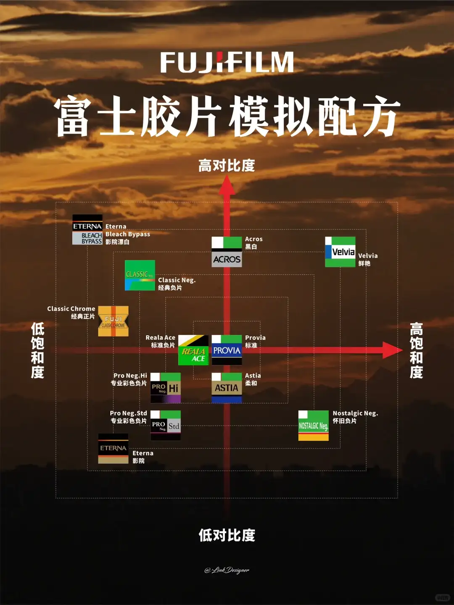
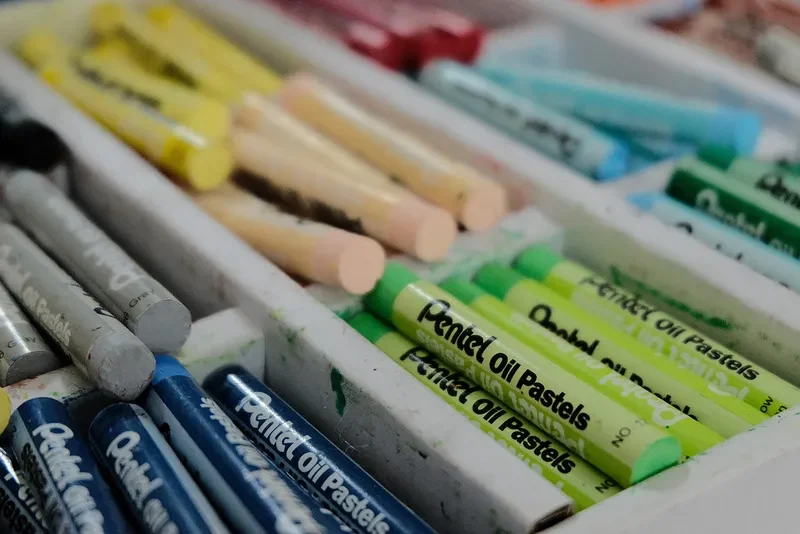

<!--more-->

首先，先考考你，下面的胶片模拟都知道哪些？

你可能会疑惑，不对啊，我的相机上也就 7、8 种，哪来的这么多？别急，容我和你慢慢道来。

## 富士的历史

> 以下内容来自 Chatgpt

富士胶片（Fujifilm，全名：富士胶片控股株式会社，日文：富士フイルム株式会社）是日本最著名的成像技术公司之一，其历史不仅仅限于胶卷和相机，还涵盖了医疗、印刷、显示、电子材料、化妆品等多个领域。

1934年：富士写真フイルム株式会社在日本静冈县足柄成立，是由大日本セルロイド公司（大日本赛璐珞）分拆而成，旨在打造日本国产胶片品牌。

1936年：推出首款胶片产品，主要用于电影、摄影、X光片等。

1970年代：推出高品质胶片如 Velvia、Provia 系列，同时扩大在光学镜头、相机等领域的影响。成为了日本乃至全球最大的胶片制造商之一。

1990年代：面对数码相机兴起，富士开始投入数码影像技术，推出自己的数码相机（FinePix 系列）。

2000年代初：胶片市场急剧下滑，富士与柯达面临“数码生死战”。但富士决策更为果断：

- 大规模裁员与重组。
- 向医疗影像、光学元件、印刷系统、办公设备、化妆品和功能性材料多领域转型。
- 同时保留并精简传统胶片业务（如停产部分型号，但保留Velvia、Acros等经典系列）。

富士坚持“双轨战略”：保留传统（如胶片、相机文化）+ 进军未来（医疗、材料、AI成像）。同时也是“极少数在数码冲击中转型成功的胶片巨头”。

## 富士的经典胶片型号

从富士的历史可以看出，富士是从胶片起家的，截止到2025年，富士有如下胶片型号：

一、**彩色负片（Color Negative Film）**

适合日常、人像、街拍等，多数为C-41工艺冲洗。

- 135格式（35mm）
  - **Fujicolor C200**：经济实惠，色彩自然。
  - **Fujicolor Superia X-TRA 400**：适应性强，色彩饱和。
  - **Fujicolor Pro 400H**（已停产）：肤色还原优秀，适合婚礼和人像。
- 120格式（中画幅）
  - **Fujicolor Pro 400H**（已停产）：专业中画幅彩色胶片。

---

二、**彩色反转片（Color Reversal Film / Slide Film）**

色彩鲜艳，对曝光要求高，需E-6工艺冲洗。

- **Fujifilm Velvia 50 / 100**：极高饱和度和细节，适合风景摄影。
- **Fujifilm Provia 100F**：色彩自然，宽容度较Velvia好，适合人像和风景。
- **Fujifilm Astia 100F**（已停产）：肤色表现柔和，适合人像。

---

三、**黑白负片（Black & White Negative Film）**

适合艺术摄影、街拍和纪实风格。

- **Fujifilm Neopan 100 Acros II**：超细颗粒，锐利，宽容度高，适合风景、建筑。
- **Neopan 400 / 1600**（已停产）：曾是高感黑白片代表。

## 富士胶片照片欣赏

不同胶片的生产工艺、化学成分不同，导致了它们拍出来的风格各异。具体可以看网友的照片：

- [逝去的经典胶片之富士Astia - 一重山的文章 - 知乎](https://zhuanlan.zhihu.com/p/365167283)
- [盘点市面上可购买到胶片之彩色负片篇](https://qicai.fengniao.com/437/4375497_all.html#4377231)

## 富士胶片模拟

富士胶片模拟有一张特别出名的坐标轴，这张图显示了各个胶片模拟的特点：

### PROVIA/标准

从名字上来看，PROVIA 来源于 PROVIA 胶片，但知乎上也有人说：

> Provia 胶片实际上更像 Astia 胶片模拟而 Astia 胶片更像 Provia 胶片模拟

官方的介绍是：

> 标准色彩再现。适用于从肖像到风景的多种拍摄对象。

其特点是 **均衡**，色彩还原稳定、中性，明暗对比适中、平缓，基本上适用于所有场景，包括风光、人像、街拍。网友的评价是：

> "富士PROVIA滤镜才是王者"——小红书
>
> 该网友还给出了她的设置：
>
> - 色彩效果：强
> - 彩色FX蓝色：弱
> - 光滑皮肤效果：弱
> - 白平衡：自动
> - 动态范围：DR400
> - 色调曲线：H -2 S 0
> - 色彩：+1
>
> 

> “Provia对红黄蓝等关键色彩还原都相对稳定，并没有过于夸张的色彩变化，这也让它成为了不少摄影师爱用的万金油🦾”
>
> “再加上相对平缓的高光阴影对比，让Provia成为一款很适合自主色彩调整的“基酒”，适合在这个基础上进行大量富有个人想法的调整设置”
>
> 

> “PROVIA拍绿色特别好看”
>
> 但也有人说：“我用的astia，std的绿色太假了”
>
> 

这个胶片模拟本身就是富士其他胶片模拟模式的「锚定点」，可以用作其他胶片模拟的“基底”，比如：

- [Agfa Optima 200 recipe](https://fujixweekly.com/2019/02/14/fujifilm-provia-film-simulation-settings-or-my-agfa-optima-200-recipe/)，原文是英语，知乎上有翻译：[Agfa Optima 200 胶片模拟配方 - 知乎](https://zhuanlan.zhihu.com/p/375635111)，从示例图来看，这种风格清新淡雅，带有淡淡的怀旧感。
  - Provia
  - 动态范围：DR100
  - 高光：-2
  - 阴影：+2
  - 色彩：-2
  - 降噪：-3
  - 锐度：0
  - 颗粒效果：弱
  - 白平衡：自动，-1红&-1蓝
  - ISO：自动，最高6400
  - 曝光补偿：+2/3到+1（通常）

### Velvia

官方的介绍是：

> 色彩饱和、对比度高的色调，适用于拍摄自然风景。

### ASTIA

官方的介绍是：

> 增加可用于肖像肤色的色相范围，同时保留白天天空鲜亮的蓝色。在户外进行肖像拍摄时推荐使用该选项。

### Classic Chrome

官方的介绍是：

> 使用柔和色彩及强化的暗调反差获取一种平静效果。

### Classic Negative

- [富士胶片模拟，Classic Negative](https://zhuanlan.zhihu.com/p/533955399)

## 进阶

富士胶片模拟的默认设置并不是万能的，这个时候我们就需要调整更细致的参数。

### 参数介绍

- 动态范围
- 高光
- 阴影
- 色彩
- 降噪
- 锐度
- 颗粒效果
- 白平衡
- ISO
- 曝光补偿

### 一些配方
