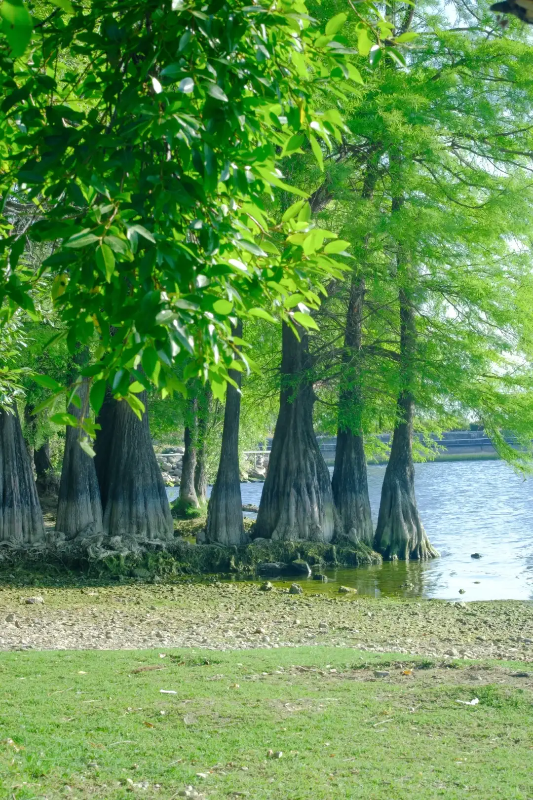
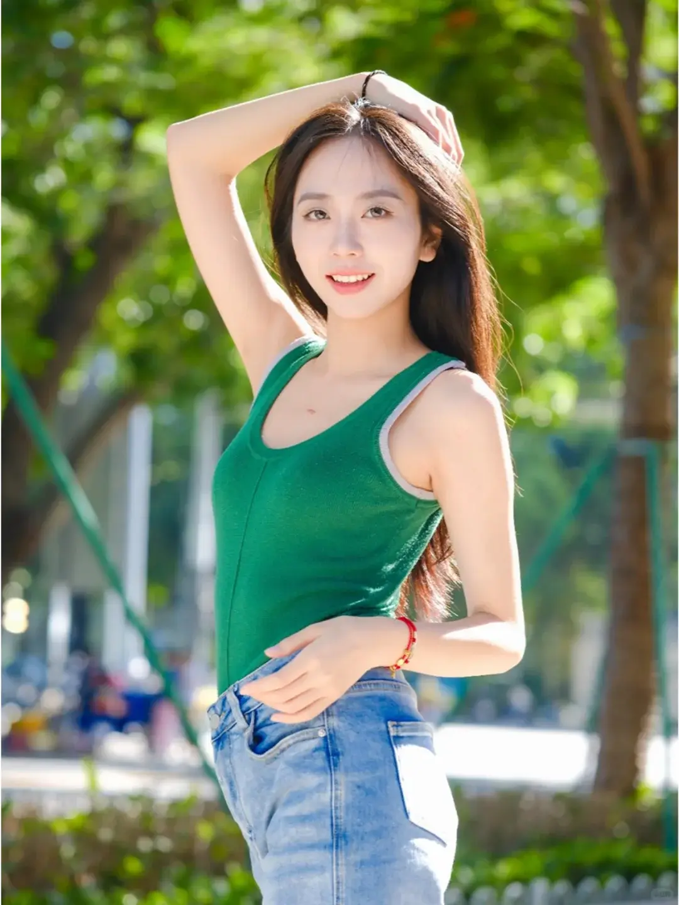
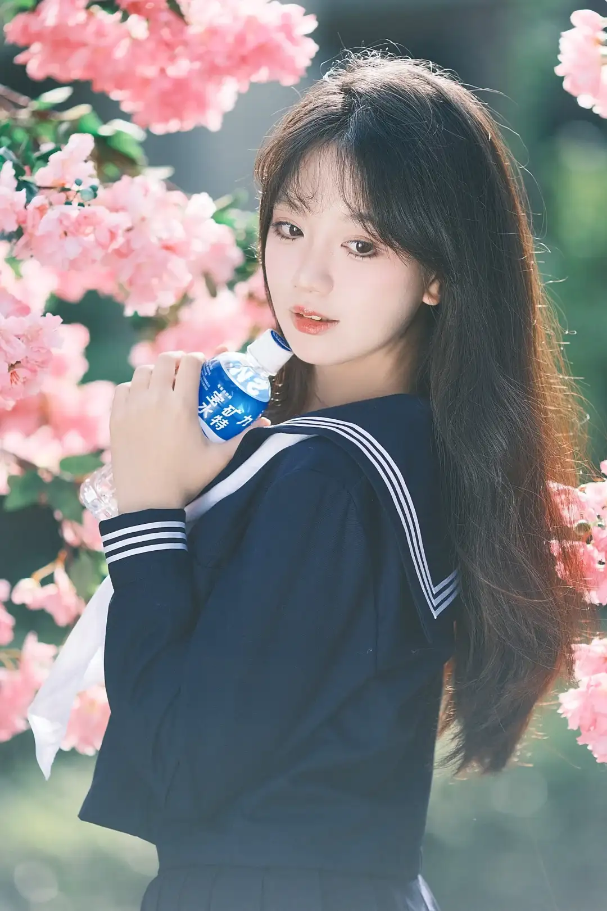
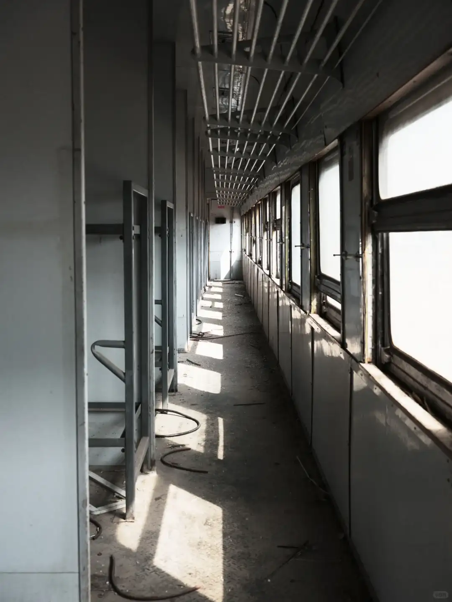

<!--more-->

首先，先考考你，下面的胶片模拟都知道哪些？

你可能会疑惑，不对啊，我的相机上也就 7、8 种，哪来的这么多？别急，容我和你慢慢道来。

## 富士的历史

> 以下内容来自 Chatgpt

富士胶片（Fujifilm，全名：富士胶片控股株式会社，日文：富士フイルム株式会社）是日本最著名的成像技术公司之一，其历史不仅仅限于胶卷和相机，还涵盖了医疗、印刷、显示、电子材料、化妆品等多个领域。

1934年：富士写真フイルム株式会社在日本静冈县足柄成立，是由大日本セルロイド公司（大日本赛璐珞）分拆而成，旨在打造日本国产胶片品牌。

1936年：推出首款胶片产品，主要用于电影、摄影、X光片等。

1970年代：推出高品质胶片如 Velvia、Provia 系列，同时扩大在光学镜头、相机等领域的影响。成为了日本乃至全球最大的胶片制造商之一。

1990年代：面对数码相机兴起，富士开始投入数码影像技术，推出自己的数码相机（FinePix 系列）。

2000年代初：胶片市场急剧下滑，富士与柯达面临“数码生死战”。但富士决策更为果断：

- 大规模裁员与重组。
- 向医疗影像、光学元件、印刷系统、办公设备、化妆品和功能性材料多领域转型。
- 同时保留并精简传统胶片业务（如停产部分型号，但保留Velvia、Acros等经典系列）。

富士坚持“双轨战略”：保留传统（如胶片、相机文化）+ 进军未来（医疗、材料、AI成像）。同时也是“极少数在数码冲击中转型成功的胶片巨头”。

## 富士的经典胶片型号

从富士的历史可以看出，富士是从胶片起家的，截止到2025年，富士有如下胶片型号：

一、**彩色负片（Color Negative Film）**

适合日常、人像、街拍等，多数为C-41工艺冲洗。

- 135格式（35mm）
  - **Fujicolor C200**：经济实惠，色彩自然。
  - **Fujicolor Superia X-TRA 400**：适应性强，色彩饱和。
  - **Fujicolor Pro 400H**（已停产）：肤色还原优秀，适合婚礼和人像。
- 120格式（中画幅）
  - **Fujicolor Pro 400H**（已停产）：专业中画幅彩色胶片。

---

二、**彩色反转片（Color Reversal Film / Slide Film）**

色彩鲜艳，对曝光要求高，需E-6工艺冲洗。

- **Fujifilm Velvia 50 / 100**：极高饱和度和细节，适合风景摄影。
- **Fujifilm Provia 100F**：色彩自然，宽容度较Velvia好，适合人像和风景。
- **Fujifilm Astia 100F**（已停产）：肤色表现柔和，适合人像。

---

三、**黑白负片（Black & White Negative Film）**

适合艺术摄影、街拍和纪实风格。

- **Fujifilm Neopan 100 Acros II**：超细颗粒，锐利，宽容度高，适合风景、建筑。
- **Neopan 400 / 1600**（已停产）：曾是高感黑白片代表。

## 富士胶片照片欣赏

不同胶片的生产工艺、化学成分不同，导致了它们拍出来的风格各异。具体可以看网友的照片：

- [逝去的经典胶片之富士Astia - 一重山的文章 - 知乎](https://zhuanlan.zhihu.com/p/365167283)
- [盘点市面上可购买到胶片之彩色负片篇](https://qicai.fengniao.com/437/4375497_all.html#4377231)

## 富士胶片模拟

富士胶片模拟有一张特别出名的坐标轴，这张图显示了各个胶片模拟的特点：

###  PROVIA/标准

从名字上来看，PROVIA 来源于 PROVIA 胶片，但知乎上也有人说：

> Provia 胶片实际上更像 Astia 胶片模拟而 Astia 胶片更像 Provia 胶片模拟

官方的介绍是：

> 标准色彩再现。适用于从肖像到风景的多种拍摄对象。

其特点是 **均衡**，色彩还原稳定、中性，明暗对比适中、平缓，基本上适用于所有场景，包括风光、人像、街拍。网友的评价是：

> "富士PROVIA滤镜才是王者"——小红书
>
> 该网友还给出了她的设置：
>
> - 色彩效果：强
> - 彩色FX蓝色：弱
> - 光滑皮肤效果：弱
> - 白平衡：自动
> - 动态范围：DR400
> - 色调曲线：H -2 S 0
> - 色彩：+1
>
> 

> “Provia对红黄蓝等关键色彩还原都相对稳定，并没有过于夸张的色彩变化，这也让它成为了不少摄影师爱用的万金油🦾”
>
> “再加上相对平缓的高光阴影对比，让Provia成为一款很适合自主色彩调整的“基酒”，适合在这个基础上进行大量富有个人想法的调整设置”
>
> 

> “PROVIA拍绿色特别好看”
>
> 但也有人说：“我用的astia，std的绿色太假了”
>
> 

###  Velvia/鲜艳

从名字来看，Velvia 来自于 Velvia 50 或 100F，这种胶片的颜色鲜艳、高饱和：

对于 Velvia 胶片模拟，官方的介绍是：

> 色彩饱和、对比度高的色调，适用于拍摄自然风景。

网友的评价是：

> - Velvia有着极高的对比度和饱和度，常用于风光摄影。同时色彩也呈现出“记忆色”，通过在蓝色中加入了洋红，则可以加深人们对蓝色的印象。
> - Velvia提升的不仅是色彩的饱和度，同样也提升了对色彩的捕捉敏感程度，在拍摄夜景、朝霞、夕阳、夜幕的霓虹时，会让人有意外的惊喜。
> - 在拍摄美食时，通过降低Velvia的饱和度与阴影，可以将画面的层次体现出来，同时也不失去Velvia独有的色彩魅力。
> - 肤色整体偏黄，在拍摄近景人像时鲜少用 Velvia，但是在户外时，搭配好白平衡及颗粒可以拍处很浓的胶片风格。
> - Velvia的特点并不是所有颜色的饱和度都高，它会突出表现蓝色、绿色这样的颜色，同时对番茄的橙色饱和度同样进行提升，但是幅度很小，从而形成色彩的平衡。

> 

> “超级适合大自然”
>
> 富士相机机内参数
> 1️⃣胶片模拟Velvia
> 2️⃣色彩效果：强
> 3️⃣色彩FX蓝色：强
> 4️⃣白平衡白色优先：-4，2
> 5️⃣动态范围DR200
> 6️⃣色调曲线：H-2，S-2
> 7️⃣色彩➕3
> 8️⃣锐度➖3
> 

> “富士Velvia/VIVID 一个字，绝，小清新中带着艳”
>
> 

> “这款胶片模拟在富士数码相机上的拥有色彩层次丰富，饱和度高的成像风格，适用于展现鲜明色调，从而增强照片的吸引力。”
>
> 

> “富士除了nc和cc，Velvia超绝！超适合人文扫街的”
>
> 

###  ASTIA/柔和

ASTIA 胶片的特点是：宽容度高，反差略低，层次感强，非常适合人像。色彩还原真实，对于人像拍摄来说恰如其分，肤色和场景都不夸张，很自然。颗粒幼细，锐度不错。

ASTIA 胶片模拟同样继承了这些特点，官方的介绍是：

> 增加可用于肖像肤色的色相范围，同时保留白天天空鲜亮的蓝色。在户外进行肖像拍摄时推荐使用该选项。

> Astia的暗部表现适中，亮部过渡曲线非常平坦，所以在拍摄皮肤等高光细节部分时，会有一种天然的柔化效果。整体色彩表现偏绿🌿，对橘色和蓝色会更加敏感。
> 

> 用多了CC，会爱上Astia复古油画感  
> 颗粒效果：关闭  
> CC效果：强  
> CC FX 蓝色：弱  
> 白平衡：自动 R：4 B：3  
> 动态范围：DR400%  
> D 范围优先级：关闭  
> 色调曲线：+2 S-2  
> 颜色：+1  
> 锐度：0  
> 高 ISO 降噪：+4  
> 清晰度：-3  
> 色彩空间：sRGB  
> 曝光补偿：1/3  
> 

> 我过去曾使用过各种胶片模拟，但 ASTIA/Soft 是最接近肉眼所见效果的模拟。尤其是红色和蓝色显得非常鲜艳。
>
> 

###  Classic Chrome

普遍认为这里由于版权问题，富士用Classic Chrome替代柯达著名的 Kodachrome. Kodachrome 发明于 1935，其冲洗极其麻烦，药水剧毒，处理费用昂贵，全球仅仅有十几家专业店才能冲洗，冲洗邮寄过程中还有丢失的危险，因此在业余使用者当中很少普及。

Kodachrome 非常微妙、细腻且色调丰富。它是最早用于电影摄影和静态摄影的成功彩色材质之一。

2009 年 6 月 22 日，柯达公司宣布停产柯达克罗姆彩色胶卷，并将最后一卷克罗姆胶卷交给了美国摄影师史蒂夫·麦卡瑞（Steve McCurry），也即下面这张经典图片的摄影师。

而对于 Classic Chrome，官方的介绍是：

> 使用柔和色彩及强化的暗调反差获取一种平静效果。

Classic Chrome 的饱和度低，反差适中，色调平衡，整体照片色彩和谐。不累眼睛，观看感受舒适。不过这也意味着照片比较难有亮点，所以相对考验构图。

网友评价：

> 使用Classic Chrome（CC）滤镜时，其本身低饱和、高对比的特性容易在暗部产生噪点。
> 基础配方（核心降噪+通透感）
>
> 1. 胶片模拟：Classic Chrome（保持风格基底）
> 2. 动态范围：DR400（强光下必开，弱光可降至DR200）
> 3. 色调曲线：  
>    高光：-2.0（压制CC的高光对比）  
>    阴影：-1.0（避免暗部过沉导致噪点显眼）  
> 4. 色彩效果：弱（防止红色/蓝色溢出增加噪点）
> 5. 色彩：+1（补偿CC的低饱和倾向）
> 6. 锐度：-1（削弱边缘锐化，让过渡更自然）
> 7. 高ISO降噪：+20~+30（ISO≥800时启用）
> 8. 白平衡：  
>    自动白平衡（AWB）+ 偏移：R-1, B+2  
>    目的：中和CC的黄绿色倾向，增强冷调通透感
> 9. 颗粒效果：关闭（重要！原图更干净）
> 10. 清晰度：0（避免强化明暗交界处的噪点）
>
> 拍摄时注意避免大光比场景，曝光宁过勿欠（CC暗部救回成本高）！
>
> 

> 富士CC 初夏清透感真的很好出片！
>
> 天气晴  
> 胶片模拟：cc  
> 色彩效果：强  
> 彩色fx蓝色：强  
> 光滑皮肤效果：无  
> 强白平衡：自动  
> 白平衡 R:-2  B:2  
> d范围优先级： 200%  
> 色彩：+2  
> 锐度：关  
> 高光：-2 ，阴影：-2  
>
> 

###  REALA ACE

Reala Ace，这是源自于富士传奇的日系小清新风格负片Reala。

这个模式的风格并不是很“冲”，风格介于Astia柔和与Nostalqic Negative负片之间的样子。Reala Ace会比Astia柔和更加柔和，影调更偏亮调一些，色调偏淡偏黄一些也不很过分，对于人像摄影来说确实非常小清新。

富士官方的介绍是：

> 中性色彩，适合多种主体，同时提供高对比度的色调渐变以形成深刻印象。

网友评价是：

> Reala Ace作为一款日光负片，色彩特色就是颗粒细腻、暖色倾向明显。画面的光影对比度适中，但饱和度上会适当弱一些。整体风格介乎于Provia和Pro neg. hi两种模拟模式之间。
>
> Reala Ace因为整体色彩偏浅，所以建议一定把FX蓝色设置为「强」。这样在户外拍摄时，整体画面的蓝色会更加饱满

> REALA胶片的名字来源于“Real”一词，意为真实，它致力于提供最接近自然的色彩表现，在拍摄人像和风景时效果尤为出色。
>
> 

> RA的肤色也是出乎意料的好诶，大面积的绿色也不像astia那样太艳，比起provia又要淡点，简直就是不想风格化的挂机首选
>
> 

###  Classic Negative

NC 主要模拟了「SUPERIA」这款胶片。「SUPERIA」胶片的设计初衷，主要是为了照顾大众用户，即使拍摄一个平淡的场景时，依然可以提升成片的观感。进一步说，「SUPERIA」胶片的是为了让我们日常生活中随处可见的一般场景，拍出来更有层次、更有质感、更好看。

富士官方的介绍是：

> 此胶片模拟模式可提供高对比度的色调渐变，并通过调整高光和阴影同时降低饱和度来增加色彩的深度和清晰度。

就像所有的负片一样，经典彩色负片模式具备低饱和度的特色，甚至比标准的「PROVIA」模式还低。 在这方面，经典彩色负片和「Pro Neg」模式没有太大的区别。

经典彩色负片最值得注意的部分是，色调是根据每种颜色亮度所定制。通常人们会认为，无论什么颜色，光源若越亮，颜色的显示就越清晰鲜明，然而这并不符合我们实际观看照片的经验。相反地，反而会看到的是完全没有留下任何印象的照片。

遇到这种情况时，我们会调整色调曲线以收紧暗部并拉出高光，仔细选择我们希望看到的细节，以及那些我们无法让它们看来生动的照片。那么，如果富士能够在逐一颜色的基础上为我们完成这项工作，那会是什么情形？这就是全新的「经典彩色负片」的功能。

> 个人认为CC的蓝是那种很清澈的富士蓝，干净通透。  
> 但NC的负片效果实在是会令人中毒不浅。  
> 个人拙见：CC基本可以应对各种场景各种天气，尤其是晴天，CC无敌；  
> NC会比较挑天气，不是光线特别好的话画面会有点显脏，条件合适的话还得是NC
>
> 
> 

> 阳光欠佳的时候不要用NC拍人像（除非打光）。阴天环境中没有直接的光源，人和景物都不受光，天空就会是画面中最亮的部分，所以当我们对暗部(人脸)提高曝光时，由于NC 的高对比度特性（高光更亮，阴影更暗），天空就会过曝，整个画面呈现死白  
> 弱光下景物仍可以用NC，只是未受光的绿植会发青，唯独红花会有一种别样的美  
> 💡阴天拍摄可以尝试Provia标准/Astia 柔和/ Pro Neg. std，人像可以尝试CC
>
> 

> 一定要学会找光，逆光一定要使用反光板或者闪光灯，不然拍出来就是又脏又黑。  
> nc拍人像想直出就很清透，就要先把色温K值定好，nc高光偏红偏黄，所以白平衡一般不要超过5400，偏移往蓝调也就是-R+B。加多少减多少是根据当天现场情况决定，不能死记参数
>
> 📷这一组的参数分享  
> 色彩效果：强  
> 彩色FX蓝色:强  
> 动态范围：400  
> 色调曲线：H-2， S-2  
> 色彩：+2  
> 锐度:+1  
> 降噪:-2  
> 白平衡：白色优先，r-2 b2  
>
> 

###  PRO Neg. Std

Pro Neg. Std 这款胶片模拟模式配方是从富士一款专业棚拍人像彩色负片NS160延续而来。富士官方的说法是：

> 色调柔和。增加了可用于肤色的色相范围，因此它成为摄影棚肖像摄影的最佳选择。

Pro Neg. Std 明暗光影对比柔和，在肤色等中间调色明暗的过渡上非常细腻，非常适合搭配影棚内的专业灯光使用。这也造成了这款色彩的反差较低，色彩的饱和度也较为欠缺。在使用的时候，我们建议可以考虑在机身设定中加强色彩，调整彩色FX蓝色的强度，让画面的饱和度适当增加。

整体而言，Pro Neg. Std更适合人像和风格化的静物摄影，并不太适用于风光拍摄

网友评价：

> 富士的胶片模拟Ns（PRO Neg.Std）是中性色调，对比没有那么强烈，搭配黑柔或欧根纱可以拍出来很梦幻的感觉。
>
> 彩色FX蓝色：关  
> 色彩效果：强  
> 色调曲线：H-1、S-2  
> 色彩：+2  
> 白平衡：白色优先 R0 B-3  
> 动态范围：DR200%
>
> 

> 这一风格对肤色具有极佳的表现能力，在室内、影棚等光线较为柔和的条件下有着更好的表现。
>
> 

###  PRO Neg. Hi

该胶片模拟模式基于专业彩色负片PRO160NH，其色调渐变比专业负片标准稍显生硬。富士官方的描述是：

> 提供的对比度比在 （PRO Neg. Std）下提供的稍多。在户外进行肖像拍摄时推荐使用该选项。

网友的评价是：

> 富士胶片模拟中，NH滤镜是最老的几个滤镜之一，这款滤镜在接近真实色彩观感的同时，更突出画面的纯净感，个人觉得比较适合写实拍照，人像拍照，以及美食拍照。
>
> 颗粒效果：弱，大  
> 色彩效果：强  
> FX蓝色：强  
> 白平衡：自动 R -2 B +0  
> 色调曲线：H -2  S +1  
> 色彩：+4  
>
> 

> Pro Neg.Hi这一模式能够增强肖像照片的质感，并提供极具对比度的肤色效果。
>
> 

###  Nostalgic Neg

 “Nostalgic Neg.怀旧负片” 胶片模拟模式是基于1970年代美国的 “新彩色摄影” 作品风格，能够给用户带来 “怀旧电影风” 的拍摄体验。通过集合 “柔和色调” 与 “高饱和度” 两种特性，这款胶片模拟模式能够给画面带来一种朦胧的美感，同时保持清晰可辨的细节以及明快的色彩表现。

富士官方的描述是：

> 琥珀色高光和丰富的阴影色调可用于打印照片

网友评价：

> - 最重要的就是要注意调整相机的白平衡，想要省事就直接设定为自动白色优先
> - 因为NN色彩本身就偏暖，所以在涉及到人像拍摄时，要注意根据现场实际的光线情况，来手动调整白平衡倾向
> - 避免过多的暖色调加持，影响人物肤色
>
> 

> 在人像摄影中，这款滤镜能够优化皮肤色调  
> 使其看起来更加自然和充满活力  
> 同时保持一种柔和而怀旧的美感
>
> 

###  Acros 与  黑白

ACROS和黑白胶片模拟，都是黑白单色滤镜。但ACROS相比黑白，细节更加丰富，锐度也更高。它们各自还有三个衍生版本：

-  黄滤镜：能够稍微增强对比度和暗化天空，能够加深紫色和蓝色。
-  红滤镜：强化对比度并大幅度暗化天空，能够加深绿色和蓝色，所以相对更适合拍摄风景。
-  绿滤镜：适合拍摄人像，能够加深红色和棕色，能够提升皮肤质感

###  Eterna/影院

富士官方的描述是：

> 适用于影片外观视频的柔和颜色和丰富阴影色调。

在富士官方的胶片模拟模式地图中可以看到，Eterna位于对比度和饱和度的极限。低饱和、高光阴影对比低、宽容度高是Eterna影院的色彩特点。在视频拍摄中，后期二次调色会有很大的调整范围。

网友评价：

> 特性：这款滤镜有很强的电影色调，它的饱和度与影调都非常柔和，能保留丰富的细节。用这套配方会让影像更显宁静感，感觉时光慢了下来。  
> 适用场景：日常、静物、人像  
> 预设配方参数
>
> - 色彩效果：强
> - 色彩FX蓝色：弱
> - 白平衡：自动 R+4，B-6
> - 动态范围：DR200
> - 色彩曲线：H+1，S-1
> - 色彩：+3
>
> 

> 富士最被低估的胶片模拟滤镜！ETERNA/影院！  
> 超级万能日常的滤镜  
> 各种生活照，日常照，风景照，直出自带电影感！（为了更直观呈现电影感的效果，以上选择的都是特别简单的构图的照片）  
> 分享我最常用的参数如下：
>
> - 动态范围：DR400
> - 色调曲线：H-1 S+0.5
> - 色彩：+2
> - 锐度：-1
> - 高iso降噪：+1
>
> 

###  Eterna Bleach Bypass

富士官方的描述是：

> 低饱和度高对比度的独特颜色。适用于静态图像和视频。

EB 模拟了传统的胶片处理技术“漂白效果”，在保持低色彩饱和度的同时，进一步降低饱和度，让画面的影调变得十分硬，给人以深刻的印象，深受许多电影制作者的钟爱，非常适合进行更戏剧性的剪辑。

网友评价：

> 漂白模式的设置思路：  
> ✅EB胶片模拟对比度较高，阴影容易过暗，提高曝光补偿降低色调曲线的阴影数值，画面会更干净。  
> ✅饱和度很低，通过调整白平衡和白平衡偏移，很好加载各种色彩倾向，就像给照片增加一层淡淡的色彩滤镜。笔记图片拍摄时将白平衡设置为4000k偏冷，白平衡偏移设为R-1,B+4偏青，得到偏蓝的色调。如果想拍暖调的画面，就将白平衡向偏暖调整。  
> ✅如果觉得饱和度太低，颜色太旧，就增加色彩值，会让颜色稍微明显一点。
>
> 

> 

###  SEPIA

模拟怀旧风格的棕褐色调。

### 我该选择哪种？

① 如果你还拿不准主意：

> 可以选择Provia或者Classic Chrome，这两种都很接近于原始画面，区别在于Classic Chrome多一些电影质感。

② 如果你喜欢色彩更加鲜艳高饱和的画面：

> Velvia是不错的选择。

③ 如果你喜欢拍摄人像照片：

> 黑白肖像请选择ACROS+绿色滤镜  
> 彩色肖像请选择Pro Neg. Hi（室外）/Pro Neg. Std（室内）  
> 如果人物肤质有瑕疵，可尝试Astia模式

④ 如果你喜欢拍摄风光照片：

> 彩色片选择Provia，黑白片选择ACROS+红色滤镜

⑤ 选择困难症患者注意：

> 拍摄 RAW 图片可以后期改变滤镜

## 进阶

富士胶片模拟的默认设置并不是万能的，这个时候我们就需要调整更细致的参数。

### 参数介绍

- 饱和度
  - 色彩：影响整体饱和度，会影响亮度，不影响色相，
  - 色彩效果：影响暖色系饱和度
  - FX蓝色：影响冷色系饱和度
- 动态范围
  - 动态范围：降低高光，不影响阴影。（需要提高ISO才能用DR200或DR400）
  - 色调曲线：
    - 高光：增强/减弱高光，影响程度较小，不如动态范围的DR200
    - 阴影：增强/减弱阴影
  - D范围优先级：与“动态范围”和“色调曲线”不兼容，同时降低高光、提高阴影
- 降噪
  - +降噪：强化降噪功能，相机会降低画面噪点，让画面更纯净，但“涂抹感”增强。
  - -降噪：弱化降噪功能，相机会保留更多噪点，同时画面细节更多，但“颗粒感”增强。
- 锐度
  - 如果想拍风景或者微距拍摄需要更清晰的画面时，也可以增加锐度，增加纹理细节
  - 如果想拍摄柔和有氛围的照片时，比如人像时 可以适当降低锐度，让皮肤更光滑细腻
- 颗粒效果：使得照片出现颗粒状噪点，呈现出一种复古的胶片质感。
- 白平衡
  - AUTO白色优先：在有色偏的情况下 优先还原白色 适合画面中有大量白色或者想表现干净色彩的场景
  - 自动：根据现场的情况自动调节
  - AUTO环境优先：优先还原场景整体色彩 但有点偏黄
- 白平衡偏移：
  - 横坐标是 R，正值往红偏，负值往绿偏
  - 纵坐标是 B，正值往蓝偏，负值往黄偏

### 一些配方

不同胶片由于使用的化学配方不同，照出来的效果也不一样。而在富士的胶片模拟中，通过修改参数也能够获得一些特别的效果。

#### Agfa Optima 200

[Agfa Optima 200 recipe](https://fujixweekly.com/2019/02/14/fujifilm-provia-film-simulation-settings-or-my-agfa-optima-200-recipe/)，原文是英语，知乎上有翻译：[Agfa Optima 200 胶片模拟配方 - 知乎](https://zhuanlan.zhihu.com/p/375635111)，从示例图来看，这种风格清新淡雅，带有淡淡的怀旧感。

- Provia
- 动态范围：DR100
- 高光：-2
- 阴影：+2
- 色彩：-2
- 降噪：-3
- 锐度：0
- 颗粒效果：弱
- 白平衡：自动，-1红&-1蓝
- ISO：自动，最高6400
- 曝光补偿：+2/3到+1（通常）

#### 🍬SUGER

#### Kodak Portra 160

富士周刊上排名N0.1的CC预设配方

- 胶片模拟：CLASSIC CHROME
- 颗粒效果：关
- 色彩效果：强
- 白平衡：Auto  R+4 B-5
- 动态范围：AUTO
- 高光：-2 阴影：0
- 色彩：+2
- 锐度：-2
- 高ISO降噪：-4
- 清晰度：0

色彩曲线调整下，这个配方拍妹纸蛮好的。

#### Gold Aura Neg

国外摄影圈子里面很火的一个富士胶片直出预设方案，基于富士NOSTALGIC Neg胶片模拟。这个胶片风格的灵感来源于上世纪伟大的摄影师们，富士的工程师们通过研究其中的画面风格，以此为参考设计出这款「怀旧负片」。

色彩上有着琥珀色高光和丰富的阴影色调，整体风格偏暖，大部分颜色中都加入了暖色，红色明显偏橙。影调上暗部提亮，整体反差降低。整个画面的效果仿佛笼罩在温暖的阳光之下，因此在室内、晴天日光下拍摄都能得到不错的效果。

富士相机的研发者西尾也表示「适用于阳光斜射时间段光影斑驳的场景」

- 胶片模拟 : Nostaligic Neg
- 动态范围 : DR400
- 颗粒效果 : 强 小
- 白平衡 : 荧光灯 -2R -4B
- 色调曲线：H-2 S+1
- 色彩 : +4
- 锐度 : 1
- 清晰度 : -3
- 降噪 : -2
- 色彩效果 : 强
- 彩色FX蓝色 : 强

#### 往事宛如昨

- 📽️配方名称：[往事宛如昨](https://www.xiaohongshu.com/explore/670b884e00000000210032ef?type=normal&xsec_token=ABQtQBeJk6WOz5SE7WtWv-l6oklSFIwBR3mXVaoetuH34=&xsec_source=pc_share)
- 🎞️胶片模拟：影院模式 ETERNA
- ⚖️白平衡：4800K
  - 机内调低色温K值，使画面整体偏冷，营造电影氛围
- 🧭白平衡偏移：R+2 / B-2
  - 加红减蓝，避免人脸过于偏青，矫正肤色
- 🌈色彩：+1
  - 影响所有色彩，加强藕粉色衬衣的色彩表现
- 🎨色彩效果：Weak
  - 提升高饱和色彩的饱和度，适度加强唇色
- 📘彩色FX蓝色： Weak
  - 提升蓝色的饱和度，强化暗调电影感特征
- 📉色调曲线：H+0.5 / S+1
  - 提亮高光，加深阴影，适度去灰，提升质感
- ♨️动态范围：DR100%
  - 几乎没有高光溢出，不需要抑制高光
- 颗粒效果：关
  - 调整颗粒粗糙度强弱和尺寸大小，人像后期需要磨皮，建议关闭。
- 锐度：0
  - 影响物体轮廓的锐利程度，个人习惯不增加。
- 高ISO降噪：-4
  - 影响画面平滑程度，数值越高，涂抹感越强。
- 清晰度：0
  - 影响画面清晰程度和对比度，当清晰度不为0时，相机计算处理会延长照片保存时间，建议设置为0。

#### 人像专用配方

<https://zhuanlan.zhihu.com/p/335582262>
