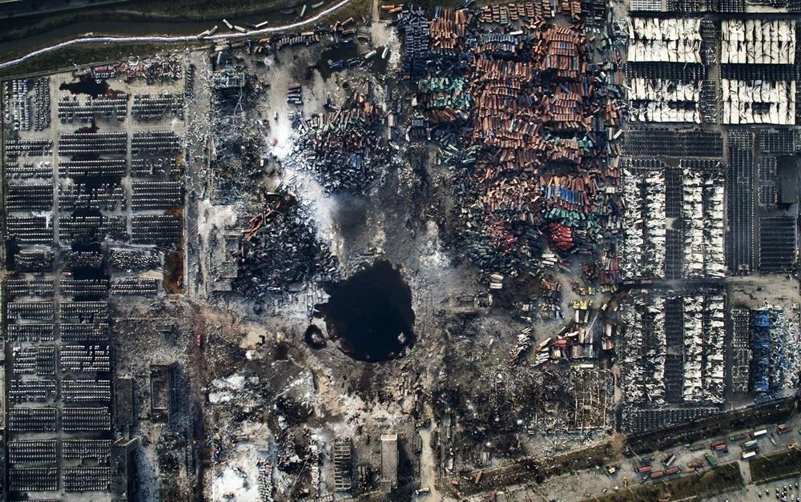
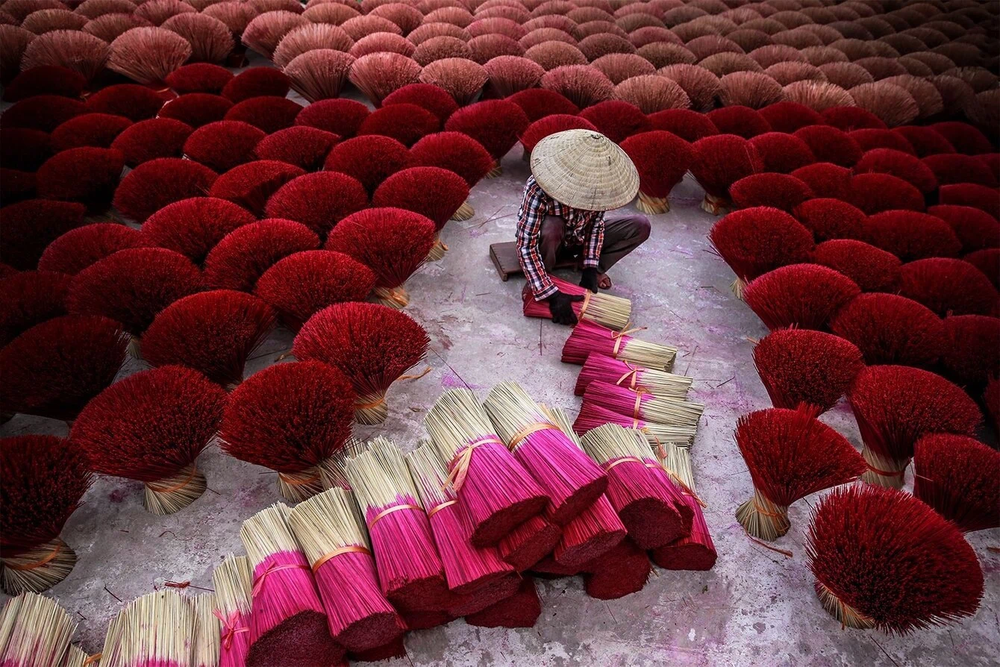
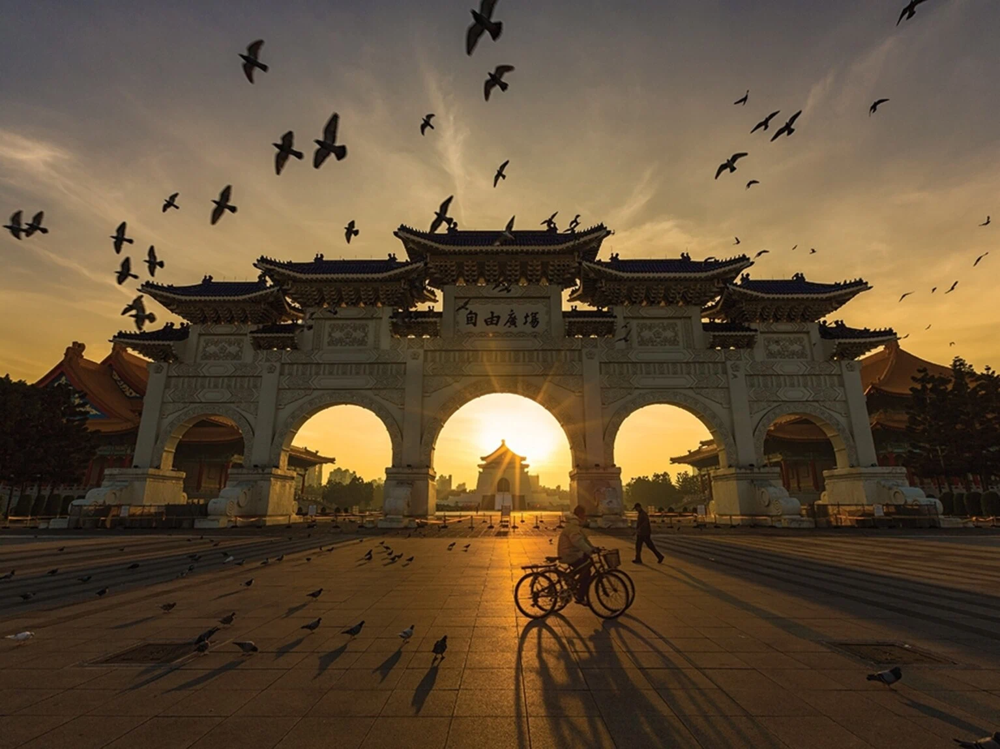
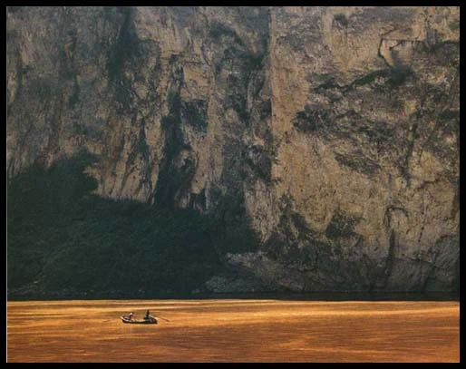
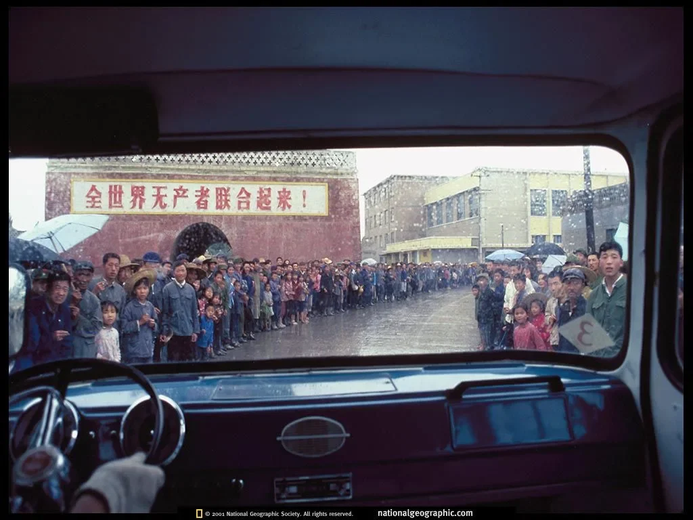
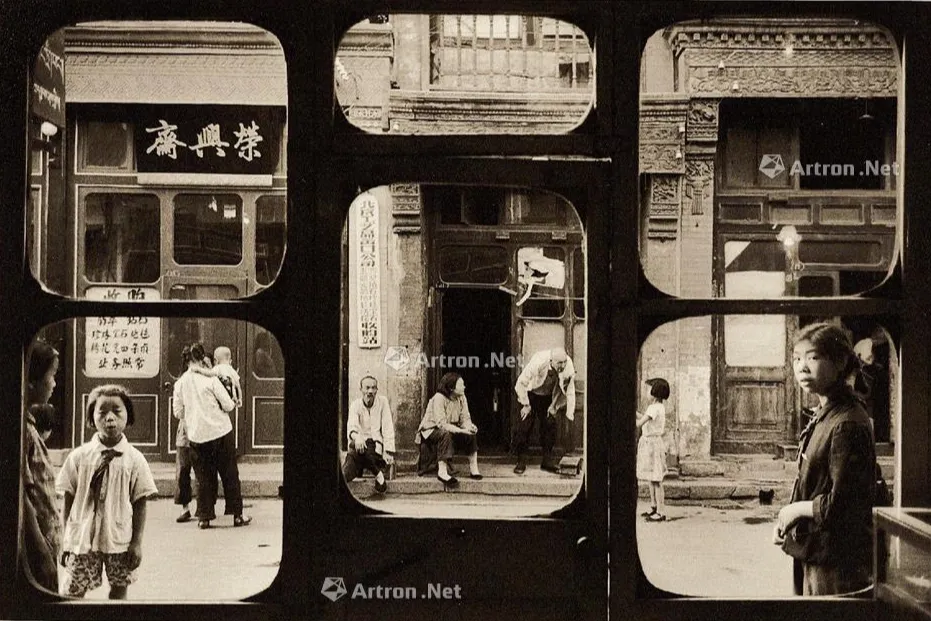
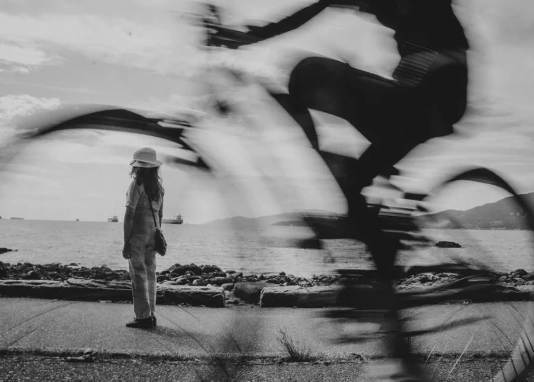
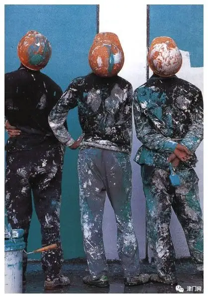

> 这是中国传媒大学开设的课程，主讲老师是郭艳民老师。在B站上有 [视频课程](https://www.bilibili.com/video/BV1er4y177k2)，同时也有 [文字版](http://mdedu.cuc.edu.cn/excellentCourse/demo/sheyinggoutu/index.htm)，我在此记录了一些重点，并附加了示例照片。

<!--more-->

## 1 评判画面优劣的标准

- **普遍性主题**：能让所有观众都接受的、比较好的主题思想
- **形象表现力强**：画面形象要表达主题立意
- **情感因素**：具有强烈或丰富的情感
- **画面简洁**：画面越简洁，主题对象越突出，凡是留存的东西都要有利于主题，繁杂的东西都去除掉
- **形式美感**：画面形式感要好、有特点

## 2 摄影画面的构成元素

- 主体：画面的主要表现对象
- 陪体：画面中陪衬、渲染主题，和主体构成特定情节的次要对象
- 前景：位于主体之前，离镜头最近的景物
- 背景：位于主题后的景物
- 空白：不一定是纯黑、纯白，缺乏实体意义的都叫空白

比如下面这张图，主体是人，陪体是手中的香，前景是图片下面的横放的香，背景是竖放的香，空白是人和香之间空的地面。

不是所有图片都有上面的构成元素，比如下面这张图，鸽子、牌楼、骑车的人都是前景，主体是中间尖顶的中正纪念堂，背景是带霞光的天空，上面没有云的天空是空白。这个画面里就没有陪体对象。

## 3 主体——怎么突出主要被摄对象

可以利用常见的构图样式，来突出主体。比如：

- 黄金分割构图：把画面分成三等分，把主体放在黄金分割线上
- 九宫格构图：把画面横竖分为九份，把主体放在分割线的交点上

- S型构图：比如河、路、山、沙丘等，线条从一角出发，到达对角，一般用俯拍的形式
- 对角线构图：把主体放在对角线上

- 对称式构图：适合安静、稳定、严肃、庄重的主题，但容易使得被摄影对象显得呆板、缺少生气和变化。对称可以分为：
  - 主体在中轴线，被中轴线均分
  - 主体以中轴线两端对称
  - 宽泛的对称，比如主体和陪体以中轴线对称
  - 上下对称，比如水中倒影

当然，构图有时候也可以反其道而行之。

## 4 间接突出主体——如何突出成像面积较小的景物

- 利用对比，比如明暗对比、色彩对比、动静对比、运动（方向、速度）对比等；
- 利用线条，引导人的视线
- 利用框架性前景，比如透过一扇窗看、透过树枝看，使得注意力透过框架集中在景物上

面积比较小的景物可以起到“支点”的作用。支点：拍摄以表现场面、规模数量、气势为主的大景别画面时，拍摄场景中位置突出、形式独特、内涵丰富，能够起到统帅全局、结构画面作用的事物。比如：

拍摄大景别是要有意识地设置支点。

## 5 陪体

陪体的作用：

- 解释、限制、说明主体的作用
- 点明深化主体
- 陪体作为前景

陪体有两种处理方法：

- 在画内（封闭式构图），此时陪体要放在边缘，可以进行裁切，不能影响主体
- 在画外（开放式构图），比如放风筝，风筝可以在画外面，只拍一个人手拿风筝的线

## 6 前景

前景
: 位于主体前，离镜头最近的景物。在主体前用什么东西遮挡一下

前景的作用：

1. 增加画面的空间透视效果，增加纵深感。
2. 与主体、背景形成关联
3. 填补画面中过多的空白（比如用树枝填补天空的空白）
4. 遮挡后景中杂乱、多余景物
5. 交代主观视点，拍摄主观镜头（比如下面这张图）

## 7 框架性前景

框架性前景：

1. 以框架的形式存在于前景位置，可以集中观众注意力，并美化画面的景物。
2. 突出后景中的主体
3. 遮挡后景多余杂乱的景物

## 8 背景

背景
: 在一幅画面当中，位于主体之后，渲染、衬托主体的环境景物，背景要有助于表现主题。

常见问题：前后景物不良重叠，比如人脑袋上长棵树。但并不绝对。

背景一定要简化，画面简洁与否，却决于背景是否简洁。方法：

1. 仰拍或俯拍，平角度拍摄最容易导致景物重叠
2. 逆光或测逆光拍摄
3. 使用长焦拍摄
4. 使用大光圈拍摄
5. 追随拍摄高速运动的物体
6. 利用 风霜雨雪雾 天气拍摄

## 9 空白——画面留白

空白
: 画面中色调相近、影调单一、缺乏实体意义的部分，空自不一定必须是纯自或纯黑。

空白的作用：

1. 突出主体
2. 使画面简洁
3. 空白写意，营造意境

空白处理的常规方法：

1. 视线前方留较多空白
2. 运动物体的趋向方留较多空白
3. 光线入射方留较多空白
4. 注意空白与实体部分的比例，空白与实体最大不能超过9:1
5. 大面积空白要“破”，用细小的东西打破它

## 10 拍摄角度对画面的影响

1. 角度不同，画面的造型效果不同
2. 角度不同，画面的表现力不同
3. 角度不同，画面的侧重点不同（后续逐一讲解）
4. 在影视中，体现不同的视点的效果

### 11 正面角度

角度三要素：

1. 拍摄高度
2. 拍摄方向
3. 拍摄距离

正面角度
: 照相机(或摄影机)在被摄对象正对面进行拍摄的角度。

正面角度的特点：

1. 展现食物本质特征的最主要角度
2. 拍人，重在表现人的表情神态，人体对称和正面动作
3. 适合表现安静、严肃、庄重的主题，静态有余、动感不足
4. 形成画内画外，直接的交流感
5. 并列展示、同等评价多个事物

### 12 侧面角度

侧面角度
: 摄影机(或照相机)在被摄对象正侧面90°位置进行拍摄的角度

侧面角度的特点：

1. 表现动作、姿态和手势
2. 交代动作的方向感
3. 展现事物的轮廓特征（比如人体的身材美）
4. 交代事物的方位关系

### 13 斜侧面角度

斜侧面角度
: 摄影机(或照相机)在被摄对象正面或背面和侧面之间位置进行拍摄的角度。
: 斜侧面角度包括前斜侧面角度和后斜侧面角度。

斜侧面角度的特点：

1. 拍摄人像的经典角度（比如蒙娜丽莎的微笑），称为3/4人面像，被摄对象的鼻尖不超过脸的外部轮廓线
   - 在人像摄影中，被摄人物斜侧程度大小，是校正人物面部缺陷的重要方法。如果比较宽、比较胖，可以斜侧一些；反之，瘦的可以拍正一些。
2. 表现空间感和立体感
3. 表现动势和动感
4. 影视摄影中，拍人物对话常用角度（外反拍机位、内反拍机位）

### 14 背面角度

背面角度
: 摄影机(或照相机)在被摄对象背后位置进行拍摄的角度

背面角度的特点：

1. 含蓄、想象联想空间大
2. 给观众强烈的参与感和伴随感
3. 借实写意，通过实景来表现景外含义
4. 具有悬念的效果，比如鬼片
5. 注意姿态和轮廓的提炼，没有面部表情，要注重姿态的表现力

### 15 平角度

平角度
: 摄影机镜头与被摄对象处在同一水平线上，这个角度合乎或接近人们平常的视觉习惯和观察景物的视点

平角度的特点：

1. 客观、真实、自然，最接近人的正常视觉效果
2. 日常拍摄运用最多最普遍的角度，与人视线相平
3. 特别强调使用平角度拍摄，可以带来客观、平等、公正的感觉。
4. 平角度拍摄要注意背景的简化
5. 平角度拍摄要注意地平线、水平线的处理，避免地平线无限制地横穿画面，避免分割画面，最好让地面线有起伏（比如建筑物）

### 16 仰角度

仰角度
: 摄影机镜头处于视平线以下，由下向上拍摄被摄体

仰角度的特点：

1. 近距离拍摄高大的物体，包容对象的整个体积，使得物体更高大
2. 简化背景，利用天空做背景
3. 夸张前景景物
4. 缩小背景
5. 建立上下位置事物的联系，把小的事物和高大的事物联系到一起
6. 体现仰视视点的效果，体会仰视视觉的感受

### 17 俯角度

俯角度
: 摄影机(或照相机)镜头处在正常视平线之上，由高处向下拍摄被摄体。

俯角度的特点：

1. 拍摄大场面、全景，交代事物之间的方位关系
2. 表现纵向延申的线条
3. 具有强烈的主观感情色彩，使拍摄者、看视者处在心理优越位置
4. 简化背景
5. 压缩前景景物
6. 远距离拍摄，简化构图

### 18 顶角度

顶角度
: 摄影机镜头近似垂直的摄体上方自上而下拍摄，这画角度在拍摄中用的较少，正面效果往往比较奇特。

特点：

1. 表现图案美
2. 形成被摄物体上下部分大小悬殊比
3. 表现俯视的视觉效果拍摄主观镜头
4. 化立体为平面，简化构图，使事物图案化

## 19 景别划分

景别
: 拍摄距离的变化，带来画面取景范围大小的变化，从而产生景别。

景别的分类：一般根据人来划分

1. 远景：从远距离拍摄的，包括被摄景物广阔的空间，包括较多的空间景物，易于表现环境和总体气势的画面景别
2. 全景：按成年人的人体来衡量一般是指包括成年人人体的全身，如果拍摄其他事物，则是指保留事物外部轮廓线完整的画面景别
3. 中景：以成年人的人体来衡量则是指人的腰腹以上(坐姿或膝部以上(站姿)。如果拍摄其他事物，则是指包括其主要部分的大部分。
4. 近景：按成年人的人体来衡量，一般是指人的胸部以上的部分。如果拍摄其他事物，则只包括被摄对象的主要部分
5. 特写：按成年人的人体为标准一般指人的肩部以上的部分如果拍摄其他事物，则是只
拍摄事物的局部

改变画面景别的方法：

1. 改变物理距离
2. 改变镜头焦距

景别部分需要注意的问题：

1. 景别是一个相对的概念
2. 注意远景和特写，这两个会表现心理，不可滥用
3. 景别运用要准
4. 不同景别镜头组接影响影视语言节奏

### 20 远景

远景
: 从远距离拍摄的，包括被摄景物广阔的空间，包括较多的空间景物，易于表现环境和总体气势的画面景别。

远景的作用：

1. 交代空间环境
2. 抒情写意

远景处理：

1. 远取其势，大处着眼
2. 注意地平线、水平线，防止其分割画面、无限制地贯穿画面，用东西打破它
3. 可以有意识地使用前景
4. 在影视摄影中，时长要较长

### 21 全景

全景
: 拍人，一般是指包括人体的全身。拍摄其他事物，是指保留事物外部轮廓线完整，表现被摄对象全貌。

全景的作用：

1. **客观的**展现事物的全貌
2. 交代主体与环境之间的关系
3. 交代事物之间的相互关系
4. 在影视摄影中具有"定位"作用，分切镜头以全景镜头为准

### 22 中景

中景
: 拍人，是指人的腰部以上(坐姿)或膝部以上(站姿)。如果拍摄其他事物则是指包含其绝大部分(约3/4)的画面景别。

中景的作用：

1. 利于展现动作姿态和手势
2. 景别适中，影视中运用最多
3. 利于展现情节交流

注意：

1. 景别要准准
2. 拍人，画框不要切割体位

### 23 近景

近景
: 拍人，一般是指人的胸部以上的部分;如果拍摄其他事物，则只包括被摄对象的主要部分。

注意：

1. 近取其神，重在表现人物的内心状态
2. 近取其质，重在表现物体质感、纹理、色彩
3. 局部放大，要精细处理

### 24 特写

特写
: 拍人，一般指人的肩部以上的部分;拍摄其他事物则是取事物的局部

特写的作用：

1. 突出细节
2. 通过局部透视全部，通过表象揭示本质
3. 具有强烈的主观性，有强制观看的意味
4. 在影视摄影和编辑中用来转场

特写的处理：

1. 要有明确的目的
2. 注意眼睛、表情、手势
3. 注意富有内涵的细节
