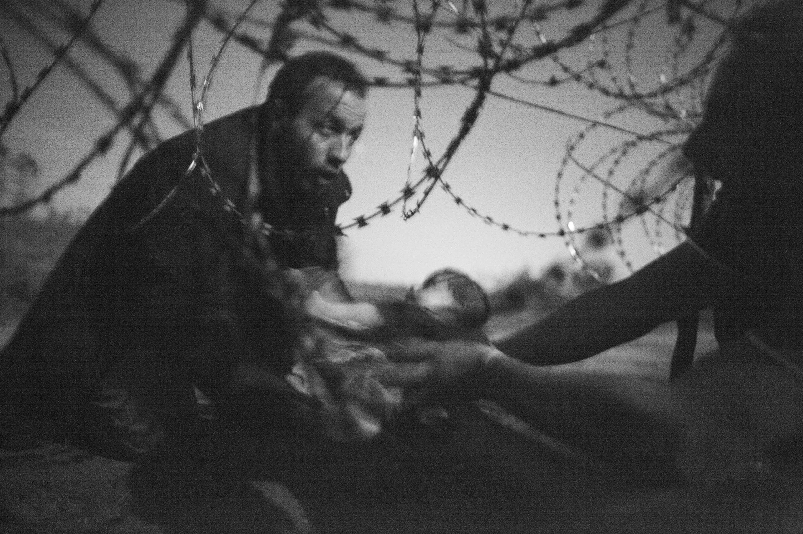
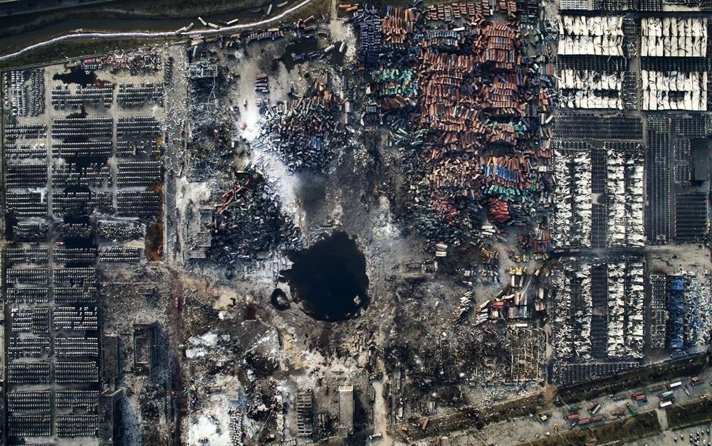
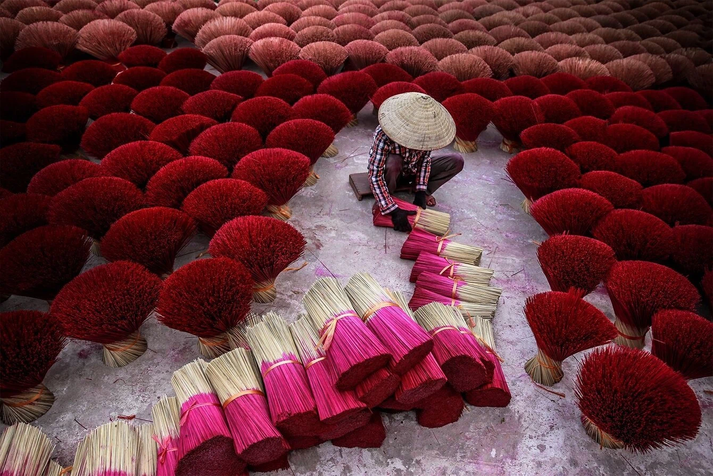
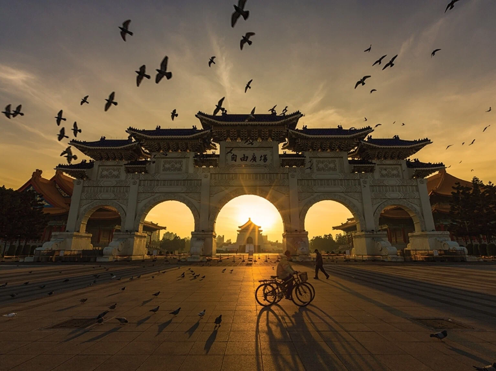
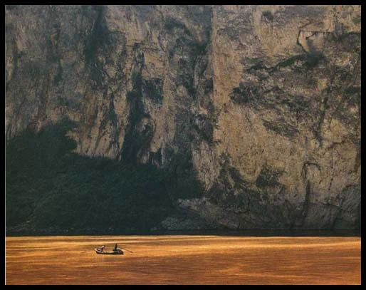

## 1 评判画面优劣的标准

- **普遍性主题**：能让所有观众都接受的、比较好的主题思想
- **形象表现力强**：画面形象要表达主题立意
- **情感因素**：具有强烈或丰富的情感
- **画面简洁**：画面越简洁，主题对象越突出，凡是留存的东西都要有利于主题，繁杂的东西都去除掉
- **形式美感**：画面形式感要好、有特点

## 2 摄影画面的构成元素

- 主体：画面的主要表现对象
- 陪体：画面中陪衬、渲染主题，和主体构成特定情节的次要对象
- 前景：位于主体之前，离镜头最近的景物
- 背景：位于主题后的景物
- 空白：不一定是纯黑、纯白，缺乏实体意义的都叫空白

比如下面这张图，主体是人，陪体是手中的香，前景是图片下面的横放的香，背景是竖放的香，空白是人和香之间空的地面。

不是所有图片都有上面的构成元素，比如下面这张图，鸽子、牌楼、骑车的人都是前景，主体是中间尖顶的中正纪念堂，背景是带霞光的天空，上面没有云的天空是空白。这个画面里就没有陪体对象。

## 3 主体——怎么突出主要被摄对象

可以利用常见的构图样式，来突出主体。比如：

- 黄金分割构图：把画面分成三等分，把主体放在黄金分割线上
- 九宫格构图：把画面横竖分为九份，把主体放在分割线的交点上

- S型构图：比如河、路、山、沙丘等，线条从一角出发，到达对角，一般用俯拍的形式
- 对角线构图：把主体放在对角线上

- 对称式构图：适合安静、稳定、严肃、庄重的主题，但容易使得被摄影对象显得呆板、缺少生气和变化。对称可以分为：
  - 主体在中轴线，被中轴线均分
  - 主体以中轴线两端对称
  - 宽泛的对称，比如主体和陪体以中轴线对称
  - 上下对称，比如水中倒影

当然，构图有时候也可以反其道而行之。

## 4 间接突出主体——如何突出成像面积较小的景物

- 利用对比，比如明暗对比、色彩对比、动静对比、运动（方向、速度）对比等；
- 利用线条，引导人的视线
- 利用框架性前景，比如透过一扇窗看、透过树枝看，使得注意力透过框架集中在景物上

面积比较小的景物可以起到“支点”的作用。支点：拍摄以表现场面、规模数量、气势为主的大景别画面时，拍摄场景中位置突出、形式独特、内涵丰富，能够起到统帅全局、结构画面作用的事物。比如：

拍摄大景别是要有意识地设置支点。

## 5 陪体

陪体的作用：

- 解释、限制、说明主体的作用
- 点明深化主体
- 陪体作为前景

陪体有两种处理方法：

- 在画内（封闭式构图），此时陪体要放在边缘，可以进行裁切，不能影响主体
- 在画外（开放式构图），比如放风筝，风筝可以在画外面，只拍一个人手拿风筝的线
