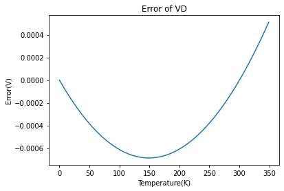

## Terms

- Solar Cell
- Photodiode
- LED
  - direct bandgap material (GaAs) - can emit photon
  - indirect bandgap material (Si)
- Schottky Barrier Diode/ Schottky Diode = metal + n-type semiconductor
- Zener Diode

## Design Application: Diode Thermometer

The temperature characteristics of diode:

$$
I_D \approx I_S \exp(\frac{V_D}{V_T})
$$

where $I_S\propto n_i^2 \propto e^{-E_g/kT}$, so

$$
I_D \propto \exp (-E_g/kT + eV_D/kT)\\
    \ln I_D \propto (-E_g + eV_D)\cdot \frac{1}{kT}
$$

The ratio of $I_D$ in different temperature is

$$
\frac{\ln I_{D1}}{\ln I_{D2}} = \frac{-E_g+eV_{D1}}{-E_g+eV_{D2}} \frac{T_2}{T_1}
$$

For silicon $E_g=1.12{\rm eV}$，so

$$
\frac{\ln I_{D1}}{\ln I_{D2}} = \frac{-1.12+V_{D1}}{-1.12+V_{D2}} \frac{T_2}{T_1}
$$

---

In Figure 1.47, with $T_1$ being set to 300K, $V_{D1} = 0.5976{\rm V}$, $I_{D1}=0.9602{\rm mA}$. According to the equation above,

$$
\frac{\ln(0.9602 \cdot 10^{-3})}{\ln I_{D2}} = \frac{-1.12+0.5976}{-1.12+V_{D2}} \frac{T}{300}
$$

where $I_{D}=\dfrac{15-V_D}{15} {\rm (mA)}$, i.e.

$$
\frac{\ln (0.9602\cdot 10^{-3})}{\ln (\frac{15-V_{D_2}}{15\cdot 10^{3}})} = \frac{-1.12+0.5976}{-1.12+V_{D2}} \frac{T}{300}
$$

After simplification,

$$
V_{D2} =1.12+ 7.5183\cdot 10^{-2}\cdot \frac{T}{300} \ln (\frac{15-V_{D_2}}{15\cdot 10^{3}})
$$

Assuming $\dfrac{15-V_{D2}}{15\cdot 10^{3}}\approx\dfrac{15-V_{D1}}{15\cdot 10^{3}}$, we have

$$
V_{D2} = 1.12-0.5224 \frac{T}{300}
$$

It means $V_{D2}$ is a linear function of temperature.

By the way, the error caused by approximation is plotted below, which indicates that the error is neglectable.

