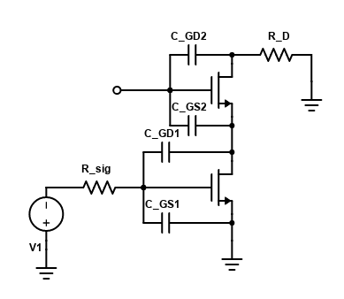

## 频率响应

主要看主极点，其余的忽略。我们一个一个电容（结点）分析：

- 在 M2 漏端，$C_{GS2}$ 比较小，电阻也比较小，所以不是主极点
- 在 M2 源端，电阻 $1/g_m$ 比较小，所以也不是主极点
- 在 M1 栅端，$C_{GS1}$ 经过 Miller Effect 比较大，并且电阻也比较大，所以是主极点。

$C_{GS1}$ 经过 Miller Effect 后，等效为 M1 栅端的 $2C_{GS1}$（$A_{v1}=-g_{m1} \cdot \frac{1}{g_{m2}} \approx -1$），从而主极点为：

$$
\omega_{p1} = \frac{1}{R_{\rm sig}(C_{GS1}+2C_{GD1})}
$$
