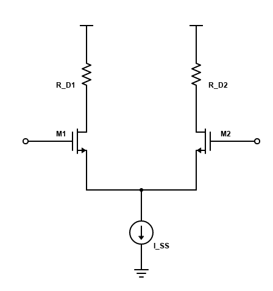
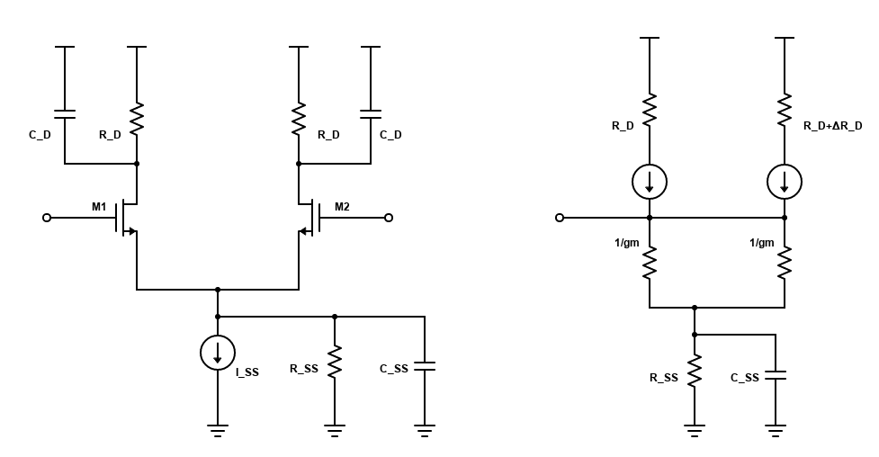

概述：

1. 电路里一般一有机会就做成差动对，准没错
2. 可以消除共模的信号（共模噪声）
3. 波形类似于 tanh(arctan)；$I_{\rm out,max} = I_{SS}$，此时 $V_{in}=\sqrt{\dfrac{2I_{SS}}{\mu C_{ox}W/L}}+V_{\rm th}$

分析方法：

1. fully-symmetric（电路对称、信号对称） => half-circuit（只考虑一半的电路）
   - gain、BW、pole、zero不变

## High-Freq response

差模放大倍数（只考虑 $C_D$ 引起的极点 $\omega_{p1}=\frac{1}{R_D C_D}$）：

$$
A_{\rm DM} = \frac{g_m R_D}{1+s/\omega_p}
$$

为了方便，定义 $Z \triangleq R_{SS}\| sC_{SS}$，从而共模放大倍数：

$$
\begin{aligned}
A_{\rm CM-DM} &= \frac{1}{1/g_m \cdot 1/2 + Z} \cdot \frac{1}{2} \cdot \Delta R_D\\
&= \frac{\Delta R_D}{2R_{SS}}(1+1/\omega_{p2})
\end{aligned}
$$

$$
\omega_{p2} = \frac{1}{R_{SS}C_{SS}}
$$

则共模抑制比（Common-Mode Rejection Ratio）：

$$
{\rm CMRR} \triangleq \l| \frac{A_{\rm DM}}{A_{\rm CM_DM}} \r| \\
= \frac{g_m R_D}{(1+s/\omega_{p1})\frac{\Delta R_D}{2R_{SS}}(1+1/\omega_{p2})}
$$

$R_{SS}, C_{SS}$ 都比 $R_D, C_D$ 大，所以 $\omega_{p2}<\omega_{p1}$，因此 CMRR 的超过 $\omega_{p2}$ 后就开始往下掉。
