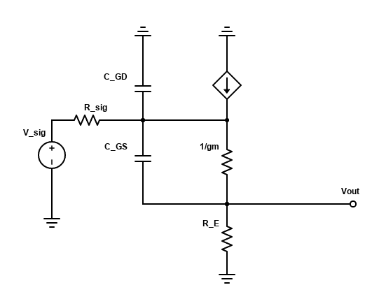
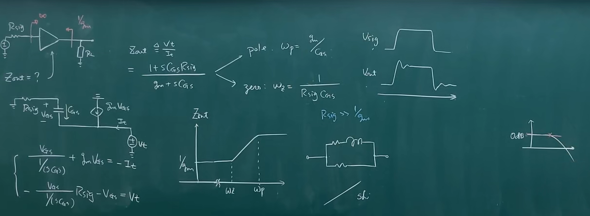

## 频率响应

易知，$V_{\rm out}$ 的输出是 $1/g_m$ 和 $R_E$ 的分压，所以有：

$$
A_v = \frac{R_E}{1/g_m+R_E}
$$

对于 $C_{GS}$，其等效电阻为：

$$
\begin{cases}
    \dfrac{V_D+V_t}{R_{\rm sig}} = I_t\\
    \dfrac{V_t}{1/g_m} = I_t + \dfrac{V_D}{R_E}
\end{cases}\\
\Rightarrow \omega_{p1} = \frac{1}{C_{GS}\l( \frac{R_{\rm sig}+R_E}{1+g_m R_E}\r)}
$$

对于零点，要使输出为 0，则流过 $R_E$ 的电流为 0，因此有：

$$
V_G \cdot sC_{GS} + V_G g_m = 0\\
\Rightarrow s_{z1} = -g_m / C_{GS}\\
\Rightarrow \omega_{z1} = g_m/C_{GS}
$$

零点和极点都不算太高/太低。

对于 $C_{GD}$，易知，极点为 $\omega_{p2} = \frac{1}{C_{GD} R_{\rm sig}}$，零点为 $\omega_{z2}=\infty$

总的带宽为（OCTC法）：

$$
{\rm BW} = \frac{1}{C_{GS}\l( \frac{R_{\rm sig}+R_E}{1+g_m R_E}\r)+C_{GD} R_{\rm sig}}
$$

这两个极点靠得比较近，虽然这个电路本身的增益是 0dB（也就是一定会稳定），但在两个极点处会迅速到180，也就是其 Phrase Margin 很小。

另外，该电路的输出电阻随频率的变化而变大，就像一个电感（见下面推导），就会导致输入方波时，边缘会有震荡（Ringing）。这也是 Phrase Margin 很小导致的。

## 该电路的问题

对于 Bipolar，由于 $V_{BE}$ 可以维持在 0.7，所以其输出可以跟随输入。因此可以用作 Buffer

但对于 CMOS，由于 $I_D$ 不是恒定的（就算用电流源来代替 $R_E$，也会有 Body Effect），会导致 $V_{GS}$ 变化，因此输出的跟随不是很好。如果实在要用，则可以连接 BS，利用体效应来抑制 $V_{GS}$ 的变化，但尽管如此，Ringing 也使得它不适合作为 Ringing.
