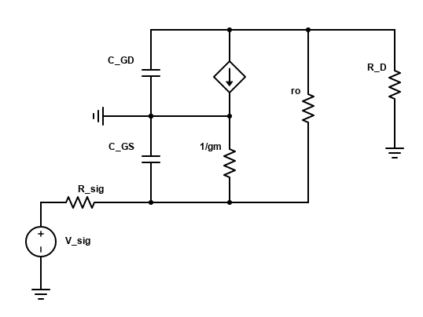
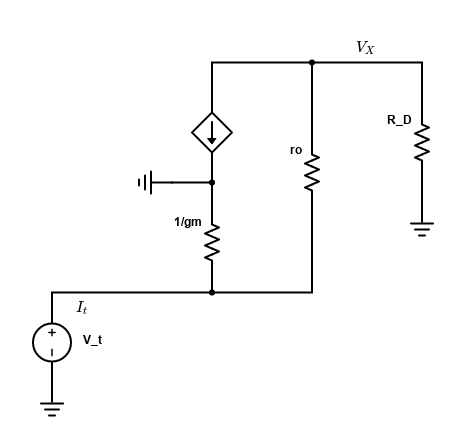

## 频率响应

对于 $C_{GS}$，其等效电阻为：$R_{\rm sig}\|1/g_m$（$r_o$很大，可以看作断路，详细分析如下）：

$$
\frac{V_t}{1/g_m} + \frac{V_t - V_X}{r_o} = \frac{V_X}{R_D} = I_t\\
\Rightarrow R_{\rm eq} = \frac{V_t}{I_t} = \frac{R_D+r_o}{1+g_m r_o} \approx \frac{1}{g_m}
$$

所以 

$$
\omega_{p1} = \frac{1}{C_{GS} (R_{\rm sig}\|1/g_m)} \approx \frac{1}{(1/g_m) \cdot C_{GS}}
$$

对于 $C_{GD}$，过程和上面类似，等效电阻为 $R_D \| (r_o + R_{\rm sig}+g_m r_o R_{\rm sig}) \approx R_D$，所以

$$
\omega_{p2} \approx \frac{1}{C_{GD}\cdot R_D}
$$

这两个极点都挺大的，所以这个电路可以操作在高频。得益于其输入电阻小，一般用作高频输入端。

-----

零点：

- $1/(sC_{GS}) = 0$，$\omega_{z1}=\infty$
- $1/(sC_{GD}) = 0$，$\omega_{z2}=\infty$

所以总的传输方程为：

$$
H(s) = \frac{A_v}{(1+s/\omega_{p1})(1+s/\omega_{p2})}
$$