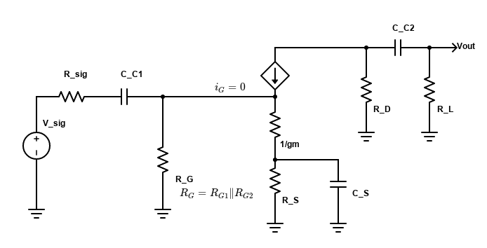
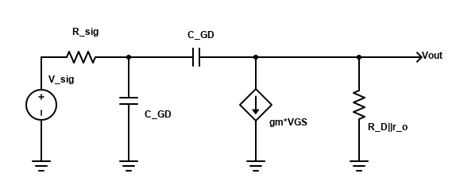
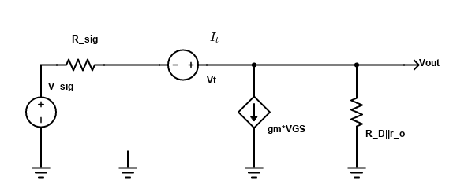
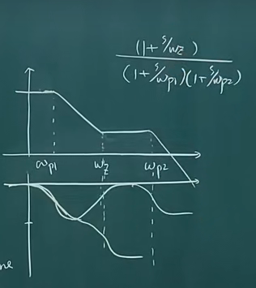

图中，$C_{C1}$、$C_{C2}$ 为耦合电容，容值较大（$10^{-9}\sim 10^{-6}$），寄生电容一般只有 $10^{-15}$。

## 频率响应

### 分析原则

- 一个电容对应一个极点+一个零点
- 零点可能会在0或无穷
- 分析一个电容的时候，忽略其他电容（耦合电容看作短路，寄生电容看作开路）
- 找零点的方法：使输出始终为 0 的频率（无论输入是什么）

### 不考虑寄生电容

- $C_{C1}$，由于 $i_{G}=0$，只需要考虑 $R_{\rm sig},R_{G}$
  - $\omega_{p1}=\dfrac{1}{C_{C1}(R_{\rm sig}+R_{G})}$
  - $\omega_{z1}=0$（此时 $\frac{1}{sC_{C1}} \rightarrow \infty$，$v_G=0$，输出为0）
- $C_{S}$，由于 $v_G = 0$，受控电流源为0，因此只需要考虑 $1/g_m, R_S$
  - $\omega_{p2}=\dfrac{1}{C_S(R_S\|\frac{1}{g_m})}$
  - $\omega_{z2}=\dfrac{1}{R_S C_S}$（此时 $R_S\|\frac{1}{sC}\rightarrow \infty$，$i_D=0$，输出为0）
- $C_{C2}$，只需要考虑 $R_D,R_L$
  - $\omega_{p3}=\dfrac{1}{C_{C2}(R_D+R_L)}$
  - $\omega_{z3}=0$（此时 $\frac{1}{sC_{C2}} \rightarrow \infty$，输出为0）

总的频率响应：

- 一般来说，为了减小电流，$R_G$ 比较大，所以 $\omega_{p1}$ 最小
- 考虑到 $1/g_m \approx 50$, $R_S\approx 10^3$，从而 $\omega_{p2}\approx \dfrac{1}{C_S\frac{1}{g_m}}$ 最大，且 $\omega_{p2}>\omega_{z2}$
- $\omega_{p2}$ 在 $\omega_{p1},\omega_{p3}$ 之间
- $\omega_{z2}$ 不确定，可能在 $\omega_{p1},\omega_{p3}$ 周围

总之就是：$\omega_{p1}<\omega_{p3}<\omega_{p2}$ 且 $\omega_{z2}<\omega_{p2}$

### 考虑寄生电容

为了简化分析，把耦合电容、旁路电容忽略，从而小信号电路为：

由于 $r_o \gg R_D$，所以 $R_D \| r_o \approx R_D$

**主极点法**。饱和状态时，$C_{GS}>C_{GD}$，因此 Dominant Pole 应该在栅极。利用 Millar Effect 将 $C_{GD}$ 等效为 $[1+g_m(R_D\| r_o)]C_{GD}$，从而有：

$$
\omega_{p1} = \frac{1}{R_{\rm sig}[C_{GS}+C_{GD}(1+g_m R_D)]}
$$

这个频率就是3dB带宽。这种方法比较精确，但不好算（需要确定主极点）。另一种方法叫 **OCTC**（Open-Circuit Time Constant），就是把所有电容对应的时间常数相加取倒数，得到 BW：

$$
{\rm BW} = \frac{1}{\sum_i C_i R_{io}}
$$

$R_{io}$ 是开路电阻，也就是把其他电容忽略（开路）。利用这种方法，我们可以计算出共模BW为：

$$
{\rm BW} = \frac{1}{\omega_{p1}+\omega_{p2}}
$$

- $\omega_{p1}=C_{GS}R_{\rm sig}$
- $\omega_{p2}=C_{GD}[R_{\rm sig}+({\color{red}1}+g_m R_{sig})R_D]$

其中，$C_{GD}$ 的往外看到的等效阻抗可以用下面这个电路计算（把 $C_{GD}$ 替换为一个电压源，$R_{\rm eq}=\frac{V_t}{I_t}$）：

$$
\begin{cases}
    V_{GS}=-I_t \cdot R_{\rm sig}\\
    I_t = g_m V_{GS} + \frac{V_{GS}+V_t}{R_D}
\end{cases}\\
\Rightarrow R_{\rm eq}=R_{\rm sig}+(1+g_mR_{\rm sig})R_D
$$

**OCTC** 的结果不如 **主极点法** 精准，但也只是分母多了个 1，所以可以用来进行大致的分析。

-----

对于零点，分析过程和上一节相似，所以有：

- $C_{GS}$：$\omega_{z1}=\infty$
- $C_{GD}$：$\omega_{z2}=-g_m/C_{GD}$

$C_{GD}$ 零点的分析如下：要使输出为0，则流过 $C_{GD}$ 的电流与 $g_m V_{GS}$ 相同，从而流过 $R_D$ 的电流为 0. 所以有：

$$
g_m V_{DS} = i = \frac{V_{GS}}{1/(sC_{GD})}\\
\Rightarrow s = g_m/C_{GD}
$$

注意到 $\omega_{z2}$ 是一个右半平面零点，这有可能引起稳定性问题：

- 左边平面零点会将相位 +90°，右半平面零点则会 -90°
- 右半平面会使得信号在 0dB 前到达 -180°

但在共模电路中，$\omega_{p1},\omega_{p2}$ （OCTC中求得）都比 $\omega_{z1}$ 要小得多（$C_{GS}>C_{GD}$, $R_{\rm sig}>1/g_m$），所以幅度会以 40dB/10倍频迅速下降到 0（在到达 $\omega_{z1}$ 前）
