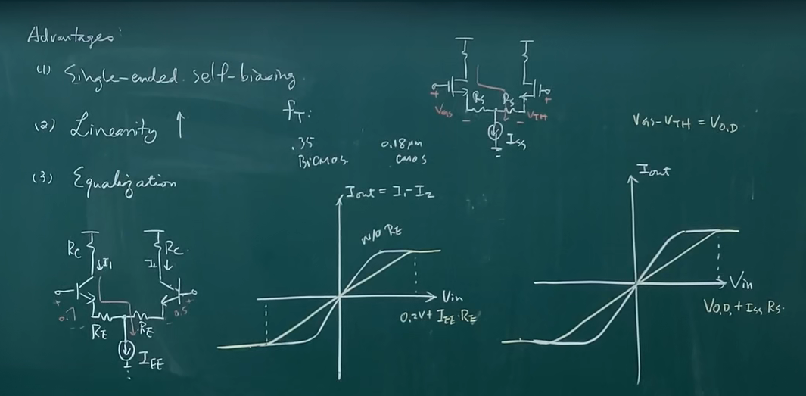
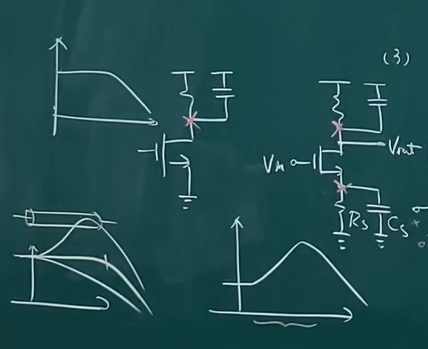
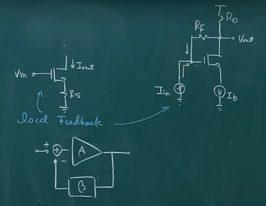
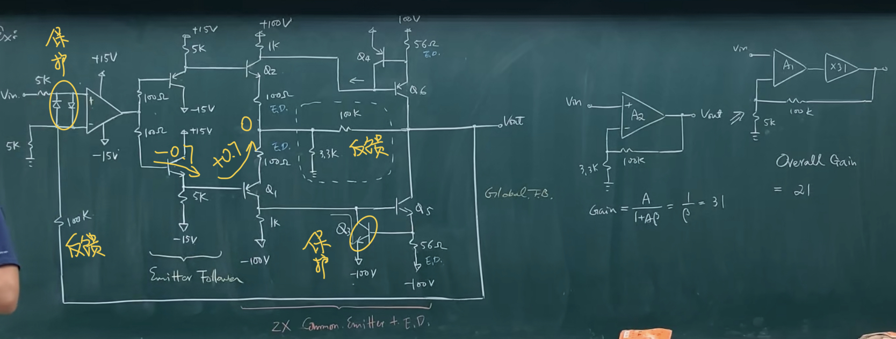

## 优点

1. Single-ended self-biasing 可以用作自偏置
2. Linearity 线性度增加：图中展示了加入 Degeneration 后，差分放大器的线性区间会变大（变大 $I_{EE}R_E$ 或 $I_{SS}R_{S}$），相应的线性度也会增加。

   

3. Equalization 均衡化（CTLE）：信号经过传输线后，高频会下降，配合上 degeneration amp（引入一个较低的零点），可以使低频/高频均衡。

    

degeneration 的本质是一个负反馈（Local Feedback），输出电流流过 $R_S$ 会使得输入 $V_{GS}$ 减小（输入电压，输出电流）。图中右上部分的电路是输入电流输出电压的负反馈。

## 示例电路

