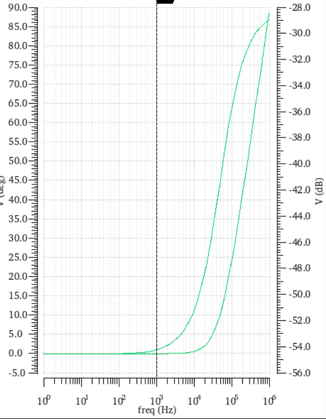

改动之处：

- 对 PTAT、CTAT 相关电阻进行了微调，使得温度系数小于 8ppm
- 对输出电阻进行了调整，使得输出等于 1.5V
- 在 VDD 和 GND 之间增加电容，使得 PSRR 大于 50dB

3.0V时的输出-温度图如下：

幅频特性如图：

其余测试结果如下：

|VDD|温度系数ppm|电源抑制比（dB）|-20~120℃平均输出电压|
|---|------|-------|-----|
|2.7|5.965|49.16|1.500
|2.85|5.781|51.61|1.500|
|3.0|6.436|54.4822|1.501|
|3.15|6.556|59.373|1.501|
|3.3|6.490|86.7191|1.501|