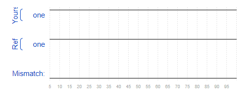

## Getting Started

刷题流程：

1. Learn
2. Write Code
3. Compile with Altera Quartus
4. Simulate
5. Compare
   - Compile Error — Circuit did not compile.
   - Simulation Error — Circuit compiled successfully, but simulation did not complete.
   - Incorrect — Circuit compiled and simulated, but the outputs did not match the reference.
   - Success! — Circuit was correct

---

### 问题1

- 题目：Build a circuit with no inputs and one output. That output should always drive 1 (or logic high).

```verilog
module top_module( output one );

// Insert your code here
    assign one = 1;

endmodule
```



编译中出现了如下警告：这主要是由于输出恒为1

> Warning (13024): Output pins are stuck at VCC or GND
>
> This warning says that an output pin never changes (is "stuck"). This can sometimes indicate a bug if the output pin shouldn't be a constant. If this pin is not supposed to be constant, check for bugs that cause the value being assigned to never change (e.g., assign a = x & ~x;)

## Zero

HDLBits 中使用的是 Verilog-2001，这比 Verilog-1995 更简洁易读。比如对比下面两个模块定义：

```verilog
module top_module ( zero );
    output zero;
    // Verilog-1995
endmodule
```

```verilog
module top_module ( output zero ); 

    // Verilog-2001
endmodule
```

### 问题2

- 题目：Build a circuit with no inputs and one output that outputs a constant 0（与问题1相同，但输出改为恒0）

（略）