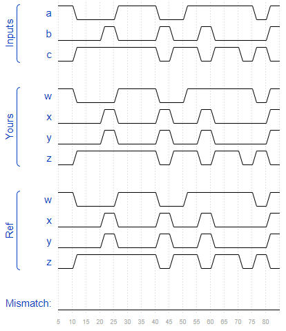
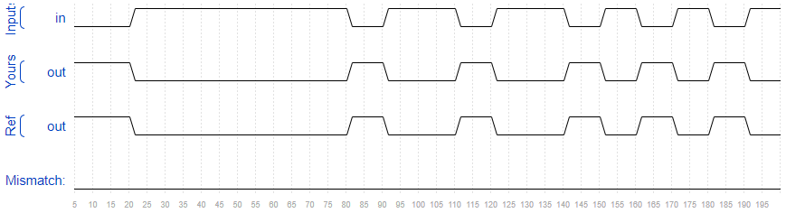
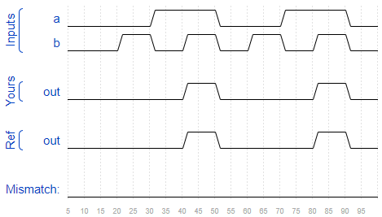
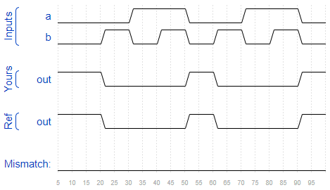
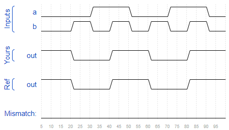
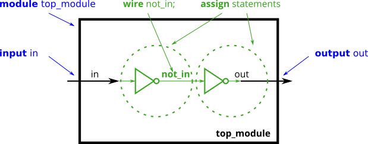
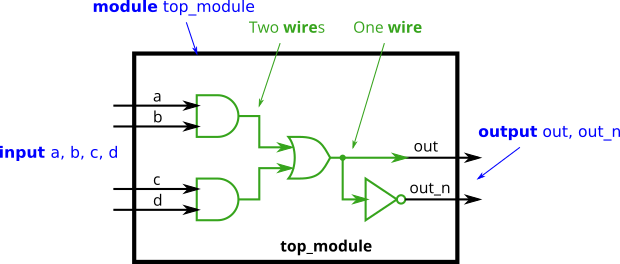
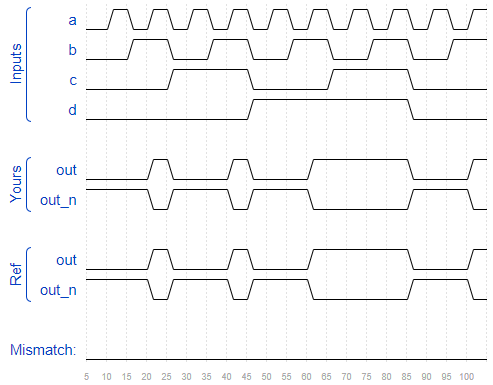

## Wire

Verilog 中的 `wire` 是单向的（与实际电路不同），从 driver 到 sink。可以用continuous assignment来赋值：

```verilog
assign left_side = right_side;
```

模块的端口也有方向，`input` 或 `output`。


### 问题3

- 题目：Create a module with one input and one output that behaves like a wire.

```verilog
module top_module( input in, output out );
    
    assign out = in;

endmodule
```

## Wire4

`assign` 语句是并行的，其出现顺序无关紧要。

除非特别声明，`input` 和 `output` 默认都是 `wire`. 即 `input wire a` 与 `input a` 一样。

### 问题4

- 题目：Create a module with 3 inputs and 4 outputs that behaves like wires that makes these connections:

  

```verilog
module top_module( 
    input a,b,c,
    output w,x,y,z );
    
    assign w = a;
    assign x = b;
    assign y = b;
    assign z = c;

endmodule
```



## NOT gate

### 问题5

- 题目：Use an assign statement. The assign statement will continuously drive the inverse of in onto wire out.
- 提示：Verilog has separate bitwise-NOT (`~`) and logical-NOT (`!`) operators, like C. Since we're working with a one-bit here, it doesn't matter which we choose.


```verilog
module top_module( input in, output out );

    assign out = ~in;
    // assign out = !in;

endmodule
```



## AND gate

### 问题6

- 题目：Write an assign statement that drives out with the AND of signals a and b.
  
  

- 提示：Verilog has separate bitwise-AND (`&`) and logical-AND (`&&`) operators, like C. Since we're working with a one-bit here, it doesn't matter which we choose.

```verilog
module top_module( 
    input a, 
    input b, 
    output out );

    assign out = a&b;

endmodule
```



## NOR gate

### 问题7

- 题目：Create a module that implements a NOR gate. A NOR gate is an OR gate with its output inverted.

  

- 提示：Verilog has separate bitwise-OR (`|`) and logical-OR (`||`) operators, like C. Since we're working with a one-bit here, it doesn't matter which we choose.

```verilog
module top_module( 
    input a, 
    input b, 
    output out );
    
    assign out = ~(a|b);

endmodule
```



## XNOR gate

### 问题8

- 题目：Create a module that implements an XNOR gate.

  

- 提示：The bitwise-XOR operator is `^`. **There is no logical-XOR operator**.

```verilog
module top_module( 
    input a, 
    input b, 
    output out );
    
    assign out = ~(a^b);

endmodule
```



## Declaring wires

下面示范了如何在模块内部定义wire：



```verilog
module top_module (
    input in,              // Declare an input wire named "in"
    output out             // Declare an output wire named "out"
);

    wire not_in;           // Declare a wire named "not_in"

    assign out = ~not_in;  // Assign a value to out (create a NOT gate).
    assign not_in = ~in;   // Assign a value to not_in (create another NOT gate).

endmodule   // End of module "top_module"
```

### 问题9

- 题目：

  

```verilog
`default_nettype none
module top_module(
    input a,
    input b,
    input c,
    input d,
    output out,
    output out_n   ); 
    
    wire xor_in1, xor_in2;
    
    assign xor_in1 = a&&b;
    assign xor_in2 = c&&d;
    assign out = xor_in1|xor_in2;
    assign out_n = !out;

endmodule
```



## 问题10

- 题目：Create a module with the same functionality as the 7458 chip.


```verilog
module top_module ( 
    input p1a, p1b, p1c, p1d, p1e, p1f,
    output p1y,
    input p2a, p2b, p2c, p2d,
    output p2y );

    assign p1y = (p1a&p1b&p1c)|(p1f&p1e&p1d);
    assign p2y = (p2a&p2b)|(p2c&p2d);

endmodule
```


