## Module

多个小模块可以组合成更大的模块。比如假设有如下一个模块：

```verilog
module mod_a ( input in1, input in2, output out );
    // Module body
endmodule
```

可以通过将信号连接到模块端口的名字或位置，来使用模块：

- 通过模块端口的位置（即定义时的位置）
  
  ```verilog
  mod_a instance1 ( wa, wb, wc );
  ```

- 通过模块端口的名称

  ```verilog
  mod_a instance2 ( .out(wc), .in1(wa), .in2(wb) );
  ```

如果有端口需要悬空，则直接不写外部的连线即可，如`mod_a instance1 ( wa, , wc );` 或 `mod_a instance2 ( .out(wc), .in1(wa), .in2( ) );`

### 问题20

- 题目：

  

```verilog
module top_module ( input a, input b, output out );

    mod_a instance1(a,b,out);
    // mod_a instance2 (.in1(a), .in2(b), .out(out));
    
endmodule
```

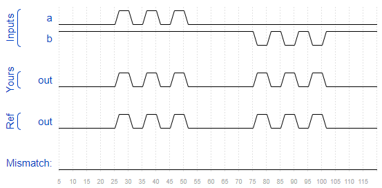

### 问题21

- 题目：You are given the following module:

  ```verilog
  module mod_a ( output, output, input, input, input, input );
  ```

  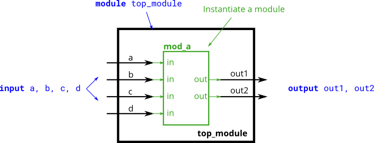

```verilog
module top_module ( 
    input a, 
    input b, 
    input c,
    input d,
    output out1,
    output out2
);

    mod_a instance1(out1,out2,a,b,c,d);

endmodule
```

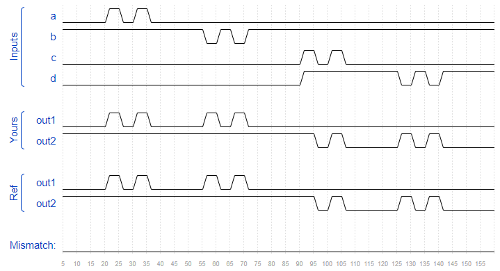


### 问题22

- 题目：

  

```verilog
module top_module ( 
    input a, 
    input b, 
    input c,
    input d,
    output out1,
    output out2
);
    
    mod_a instance1(.in1(a), .in2(b), .in3(c), .in4(d), .out1(out1), .out2(out2));

endmodule
```

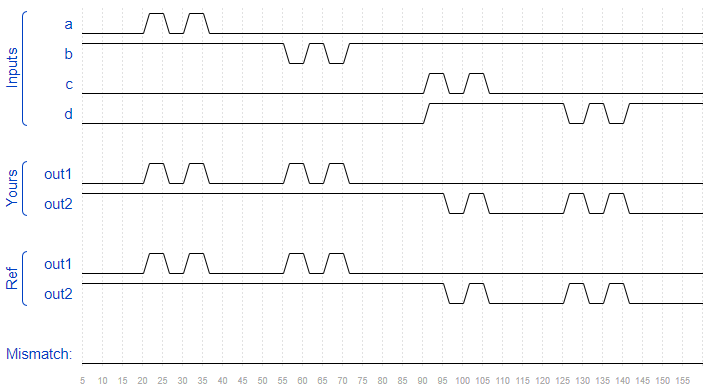

### 问题23

- 题目：You are given a module my_dff with two inputs and one output (that implements a D flip-flop). Instantiate three of them, then chain them together to make a shift register of length 3. The clk port needs to be connected to all instances.

  The module provided to you is: `module my_dff ( input clk, input d, output q );`

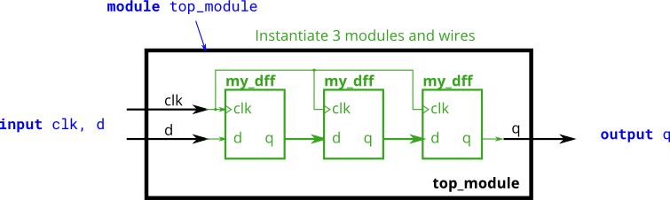

```verilog
module top_module ( input clk, input d, output q );
    
    wire q1,q2;
    my_dff instance1(clk, d, q1);
    my_dff instance2(clk, q1, q2);
    my_dff instance3(clk, q2, q);

endmodule
```

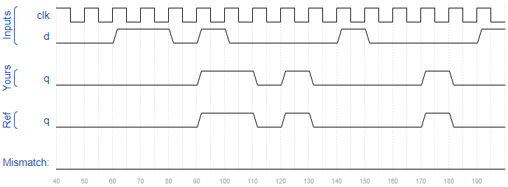

### 问题24

- 题目：

  

```verilog
module top_module ( 
    input clk, 
    input [7:0] d, 
    input [1:0] sel, 
    output [7:0] q 
);
    
    wire [7:0] q1,q2,q3;
    my_dff8 dff1(.clk(clk), .d(d), .q(q1));
    my_dff8 dff2(.clk(clk), .d(q1), .q(q2));
    my_dff8 dff3(.clk(clk), .d(q2), .q(q3));
    
    always @(*) begin
        case(sel)
            0: q = d;
            1: q = q1;
            2: q = q2;
            3: q = q3;
        endcase
    end

endmodule
```

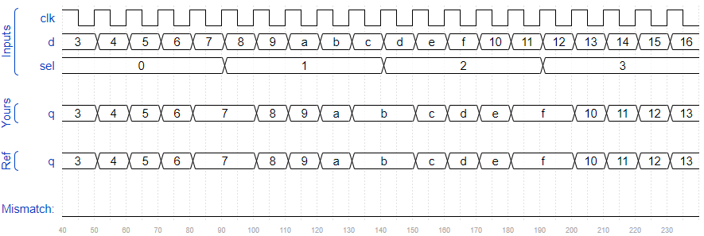

### 问题25

- 题目：

  

```verilog
module top_module(
    input [31:0] a,
    input [31:0] b,
    output [31:0] sum
);
    wire carry;
    add16 low(a[15:0], b[15:0], 1'b0, sum[15:0], carry);
    add16 high(a[31:16], b[31:16], carry, sum[31:16],); //悬空

endmodule
```

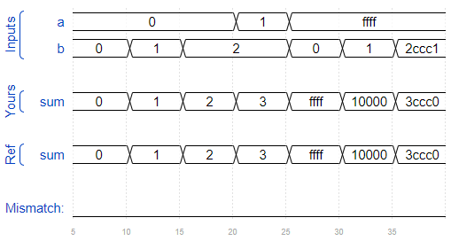

### 问题26

- 题目：there are three modules in this design:

  - top_module — Your top-level module that contains two of...
  - add16, provided — A 16-bit adder module that is composed of 16 of...
  - add1 — A 1-bit full adder module.

  

- 提示：Full adder equations: `sum = a ^ b ^ cin` and `cout = a&b | a&cin | b&cin`

```verilog
module top_module (
    input [31:0] a,
    input [31:0] b,
    output [31:0] sum
);//
    wire carry;
    add16 low(a[15:0], b[15:0], 1'b0, sum[15:0], carry);
    add16 high(a[31:16], b[31:16], carry, sum[31:16],);

endmodule

module add1 ( input a, input b, input cin,   output sum, output cout );

// Full adder module here
    assign {cout, sum} = a+b+cin;
    
endmodule
```

### 问题28

- 题目：并行加法器

  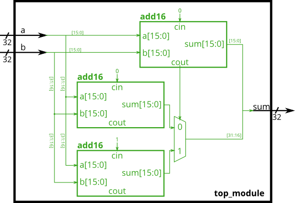

```verilog
module top_module(
    input [31:0] a,
    input [31:0] b,
    output [31:0] sum
);
    
    wire sel;
    wire [15:0] high0_out, high1_out;
    add16 low(a[15:0], b[15:0], 0, sum[15:0], sel);
    add16 high0(a[31:16], b[31:16], 0, high0_out, );
    add16 high1(a[31:16], b[31:16], 1, high1_out, );
    
    always @(*) begin
        case (sel)
            1'b0: sum[31:16] = high0_out;
            1'b1: sum[31:16] = high1_out;
        endcase
    end
    

endmodule
```

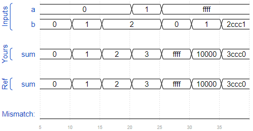

### 问题29

- 题目：
  
  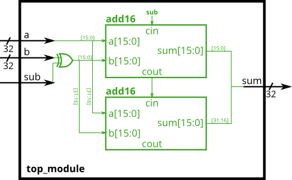

```verilog
module top_module(
    input [31:0] a,
    input [31:0] b,
    input sub,
    output [31:0] sum
);
    
    wire cout_low;
    wire [31:0] out_xor;
    
    assign out_xor = b^{32{sub}};
    add16 low(a[15:0], out_xor[15:0], sub, sum[15:0], cout_low);
    add16 high(a[31:16], out_xor[31:16], cout_low, sum[31:16], );
    

endmodule
```

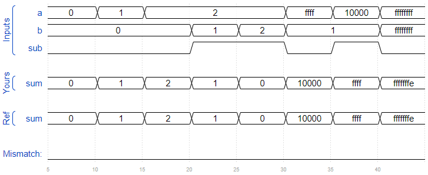