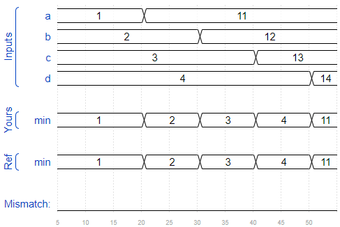

## Conditional Ternary Operator

Verilog 有 C 一样的三元运算符 `?:`

```verilog
(0 ? 3 : 5)     // This is 5 because the condition is false.
(sel ? b : a)   // A 2-to-1 multiplexer between a and b selected by sel.

always @(posedge clk)         // A T-flip-flop.
  q <= toggle ? ~q : q;

always @(*)                   // State transition logic for a one-input FSM
  case (state)
    A: next = w ? B : A;
    B: next = w ? A : B;
  endcase

assign out = ena ? q : 1'bz;  // A tri-state buffer

((sel[1:0] == 2'h0) ? a :     // A 3-to-1 mux
 (sel[1:0] == 2'h1) ? b :
                      c )
```

### 问题38

- 题目：Given four unsigned numbers, find the minimum. Unsigned numbers can be compared with standard comparison operators (a < b). Use the conditional operator to make two-way min circuits, then compose a few of them to create a 4-way min circuit.

```verilog
module top_module (
    input [7:0] a, b, c, d,
    output [7:0] min);//

    // assign intermediate_result1 = compare? true: false;
    wire [7:0] min1_output, min2_output;
    min_2 min1(a,b,min1_output);
    min_2 min2(c,d,min2_output);
    min_2 min3(min1_output, min2_output, min);

endmodule


module min_2(
    input [7:0] a,b,
    output [7:0] min
);
    assign min = a<b ? a : b;
    
endmodule
```



## Reduction Operators

Reduction Operators 可以对一个向量的所有位都进行操作，比如：

```verilog
& a[3:0]     // AND: a[3]&a[2]&a[1]&a[0]. Equivalent to (a[3:0] == 4'hf)
| b[3:0]     // OR:  b[3]|b[2]|b[1]|b[0]. Equivalent to (b[3:0] != 4'h0)
^ c[2:0]     // XOR: c[2]^c[1]^c[0]
```

### 问题39

- 题目：Parity checking is often used as a simple method of detecting errors when transmitting data through an imperfect channel. Create a circuit that will compute a parity bit for a 8-bit byte (which will add a 9th bit to the byte). We will use "even" parity, where the parity bit is just the XOR of all 8 data bits.（偶校验）

```verilog
module top_module (
    input [7:0] in,
    output parity); 
    
    assign parity = ^in;

endmodule
```

### 问题40

- 题目：Build a combinational circuit with 100 inputs, in[99:0].

  There are 3 outputs:

  - out_and: output of a 100-input AND gate.
  - out_or: output of a 100-input OR gate.
  - out_xor: output of a 100-input XOR gate.

```verilog
module top_module( 
    input [99:0] in,
    output out_and,
    output out_or,
    output out_xor 
);
    assign out_and = &in;
    assign out_or = |in;
    assign out_xor = ^in;

endmodule
```

