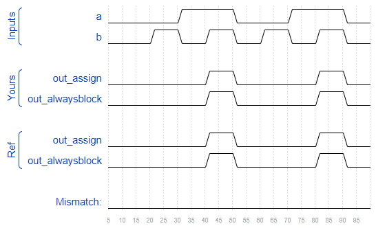
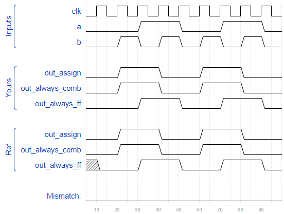
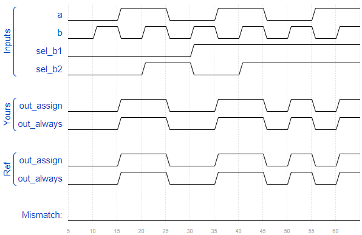
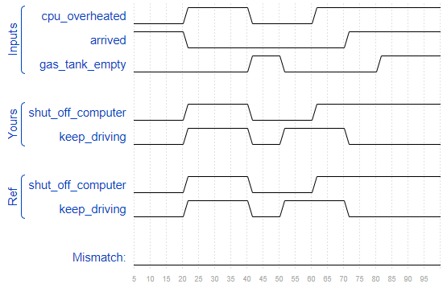
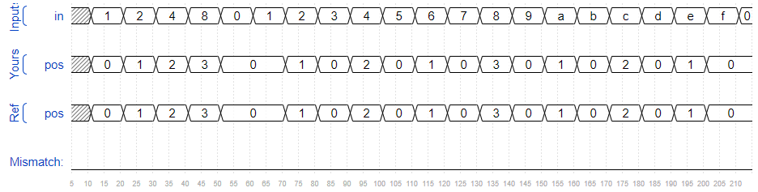
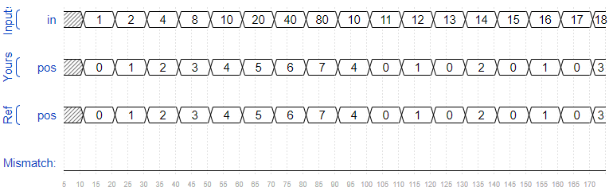
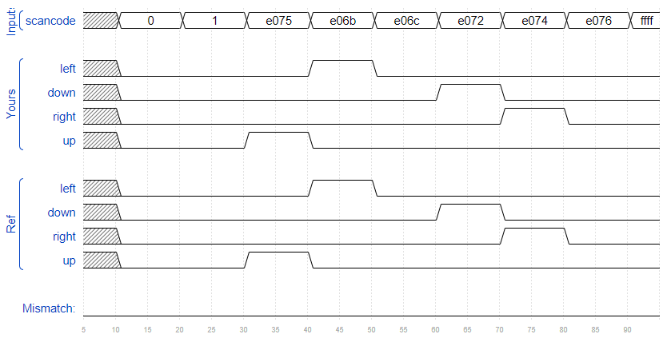
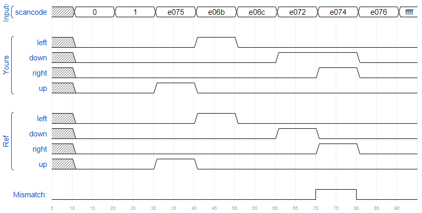

## Always Blocks(Combinational)

For synthesizing hardware, two types of always blocks are relevant:

- `Combinational: always @(*)`
- `Clocked: always @(posedge clk)`

Combinational always blocks are equivalent to assign statements, 哪个方便用哪个。但是， procedural block 里面的语句有一些不同。Procedural blocks 可以用 `if-then`、`case` 等语句，但不能包含连续赋值（Procedural continuous assignments 无法综合）。

比如，下面两个会生成同样的组合逻辑：

- `assign out1 = a & b | c ^ d;`
- `always @(*) out2 = a & b | c ^ d;`

combinational always的敏感表是 `(*)`，表示在always内部所有出现的信号。我们也可以手动列信号，但一旦漏了信号，那么：the synthesized hardware will still behave as though (*) was specified, but the simulation will not and not match the hardware's behaviour.

注意：`assign` 等号的左边必须是一个 net type(e.g., wire)，而 procedural assignment 的等号的左边必须是 variable type(e.g., reg).

### 问题30

- 题目：分别用组合逻辑与时序逻辑实现一个与门：

```verilog
// synthesis verilog_input_version verilog_2001
module top_module(
    input a, 
    input b,
    output wire out_assign,
    output reg out_alwaysblock
);
    assign out_assign = a&b;
    
    always @(*) out_alwaysblock = a&b;

endmodule
```



## Always Blocks(clocked)

For hardware synthesis, there are two types of always blocks that are relevant:

- Combinational: `always @(*)`
- Clocked: `always @(posedge clk)`

### Blocking vs. Non-Blocking Assignment

There are three types of assignments in Verilog:

- Continuous assignments (`assign x = y;`). Can only be used when not inside a procedure ("always block").
- Procedural blocking assignment: (`x = y;`). Can only be used inside a procedure.
- Procedural non-blocking assignment: (`x <= y;`). Can only be used inside a procedure.

In a combinational always block, use blocking assignments. In a clocked always block, use non-blocking assignments.

### 问题31

- 题目：用三种赋值方法实现 xor

```verilog
// synthesis verilog_input_version verilog_2001
module top_module(
    input clk,
    input a,
    input b,
    output wire out_assign,
    output reg out_always_comb,
    output reg out_always_ff   );
    
    assign out_assign = a^b;
    
    always @(*) out_always_comb = a^b;
    
    always @(posedge clk) out_always_ff <= a^b;

endmodule
```



## If Statement

if statement 可以用来弄2-1选择器：


```verilog
Always if mux.png
always @(*) begin
    if (condition) begin
        out = x;
    end
    else begin
        out = y;
    end
end
```

等价于：

```verilog
assign out = (condition) ? x : y;
```

However, the procedural if statement provides a new way to make mistakes. **The circuit is combinational only if out is always assigned a value.**

### 问题32

- 题目：Build a 2-to-1 mux that chooses between a and b. Choose b if both sel_b1 and sel_b2 are true. Otherwise, choose a. Do the same twice, once using assign statements and once using a procedural if statement.

|sel_b1|sel_b2|out|
|-----|----|----|
|0|0|a|
|0|1|a|
|1|0|a|
|1|1|b|

```verilog
// synthesis verilog_input_version verilog_2001
module top_module(
    input a,
    input b,
    input sel_b1,
    input sel_b2,
    output wire out_assign,
    output reg out_always   ); 
    
    //assign out_assign = a&~(sel_b1&sel_b2) | b&(sel_b1&sel_b2);
    assign out_assign = (sel_b1&sel_b2) ? b : a;
    
    always @(*) begin
        if (sel_b1 & sel_b2)
            out_always = b;
        else
            out_always = a;
    end

endmodule
```



## If Statement Latches

### A common source of errors: How to avoid making latches

如果没有指定某些情况，那么 Verilog 就会认为在这些情况下，输出不变。而这就会引入 Latch. 注意编译时的 Warning (10240): ... inferring latch(es)" messages. 除非你需要那个latch，否则这意味着存在一个bug. Combinational circuits must have a value assigned to all outputs under all conditions. This usually means you always need else clauses or a default value assigned to the outputs.

### Demonstration (问题33)

- 题目：The following code contains incorrect behaviour that creates a latch. Fix the bugs so that you will shut off the computer only if it's really overheated, and stop driving if you've arrived at your destination or you need to refuel.

```verilog
always @(*) begin
    if (cpu_overheated)
        shut_off_computer = 1;
end

always @(*) begin
    if (~arrived)
        keep_driving = ~gas_tank_empty;
end
```

```verilog
// synthesis verilog_input_version verilog_2001
module top_module (
    input      cpu_overheated,
    output reg shut_off_computer,
    input      arrived,
    input      gas_tank_empty,
    output reg keep_driving  ); //

    always @(*) begin
        if (cpu_overheated)
            shut_off_computer = 1;
        else
            shut_off_computer = 0;
    end

    always @(*) begin
        if (~arrived)
            keep_driving = ~gas_tank_empty;
        else
            keep_driving = 0;
    end

endmodule
```



## Case Statement

Case statements in Verilog are nearly equivalent to a sequence of if-elseif-else that compares one expression to a list of others.

```verilog
always @(*) begin     // This is a combinational circuit
    case (in)
      1'b1: begin 
               out = 1'b1;  // begin-end if >1 statement
            end
      1'b0: out = 1'b0;
      default: out = 1'bx;
    endcase
end
```

- Each case item can execute exactly one statement. This makes the "break" used in C unnecessary. But this means that if you need more than one statement, you must use `begin ... end`.
- Duplicate (and partially overlapping) case items are permitted. The first one that matches is used. C does not allow duplicate case items.

### 问题34

- 题目：Case statements are more convenient than if statements if there are a large number of cases. So, in this exercise, create a 6-to-1 multiplexer. When sel is between 0 and 5, choose the corresponding data input. Otherwise, output 0. The data inputs and outputs are all 4 bits wide.
- 提示：Be careful of inferring latches

```verilog
// synthesis verilog_input_version verilog_2001
module top_module ( 
    input [2:0] sel, 
    input [3:0] data0,
    input [3:0] data1,
    input [3:0] data2,
    input [3:0] data3,
    input [3:0] data4,
    input [3:0] data5,
    output reg [3:0] out   );//

    always@(*) begin  // This is a combinational circuit
        case(sel)
            0: out = data0;
            1: out = data1;
            2: out = data2;
            3: out = data3;
            4: out = data4;
            5: out = data5;
            default: out = 0;
        endcase
    end

endmodule
```

## Priority Encoder（问题35）

- 题目：A priority encoder is a combinational circuit that, when given an input bit vector, outputs the position of the first 1 bit in the vector. For example, a 8-bit priority encoder given the input 8'b10010000 would output 3'd4, because bit[4] is first bit that is high.
  
  Build a 4-bit priority encoder. For this problem, if none of the input bits are high (i.e., input is zero), output zero. Note that a 4-bit number has 16 possible combinations.

```verilog
// synthesis verilog_input_version verilog_2001
module top_module (
    input [3:0] in,
    output reg [1:0] pos  );
    
    always @(*) begin
        case(in)
            4'b0001: pos = 0;
            4'b0010: pos = 1;
            4'b0110: pos = 1;
            4'b1010: pos = 1;
            4'b1110: pos = 1;
            4'b0100: pos = 2;
            4'b1100: pos = 2;
            4'b1000: pos = 3;
            default: pos = 0;
        endcase
    end

endmodule
```



### Priority encoder with casez（问题36）

可以利用 `casez` 来简化 priority encode. `casez` 会把 `z` 当作无关紧要的值，比如：

```verilog
always @(*) begin
    casez (in[3:0])
        4'bzzz1: out = 0;   // in[3:1] can be anything
        4'bzz1z: out = 1;
        4'bz1zz: out = 2;
        4'b1zzz: out = 3;
        default: out = 0;
    endcase
end
```

case statement 会逐个检查每一项，会选择第一个匹配的项。

另外还有一个 `casex` 会把 `x` 和 `z` 都看作无关紧要的。另外，`?` is a synonym for `z`.

- 题目：Build a priority encoder for 8-bit inputs. Given an 8-bit vector, the output should report the first (least significant) bit in the vector that is 1. Report zero if the input vector has no bits that are high. For example, the input 8'b10010000 should output 3'd4, because bit[4] is first bit that is high.

```verilog
// synthesis verilog_input_version verilog_2001
module top_module (
    input [7:0] in,
    output reg [2:0] pos );
    
    always @(*) begin
        casex(in)
            8'bxxxxxxx1: pos = 3'd0;
            8'bxxxxxx1x: pos = 3'd1;
            8'bxxxxx1xx: pos = 3'd2;
            8'bxxxx1xxx: pos = 3'd3;
            8'bxxx1xxxx: pos = 3'd4;
            8'bxx1xxxxx: pos = 3'd5;
            8'bx1xxxxx0: pos = 3'd6;
            8'b1xxxxxx0: pos = 3'd7;
            default: pos = 3'd0;
        endcase
    end

endmodule
```



## Avoiding Latches（问题37）

假设要扫描键盘的输入（假设只需要扫描上下左右4个键），如下：

|Scancode [15:0]|Arrow key|
|-------------|---------|
|16'he06b|left arrow|
|16'he072|down arrow|
|16'he074|right arrow|
|16'he075|up arrow|
|Anything else|none|

To avoid creating latches, all outputs must be assigned a value in all possible conditions. Simply having a default case is not enough. You must assign a value to all four outputs in all four cases and the default case.This can involve a lot of unnecessary typing. One easy way around this is to assign a "default value" to the outputs before the case statement:

```verilog
always @(*) begin
    up = 1'b0; down = 1'b0; left = 1'b0; right = 1'b0;
    case (scancode)
        ... // Set to 1 as necessary.
    endcase
end
```

This style of code ensures the outputs are assigned a value (of 0) in all possible cases unless the case statement overrides the assignment. This also means that a default: case item becomes unnecessary.

**Reminder**: The logic synthesizer generates a combinational circuit that behaves equivalently to what the code describes. Hardware does not "execute" the lines of code in sequence.

```verilog
// synthesis verilog_input_version verilog_2001
module top_module (
    input [15:0] scancode,
    output reg left,
    output reg down,
    output reg right,
    output reg up  );
    
    always @(*) begin
        up = 1'b0; down = 1'b0; left = 1'b0; right = 1'b0;
        case(scancode)
            16'he06b: left = 1'b1;
            16'he072: down = 1'b1;
            16'he074: right = 1'b1;
            16'he075: up = 1'b1;
        endcase
    end

endmodule
```



下面是错误示范。

```verilog
// synthesis verilog_input_version verilog_2001
module top_module (
    input [15:0] scancode,
    output reg left,
    output reg down,
    output reg right,
    output reg up  );
    
    always @(*) begin
        case(scancode)
            16'he06b: left = 1'b1;
            16'he072: down = 1'b1;
            16'he074: right = 1'b1;
            16'he075: up = 1'b1;
            default: begin
                up = 1'b0; down = 1'b0; left = 1'b0; right = 1'b0;
            end
        endcase
    end

endmodule
```




