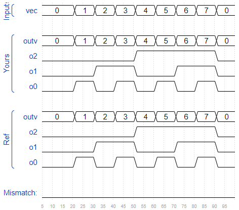
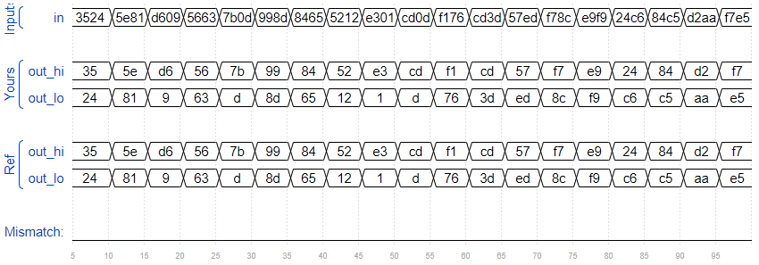
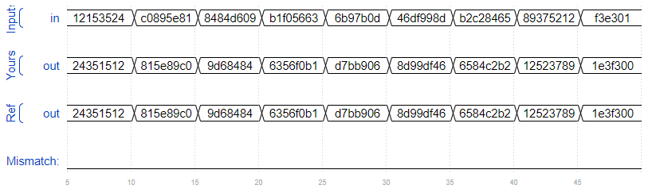
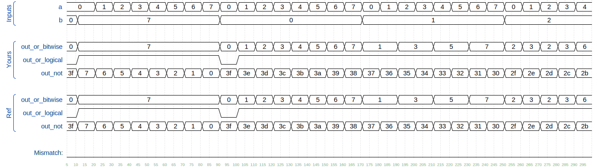
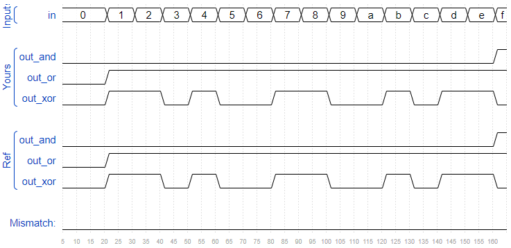
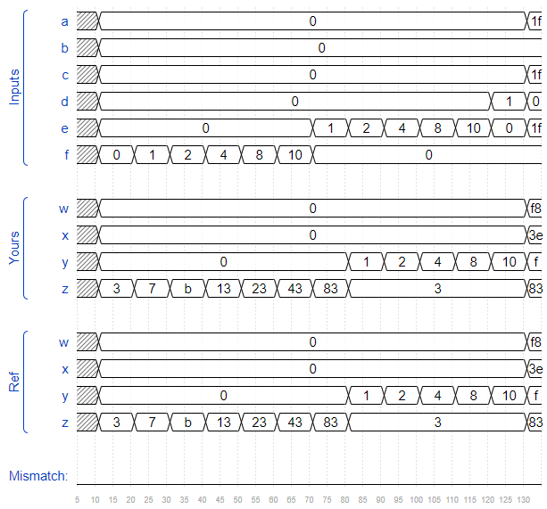
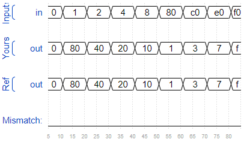

## Vertor0

向量是一组信号的集合，比如 `wire [7:0] w;` 定义了一个 8-bit 向量。注意向量的位数放在变量名前面（与 C 语言不同），但选择某一位时则与 C 语言一样都是放在变量后面。

示例：

```verilog
wire [99:0] my_vector;      // Declare a 100-element vector
assign out = my_vector[10]; // Part-select one bit out of the vector
```

### 问题11

- 题目：Build a circuit that has one 3-bit input, then outputs the same vector, and also splits it into three separate 1-bit outputs. Connect output o0 to the input vector's position 0, o1 to position 1, etc.
  
  图中，线上一撇表示那是一个向量，旁边的数字是位数。


```verilog
module top_module ( 
    input wire [2:0] vec,
    output wire [2:0] outv,
    output wire o2,
    output wire o1,
    output wire o0  ); // Module body starts after module declaration
    
    assign outv = vec;
    assign o0 = vec[0];
    assign o1 = vec[1];
    assign o2 = vec[2];

endmodule
```




## Vector1

### Declaring Vectors

向量必须先被定义：

```verilog
type [upper:lower] vector_name;
```

type 是向量的类型，可以是 `wire` 或 `reg`，如果是端口，则类型可以是 `input` 或 `output`. 示例：

```verilog
wire [7:0] w;         // 8-bit wire
reg  [4:1] x;         // 4-bit reg
output reg [0:0] y;   // 1-bit reg that is also an output port (this is still a vector)
input wire [3:-2] z;  // 6-bit wire input (negative ranges are allowed)
output [3:0] a;       // 4-bit output wire. Type is 'wire' unless specified otherwise.
wire [0:7] b;         // 8-bit wire where b[0] is the most-significant bit.
```

注意向量的字节顺序，可以是 little-endian, e.g., [3:0] 或 big-endian, e.g., [0:3]. 但一旦定义为特定顺序后，使用时顺序就必须相同。

### Implicit nets

Implicit nets 是一类很难发现的 bug. 在给未定义的变量赋值时、把未定义变量用于modele port时，就会产生 implicit nets. Implicit nets 始终是 1bit wire，不能给向量赋值。通过在开头加入 `` `default_nettype none directive `` 来禁止 生成 implicit net.

```verilog
wire [2:0] a, c;   // Two vectors
assign a = 3'b101;  // a = 101
assign b = a;       // b =   1  implicitly-created wire
assign c = b;       // c = 001  <-- bug
my_module i1 (d,e); // d and e are implicitly one-bit wide if not declared.
                    // This could be a bug if the port was intended to be a vector.
```

加入 `` `default_nettype none directive `` 后，就会使得 `assign b = a` 出错，使得 bug 更容易找。

### Unpacked vs. Packed Arrays

You may have noticed that in declarations, the vector indices are written before the vector name. This declares the "packed" dimensions of the array, where the bits are "packed" together into a blob (this is relevant in a simulator, but not in hardware). The unpacked dimensions are declared after the name. They are generally used to declare memory arrays.

```verilog
reg [7:0] mem [255:0];   // 256 unpacked elements, each of which is a 8-bit packed vector of reg.
reg mem2 [28:0];         // 29 unpacked elements, each of which is a 1-bit reg.
```

### Accessing Vector Elements: Part-Select

以下向量的定义在最上方。

```verilog
w[3:0]      // Only the lower 4 bits of w
x[1]        // The lowest bit of x
x[1:1]      // ...also the lowest bit of x
z[-1:-2]    // Two lowest bits of z
b[3:0]      // Illegal. Vector part-select must match the direction of the declaration.
b[0:3]      // The *upper* 4 bits of b.
assign w[3:0] = b[0:3];    // Assign upper 4 bits of b to lower 4 bits of w. w[3]=b[0], w[2]=b[1], etc.
```

### 问题12

- 题目：Build a combinational circuit that splits an input half-word (16 bits, [15:0] ) into lower [7:0] and upper [15:8] bytes.

```verilog
`default_nettype none     // Disable implicit nets. Reduces some types of bugs.
module top_module( 
    input wire [15:0] in,
    output wire [7:0] out_hi,
    output wire [7:0] out_lo );
    
    assign out_hi = in[15:15-7];
    assign out_lo = in[0+7:0];

endmodule
```



## Vector2

### 问题13

- 题目：A 32-bit vector can be viewed as containing 4 bytes (bits [31:24], [23:16], etc.). Build a circuit that will reverse the byte ordering of the 4-byte word.

AaaaaaaaBbbbbbbbCcccccccDddddddd => DdddddddCcccccccBbbbbbbbAaaaaaaa

This operation is often used when the endianness of a piece of data needs to be swapped, for example between little-endian x86 systems and the big-endian formats used in many Internet protocols.

```verilog
module top_module( 
    input [31:0] in,
    output [31:0] out );//

    // assign out[31:24] = ...;
    assign out[1*8-1:0*8] = in[4*8-1:3*8];
    assign out[2*8-1:1*8] = in[3*8-1:2*8];
    assign out[3*8-1:2*8] = in[2*8-1:1*8];
    assign out[4*8-1:3*8] = in[1*8-1:0*8];

endmodule
```



## Vector Gates

### 问题14

- 题目：Build a circuit that has two 3-bit inputs that computes the bitwise-OR of the two vectors, the logical-OR of the two vectors, and the inverse (NOT) of both vectors. Place the inverse of b in the upper half of out_not (i.e., bits [5:3]), and the inverse of a in the lower half.
- 提示：
  - Even though you cannot assign to a wire more than once, you can use a part select on the left-hand-side of an assign. You don't need to assign to the entire vector all in one statement.
  - 注意 bitwise 和 logical 的区别。


```verilog
module top_module( 
    input [2:0] a,
    input [2:0] b,
    output [2:0] out_or_bitwise,
    output out_or_logical,
    output [5:0] out_not
);

    assign out_or_bitwise = a|b;
    assign out_or_logical = a||b;
    assign out_not[2:0] = ~a;
    assign out_not[5:3] = ~b;

endmodule
```



## Gates4

### 问题15

- 题目：Build a combinational circuit with four inputs, in[3:0].

There are 3 outputs:

- out_and: output of a 4-input AND gate.
- out_or: output of a 4-input OR gate.
- out_xor: output of a 4-input XOR gate.

```verilog
module top_module( 
    input [3:0] in,
    output out_and,
    output out_or,
    output out_xor
);
    
    assign out_and = in[0] & in[1] & in[2] & in[3];
    assign out_or = in[0] | in[1] | in[2] | in[3];
    assign out_xor = in[0] ^ in[1] ^ in[2] ^ in[3];

endmodule
```



## Vector3

拼接操作 `{a,b,c}` 用于把多个向量合并为一个大的向量。比如：

```verilog
{3'b111, 3'b000} => 6'b111000
{1'b1, 1'b0, 3'b101} => 5'b10101
{4'ha, 4'd10} => 8'b10101010     // 4'ha and 4'd10 are both 4'b1010 in binary
```

拼接操作可以在等号的两边都可以使用：

```verilog
input [15:0] in;
output [23:0] out;
assign {out[7:0], out[15:8]} = in;         // Swap two bytes. Right side and left side are both 16-bit vectors.
assign out[15:0] = {in[7:0], in[15:8]};    // This is the same thing.
assign out = {in[7:0], in[15:8]};       // This is different. The 16-bit vector on the right is extended to
                                        // match the 24-bit vector on the left, so out[23:16] are zero.
                                        // In the first two examples, out[23:16] are not assigned.
```


### 问题16

- 题目：Given several input vectors, concatenate them together then split them up into several output vectors. There are six 5-bit input vectors: a, b, c, d, e, and f, for a total of 30 bits of input. There are four 8-bit output vectors: w, x, y, and z, for 32 bits of output. The output should be a concatenation of the input vectors followed by two 1 bits:


```verilog
module top_module (
    input [4:0] a, b, c, d, e, f,
    output [7:0] w, x, y, z );//

    assign {w,x,y,z} = {a,b,c,d,e,f,2'b11};

endmodule
```



## Vector Reversal1

### 题目17

- 题目：Given an 8-bit input vector [7:0], reverse its bit ordering.

```verilog
module top_module( 
    input [7:0] in,
    output [7:0] out
);
    
    assign {out[0],out[1],out[2],out[3],out[4],out[5],out[6],out[7]} = in;

endmodule
```

利用 sequential code 的 for-loops:

```verilog
module top_module( 
    input [7:0] in,
    output [7:0] out
);
    
    always @(*) begin    
        for (int i=0; i<8; i++)    // int is a SystemVerilog type. Use integer for pure Verilog.
            out[i] = in[8-i-1];
    end

endmodule
```

利用 generate-for-loop（编译器在预处理阶段展开）：

```verilog
module top_module( 
    input [7:0] in,
    output [7:0] out
);

    generate
        genvar i;
        for (i=0; i<8; i = i+1) begin: my_block_name
            assign out[i] = in[8-i-1];
        end
    endgenerate

    end

endmodule
```



## Vector4

尽管拼接操作可以组合多个向量，但如果需要重复组合一个向量（比如 `a = {b,b,b,b,b};`），可以用重复操作来将一个向量重复多次，再进行拼接操作。重复的次数必须是一个常数。

```verilog
{5{1'b1}}           // 5'b11111 (or 5'd31 or 5'h1f)
{2{a,b,c}}          // The same as {a,b,c,a,b,c}
{3'd5, {2{3'd6}}}   // 9'b101_110_110. It's a concatenation of 101 with
                    // the second vector, which is two copies of 3'b110.
```

### 问题18

- 题目：One common place to see a replication operator is when sign-extending a smaller number to a larger one, while preserving its signed value. This is done by replicating the sign bit (the most significant bit) of the smaller number to the left. For example, sign-extending 4'b0101 (5) to 8 bits results in 8'b00000101 (5), while sign-extending 4'b1101 (-3) to 8 bits results in 8'b11111101 (-3).
  
  Build a circuit that sign-extends an 8-bit number to 32 bits. This requires a concatenation of 24 copies of the sign bit (i.e., replicate bit[7] 24 times) followed by the 8-bit number itself.

```verilog
module top_module (
    input [7:0] in,
    output [31:0] out );//

    assign out = {{24{in[7]}}, in};

endmodule
```

## Vector5

### 问题19

- 题目：Given five 1-bit signals (a, b, c, d, and e), compute all 25 pairwise one-bit comparisons in the 25-bit output vector. The output should be 1 if the two bits being compared are equal.


```verilog
module top_module (
    input a, b, c, d, e,
    output [24:0] out );//

    // The output is XNOR of two vectors created by 
    // concatenating and replicating the five inputs.
    // assign out = ~{ ... } ^ { ... };
    
    wire [24:0] xnor_in1;
    wire [24:0] xnor_in2;
    assign xnor_in1 = {{5{a}},{5{b}},{5{c}},{5{d}},{5{e}}};
    assign xnor_in2 = {{5{a,b,c,d,e}}};
    assign out = ~(xnor_in1^xnor_in2);

endmodule
```
