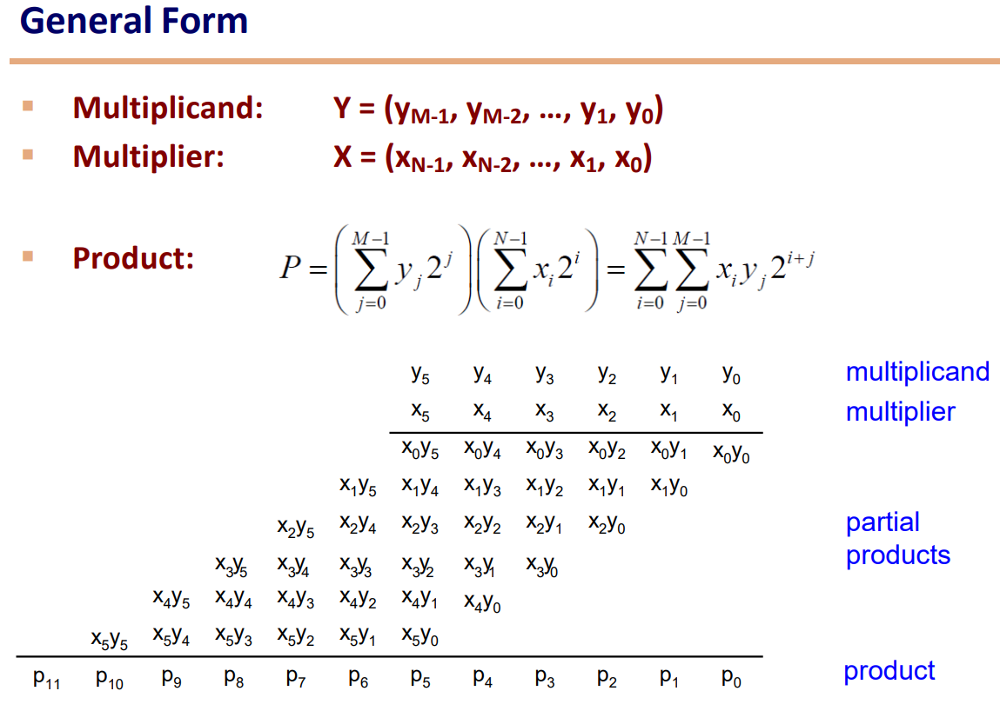
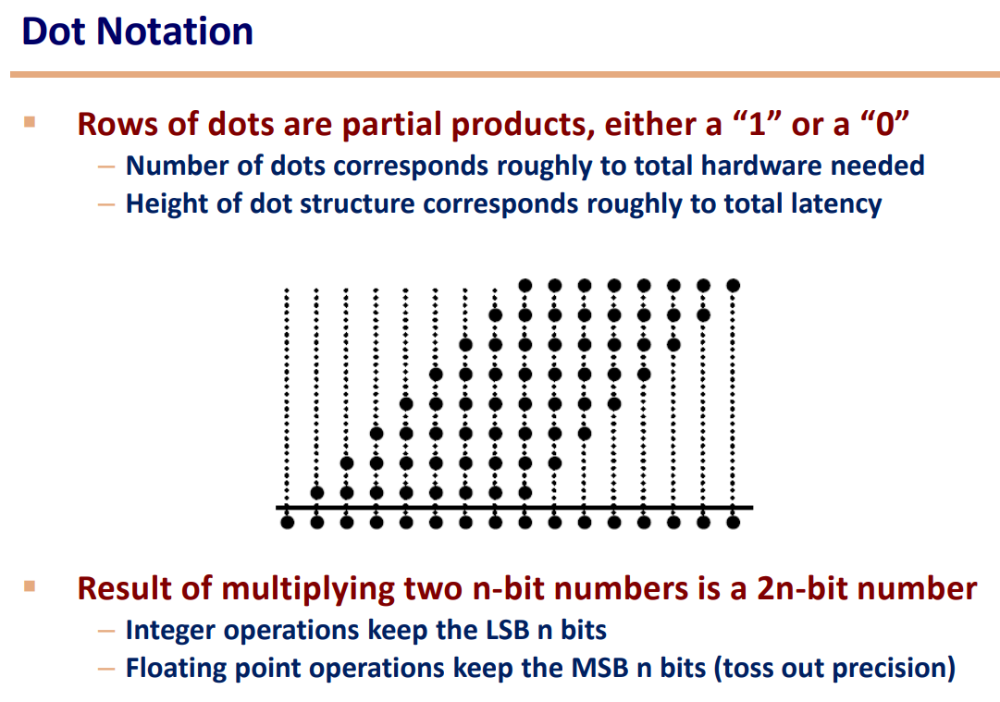
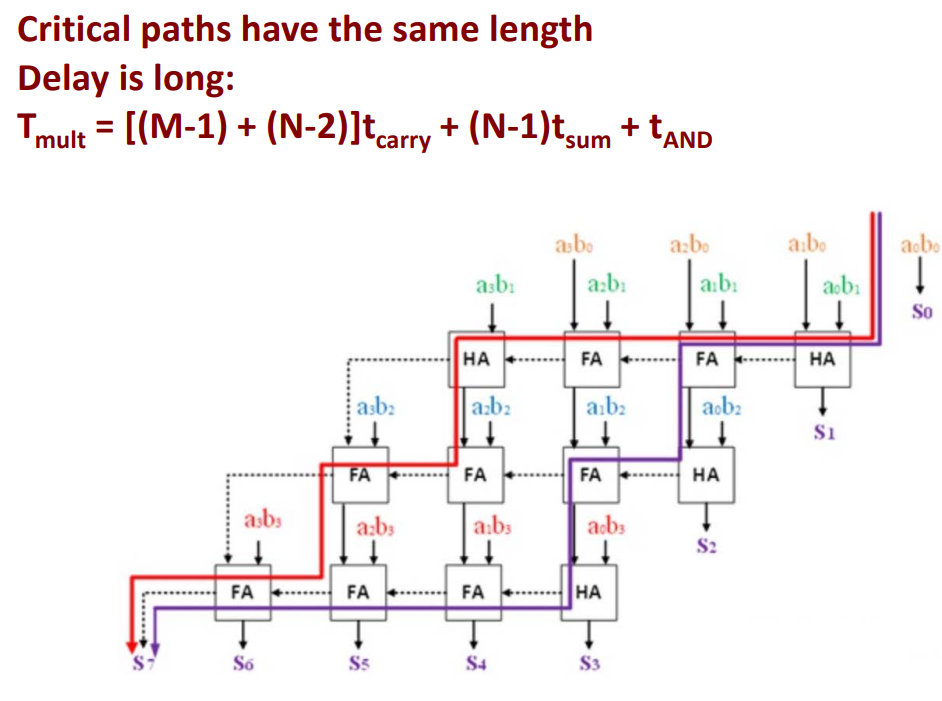
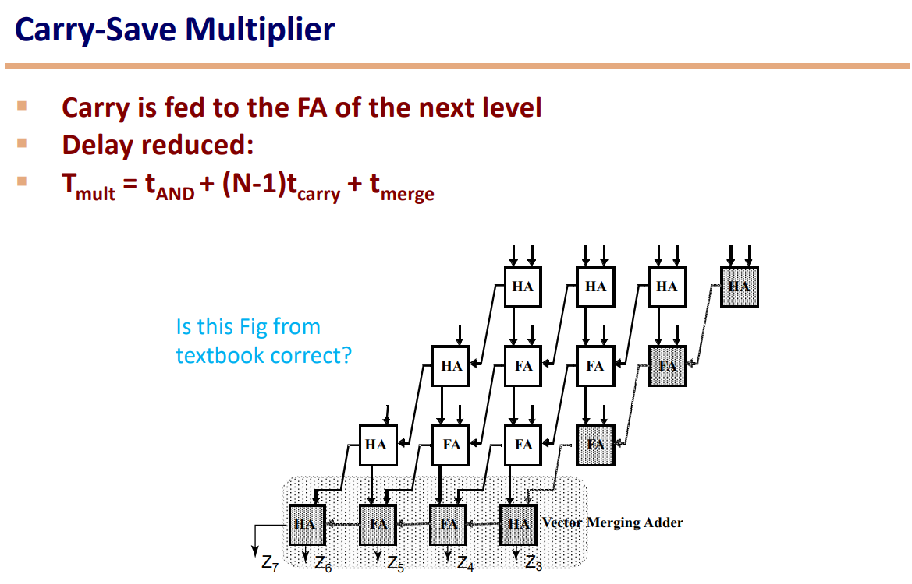
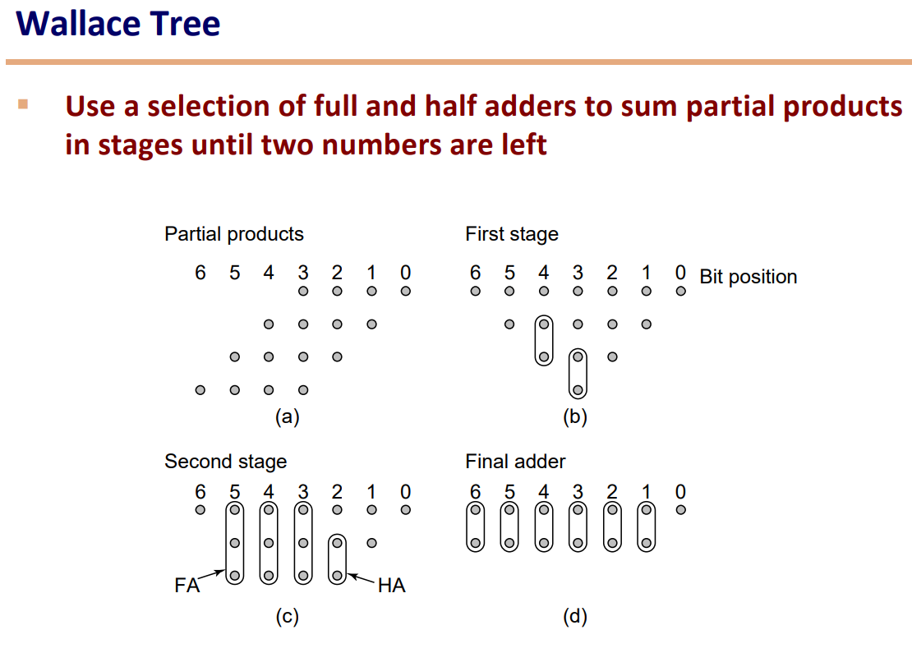
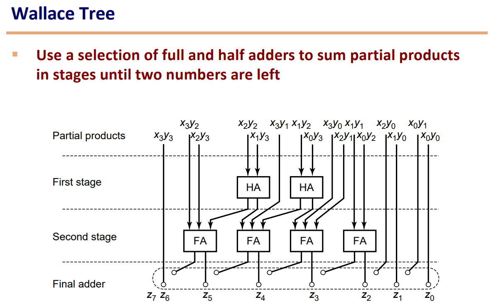
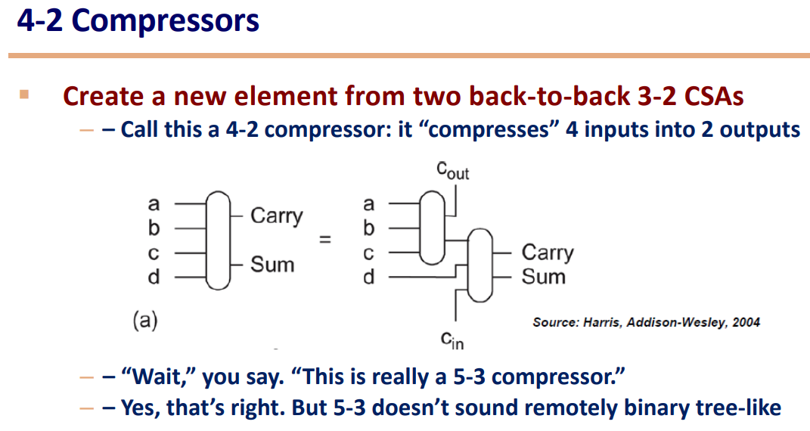
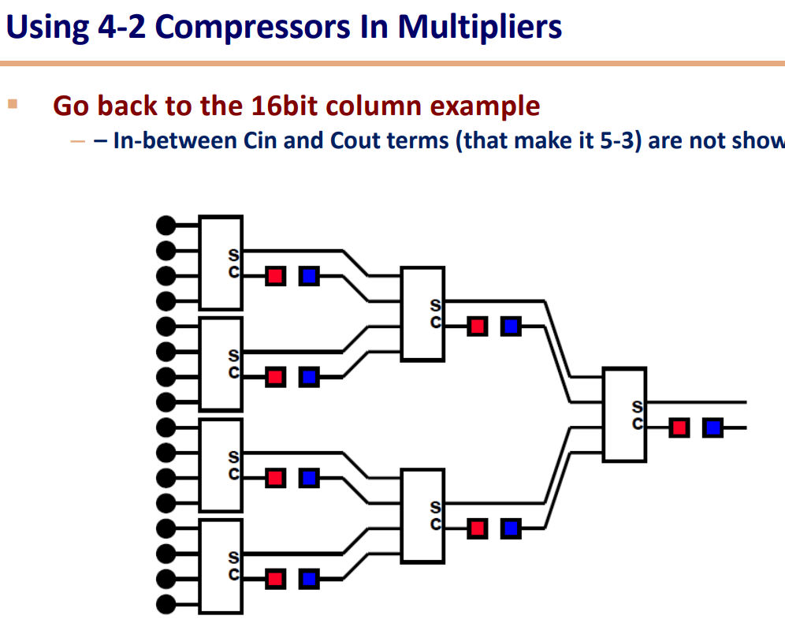
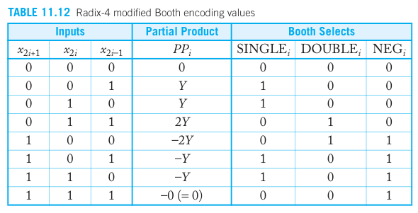

# 乘法器

## 简单乘法器

按照小学的写法，乘法首先是用下面那个数的每一位，去乘上面那个数，得到部分积（partial products）。然后把得到的结果相加。

为了简化，用“点”来表示：

- 点的数量即所需的门的数量
- 行数（或高度）就是延迟

每个点可以看作是一个 1bit乘以1bit 的乘法，可以用一个与门来表示，而点与点之间的连线则是加法器。因此总的延时为：

$$
T = [(M-1)+(N-2)]t_{carry}+(N-1)t_{sum}+t_{AND}
$$

- $M$ 是被乘数的位数（也就是上面那个数，即每行的宽度）
- $N$ 是乘数的位数（也就是行数）
- 箭头方向向左就是一个 $t_{carry}$
- 箭头方向向下就是一个 $t_{sum}$
- $t_{AND}$ 是最开始的相乘

可以看出，$t_{carry}$（进位）消耗了大量时间，因为每一级都要等上一级的 carry 算出来后才开始算。因此我们不妨改变一下 carry 的接法，把它接到下一级（P.S. 下图没有问题，只是没有把 $z_2,z_1,z_0$ 标出来而已）：

延迟为：

$$
T = t_{AND} + (N-1)t_{carry}+t_{merge}
$$

- $t_{merge}$ 是最下面的 Vector Merging Adder 的时间。
- 这里不考虑 $t_{sum}$ 是因为我们认为 $t_{sum}$ 和 $t_{carry}$ 是同时发生的，且 $t_{sum}\leq t_{carry}$。并且我们这里没有走向下的箭头。

但是上面还有一个问题，就是要做加法的次数太多了。假如我们要算 $A+B+C+D+E+F$对比下面两种做法：

1. 旧的方法
   - $S_1=A+B$
   - $S_2=S_1+C$
   - $S_3=S_2+D$
   - $S_4=S_3+E$
   - $S=S_4+F$
2. 更好的方法
   - 同时计算：$S_1=A+B$，$S_2=C+D$，$S_3=E+F$
   - $S=S_1+S_2+S_3$

显然，做法2 的高度（层数）更少，算起来也更快。这就是我们下面这种 Wallace Tree 的思想，先减少层数，再算。

当然，Wallace Tree 看起来很简洁，但是由于它是不规则的，所以走线会很困难。在此基础上，进一步改进，把两个 `FA` 结合成一个 `4-2 Compressors`

## Booth编码

上面的计算可以进一步改进：

- 如果是某一位是 0，那么这一位的乘积就是0，我们跳过这个加法
- 如果乘数是 0111，我们可以改为用 (100-001)相乘。后者只需要做两次乘法和一次加法

那么如何实现上面的算法呢？听起来需要复杂的逻辑判断是吧？非也，只需要改变编码就行，下面介绍 Booth 编码。

对于一个 $n$ 位的数：

$$
y=-2^{n-1}y_{n-1}+2^{n-2}y_{n-2}+2^{n-3}y_{n-3}+\cdots+y_0
$$

可以改写成：

$$
\begin{aligned}
y=&2^{n-2}(-2y_{n-1}+y_{n-2}+y_{n-3})\\
&+2^{n-4}(-2y_{n-3}+y_{n-4}+y_{n-5})\\
&+\cdots+(-2y_1+y_0+y_{-1})
\end{aligned}
$$

其中，最高位是符号位，而 $y_{-1}=0$。把括号中的数当作一组新的数，其可能的取值为（下表中左边三列）：

而其对应的操作就是中间 $PP_i$ 列，比如：当 $-2y_1+y_0+y_{-1}=-2$，对应 $P P_i=-2Y$ 就是将被乘数取反、+1、再左移一位（注意如果是负数，那么高位需要补1）。

因此，我们可以将 $2i+1,2i,2i-1$ 三个数划分为一组，根据上表得到对应操作，然后乘以被乘数，最后再相加。

Booth编码可以配合 Carry-Save 来使用。

我们可以进一步扩展 3 位 Booth编码为 4 位的Booth编码，但是这样的话就 $PP_i$ 的情况会很复杂，所以一般不会超过 4 位。
