## 1-bit 加法

### 逻辑表达式

1-bit 加法有两种类型：

- 半加器：不可以接收上一位的进位
- 全加器：可以接收上一位的进位

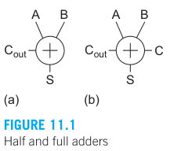

它们对应的真值表不难写出：

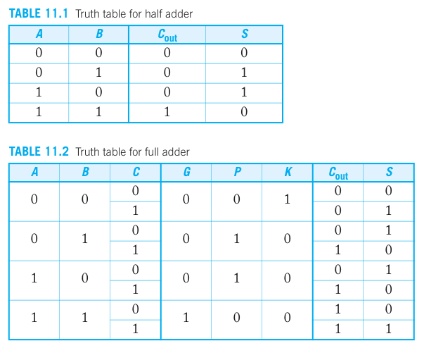

输入输出端口如下：

- $A$、$B$ 加数
- $C$ 上一位的进位
- $C_{out}$ 进位位
- $S$ 和

另外还有三个中间变量：

- $G$enerate：进位产生，即这一位会产生一个进位（不论上一位的进位如何），$G=AB$
- $P$ropagate：进位传播，即将上一位的进位传播到下一位，$P=A\oplus B$，有时候也定义为 $P=A+B$
- $K$ill：进位取消，即这一位不会产生进位（即使上一位有进位），$D=\bar{A}\bar{B}$

从真值表，不难写出半加器的逻辑表达式：

$$
S=A \oplus B\\
C_{out} = A \cdot B
$$

全加器的逻辑表达式：

$$
S = A \oplus B \oplus C\\
C_{out} = AB + AC + BC = {\rm MAJ}(A,B,C)
$$

${\rm MAJ}$ 表示 majority，即取 A,B,C 中占大多数的值（也就是当至少有两个为 1 时输出 1）

全加器的另一种逻辑表达式：

$$
S = = P \oplus C\\
C_{out} = G+PC
$$

### 电路实现

半加器的电路实现并不难，只需要一个异或门和一个与门就行。

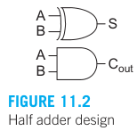

而全加器则复杂得多。我们先来看常规实现：用一个三输入异或门，和一个 MAJ 门

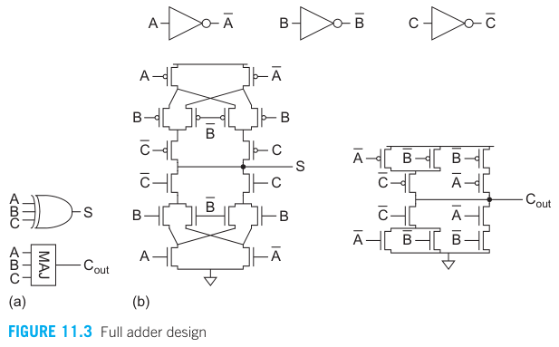

- 三输入的异或门中有很多支路是共享的。比如下拉网络中，$AB\overline{C}$ 和 $A\overline{B}C$ 共享了 $A$ 支路。
- MAJ 门的实现借鉴了“G、P、K”，
  - 当 A、B 都为 0 时，Kill，$C_{out}=0$；
  - 当 A、B 都为 1 时，Generate，$C_{out}=1$；
  - 当 A、B 有一个为 1 时，Propagate，$C_{out}$ 取决于 $C$
- 一共需要 32 个晶体管
  - 反相器占 6 个
  - 三输入异或门占 16 个
  - MAJ 门占 10 个

---

另一种更紧凑的实现方法是求出 $C_{out}$ 后，再用来求 $S$：

$$
S = ABC + (A+B+C) \overline{C}_{out}
$$

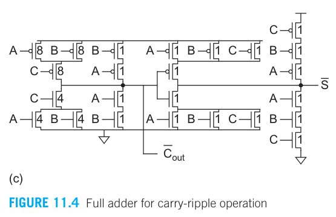

- $\overline{C}_{out}$ 的求解使用的是 Minority 门，也就是将 MAJ 门的输入取反
- 整个电路是上下对称的，因此这种实现方式也叫做 mirror adder.
- 一共只使用了 28 个晶体管

另外，为了优化延时（下一节会讲到，关键路径是进位的路径，也即产生 $\overline{C}_{out}$ 的路径），这个电路作了如下优化：

- 关键路径上的晶体管的尺寸较大
- 非关键路径上的晶体管的尺寸都取最小，以减小关键路径的 Branch Effort
- 将上一级的进位位 $C$ 放在内部，这样中间节点就已经提前放电了（通过 $A,B$）
- 为了移除输出的反相器，使用正负逻辑交替连接（下一节会讲到）

> 这个电路的尺寸与教材的取值不同，我认为这里的取值更有道理。

### 传输门加法器

## 多bits加法器

### 逐位进位加法器

通过将多个全加器串联在一起，可以实现多 bits 加法器。

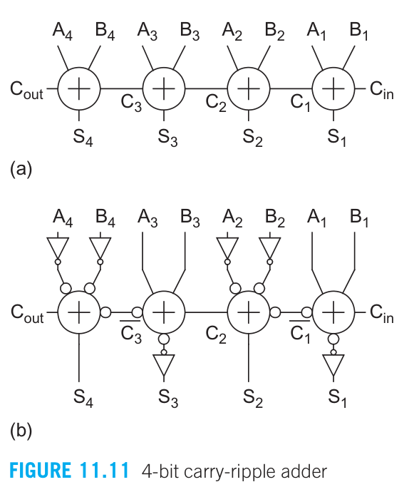

这里为了符合算数规律，把低位放到右边。从图中可以看出，要算出最后一位 $S_4$，必须等前面的进位算出来。因此关键路径就是 $C_{in}\rightarrow C_1 \rightarrow C_2 \rightarrow C_3 \rightarrow S_4$，延时可以写为：

$$
t_{adder} = (N-1) t_{carry} + t_{sum}
$$

- $N$ 是加法器的位数
- $t_{carry}$ 是从 $C_{in}$ 到 $C_{out}$ 的延时
- $t_{sum}$ 是从 $C_{in}$ 到 $S$ 的延时
- 显然，优化 $t_{carry}$ 比优化 $t_{sum}$ 重要。

另外值得说的是，延时还取决于输入的 $A$ 和 $B$。延时最坏的情况为：$A=x001$ 和 $B=x111$（答案不唯一，可以交换 $A,B$ 中的某些位）

图(b)展示了**全加器**的一个性质：**把输入反相，则输出也会反相**。这点看真值表不难证明。利用这点就可以节省全加器中的反相器。

逐位进位加法器的缺点是，如果位数很多，进位只能一位一位传播，速度很慢。解决方法是，我们 bits 分组，比如 32bit 分为 8 个 4bit，然后每个 4bit 加法器内部用一些方法提高进位传播速度。

### 旁路进位加法器

考虑一个 4bits 的加法器。当 $P_0P_1P_2P_3 = 1$ 时，进位可以直接传到输出，就不需要一位一位传了。根据这个，我们可以设计“旁路进位加法器”：

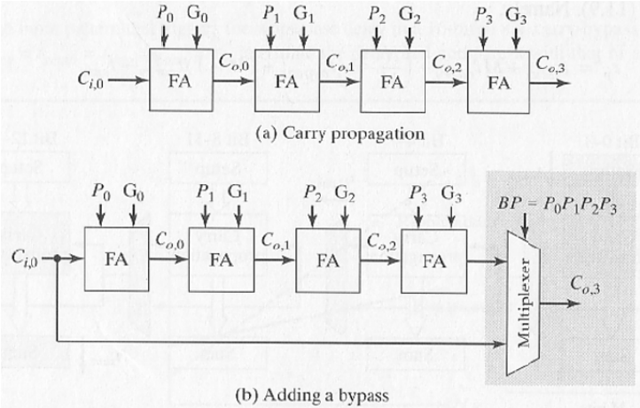

将多个旁路进位加法器组合起来可以得到多 bits 的加法器。

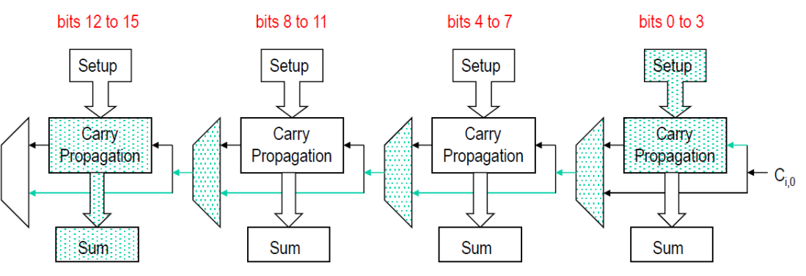

其关键路径如图中绿色部分所示。出人意料的是，关键路径居然经过了旁路进位，按道理旁路进位不应该更快吗？首先，我们要树立这么一个意识：**所有的 $P$、$G$ 都是同时计算出来的**。假如中间（bits 4 to 15）有一个 $P=0$，那么就依赖于 $G$ 来产生进位，前面的进位就没有用了。因此，如果关键路径必须经过旁路进位。

理解了上面一点，就可以简单地把延时计算出来：

$$
T_{add} = t_{setup} + M t_{carry} + (\frac{N}{M}-1) t_{bypass} + (M-1) t_{carry} + t_{sum}
$$

- $N$ 位加法器，划分为 $N/M$ 级，每级 $M$ 位
- $t_{setup}$：产生 $P$、$G$ 信号所需的时间
- $t_{carry}$：进位传播一位所需的延时
- $t_{bypass}$：通过一级旁路多路开关的传播延时
- $t_{sum}$：产生最后一级“和”所需的时间

我们可以进一步利用这种“旁路”的思想。比如在单个旁路加法器内，进一步增加旁路。这就是我们下面所要介绍的。

### 并行前缀加法器

为了更清楚地说明，我们定义：

$$
P_{i:j}=P_{i}P_{i-1}\cdots P_{j}=P_{i:k}P_{k-1:j}
$$

$$
G_{i:j} = G_{i:k}+P_{i:k}G_{k-1:j}
$$

$i:j$ 表示从第 $i$ 级到第 $j$ 级（$i>j$）。为了简约起见，定义 $C_{i-1}=G_{i-1}$，且 $C_{-1}=G_{-1}=0$。以上式子可以代入到旁路进位加法器中来理解，在此不作过多解释。

一旦知道 $G_{i:j}$，就可以用 $S_{i}=A_i\oplus B_i\oplus G_{i-1:-1}$ 来算出和。因此，如何快速算出 $G_{i-1:-1}$ 就是关键。

以一个 16-bits 加法器为例。我们最终目标是要计算出 $G_{3:-1}$。逐次进位的做法是：

1. $G_{0:-1}=G_{0}+P_{0}G_{-1}$
2. $G_{1:-1}=G_{1}+P_{1}G_{0:-1}$
3. $G_{2:-1}=G_{2}+P_{2}G_{1:-1}$
4. $G_{3:-1}=G_{3}+P_{3}G_{2:-1}$
5. ……
6. $G_{15:-1}=G_{15}+P_{15}G_{14:-1}$

为了方便理解，我们可以用下图来表示逐次进位加法器。可以看出它从上到下有很多级。

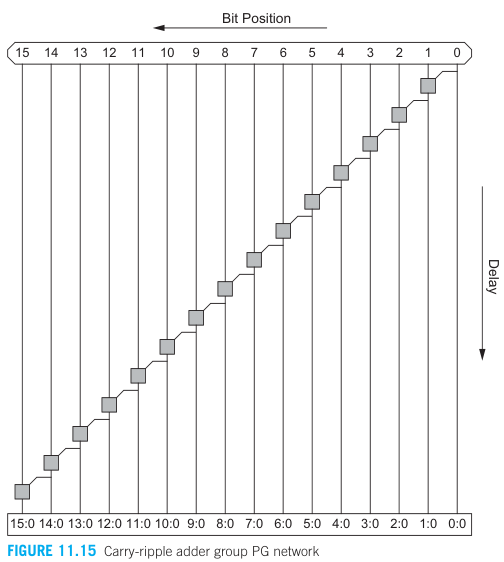

旁路进位的做法是：

1. $G_{3:-1}=G_{3:0}+P_{3:0}G_{-1}$
2. $G_{7:-1}=G_{7:4}+P_{7:4}G_{3:-1}$
3. $G_{11:-1}=G_{11:8}+P_{11:8}G_{7:-1}$
4. $G_{15:-1}=G_{15:12}+P_{15:12}G_{11:-1}$

其中，

- $P_{3:0}=P_3P_2P_1P_0$
- $G_{3:0}=G_3+P_3G_{2:-1}$
  - $G_{2:-1}=G_2+P_2G_{1:-1}$
    - $G_{1:-1}=G_1+P_1G_{0:-1}$
      - $G_{0:-1}=G_0+P_0G_{-1}=G_0$

下图表示旁路进位加法器。它从上到下的级数比逐次进位加法器少。

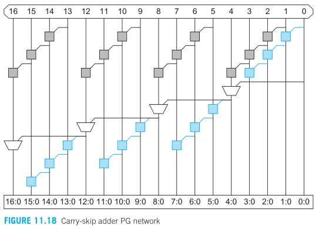

我们可以进一步拆分 $G_{3:0}$：

- $G_{3:0}=G_{3}+P_{3}G_{2:-1}$
  - $G_{2:-1}=G_{2:1}+P_{2:1}G_{0:-1}$
    - $G_{2:1}=G_{2}+P_{2}G_{1}$
    - $G_{0:-1}=G_{0}+P_{0}G_{-1}$

这样拆分的好处是：当 $G_0=1$ 时，$G_{0:-1}=1$，$G_{2:1}$ 就可以算出来。而如果不拆分，则 $G_{0:-1}$ 算出来后，还要算 $G_{1:-1}$，才能得到 $G_{2:1}$

以上公式可能有点抽象，下面这张图则更好理解：

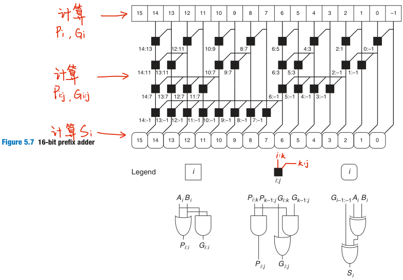

可以只看 $3:-1$，并对比上面的文字分析。这种加法器叫做并行前缀加法器（prefix adder），其好处是，如果中间某一位 $G_i=1$，那么只需要 4 级，就可以传到最后一位 $G_{14:-1}$。它从上到下的级数比旁路进位加法器还少。

它的延时可以写成：

$$
T = t_{pg}+(\log_2 N)t_{AO}+t_{\rm xor}
$$

- $t_{pg}$ 为计算 $P_i,G_i$ 的延时
- $t_{AO}$ 为图中黑色方块的延时
- $t_{\rm xor}$ 为异或门的延时

### 超前进位加法器

超前进位加法器是对旁路进位加法器的优化。简单来说就是，旁路进位器进位传播为：

- $G_{3:0}=G_3+P_3G_{2:-1}$
  - $G_{2:-1}=G_2+P_2G_{1:-1}$
    - $G_{1:-1}=G_1+P_1G_{0:-1}$
      - $G_{0:-1}=G_0+P_0G_{-1}=G_0$

超前进位就是把这个结合：

$$
G_{3:0} = G_3+P_3\{ G_2+P_2[G_1+P_1(G_0+P_0G_{-1})] \}+P_{3:0}G_{-1}
$$

实现电路如下：

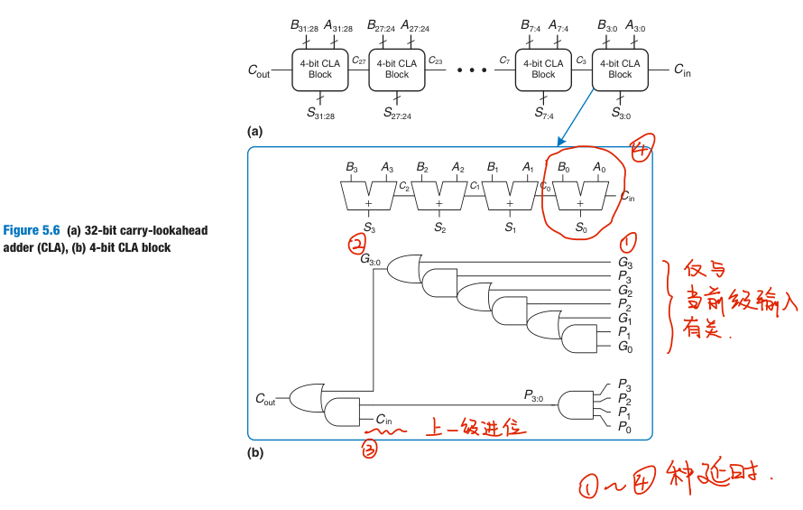

下图是一个 16 位的超前进位加法器

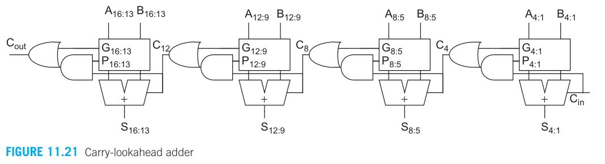

延时计算如下：

$$
t_{cla} = t_{pg} + t_{pg(n)}+[(n-1)+(k-1)]t_{AO}+t_{\rm xor}
$$

- $t_{pg}$ 是计算出 $P,G$ 的延时
- $t_{pg(b)}$ 是那一堆与门与或门的延时
- $t_{AO}$ 是下图中黑色方块的延时
- $t_{\rm xor}$ 是求 $S$ 的延时
- 把 $N$ bits 的加法器分为 $k$ 份，每份 $n$ bits

中间的 $[(n-1)+(k-1)]$ 是怎么来的？是因为尽管 $C_{3:0}$ 提前算出来了，但是 $G_{3:-1},G_{2:-1}$ 还没算出来（也就是下图里的黑色方块）。

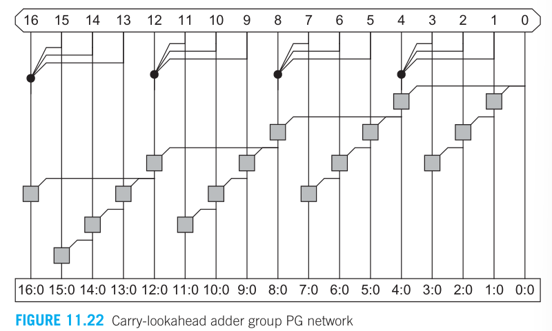

### 进位选择加法器

进位选择加法器是对旁路进位加法器的另一种优化。其思想是，进位只有 0 或 1，那么干脆就把两种情况都算出来，然后用一个 2-1 mux 来决定最终结果。

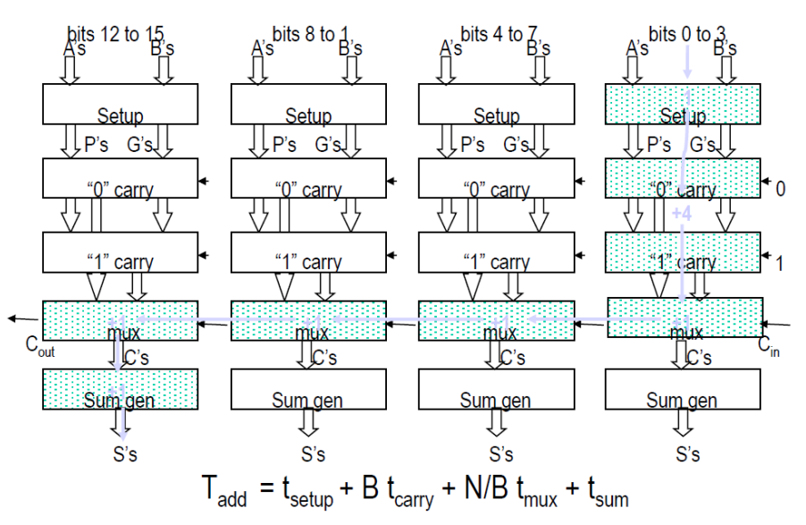
