## 概论

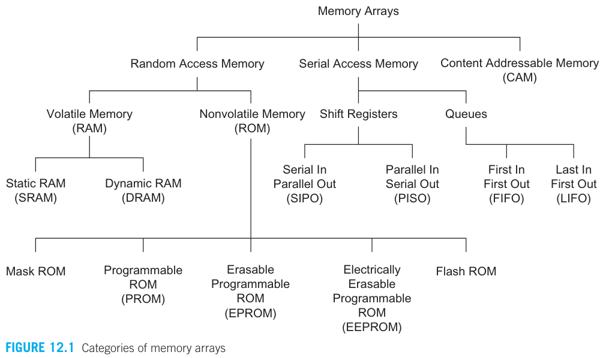

- RAM：Random Access Memory 随机读写存储器（常说的内存，掉电无数据）
- ROM：Read-Only Memory 只读存储器（一开始是在制造过程中写死，不过现在也有可擦除的，后者包括日常使用的 U盘）

## ROM

### Mask ROM

Mask 只的是掩模版，意识是需要通过修改掩模版来改变存储的值。其实现方式有三种：

- OR
- NOR
- NAND

OR 的实现很简单，所有 BL 默认为 0，所有 WL 默认为 0，选中的 WL 为 1。在需要输出 1 的 BL 上接一个 NMOS，NMOS 一端接 VDD，另一端接 BL，由于输入的 WL=1，NMOS 打开，就会使得对应 BL 为 1.

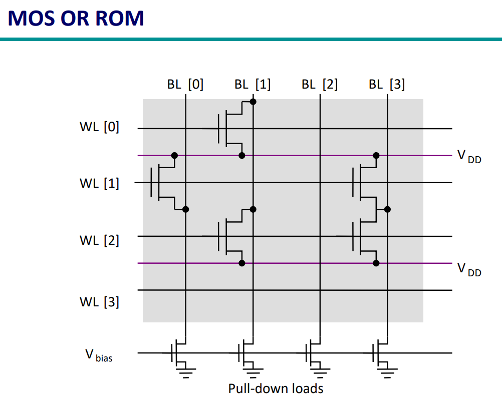

NOR 和 OR 类似，只不过所有 BL 默认为 1（WL 还是默认为 0）。在需要输出 1 的 BL 上接一个 NMOS，NMOS 一端接 GND，由于输入的 WL=1，NMOS 打开，就会使得对应 BL 为 0.

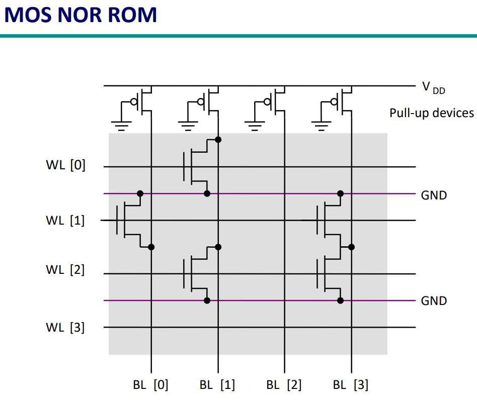

可以看出，NOR、OR 的实现中，NMOS 管的一端都要接 VDD 或 GND。而 NAND 则不用，其实现方式如下：

WL 默认为 1，选中的 WL 为 0. 所有 BL 默认为 0。在需要输出 1 的 BL 上接一个 NMOS（注意 NMOS 在 BL 到地的路径上），由于 WL 为 0，所以 NMOS 开路，BL 被上拉（这要求上拉器件是弱上拉）

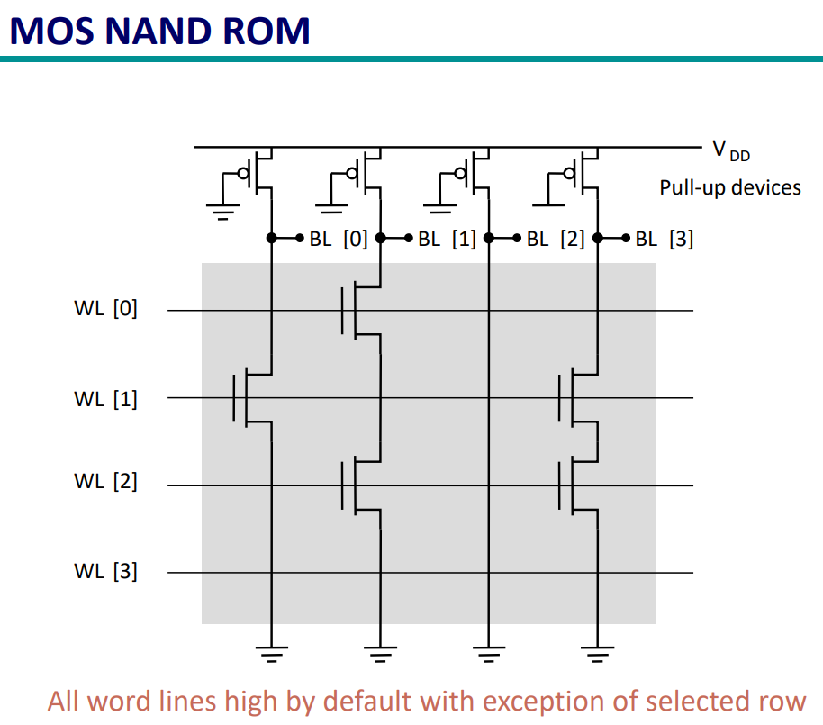

三种中，NAND 的面积最小，但是它的性能（速度）不如 NOR ROM。

----

设计要点：

如何减小 WL 延迟（毕竟这么长的 Poly）：

- 用两个 driver 从两端驱动
- 加一条并联的 metal

### EEPROM 和 FLASH

基本原理是，通过向栅极注入电子，来改变阈值电压。这么一来，注入电子的阈值电压变高，在同等栅压下就相当于断路。

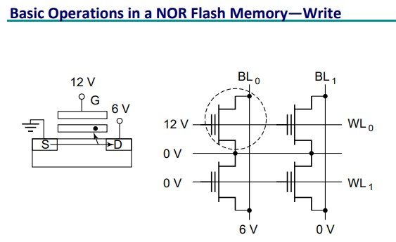

至于读取，则和 Mask ROM 一样。

EEPROM 与 FLASH 的区别：flash属于广义的EEPROM，因为它也是电擦除的rom。但是为了区别于一般的按字节为单位的擦写的EEPROM，我们都叫它flash。

## RAM

RAM 一般由以下部分组成

- Array
- Decoder
  - Row Decoder
  - Column Decoder
- Sense Amplifier
- Read/Write Circuits

对于 n 行 m 列的 RAM，有 $2^m \times 2^n$ 个bits（不太确定，按道理是按字节存储的）

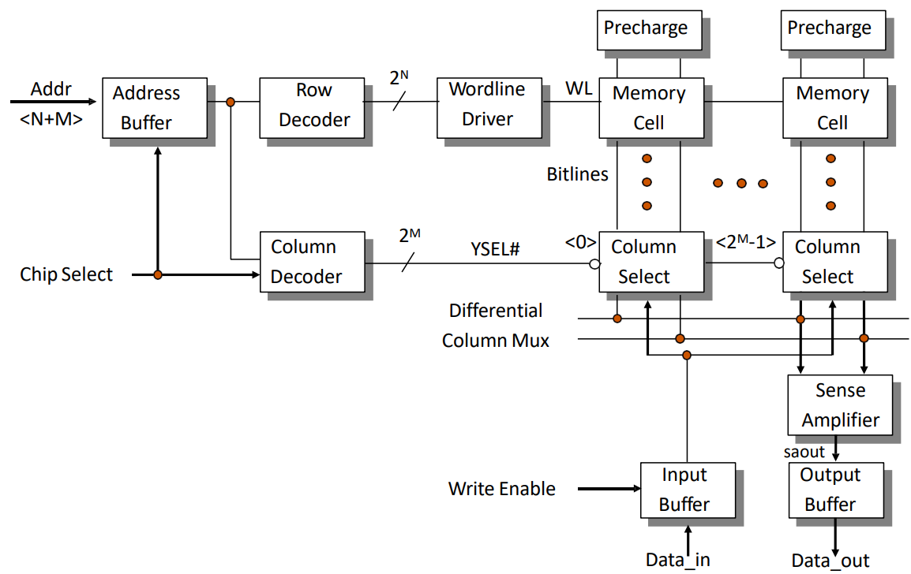

### SRAM

下图是 SRAM 的电路图，我们会介绍图中的所有部分。

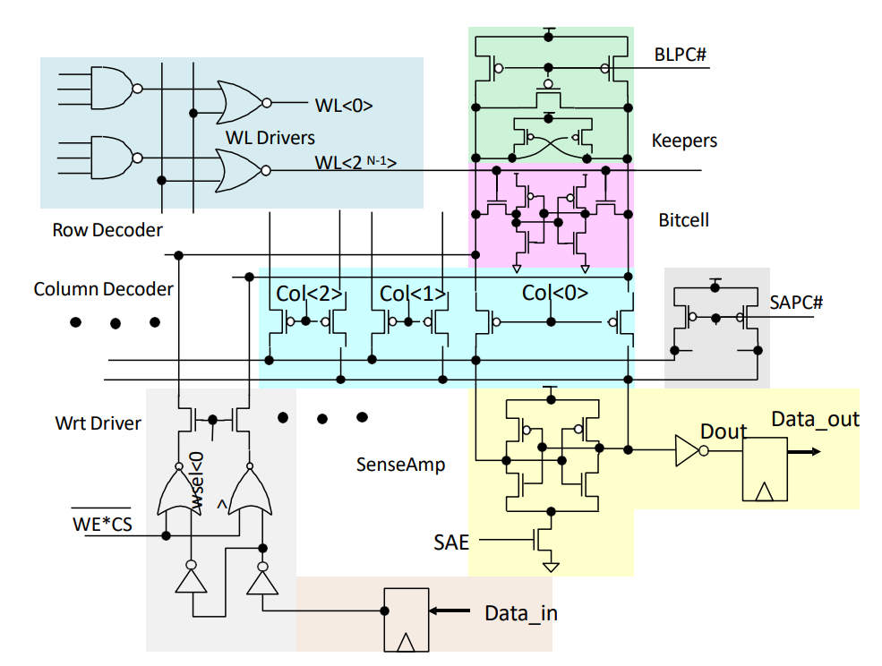

SRAM（Static RAM）与 DRAM 不同之处在于：

- DRAM 依靠“电容”来存储
- SRAM 依靠“反馈”来存储

尽管 SRAM 需要额面积比 SRAM 大，但它有如下好处：

1. 相比于比 flip-flop，密度更大
2. 可以用 CMOS 工艺实现
3. 比 DRAM 快
4. 比 DRAM 容易使用

一个最简单的 SRAM 单元是可以用 6 个晶体管实现（6T SRAM cell）：两个首尾相连的反相器+两个开关。

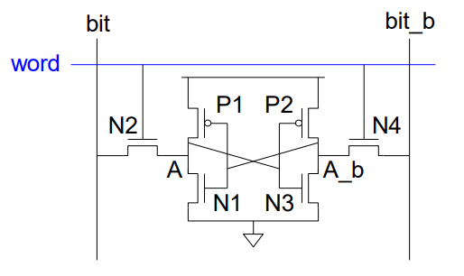

- 读操作
  - 预充电 bit、bit_b到VDD
  - N2、N4 打开
- 写操作
  - 将数据驱动到 bit、bit_b
  - N2、N4 打开

需要注意的是，这 6 个晶体管的大小（宽度）为：N2,4<P1,2<N1,3，因为：

- 读取时，bit 为 VDD，那么在 N2、N1 导通时，中间的电压一定不能超过 $\frac{1}{2} V_{DD}$，所以 N1 的电阻一定要比 N2 小、
- 写入时，假如原来是 1，要写入 0，那么在 N2、P1 导通时，中间的电压必须小于 $\frac{1}{2} V_{DD}$，所以 N2 的电阻一定要比 P1 小

### 地址译码器

#### 行译码器

行译码器的作用是从 $2^M$ 个存储行中确定一行，也就是选中这行的 Word Line。考虑一个 8 位地址译码器，它有 8 个输入和 127 个输出，每个输出的逻辑表达式为：

$$
WL_0 = \bar{A}_0\bar{A}_1\bar{A}_2\bar{A}_3\bar{A}_4\bar{A}_5\bar{A}_6\bar{A}_7\\
\vdots\\
WL_{127}=\bar{A}_0A_1A_2A_3A_4A_5A_6A_7
$$

每行需要一个 8 输入的 NOR 门（De Morgan定理），大的扇入会导致延时很大，而每个 NOR 门也要驱动字线的大负载。因此这并不是一个好的设计。

我们可以把单级的译码器拆分为 2 级：

$$
\begin{aligned}
    WL_0 &= \overline{\bar{A}_0\bar{A}_1\bar{A}_2\bar{A}_3\bar{A}_4\bar{A}_5\bar{A}_6\bar{A}_7}\\
    &= \overline{(\overline{A_0+A_1}) (\overline{A_2+A_3}) (\overline{A_4+A_5}) (\overline{A_6+A_7})}
\end{aligned}
$$

- 先用 4 个 2 输入的或非门（预译码器）
- 再用 1 个 4 输入的与非门

预译码器的优点：

1. 减少晶体管数目
2. 减小传播延时

#### 列选择器

列选择器和行选择器类似，但不同的是，列选择器则是从 bit 和 bit_b 入手。它通过一个开关，将选中的 bit/bit_b 接出来。

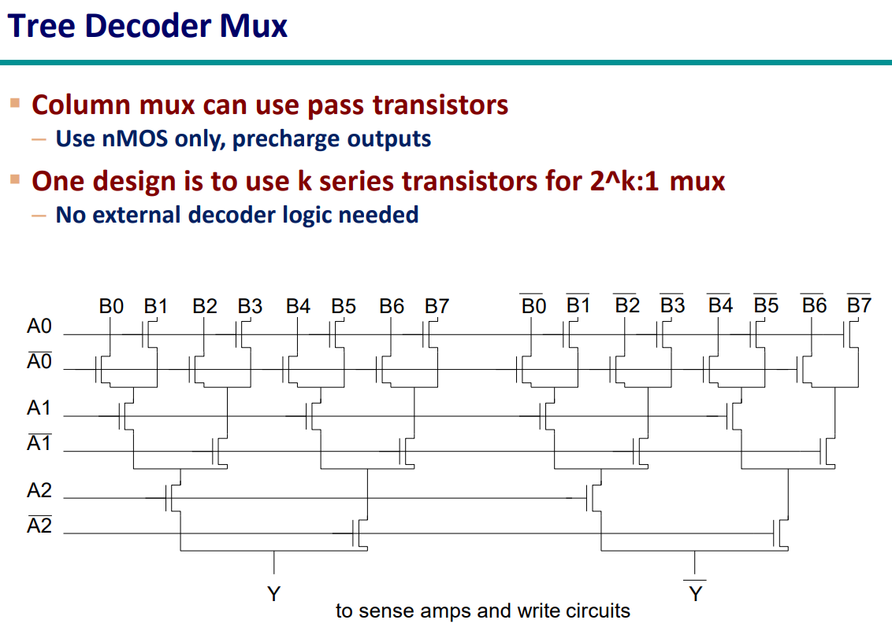

当然，列选择器还要负责打开选中的 bit/bit_b 的充电开关，这样才能正确地读。

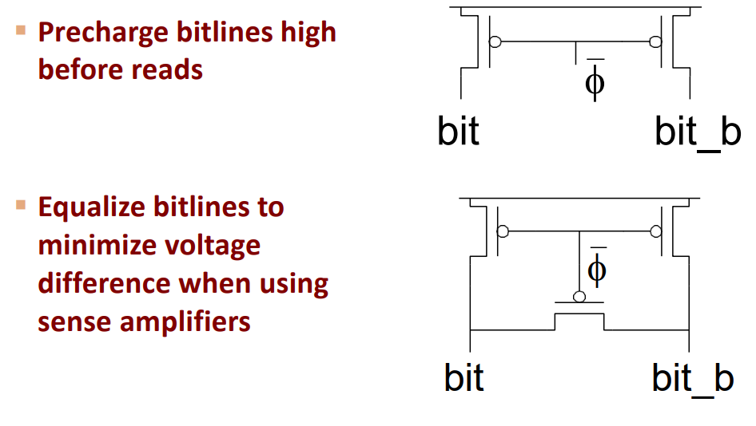

##### 灵敏放大器

每个 bitline 上面都连接着所有行。假如是一个 128 rows×256 cols 的 SRAM，那么一个 bitline 上就有 128 个单元，上面的电容会很大很大，放电速度会很慢，因此读出的速度会很慢

因此，我们需要额外的方法帮助它放电。这就是灵敏放大器的用途。因此灵敏放大器一方面接受 bit/bit_b 的输入，另一方面输出到 sense/sense_b（作为新的读出数据）

灵敏放大器（Sense Amplifier）在存储器中的作用：

1. 放大
2. 减小延时
3. 降低功耗
4. 恢复信号

灵敏放大器的速度是最重要的，增益次之。

为了降低功耗，可以在不读取数据时关闭灵敏放大器。

----

下面来说说灵敏放大器到底是个什么结构：

- 历史上多种放大器均被当做读出放大器使用。对于模拟集成电路学习者最容易理解的读出放大器则是**静态差分放大器**。然而，这类放大器几乎可以作为反面教材，具有静态功耗大，无法将小信号放大至轨对轨等缺点。
- **将电流而非电压作为输入信号的SRAM读出放大器**在2000年左右曾被研究，因其具有可以忽略输入电容而几乎没有延迟的将存储单元的驱动电流作为信号放大的优点。然而，电流读出放大器电路往往需要多级放大结构，太过复杂而导致面积太大的问题。
- 经过长年的自然选择，一类读出放大器脱颖而出，它就是**锁存型读出放大器**。锁存型读出放大器具有几乎所有的优点：高速，面积小/结构简单，功耗低（无静态功耗），轨对轨输出。

一个最简单的例子，就是 SRAM 自身。一开始 bit/bit_b 都是高电平，反相器处于非稳态。但是一旦有个下降得快，就会使得反相器输出一个稳态（一边是 0，另一边是 1）。另外，加入了时钟来节省功耗。

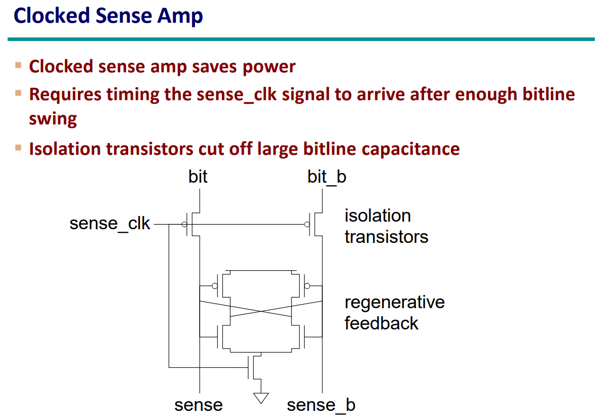

基于上面的电路，我们加一个去耦，把 sense amplifier 的输入和输出隔开，另外这个电路还能兼顾充电的功能。

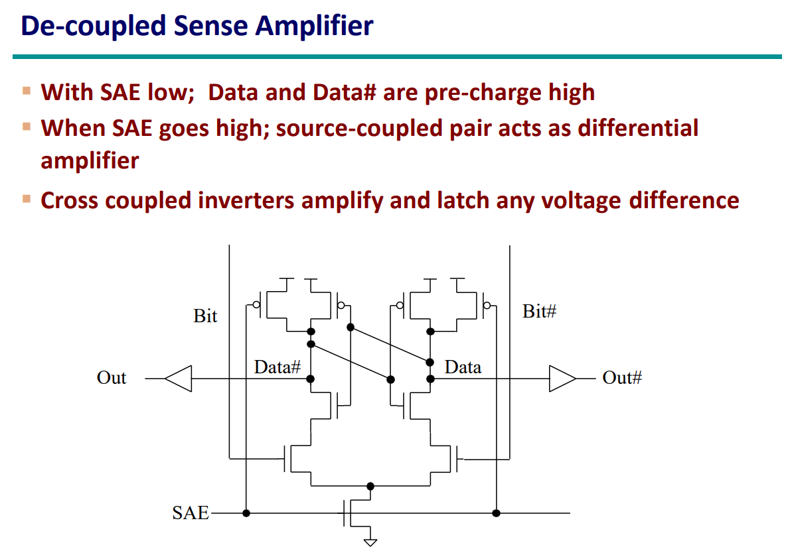

### CAM

（不知道这是啥，考到就死）

### DRAM

DRAM 除了核心的 Cell 不同，其他都和 SRAM 类似。

3-T DRAM：

- 读：BL2 预充电为 1，然后选中 RWL=1，打开 M3，数据从 BL2 读出
- 写：BL1 写入数据，然后选中 WWL=1，将数据存到 Cs

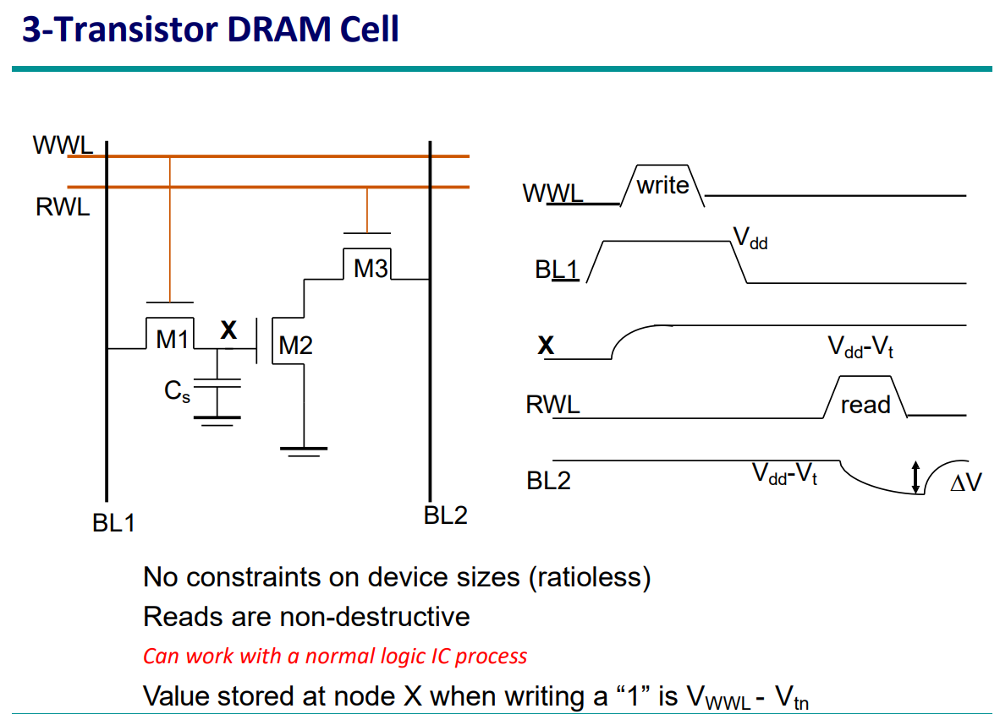

1-T DRAM：

- 读：BL 预充电为 1，然后选中 WL=1，打开 M1，数据从 BL 读出。注意读是**破坏性的**，读完后需要立即回写数据。
- 写：同 3-T DRAM

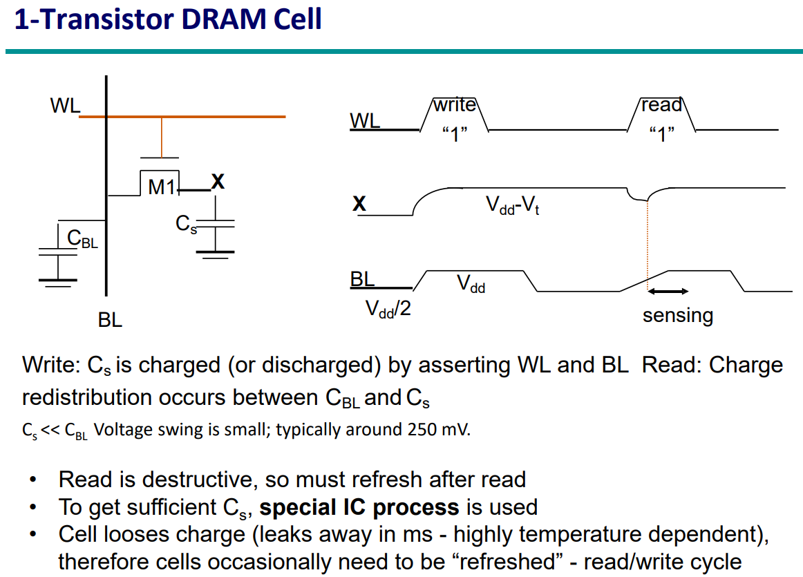

由于存在电荷泄露，因此 DRAM 就算不读，也需要周期性地刷新数据。

习题：

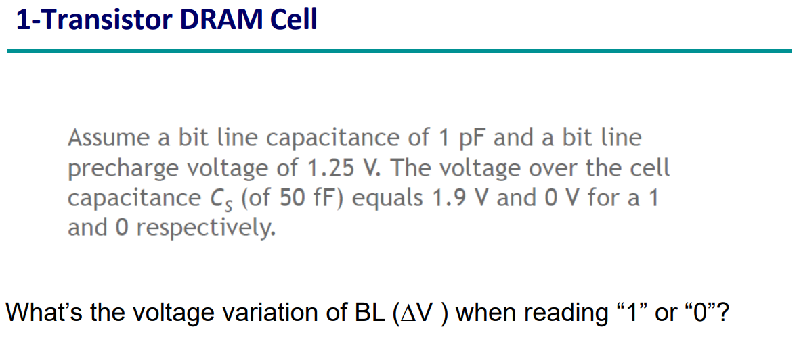

这实际上是电荷重分配的问题。我们知道，$Q=CV$，假如读的是 1，那么总的电荷为：

$$
Q_{tot} = 1.25\cdot 1p +1.9\cdot 50f
$$

由于最终两个电容上的电压相同，因此：

$$
Q_{tot} = V\cdot (1p+50f)
$$

从而：

$$
V = \frac{1.25\cdot 1p +1.9\cdot 50f}{1p+50f}
$$

$$
\begin{aligned}
\Delta V &= \frac{1.25\cdot 1p +1.9\cdot 50f}{1p+50f}-1.25\\
&= \frac{1.9\cdot 50f-1.25\cdot 50f}{1p+50f}\\
&=30.95mV
\end{aligned}
$$

同理，假如读的是 0，那么总的电荷为：

$$
Q_{tot} = 1.25\cdot 1p +0\cdot 50f
$$

由于最终两个电容上的电压相同，因此：

$$
Q_{tot} = V\cdot (1p+50f)
$$

从而：

$$
V = \frac{1.25\cdot 1p +0\cdot 50f}{1p+50f}
$$

$$
\begin{aligned}
\Delta V &= \frac{1.25\cdot 1p +0\cdot 50f}{1p+50f}-1.25\\
&= \frac{-1.25\cdot 50f}{1p+50f}\\
&=-59.52mV  
\end{aligned}
$$
