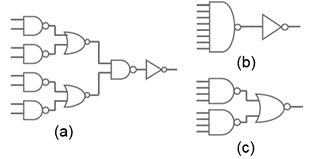
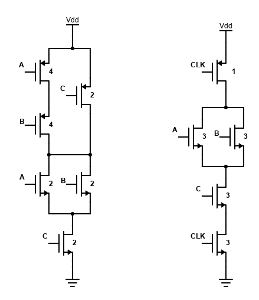

## Answers

> 微电子学院 202221061221 周镇峰

### Problem 1

#### 1)

The output load is an inverter with size=120, so $C_L = 3\times 120=360$

Using the formula: $D=t_{p0} \left(P + \frac{N(\sqrt[N]{FG})}{\gamma} \right)$, we can calculate the minimum delay of each circuit.

- For circuit (a),
  - $P = 1+2+2+2+1 = 8$
  - $F=C_L/C_{G1} = 360/3 = 120$
  - $G = 1\times 4/3\times 5/3\times 4/3\times 1=80/27$
  - $D=t_{p0}(8+\frac{5\times \sqrt[5]{120\times 80/27}}{\gamma})=t_{p0}(8+\frac{16.2}{\gamma})$

- For circuit (b),
  - $P = 1+8+1 = 10$
  - $F=C_L/C_{G1} = 360/3 = 120$
  - $G = 1\times 10/3\times 1=10/3$
  - $D=t_{p0}(10+\frac{3\times \sqrt[3]{120\times 10/3}}{\gamma})=t_{p0}(10+\frac{22.1}{\gamma})$

- For circuit (c),
  - $P = 1+4+2 = 7$
  - $F=C_L/C_{G1} = 360/3 = 120$
  - $G = 1\times 2\times 5/3=10/3$
  - $D=t_{p0}(7+\frac{3\times \sqrt[3]{120\times 10/3}}{\gamma})=t_{p0}(7+\frac{22.1}{\gamma})$

If $\gamma <5.9$, circuit (a) has the smallest delay, or else circuit (c)  has the smallest delay.

#### 2)

Circuit (b) has the smallest energy, because all of them have the same $f_{0\rightarrow 1}$ in the final output, but (a) and (c) have extra switching activity in the intermediate stage.

#### 3)

With input slope considered, the delay of circuit (a) is re-calculated as follow:

- $P = 1.2\times (1+2+2+2)+1 = 9.4$
- $F=C_L/C_{G1} = 360/3 = 120$
- $G = (1.2\times 1) \times (1.2\times 4/3) \times (1.2\times5/3)\times (1.2\times4/3)\times 1=6.144$
- $H=FG=737.28$
- $h = \sqrt[5]{H}\approx 3.75$

The size of each stage should be:

- $f_1 = \frac{3.75}{1.2 \times 1} = 3.125$
- $f_2 = f_4 = \frac{3.75}{1.2 \times 4/3} = 2.344$
- $f_3 = \frac{3.75}{1.2 \times 5/3} = 1.875$
- $f_5= \frac{3.75}{1} = 3.75$

#### 4)

Dynamic logic reduces the logic effort of logic input, so it can reduce the propagation delay. However, the charge/discharge cycles of capacitors introduce additional delay. Therefore only with proper design, can it achieve better speed.

### Problem 2

#### 1)

#### 2)

For CMOS static logic, logic effort: $g_A=2, g_B=2, g_C=4/3$; intrinsic delay: $p = 10/3$

For dynamic logic, logic effort: $g_{CLK}=4/3, g_{A}=1, g_{B}=1, g_C=1$, $g_{HL}=0$; intrinsic delay: $p_{LH}=7/3$, $p_{HL}=0$

#### 3)

The worst $t_p$ happens when $(A, B, C)$ goes from $(1,1,0)$ to $(1,0,1)$

The elmore delay of static logic can be calculated as $t_p=0.69 R_N(2 C_1+4C_2+4C_3)$. ($R_N$ is the resistor of NMOS with size=1)

The elmore delay of static logic can be calculated as $t_p=0.69 R_N(3 C_4+6C_5+9C_6)$.