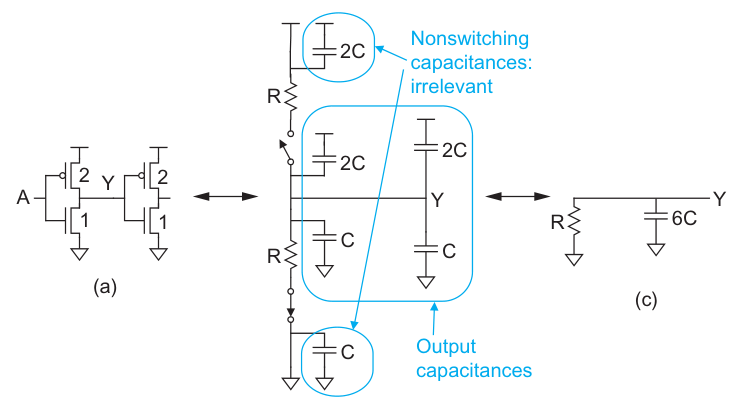
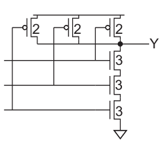
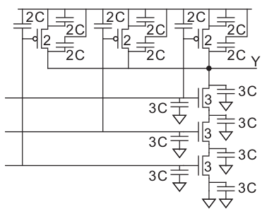
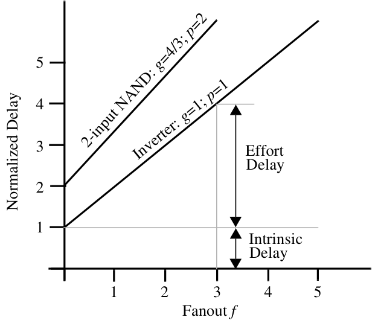
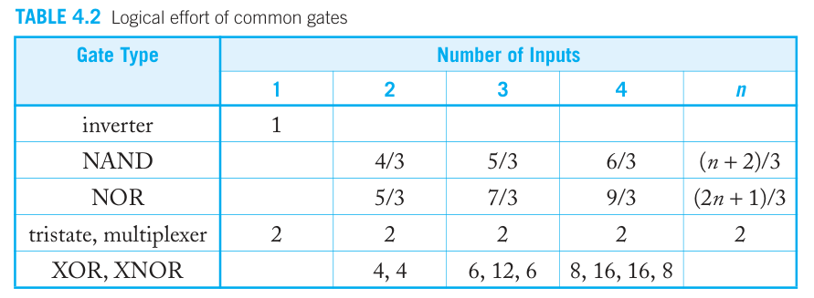
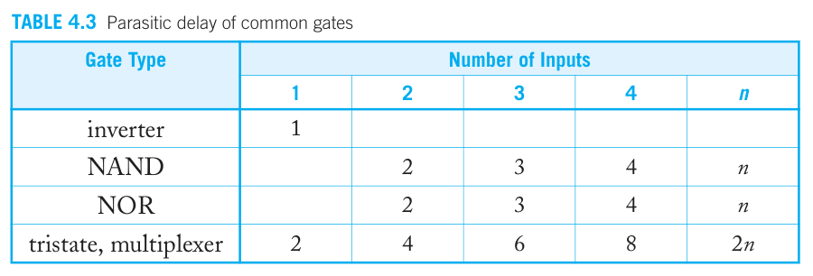

在数字集成电路课程中，老师花了整整三节课讲延时，包括反向器、组合逻辑电路的延时的计算以及优化，听得我头都晕了😵但其实延时并不难，我希望能通过这篇文章讲解清楚延时。

## 电容的延时

我们知道，电容的电流、电压关系为：

$$
I=C\frac{{\rm d}V}{{\rm d} t}
$$

对这个微分方程积分：

$$
\int I {\rm d} t = \int C {\rm d}V
$$

如果电流恒定，那么就有：

$$
I t = C (V_t-V_0)
$$

假如初始电压 $V_0=0$，定义延时为到 $V_{DD}/2$ 的时间，则延时 $t_d$ 为：

$$
t_d = \frac{CV_{DD}}{2I}
$$

## RC延时

电路中很少有恒定的电流，一般是电源通过一个电阻给电容充电（电容初始电压为 0）。因此根据 KVL，有：

$$
V_{DD} = IR+V_C = RC\frac{{\rm d}V_C}{{\rm d}t}+V_C
$$

可以计算出：

$$
V_C = V_{DD}-V_{DD}e^{-\frac{t}{RC}}
$$

同样的，我们定义延时为充电到到 $V_{DD}/2$ 的时间，则延时 $t_d$ 为：

$$
t_d=\sqrt{2}RC \approx 0.69 RC
$$

## 利用 RC 延时计算反相器延时

我们可以将反向器等效为一个RC电路（下图），其电阻为 MOS 管导通的电阻；而电容为自身的漏-衬底电容，以及下一级的栅-漏电容。这些电容电阻的具体大小我们先不管，只需要知道两点：

1. 电容和管子尺寸成正比，电阻与管子尺寸成反比。
2. 由于空穴的迁移率较差，因此要使 PMOS 的电阻等于 NMOS 的电阻，必须使 PMOS 为 NMOS 的两倍大。两者的电容在同尺寸下是相等的。

> 你可能会疑惑：为什么要让 PMOS 的电阻等于 NMOS 的电阻？因为电阻相同时，充电、放电的时间才一致。只有这样我们才好优化分析。

在上述原则下，我们将反向器的尺寸设计为 PMOS = 2，NMOS = 1

那么根据上面两点，我们可以将反向器驱动一个反向器的延时等效为上图(c)，自身的漏电容为 $3C_D$，下一级的栅电容为 $3C_G$，总电容为 $3C_D+3C_G$。总的延时就是即 $t_p=0.69R\times (3C_D+3C_G)$

## 设计逻辑门的尺寸

设计的原则就是：我们希望在最坏情况下，充电和放电的时间相等；并且它的电阻能和反相器相同。

以下面这个三输入与非门为例，最坏情况下，上面只有一个管子导通，此时要让它的电阻与反相器相同，那么应该为 2. 而下面是三个管子串联，所以它的尺寸应该为 3，这样总电阻才为 1.

我们可以计算它的电容。对于一个输入端口，它看到的栅电容为 2+3=5。而在输出端 Y，有 (2+2+2)+3=9 的电容。

因此如果一个三输入的与非门驱动一个相同的与非门，那么延时为 $t_p=0.69\times R \times (9C_D+5C_G)$

## 多个fanout的延时

如果一个反相器接了多个相同的反相器，那么它的延时是多少？显然，因为下一级的栅电容变多了，单个栅电容为 3，那么如果扇出为 f，那么总的栅电容为 3f. 考虑上自身的电容，总的电容为 (3+3f). 所以延时为：$t_p = 0.69 R (3C_D+3C_G f)$

## 延时标准化

我们始终没有求 R、C 的具体数值，一方面是求解过程比较复杂；另一个方面是不同工艺下的 R、C 都不同，换个工艺就要重新算，不利于我们优化。因此，我们不妨把延时标准化：我们将不接任何负载的标准反相器（尺寸最小的反相器）的延时定义为 $t_{p0}$，即：

$$
t_{p0} = 0.69 R\times 3C_D
$$

从而可以对延时标准化：

$$
d=\frac{t_{p}}{t_{p0}}
$$

那么如果一个反相器扇出 1 个反相器，那么它的标准化延时为：

$$
d=\frac{0.69 R\times (3C_D+3C_G)}{0.69 R\times 3C_D}=1+\frac{C_G}{C_D}
$$

我们令 $\frac{C_D}{C_G} = \gamma$，称为 **proportionality factor**，则 $d=1+1/\gamma$。

如果一个反相器扇出 f 个反相器，那么它的标准化延时为：

$$
d=\frac{0.69 R\times (3C_D+3fC_G)}{0.69 R\times 3C_D}=1+\frac{f}{\gamma}
$$

如果一个三输入与非门扇出 f 个三输入与非门，那么它的标准化延时为：

$$
d=\frac{0.69 R\times (9C_D+5fC_G)}{0.69 R\times 3C_D}=3+\frac{5/3f}{\gamma}
$$

我们可以发现，标准化延时会分成两个部分：其自身电容导致的延时（**本征延时 $p$**，也叫**寄生延迟**）、外部扇出导致的延时（**努力延时 $h$**）：

$$
d=p+\frac{h}{\gamma}
$$

本征延时 $p$ 是固定不变的，与扇出无关，甚至与自身尺寸无关，因为当尺寸增大时，$R$ 减小，$C$ 增大，两者恰好抵消。努力延时 $h$ 则与门中MOS管的数量和尺寸有关，并且与扇出的数量有关。

$$
h=gf
$$

**$g$ 是逻辑努力**，它与门电路结构有关。**$f$ 是扇出**，有时候也叫**电气努力**。

我希望这些不要把你绕晕了。实际上我们可以用一张图来表示上面的公式，图中横坐标表示扇出，纵坐标表示标准化延时。本征延时决定了在无扇出时的延时（也就是最底下那一部分）；而逻辑努力决定了直线的斜率。

值得注意的是，上面我们在说扇出时，都是以与自身相同的门为扇出。但在实际中，显然不一定是这样。我们用等效扇出来说明，比如用一个反相器驱动一个三输入与非门，前者的栅电容为 3C，后者的栅电容为 5C，那么等效扇出为 5/3，也就是说等效扇出 $f$：

$$
f = \frac{C_{out}}{C_{in}}
$$

$C_{in}$ 是自身栅电容，$C_{out}$ 是外部总的栅电容，有的书上也记为 $C_{int}$、$C_{ext}$。

> 注：有的书上定义了一个路径努力 $B=\frac{C_{out}}{C_{out,path}}$，同时 $f$ 改为 $f=\frac{C_{out,path}}{C_{in}}$。$C_{out,path}$ 表示当前数据路径上的电容。因此 $h=gfb$ 才是完整的努力延时。

### 逻辑努力

逻辑努力定义为：自身的栅电容与反相器的栅电容之比（当然，要求两者的电阻一致）。常见的逻辑努力：

具体的计算方法和“设计逻辑门的尺寸”是一样的，但是不要忘了除以标准延时（也就是除以3）。

### 本征延迟

本征延迟定义为：自身的漏电容与反相器的漏电容之比（当然，要求两者的电阻一致）。常见的本征延迟：

具体的计算方法和“设计逻辑门的尺寸”是一样的，但是不要忘了除以标准延时（也就是除以3）。

### 习题

一个4输入的与非门驱动2个3输入的或非门，问延时多少？

1. 先找4输入与非门自身的本征延时。根据表格，为 4
2. 然后找或非门的逻辑努力。根据表格，为 7/3
3. 有效扇出为 $2\times \frac{6/3}{9/3}=4/3$
4. 总的延时为 $4+\frac{4}{3}\cdot \frac{7}{3}=\frac{64}{9}$

## 尺寸的影响

如果我们改变尺寸，延时会怎么变化？前面说过，本征延时是与尺寸无关的，那么它只会影响努力延时。我们通过两个例子来说明。

第一个例子：一个反相器扇出另一个反相器，两者的尺寸都增大两倍，延时是多少？显然，本征延时还是 1，努力延时等于逻辑努力乘以有效扇出，$h=gf$，$g=1$，$f=1$，也就是说总延时为 $1+\gamma$，与放大前的一致。

我们也可以用老方法算，电阻为 $R/2$，本征电容为 $6C_D$，下一级的栅电容为 $6C_G$，因此总的延时为 $0.69\cdot R(3C_D+3C_G)$，和之前算的一样。

---

第二个例子：一个反相器扇出另一个反相器，前者的尺寸增大两倍，延时是多少？显然，本征延时还是 1，努力延时等于逻辑努力乘以有效扇出，$h=gf$，$g=1$，$f=0.5$，也就是说总延时为 $1+0.5/\gamma$，比放大前快。

我们也可以用老方法算，电阻为 $R/2$，本征电容为 $6C_D$，下一级的栅电容为 $3C_G$，因此总的延时为 $0.69\cdot R(3C_D+1.5C_G)$，除以 $0.69\cdot 3RC_D$ 得到标准化延时恰好是 $1+0.5/\gamma$。

---

通过上面两个例子，我们可以发现，尺寸唯一影响的就是有效扇出 $f$ 。因此今后，我们讨论扇出时就是在讨论尺寸。

## 延时的优化

延时怎么优化？首先，从上面尺寸的讨论可以看出，在只有一级的情况下，如果能将尺寸增大无穷多倍，那么等效扇出将为 0，从而延时可以取最小值，也就是本征延时。

如果是多级该怎么办？可以想象，对于中间级来说，如果加大尺寸，那么前面的延时会增大，后面的延时会减小，因此存在一个最优解。

对于一个 $N$ 级的组合逻辑电路，总的延时可以表示为：

$$
t_p=t_{p0}\sum_{j=1}^N (p_j + \frac{f_j g_j}{\gamma})
$$

前面说过，$p,g,\gamma$ 都是固定的，改变尺寸实际上改变的的是 $f$. 如果第 i 级的尺寸增大，那么第 $i-1$ 级的等效扇出变大，第 $i$ 级的等效扇出减小。为了分析，我们将 $f$ 用 $C_{g,i+1}/C_{g,i}$ 替代：

$$
t_p = \cdots + \frac{C_{g,i}}{C_{g,i-1}}\frac{g_{i-1}}{\gamma}+\frac{C_{g,i+1}}{C_{g,i}}\frac{g_i}{\gamma}+\cdots
$$

当 $C_{g,i}$ 取什么时，这个延时最小？根据基本不等式：

$$
a+b \geq \sqrt{2ab}\\
当且仅当 a=b 时取最小值
$$

因此当 $\frac{C_{g,i}}{C_{g,i-1}}\frac{g_{i-1}}{\gamma} = \frac{C_{g,i+1}}{C_{g,i}}\frac{g_i}{\gamma}$，也就是 $f_{i-1}g_{i-1}=f_{i}g_{i}$ 时 延时最小。这个结论可以推广到 $N$ 级：

$$
f_1 g_1 = f_2 g_2 = \cdots f_N g_N
$$

那么这个 $h = f_i g_i$ 具体等于多少呢？我们定义**路径的等效扇出**、**路径的逻辑努力**：

$$
F = f_1f_2\cdots f_N = C_L/C_{G1}\\
G = g_1g_2\cdots g_N
$$

因此**路径努力**为：$H=FG$

因此我们有：

$$
h = \sqrt[N]{\prod_{j=1}^N f_j g_j} = \sqrt[N]{FG} = \sqrt[N]{H}
$$

也就是每一级的 $fg$ 都应该等于 $h$，此时有最小延迟：

$$
D=t_{p0} \left(\sum_{j=1}^N p_j + \frac{N(\sqrt[N]{H})}{\gamma} \right)
$$