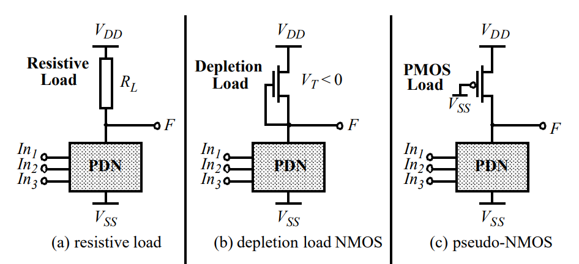

本节介绍组合逻辑电路有多种实现方式，下面主要分析各种实现方式的优缺点。

> 如果我没有写完，那么可以去看：[专用集成电路 -- CMOS组合逻辑设计](https://www.cnblogs.com/lyc-seu/p/12832029.html)

## 无比电路

## 有比电路

基本原理：把上拉网络换成一个“电阻”，其输出电压为：$V_{DD}$ 或 $\frac{R_{PDN}}{R_{PDN}+R_L}$。

“电阻”也可以用一个耗尽型的NMOS或增强型的PMOS（也叫pseudo-NMOS）来实现，这两者的面积都比电阻小（优点，记！）；同时pseudo-NMOS比NMOS好，因为PMOS没有body effect，并且电流更大（也就是等效电阻更小）

相比与无比电路的优缺点：

- 优点：
  - 管子数量少
  - 逻辑努力更少，速度更快
- 缺点：
  - 存在静态功耗
  - 输出电压取决于管子比例
  - 鲁棒性更差

要改进有比逻辑，有两个方向：

- 使得输出为 VDD~0：差分串联电压开关逻辑（Differential Cascode Voltage Switch Logic），注意这依然是有比逻辑
  - 优势：
    - 消除静态电流
    - 提供轨到轨输出
    - 同时产生了输出和其反信号，节省了额外的反相器，避免使用反相器引起的时差问题。这实际上受益于差分逻辑。
  - 缺陷：
    - 增加开关的活动性
    - 增加动态功耗
    - 布线增多
- 使得静态功耗减小：动态逻辑（后面会讲）

## 动态逻辑

## 基于传输门的实现

优点

缺点

