本文主要将 latch 和 flip-flop 的实现方法。

存储单元可以分类为：

- 静态存储：靠正反馈来保持数据
- 动态存储：靠电容保持数据

## 静态存储

静态存储靠正反馈来保持数据。最简单的正反馈就是两个首尾相连的反相器，只要**中间增益大于1**，那么它就会向两边靠拢，达到稳态。（中间还有个亚稳态，不过只要有一点扰动，它就会变成稳态）

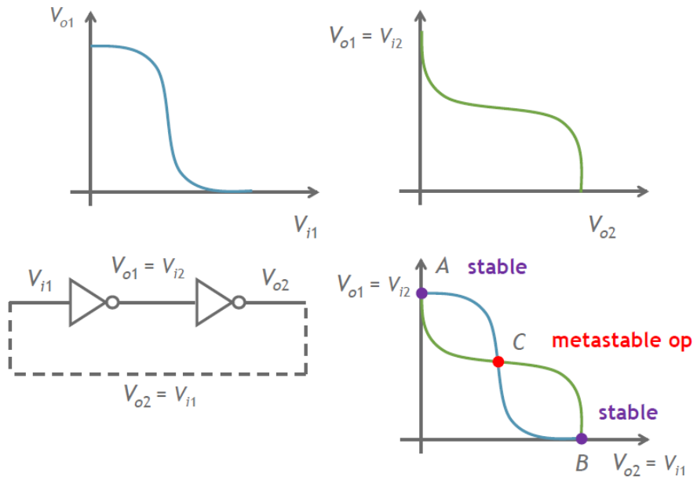

那么我们如何向这个存储写入值呢？有两种方法：

1. 断开反馈（D锁存器）
2. 强制改变状态（D锁存器）
3. 将反相器换成或非门（SR锁存器）

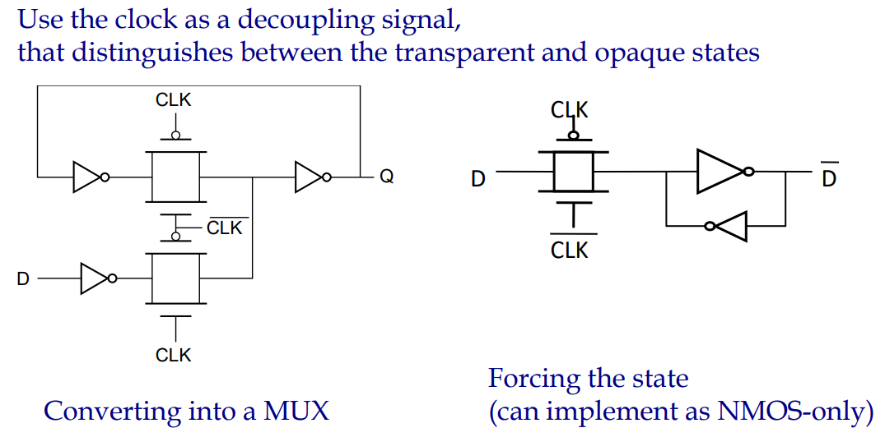

上面就是最简单的 D-latch，根据时钟的不同，可以分为 positive latch（在clk=1时锁存）和negative latch（在clk=0时锁存）。

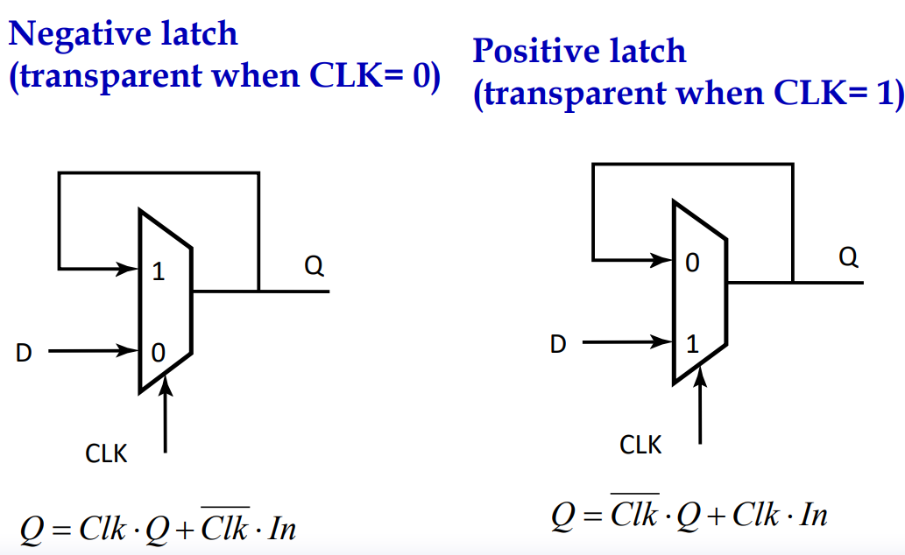

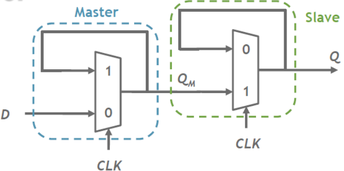

一正一反两个锁存器组合在一起，就是一个 flip-flop。前面的叫 master，后面叫 slave.其工作过程如下：

1. clk=0，master 对 D 进行采样
2. clk=1，master 保持刚刚采样得到的数据，slave 对 QM 采样并输出 Q

结合具体的电路图，我们就可以将 $t_{setup}$ 和 $t_{c-q}$ 计算出来：

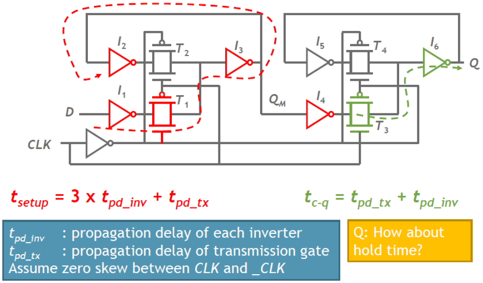

也就是说，$t_{setup}$ 是第一个锁存器形成“正反馈”的时间；而 $t_{c-q}$ 则是第二个锁存器的传输门的输入到 Q 所需的时间。

由于传输门关闭需要一定时间，在这个时间内，D 需要保持一段 $t_{hold}$ 时间，否则新数据就会破坏“正反馈”所存储的值。

更准确的定义见下图：当 D 的上升沿与时钟上升沿靠得很近得时候，由于反相器未输出强 0，所以就需要一段从非稳态到稳态的时间（也就是本文第一张图），因此就会导致 $t_{c-q}$ 加长。类似的，如果 D 在时钟上升沿后变化，也会导致 $t_{c-q}$ 加长。取 $1.05t_{c-q}$ 作为“阈值”，这段时间就是 $t_{setup}$ 和 $t_{hold}$

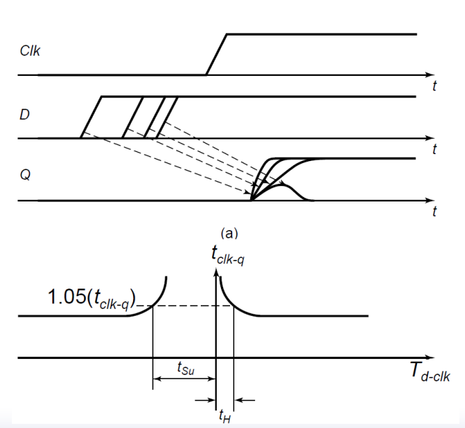

flip-flop 是工艺库中的标准单元（有不同大小的），这些时序约束由工艺库给出。值得注意的是，其中有些 $t_{hold}$ 是负的，也就是说，在上升沿之前，D 可以变化（不需要保持）。

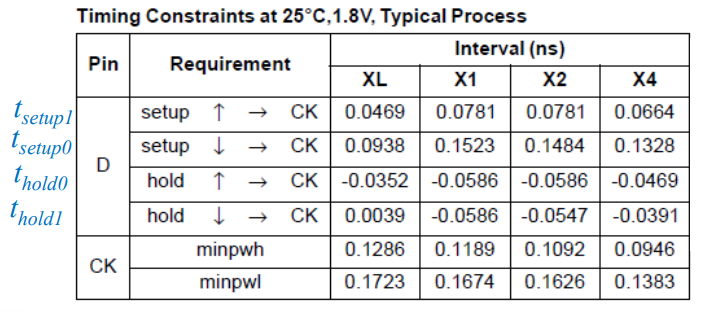

下面是一道简单的习题。我们只需要记住：$t_{hold}$ 的 D 和 Q 的波形是相同的；而 $t_{setup}$ 的 D 和 Q 波形是相反的。$t_{ccq}$ 是最早的，$t_{pcq}$ 是最慢的。

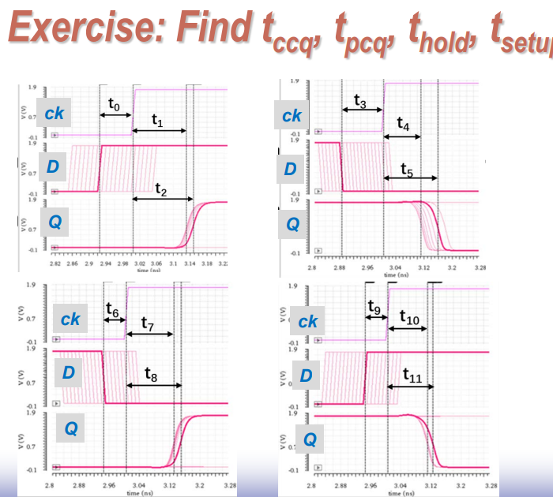

## 动态存储

动态存储就是靠电容来存储值。

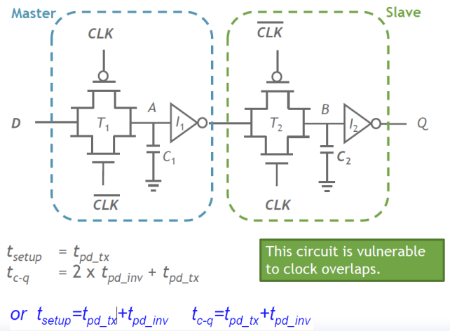

动态存储的缺点是：

1. 对噪声敏感
2. 存在漏电流
3. 节点不跟随电源电压变化

解决方法是加一个弱的反馈反相器。

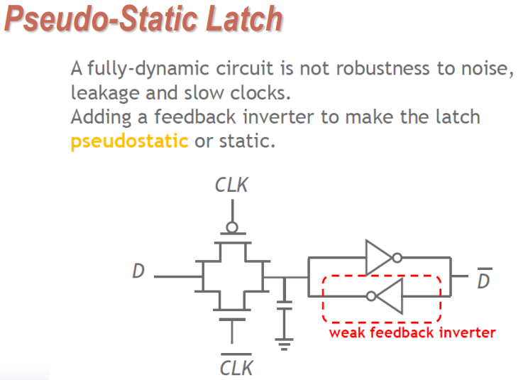

## 时钟重叠

无论是静态存储还是动态存储，它们都会受时钟交叠的影响。以静态存储为例，时钟交叠时，整个寄存器都是“透明的”，因此为了避免交叠对数据的影响，必须满足：

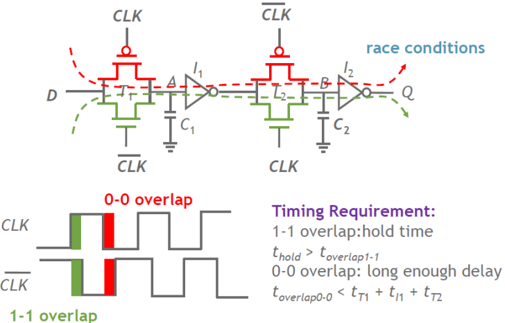

而 ${\rm C^2MOS}$ 就是一种解决方法。${\rm C^2MOS}$ 表示 Clocked CMOS，也就是在组合逻辑门中，加入时钟（把时钟当作逻辑的一部分）

当存在时钟交叠时，C2MOS 中不存在一条从 D 到 Q 的路径。比如 0-0 交叠时，如果 D=1，那么 M2 断开；如果 D=0，那么 M6 断开，Q始终不受影响。

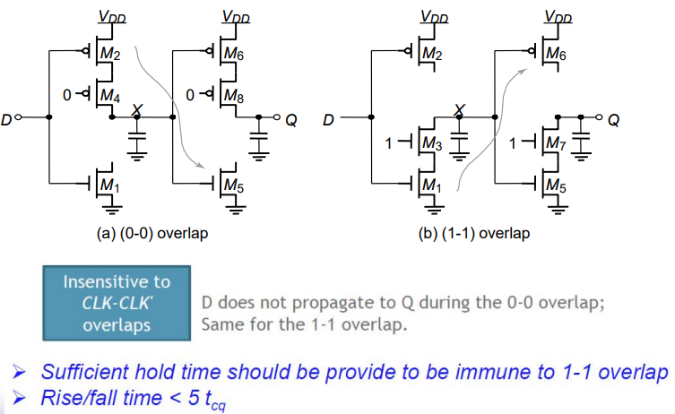

另一种解决方法是：只采用一个时钟。这种电路称为：真单相时钟寄存器（True Single-Phase Clocked Register）

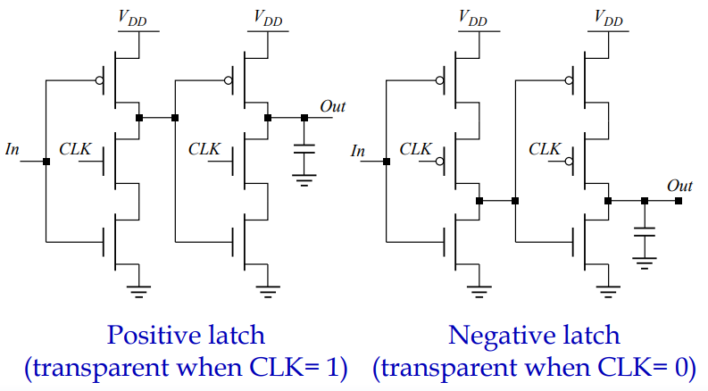

它的工作原理和 C2MOS 类似。这里就不多说。上图两类锁存器结合，就得到 flip-flop

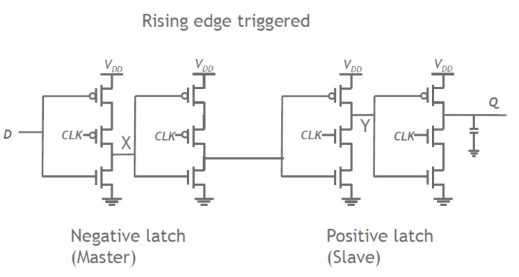

我们可以将中间两级合并，从而减少中间晶体管的数量：

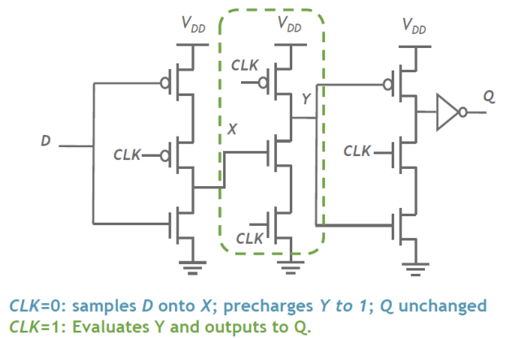

- CLK=0，X采样D，Y=1，Q保持
- CLK=1，
  - 如果 D=1，那么 X=0，Y=1，输出 0
  - 如果 D=0，那么 X=1，Y=0，输出 1
  - 如果 D=0→1，那么 X=1→0，但 Y 会先放电，所以只能输出 Y=0，输出 1
