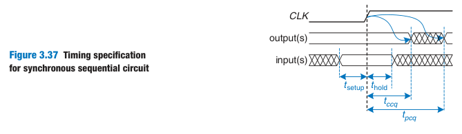
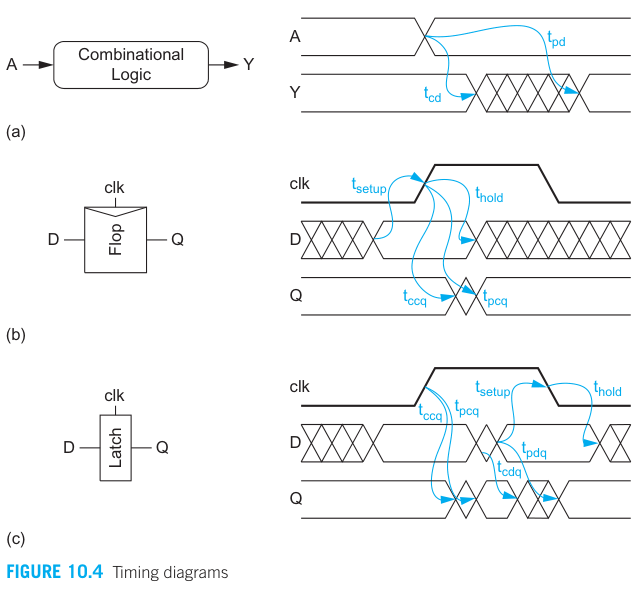
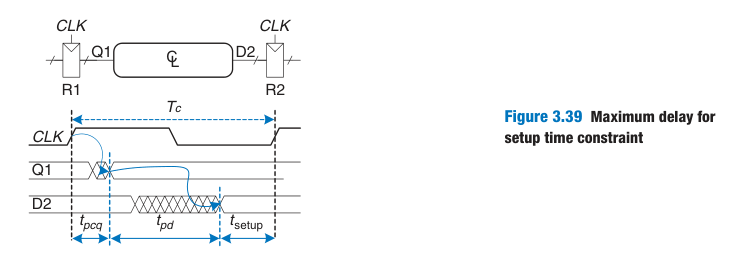
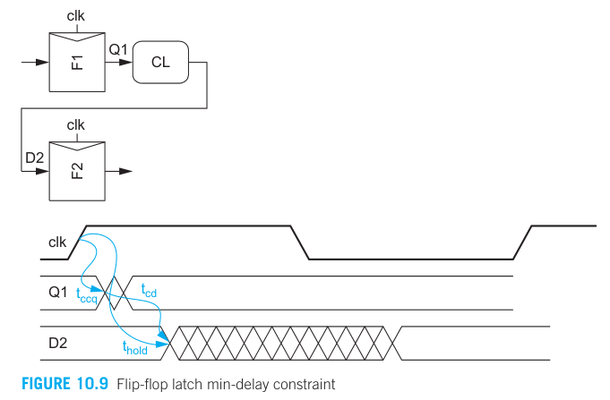
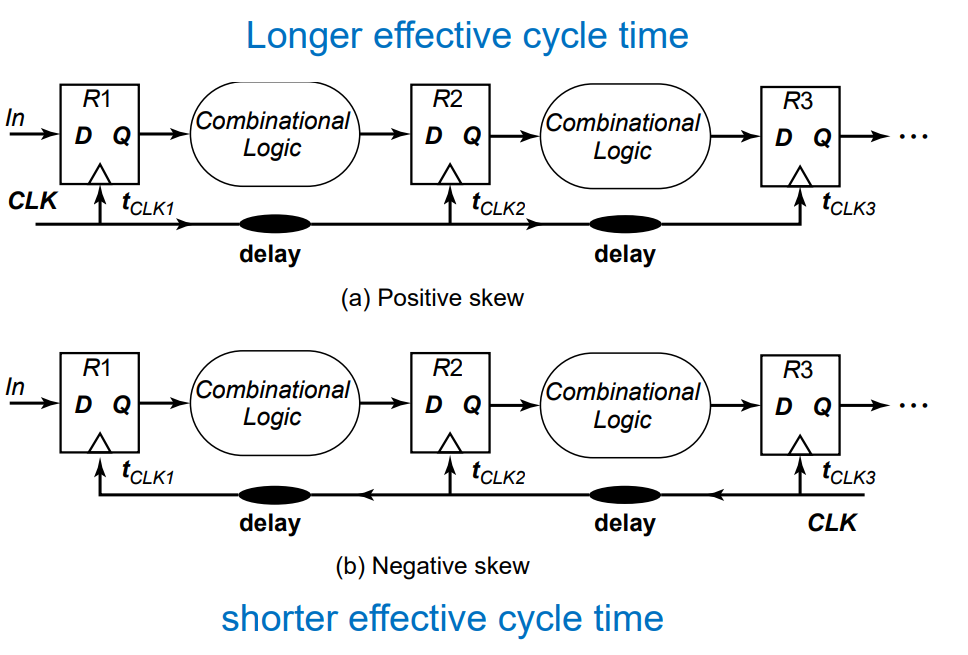
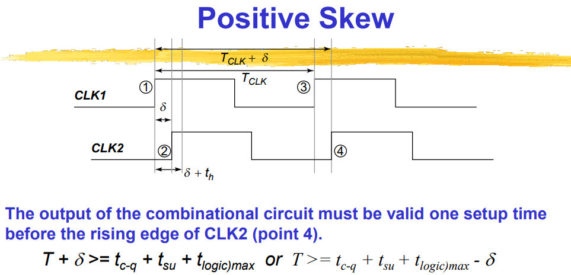
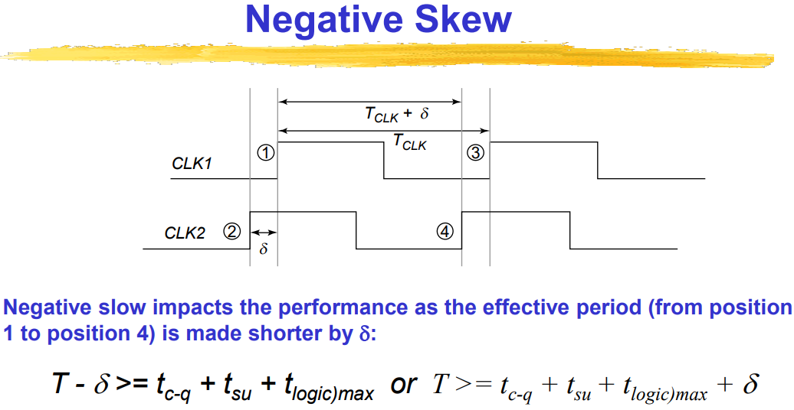
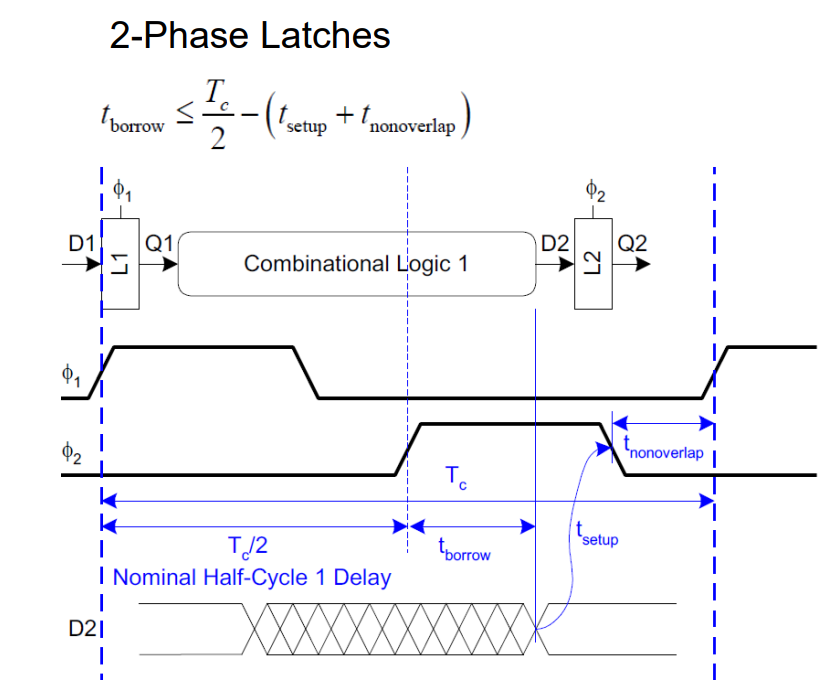
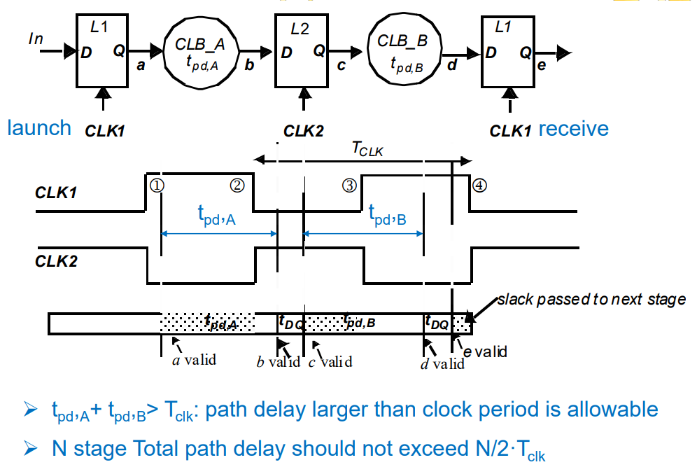
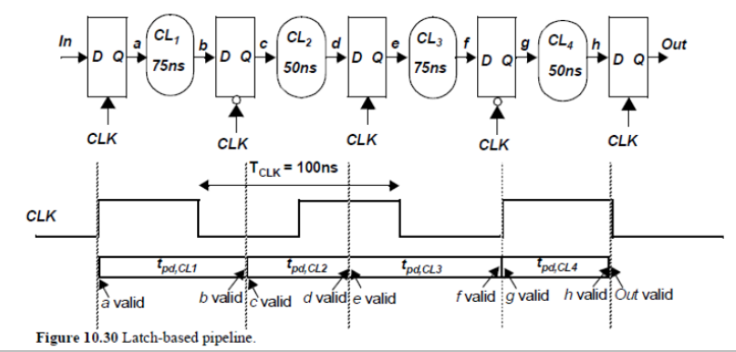

> 老师ppt上花了近50页讲这个，但我还是听不懂……

## 时序约束

时序逻辑电路的时序约束有点像照相，如果在快门按下的瞬间动了，那么拍出来的照片就会模糊。寄存器就像照相机，时钟上升沿就是快门按下的瞬间，为了正确“拍照”，必须满足以下条件：

- 为了正确采样输入，
  - 时钟变化前，输入必须稳定一段时间 $t_{setup}$
  - 时钟变化后，输入必须稳定一段时间 $t_{hold}$
- 时钟变化后
  - 到输出开始变化的间隔（最快路径）：clock-to-Q contamination delay, $t_{ccq}$
  - 到输出稳定的间隔（最慢路径）：clock-to-Q propagation delay, $t_{pcq}$

以上条件主要针对时序逻辑电路中的 flip-flop 和 latch，除此之外，时序逻辑电路中也有组合逻辑的部分，其中与时间有关的量列举如下：

flip-flop 和 latch 需要配合组合逻辑电路来组成完整的时序逻辑电路，如下图。要让电路正常工作，需要满足一些约束条件。

### 建立时间约束（周期约束）

在第一个时钟沿时，数据从 R1 输入，经过组合逻辑电路，在第二个时钟沿从 R2 输出。在这期间，有三个延时：

1. 时钟沿上升，数据从 Q1 输出的时间 $t_{pcq}$
2. 组合逻辑电路处理的时间 $t_{pd}$
3. R2 输入保持的时间 $t_{setup}$

因此时钟周期必须大于三者之和：

$$
T_c \geq t_{pcq}+t_{pd}+t_{setup}
$$

其中，flip-flop 的 $t_{pcq}$ 和 $t_{setup}$ 都是取决于工艺，因此只能改变 $T_c$ 和 $t_{pd}$。而 $T_c$ 一般是设计之初就定好的，所以只能改变 $t_{pd}$. 所以将上式改写为：

$$
t_{pd}<T_c - (t_{pcq}+t_{setup})
$$

也就是说组合逻辑的延迟不能超过一定值。总的周期 $T_c$ 是固定的，减去**时序开销（sequencing overhead）**$(t_{pcq}+t_{setup})$ 后，剩下的就是留给组合逻辑的时间。

### 保持时间约束

前面说的是数据最慢的情况，那么是不是可以无限快呢？显然不是，我们要确保在第一个时钟沿时，数据不会从 R2 跑出来，否则 R2 就采不到上一个时钟的数据。因此：

$$
t_{ccq}+t_{cd}<t_{hold}
$$

## 非理想因素

### Clock Skew 时钟偏差 与 Clock Jitter 时钟抖动

两者的区别在于：

- 时钟偏差比较的是两个寄存器的时钟，且只是相位变化，但周期不变
- 时钟抖动则是同一个寄存器时钟不同时刻，且是随机变化，周期会改变

产生的原因：

- 系统性错误：生产造成芯片与芯片不同
- 时钟产生错误：VCO受噪声、电源等影响
- 器件错误：时钟通路上的buffers
- 互连线错误：互连线的电阻、电容
- 环境影响：温度和电源的影响
- 电容耦合的影响：时钟通路受信号通路的影响

时钟偏差分为正时钟偏差（时钟方向和数据方向一致，后面的时钟慢一点）和负时钟偏差（时钟方向和数据方向相反，前面的时钟慢一点）

正时钟偏差会导致等效周期变为 $T+\delta$；负时钟偏差会导致等效周期变为 $T-\delta$

- 正时钟偏差
  - 更容易满足建立时间约束 $T+\delta = t_{c-q}+t_{su}+t_{logic,max}$
  - 但可能会违反保持时间约束 $t_{hold}+\delta<t_{c-q}+t_{logic,min}$
- 负时钟偏差
  - 可能会违反建立时间约束 $T-\delta = t_{c-q}+t_{su}+t_{logic,max}$
  - 更容易满足保持时间约束 $t_{hold}-\delta<t_{c-q}+t_{logic,min}$

而时钟抖动则考虑最坏情况，即：

- $T-2\delta = t_{c-q}+t_{su}+t_{logic,max}$
- $t_{hold}+2\delta<t_{c-q}+t_{logic,min}$

## 时间借用 Time Borrowing

对于 flip-flop，数据不能太晚也不能太早，因为 flip-flop 只在上升沿的瞬间导通数据，所以必须在上升沿之前准备好数据。

但是，对于 Latch 则不同，它在整个高电平都可以导通数据。因此 Latch 的时钟通常是个 pulse（这样它就和flip-flop一样，在那个瞬间导通数据），数据必须在上升沿之前准备好。

但如果 Latch 的时钟不是 pulse，而是维持一段时间，那么就不需要在上升沿前准备好数据，而是在高电平结束前准备好数据就行。这就叫 Time Borrowing，上个周期没没处理完的数据，可以在下个周期继续处理。

下面是一个例子，有一个两相时钟的 latch 电路。正常情况下，在时钟2的上升沿前，数据要准备好，因此用于处理数据的时间只有 $T_c/2$. 有了 Time Borrowing，就可以多处理 $T_{\phi_2,high}-t_{setup}$，也就是下面所说的 $t_{borrow}\leq \frac{T_c}{2}-(t_{setup}+t_{nonoverlap})$

为了使可以借用的时间最大，显然 $\phi_1$ 和 $\phi_2$ 应该反相，也就是像下图这样。此时最多可以借半个周期。

但这个只考虑了两个 latch，如果有三个 latch，前面借了时间，那么后面就少了时间，也就是参考下图：

当然啦，后面少的时间也可以继续向下一级借。

那么就有个问题，最小时钟周期是多少？为了简化分析，我们假设 $t_{c-q}$ 和 $t_{setup}$ 等于 0. 我们要确保数据在时钟有效时进行“交接”，如下图所示：

如何确保呢？如果考虑一级，那么它用于处理数据的时间最多为 $1T$（向下一级借 $0.5T$）；如果考虑二级，那么它用于处理数据的时间最多为 $1.5T$（向下一级借 $0.5T$）。以此类推，对于 N 级，处理数据的时间最多为 $N\times 0.5T+0.5$。因此，我们需要从 1 级考虑到 N 级，从中选择最大延迟 $T_{\max} = T_{1}+T_{2}+\cdots $（${1,2,\cdots}$ 是相邻的级），那么时钟就必须大于 $T_{\max}/(N\times 0.5+0.5)$

以上面的电路为例，我们来求最小时钟：

- 一级：$T_{clk}>75/1=75$
- 二级：$T_{clk}>(75+50)/1.5=83.3$
- 三级：$T_{clk}>(75+50+75)/2=100$
- 四级：$T_{clk}>(75+50+75+50)/2.5=100$

因此最小时钟为 100ns（和图中一致）
