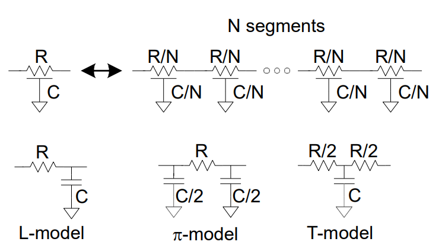
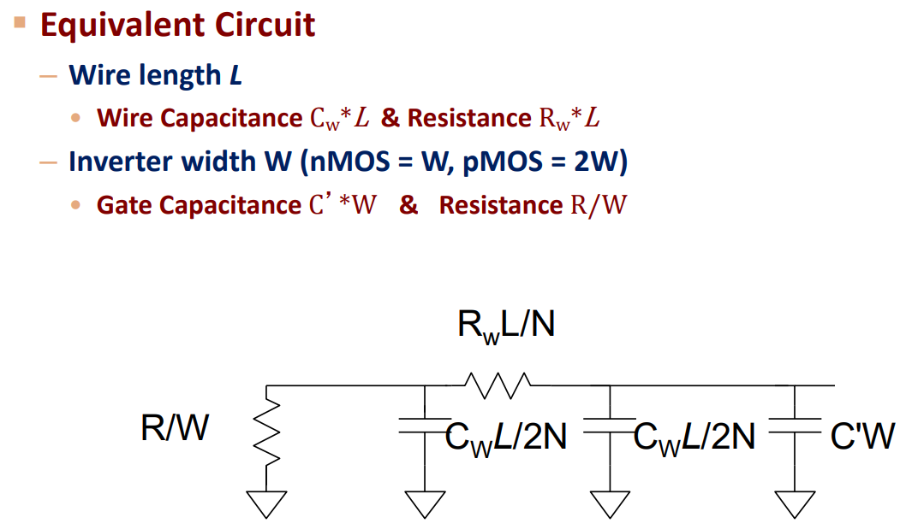
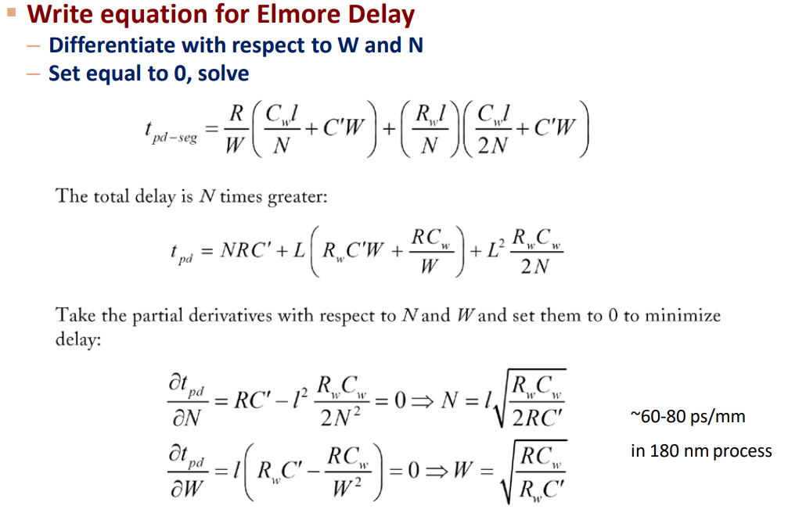
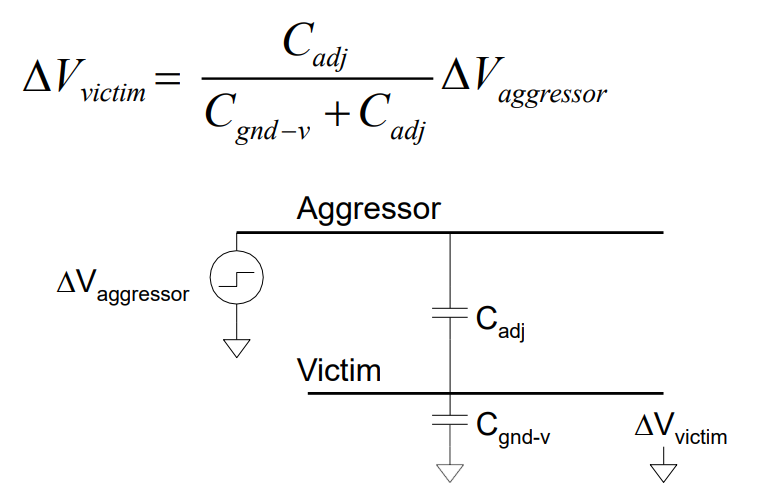

## 材料

- 180nm 以上是 Al
- 180nm 以下是 Cu

## 电阻

一般用方块电阻来衡量：

$$
R = R_\square \dfrac{l}{w}
$$

$$
R_\square = \frac{\rho}{t}
$$

但电阻不是不变的，由于趋肤效应，当频率很高时，电流会集中在表面，电阻会增大。

## 电容

导线和上下左右的导线间都有电容。

导线可以看作平板电容，容值为：

$$
C = \frac{\varepsilon A}{d}
$$

除此之外，还有侧壁电容（Fringing Capacitance）。

另外，密勒效应会导致电容变大。比如当两个相邻导线的电流方向相反时，电容会增大。

## 延迟

一个长段的延迟可以用多个小部分组成。每个小部分的电阻、电容可以用 L-model、π-model、T-model 表示。这三个model中，**π-model** 是最好的，把整个导线分成 3 个 π-model 就能和仿真相近似。L-model 则需要 100 个。

分割好后，可以用 Elmore 延迟模型来计算。这里 Elmore 延迟模型适用于 RC 树，即要求：

- 有单一的输入（源）节点
- 没有任何电阻回路
- 所有电容都在节点和地之间

如果要计算任意两点间的电容，如 i→j，那么对每个节点 k，其电容电阻为：

- $C_k$：节点k和地之间的电容
- $R_k$：“$i$ 到 $j$ 路径上的电阻” 与 “$i$ 到 $k$ 路径上的电阻” 的交集

总的延时为：

$$
\tau_{i,j} = \sum_{k} C_k R_k
$$

对于单根长导线，其延时可以写成：

$$
\tau = \sum_{i=1}^N i \cdot \frac{rL}{N} \frac{cL}{N} = rcL^2 \frac{N(N+1)}{2N^2}\rightarrow \frac{rcL^2}{2}
$$

因此延时和 $L^2$ 成正比。有没有什么方法减小延时呢？有，就是使用 Repeater（反相器或放大器），这样延时就只与长度线性相关。具体的延时如下：

最后两个式子表示需要几个 Repeater，以及每个 Repeater 的大小。考试的时候建议先写 $t_{pd}$ 再求导来算。

## 串扰

当一个导线上的电压变化时，由于存在电容耦合，会导致相邻导线电压变化。

解决方法是用差分耦合线。

## 尺寸缩放

当尺寸减小时，即长、宽、高、层间高度都减小时，有两个变化：

- 电阻随横截面减小而增大
- 电容随比例不变而保持不变（甚至略微增大）

