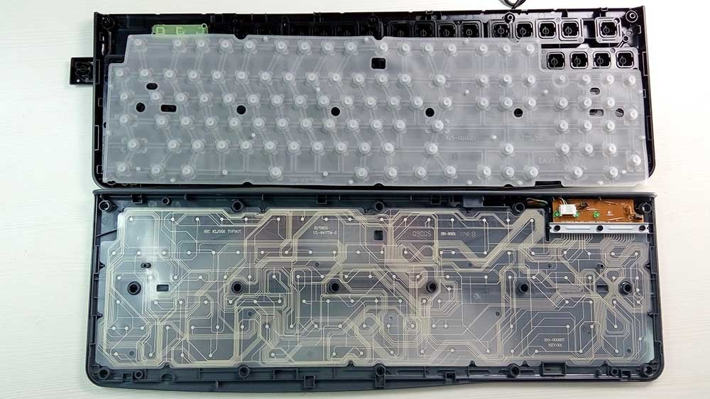
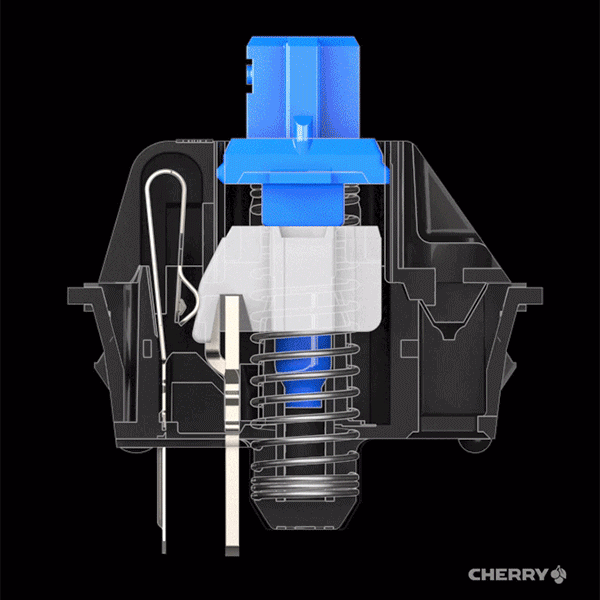
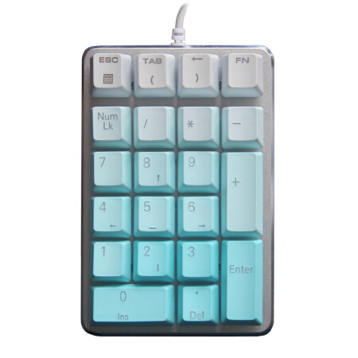
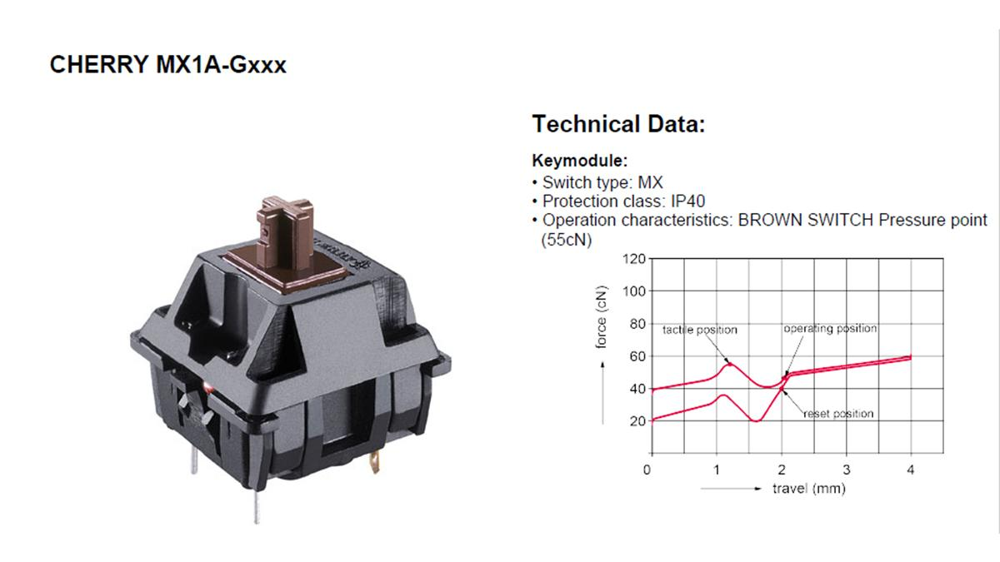
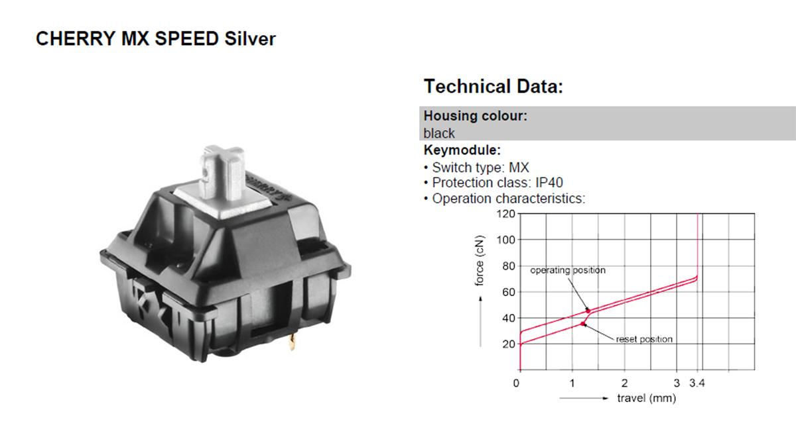
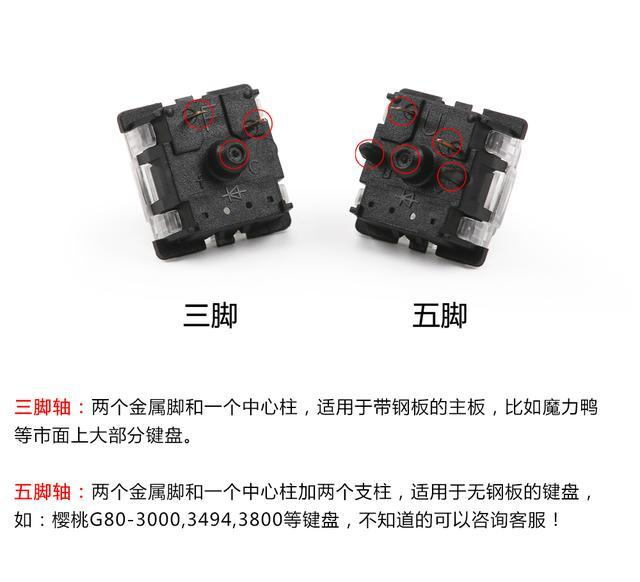
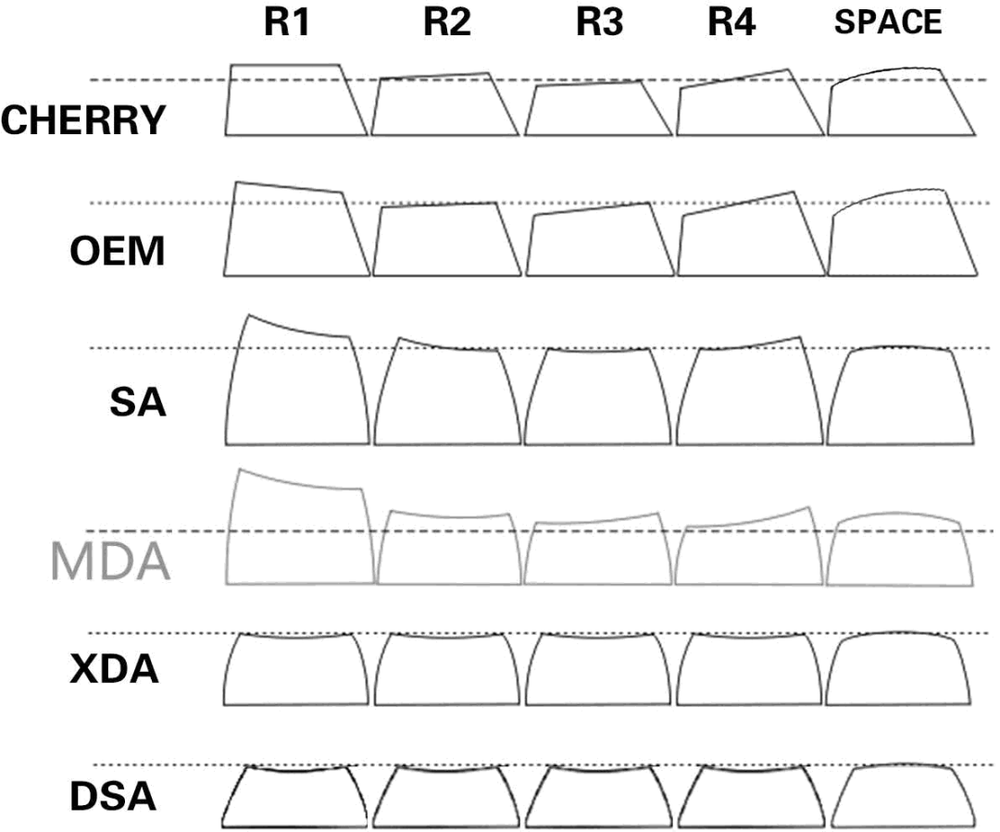
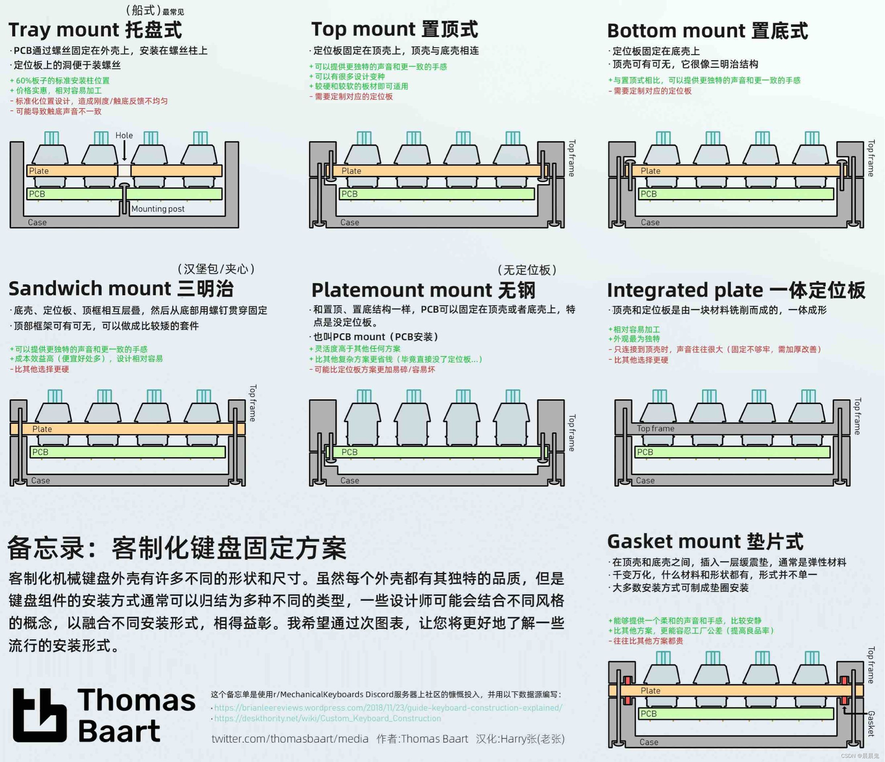

工欲善其事必先利其器，一把好的键盘，可以让我们在打字、玩游戏的时候更加畅快。清脆的键盘声，软弹的手感，让再痛苦的文字输入也是一种享受。

我们最常用的键盘是薄膜键盘（比如笔记本上的键盘），它的电路只是薄薄的一层膜，上面是一层导电橡胶，通过按下橡胶使得电路导通，从而产生输入。橡胶软绵绵的，手感想必也不会好，唯一的优点就是静音。

而机械键盘，则是通过机械结构来使得电路导通：当按键按下去时，滑块滑落，使得两个金属弹片接触，从而导通。通过合理设计机械结构，我们可以得到不同的手感/声音。并且机械键盘的寿命很高，每个按键可以按几千万次（至少有5年的寿命）。

下面，我将介绍一下机械键盘中的“术语”，方便选购。

## 配列

配列指的是键盘的尺寸，用按键数量来描述，有时也用比例。常见的配列有：

- 61配列：主键盘区+方向键
- 75配列：主键盘区+F区+方向键
- 87配列：主键盘区+F区+方向键+控制键区
- 98配列：主键盘区+F区+方向键+数字区
- 104配列：主键盘区+F区+方向键+数字区+控制键区（也就是完整的键盘）

具体各个键盘长什么样，可以去看这篇知乎文章：[「科普」机械键盘配列（布局）](https://zhuanlan.zhihu.com/p/443914240)

一般而言，按键数越多，价格就越贵，所以要根据自己的打字需求选择。当然，就算缺少某些区也没所谓，因为网上有很多独立的小键盘（比如单独的小数字区），我们可以组合使用。

## 连接方式

一般键盘和电脑有以下几种连接方式：

- 有线
- 蓝牙
- 2.4G接收器

厂商会宣传自己的键盘是“几模”的，表示有几种连接方式，比如单模就是只有一种。

## 轴体

我们先不去区分什么红、黑、茶、青轴，而是先了解一下如何评判一颗轴。

首先最明显的，就是按下去的手感。有的轴按下去和按动圆珠笔一样，咔——哒，咔——哒，这种轴叫做“段落轴”。而有的轴按下去就和自动铅笔一样，这种轴就叫做“线性轴”。

其次，是按下去的力度，称作“触发压力”或“导通压力”，也就是你需要多大的力才能打出字。有时候商品介绍里会放出“行程图”，它的横轴是按下去的距离，而纵轴则是力度，两条线一条是按下去的，另一条是抬起来的。比如下面的茶轴，从图中我们可以得知：

- 按下去需要 40g 的力
- 在 1.3mm 处有一个 50g 的峰，然后力会骤减，说明有段落感
- 在 2mm 处触发（这个叫触发行程，operating position）
- 回弹时也会有段落感
- 总行程是 4mm

下面这个是银轴，可以发现它与茶轴有很大不同：

- 按下去只需要 30g 的力
- 线是直的，说明没有段落感
- 在 1.3mm 处就触发了
- 总行程是 3.4mm

从行程图中我们基本上就可以得知这个轴的完整手感，这时候就可以根据个人喜好来选轴了，力气小的（或打字多的）就选力度小的轴，喜欢段落的就选段落轴，等等。当然，最好还是能亲自上手感受一下（可以借别人/或运费险）。

不同轴的外形也有区别。比如三脚轴和五脚轴，五脚轴多两个脚所以会稳一点。可以插五脚轴的键盘，必然也可以插三脚轴，但是反过来就不一定。

简单介绍一下轴的生产厂家。很早之前，还是以外国的[樱桃](https://www.cherry.cn)的轴为主，不过近几年国产厂商也开始崛起了，比如 [TTC](http://cn.ttcswitch.cn/)、[凯华](http://www.kailh.com/)、[高特](http://www.cngaote.com/)、[佳达隆](https://www.gateron.cn/)、[九紫](http://www.jerrzi.com/)、环诺等等。国产厂商在轴的材质、结构上有很多创新，这个就不一一列举了，如果遇到没听过名字的轴，就去 B站上搜一下测评。

## 键帽

键帽主要是以材质和高度区分。材质分为 PBT 和 ABS 两种塑料材质，前者比较干爽，后者则比较容易打油，因此 PBT 好于 ABS。但有的键帽虽然宣传使用了 PBT，但可能含量只有 30% 甚至更低，这种就不怎么好。

另外键帽高度也有很大区别。常见的高度有：原厂（Cherry）、OEM、SA、MDA、XDA等，可以参考下面这张图。带弧度的键帽打起字来更舒服，而平键帽则看起来更好看。

另外键帽的上色工艺也有很大区别，常见的有二色注塑和热升华，后者可以画更复杂的图案，但有可能会出现图案不清晰的情况。这里就不详细说了。总而言之，图案好看、清晰，打起字来顺手，就是好键帽。

## 键盘结构

机械键盘有很多结构，如下图。现在市面上常见的是 Tray mount（船壳）和Gasket mount（垫片），后者高级一点。

此外，厂商在键盘的空隙处会填充一些硅胶、泡棉等，这样可以让声音更好听。这个我了解不深，总之看中哪款键盘就去B站上找找测评。
