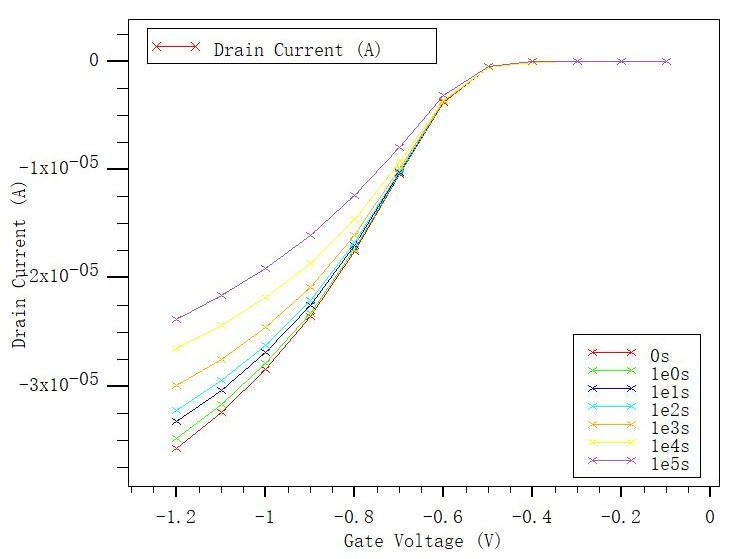
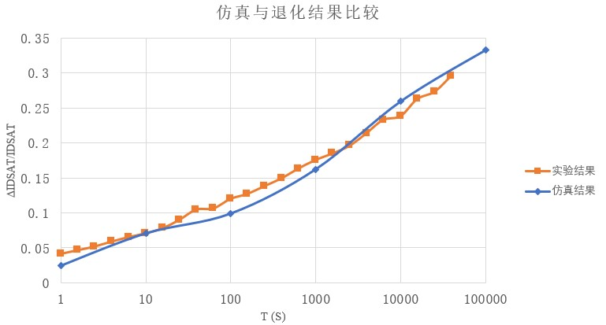
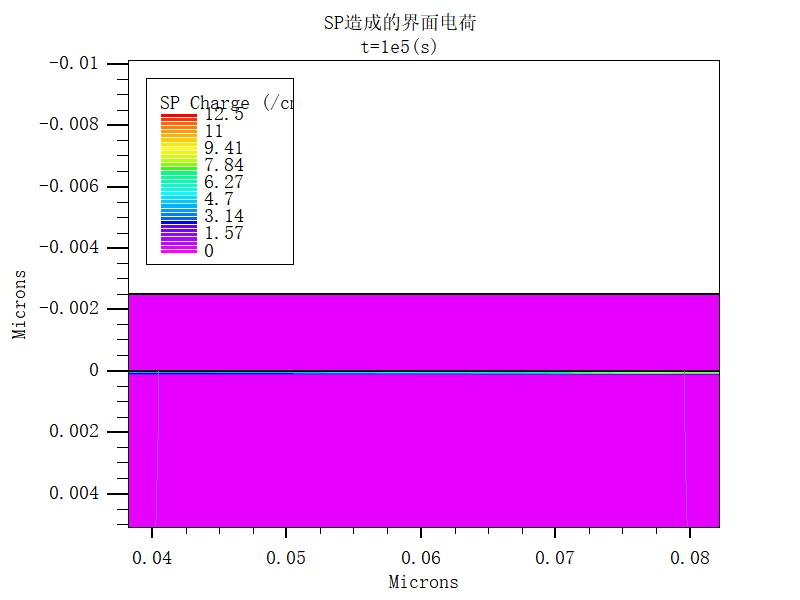
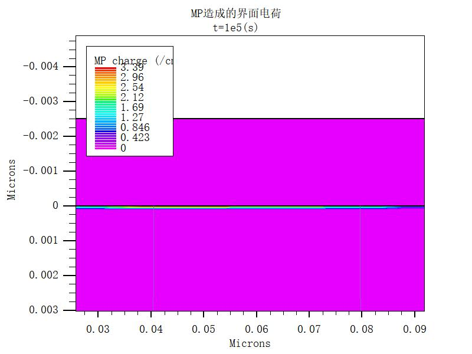

  

    <!-- 标题 -->
    <section>
      <h3>04/22 工作汇报</h3>
      <h4>周镇峰</h4>
      </section>
    <section>
      <h3>目录</h3>
      <ol>
        <li>TCAD仿真</li>
        <li>写毕业论文</li>
      </ol>
    </section>
    <section>
        
采用TCAD中较为先进的综合框架模型（General Framework Model，GFM），该模型同时考虑三种机制：

        <ul>
            <li>场增强热降解→NBTI</li>
            <li>单粒子 (single particle，SP) 过程→长沟道HC</li>
            <li>多粒子 (multiple particle，MP) 过程→短沟道HC</li>
        </ul>
        
该模型需要已知载流子能量分布，通过求解玻尔兹曼传输方程得到。

    </section>
    <section>
        <section>
        <h3>仿真结果</h3>
        

            

                
            

            

                
            

        

        </section>
        <section>
        <h3>界面电荷分布</h3>
        

            

                
            

            

                
            

        

        </section>
    </section>
    <section>
        
后续工作：完成毕业论文

    </section>
    <section>
      
谢谢聆听

    </section>
  

